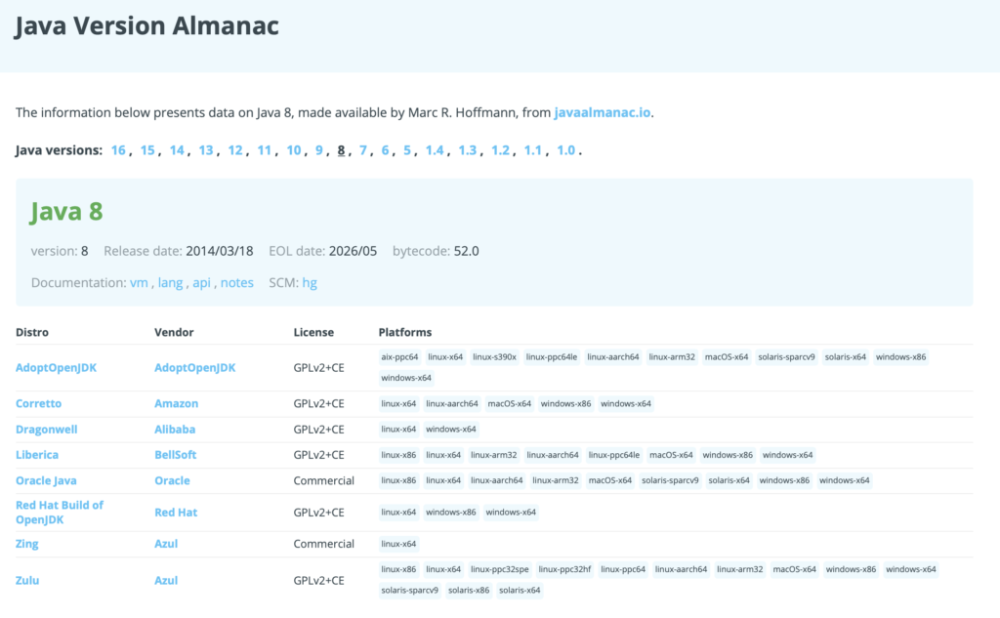
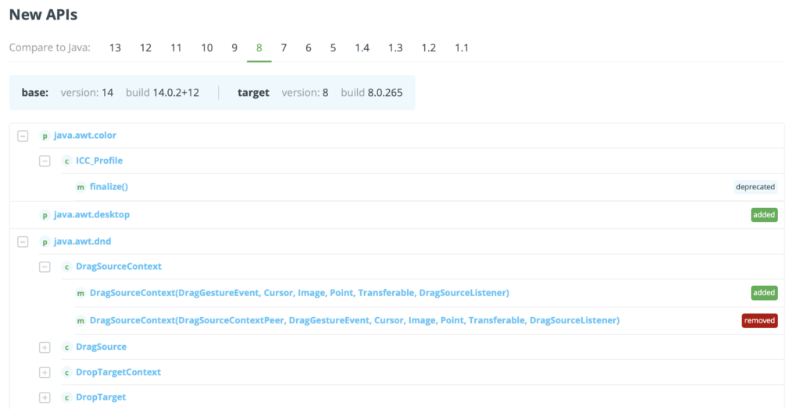
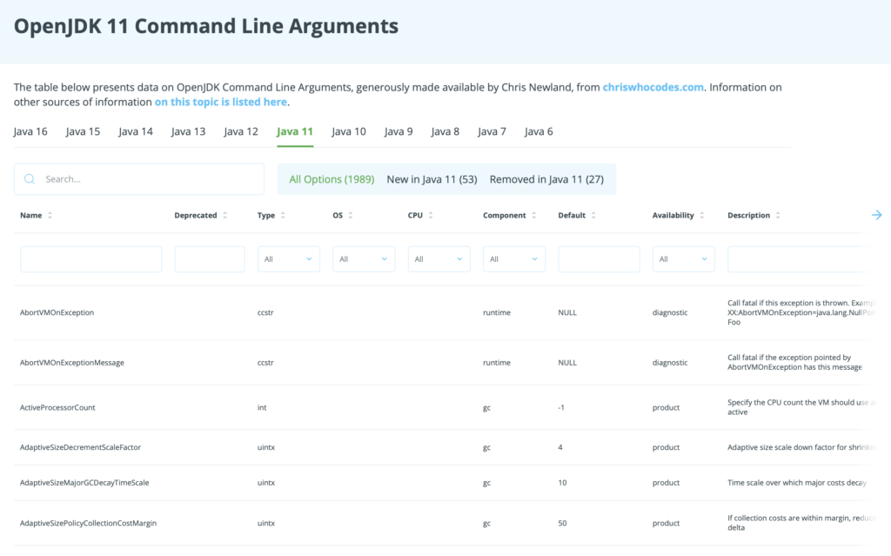
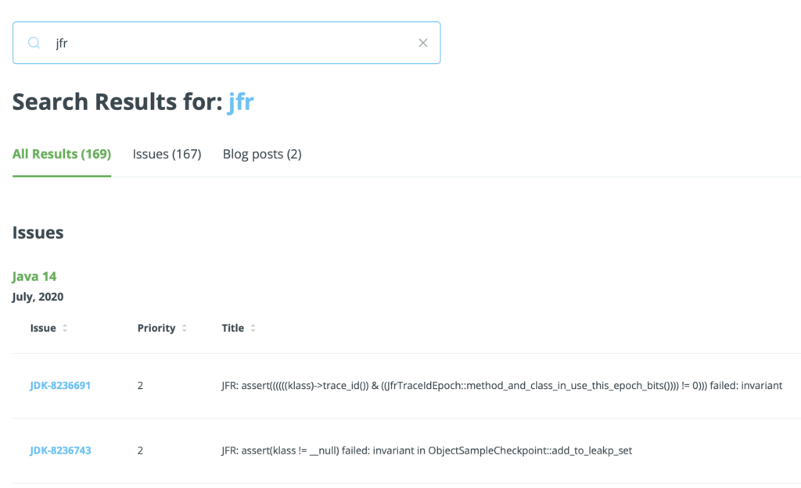

Welcome to foojay, a place for **f** riends **o** f **O** pen**J** DK, sponsored by [Azul](http://azul.com). Foojay's user-focused Java and OpenJDK technical dashboards provide free data for everyday Java developers. Right away you have access to updated analysis, selected highlights, and categorized lists arranged for easy consumption.

#### Java Technologist Dashboards

Together with Java enthusiasts around the world, the foojay team works to identify critical aspects of each new OpenJDK release and update -- with related information such as OpenJDK distributions, download locations, and JVM command line arguments -- and brings to the fore precisely the content and services that have value and relevance to those that use Java on a daily basis throughout the industry.
 OpenJDK Update Release Details

[Go here to see all the fixes and CVEs of the recent OpenJDK update releases](https://foojay.io/java-8/?tab=highlights), while indicating their relevance to you by voting on them. Use the Highlights tab to see what the community as a whole thinks about them. More details on the motivations for the OpenJDK update release details dashboard [are described here on foojay](https://foojay.io/today/dashboard-for-openjdk-update-release-details/).  



A key contributor to foojay is [Marc Hoffmann](https://twitter.com/marcandsweep). On his [javaalmanac.io](http://javaalmanac.io), he presents extensive data on each Java release, with details on distributions, new features, and API differences between releases.

That information he's also made available here on foojay, where it is known as the Java Version Almanac, consisting of a set of dashboards with detailed information on each version of Java:

Take special note at the lower end of each page of the almanac, where you'll find details on the differences between the APIs of the currently selected Java version compared to all previous Java versions:

[Go here to explore the Java Version Almanac on foojay](https://javaalmanac.io/jdk/8), with thanks to Marc.  



Another key contributor to foojay is [Chris Newland](https://twitter.com/chriswhocodes), who's gathered extensive data sets on JVM command line arguments, which he hosts on his own [chriswhocodes.com](http://chriswhocodes.com).   

At the same time, he's also been making his data available here as part of the integrated Java dashboard environment that is foojay:
 OpenJDK Command Line Arguments

[Go here to explore the wealth of JVM command line arguments on foojay](https://foojay.io/command-line-arguments/openjdk-11/), with thanks to Chris.

#### Foojay Today

The Java community is rich with up to date and cutting edge insights and knowledge into everything related to Java and the OpenJDK. A [dedicated blogging area](https://foojay.io/today/) is available on foojay to anyone who has thoughts or code to share on topics relevant to the Java ecosystem.

Let's introduce some of the bloggers active on foojay.  



**Marcus Hirt** is the project lead for the Open JDK JMC project. Once upon the time he co-founded Appeal, the company creating the JRockit JVM.

Marcus blogs on topics relating to Java Mission Control (JMC) and Java Flight Recorder (JFR). [Check out his posts here.](https://foojay.io/today/author/hirt/)  



**Kevin Farnham** is a technology writer and software engineer. He's focused on high-performance low-latency big-data Java, Python, C/C++ programming.

Kevin blogs on general high level Java topics, focusing on how Java has evolved over the years and its place relative to other programming languages. [Check out his posts here.](https://foojay.io/today/author/kevinfarnham/)

[Go here to see the full blog roll](https://foojay.io/today/), and watch that space, there's many more blog posts coming!

#### Comprehensive Search

Interested in a specific Java topic? Type it into the search and find related items across fixes, JVM command line arguments, and blogs.

#### Conclusion

It's exciting to have foojay as an integrated place to provide this sort of information to everyday Java developers and to work with others on evolving foojay content to provide these and other commentaries on the latest Java developments.

We're actively looking for highly skilled and knowledgeable Java developers to join us (we are even hiring for that purpose) and our aim is for foojay to increasingly become a place of sharing reference materials and discussion throughout the Java industry.

Of course, also [follow @foojay2020 on Twitter](https://twitter.com/foojay2020) for regular highlights of new dashboards, services, and content provided by foojay for Java developers everywhere.
