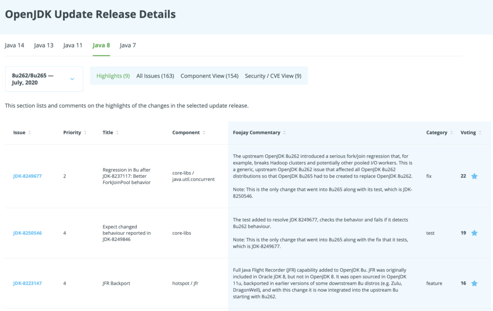

Java is a well-maintained development and deployment platform. Through the [OpenJDK project](https://openjdk.java.net/), regular updates to production releases follow a traditionally established schedule. On a specific Tuesday in January, April, July and October, a set of updates are published covering security-related issues as well as bug fixes and even minor enhancements. Regular updates have been a long-standing tradition for Java. The update cadence has been a long-standing tradition for Java and is relied on by those responsible for ensuring Java-based systems are kept up to date and secure.



Changes and bug fixes are most often initiated in the upstream, still-in-development or major OpenJDK versions, and then backported through a community effort to the already released OpenJDK versions which most of the world uses in production. In addition, security updates are confidentially coordinated through the [OpenJDK Vulnerability Group](https://openjdk.java.net/groups/vulnerability/), such that vulnerabilities, [CVEs](https://cve.mitre.org/), and source code for sensitive fixes can all be revealed simultaneously on the coordinated update date across all maintained versions. The specific update projects, for example, OpenJDK 7u, 8u, 11u and 13u, regularly update in this manner.

#### Over 560 Fixes in April 2020 Update

Much detail is involved in these updates. Their contents are publicly visible and documented via the OpenJDK projects and associated [Java Bug System (JBS)](https://bugs.openjdk.java.net/secure/Dashboard.jspa), and textual list of all issues that are resolved in a given update is generally posted to OpenJDK project mailing lists. Using the April 2020 update as an example, there were over 560 issues listed in the release notes across the various maintained versions. These varied from introspective details such as build related issues and test updates to documentation corrections, through fixes to actual behavior affecting bugs, and all the way up to multiple security fixes associated with CVEs bearing high severity CVSS scores.

For Java users and developers who depend on OpenJDK builds, finding the relevant highlights of a given update and how they may improve or otherwise impact deployments is no small task. Separating issues that have significance to a user from others would involve going through hundreds of individual issues. Following each into the Java Bug System to review details, and deducing relevance for one's environment can be quite a challenge. In practice, few Java users or organizations will go through this level of effort.

More info [on Java Almanac](https://javaalmanac.io/jdk/8/).

#### The User's Perspective Matters

When looking at the highlights, the user's perspective matters. There is a material difference between the importance and impact on Java deployments and the notion of what "priority" is for issues in the Java Bug System. The issue notes and material circulated on OpenJDK lists tend to center, for good reason, on the needs and concerns of developers who build and maintain OpenJDK. The notion of priority in the JBS focuses on OpenJDK development, timeline, and urgency, and not on their value or eventual impact. In fact, an inverse relationship often exists: Some of the most important and impactful items in OpenJDK updates in recent years were categorized as lower priority in the JBS.

A great example of this difference in perspective can be found in [JDK-8146115](https://bugs.openjdk.java.net/browse/JDK-8146115), "Improve docker container detection and resource configuration usage". This new capability, which was first introduced to OpenJDK 8 with the 8u192 update, is arguably one of the most meaningful improvements to Java's execution in a container environment in recent years. But in the JBS it is classified as an enhancement with a P3 priority. The change fundamentally altered (and significantly improved) how Java works in containers. Before the number of cores the JVM detected (and made available to the application) was driven by the size of the machine rather than by the (typically much more stringent) limitations imposed on a container, which would often lead to frequent thrashing and throttling situations. Obviously, it would be hard for a Java user to deduce the importance of this item, or even to notice it (given its low priority categorization) by skimming through the tens of other items OpenJDK 8u dev list update notes. ([More on this topic is here, by Ray Tsang.](https://foojay.io/today/container-awareness-for-java/))

#### Java Technologist Dashboard

Going forward, a clearer perspective of what changes a Java update contains is now provided at [foojay.io](https://foojay.io/). Foojay's user-focused Java and OpenJDK update descriptions offer a dashboard with updated analysis, selected highlights, and categorized lists of updates arranged for consumption by Java users.

Working together with Java enthusiasts around the world, the foojay team works to identify critical aspects of each new OpenJDK update when it is released and bring to the fore precisely the issues that have value and relevance to those that use Java throughout the industry.

For example, in the April 2020 update, foojay chose to highlight two P4 issues that might otherwise not be given the prominence they deserve and be lost in the noise:

* [JDK-8229022](https://bugs.openjdk.java.net/browse/JDK-8229022): "BufferedReader performance can be improved by using StringBuilder". This is instead of using StringBuffer internally. In the report, we see the words "swapping to use StringBuilder seems to give a \~13% performance boost". While the title provides no hint of the significant performance improvement this brings, and neither does the P4 priority, we feel that this is one of the more significant items in this update, as on its own it may be a good reason to adopt the April update. After all, how many applications aren't using BufferedReader in one way or another?
* [JDK-8193832](https://bugs.openjdk.java.net/browse/JDK-8193832): "Performance of InputStream.readAllBytes() could be improved". This is another hidden gem of performance improvement, categorized as a P4 in JBS. Rather than using intermediate buffers of geometrically increasing size with a copy into each intermediate buffer at each stage, it now stores a list of fixed-size buffers. It gathers them into a single buffer at the end.

There are several performance enhancements besides these that would be of great value to highlight. Similarly, something that remains well hidden is the extent to which the Java community has been working with and impacting the development of the OpenJDK. [JDK-8236582](https://bugs.openjdk.java.net/browse/JDK-8236582) has come about via interactions with the ElasticSearch community, and [JDK-8232879](https://bugs.openjdk.java.net/browse/JDK-8232879)has connections to Quarkus.

#### **Conclusion**

[Check the Java Almanac for more details](/java-almanac/). 
