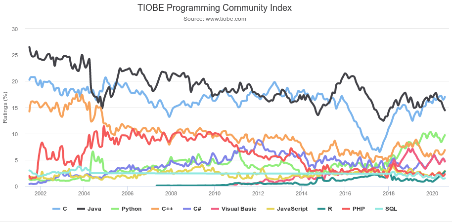

Looking at the latest [TIOBE Programming Community Index](https://www.tiobe.com/tiobe-index/), we see that Java has recently surpassed C in the TIOBE ratings index, while Python is holding steady in the third position:

Back in 2014, I wrote an analysis of the TIOBE data at that time period, claiming that: [TIOBE Is (Unintentionally) Misleading; in Truth, Interest in Java Is Surging](https://community.oracle.com/blogs/editor/2014/04/23/tiobes-unintentionally-misleading-truth-interest-java-surging).

My point back then was that, since the TIOBE index is compiled at least in part based on internet searches that include that language's name, it might be misleading to assume that simply because searches involving the word "Java" were somewhat declining, that would indicate that the usage of Java was actually in decline. My logic then was that newer languages would likely receive more search engine searches than older languages simply because they were newer languages; therefore less documentation was readily available, hence more searches, hence a higher TIOBE rating.

Moving ahead to today, we see that Java and C are still at the top of the TIOBE Index, with Java having recently overtaken C for the top spot. Meanwhile, Python is currently pretty well established in the number 3 position.

So, why is this the case? Of course, any answer will be speculative, but here's my answer.

**C** is the oldest of the three. With C, you can get almost as close to machine language as you need to get. It's great at manipulating bytes and bits. It was also a very great early language for running data intensive software on multi-processor computers (circa 1990s). It was complicated, with signals being sent between processes and all, but it worked (so long as you programmed very carefully). C is also excellent for wrapping older software like FORTRAN. Using C, I was able to in essence multithread FORTRAN code for operation on Solaris 8-processor machines (very advanced at the time) in the 1990s. C itself is also easily wrapped into callable modules from many other, more modern languages. I don't think C is going away anytime soon, because it's a kind of bedrock that's totally integrated into software's legacy. Plus, it still remains about the most efficient language you can use if you need to program at almost machine level, just above ASSEMBLER. Only problem is: C is totally operating-system and hardware specific. It's definitely not "write once, run anywhere."

That inadequacy of C was a prime inspiration for James Gosling's creation of **Java**. At the time (1990s), Microsoft Windows was dominant, Apple was quite viable, Unix in the form of Solaris and other flavors was prominent in high-end data-intensive applications, and open-source Linux was just starting to gain ground. Those were the choices, anyway, for anyone who couldn't afford the totally proprietary but also totally reliable IBM route.

The concept for Java was "write once, run anywhere". To bring this into being, the Java Virtual Machine was created. Now, why it's called a "machine" I think reflects the computing past at the time Java was invented. Back then, we actually talked about machines, like computers being electronic units consisting of a system wherein electronic signals passed over countless circuits - stuff almost no modern programmer ever thinks about. So, this Java Virtual Machine was a "machine" that was "virtual" - it was like a replica of computer hardware, but programmable at a much higher level than ASSEMBLER. Furthermore, Java itself, in utilizing the JVM, was programmable at a much higher level than C. And the JVM made any Java program runable on all major hardware and software platforms. Java was a major advance over C.

Now, how about **Python**? Python is runable on all the major hardware and operating system platforms. Python has enormous support for scientific applications, with its NumPy and SciPy libraries. Those libraries integrate hoards of legacy mathematical modeling code originally programmed in FORTRAN that modern scientists simply cannot do without. Python is not going away, so long as we still do scientific programming.

But Java still has an advantage here: the Java Virtual Machine. Anyone who needs to develop a new language for a specific purpose can simply develop it on top of the JVM. You cannot do that with Python. Python is Python, but the JVM is an open platform open to any language concept.

For these reasons, I believe Java, C, and Python are going to be our most prominent programming platforms for a long time to come, with the Java Virtual Machine being the preferred platform for newly emerging special purpose languages.
