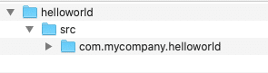
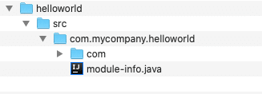

<figure class="alignleft is-resized">
 
</figure>

Most Java developers probably know by now that [Oracle](https://www.oracle.com/) has open sourced the Java JDK and hosted its source code on [Github](https://github.com/openjdk) (aka [Project Skara](https://openjdk.java.net/projects/skara/)).

Oracle encourages companies to get paid [support](https://www.oracle.com/java/java-se-subscription.html)for their LTS (Long-term support) versions of the JDK, however for the mass majority of developers (like myself), who still want to enjoy free versions of the latest JDK and JavaFX, we can now get distributions from third-party vendors or build it ourselves ([OpenJDK](https://github.com/openjdk) / [OpenJFX](https://github.com/openjdk/jfx)).

In this article, I will show you how to use a popular distribution from [Azul](https://www.azul.com/) to build a JavaFX HelloWorld Application in 60 seconds!

## Requirements

* Java 11 SDK or above. The following are some of the vendors that have binary distributions of the JDK:
  * [Oracle OpenJDK](https://www.oracle.com/java/technologies/javase-downloads.html)
  * [Amazon Corretto](https://aws.amazon.com/corretto/)
  * **[Azul ZuluFX](https://www.azul.com/downloads/zulu-community/?package=jdk-fx) - Java SDK bundled with JavaFX modules.**
  * [BellSoft Liberica JDK](https://bell-sw.com/pages/downloads/)
  * [AdoptOpenJDK](https://adoptopenjdk.net/)
* JavaFX 11 or above:
  * [GluonHQ](https://gluonhq.com/products/javafx) - JavaFX 11 - 15
  * **[Azul's ZuluFX](https://www.azul.com/downloads/zulu-community/?package=jdk-fx)** - **Java SDK bundled with JavaFX modules.**

Before we start the stopwatch (60 seconds), let's install the ZuluFX distribution. Below are instruction on how to install the ZuluFX distribution. If you've already installed **Java/JavaFX** 11 or greater (from elsewhere) you can skip to the **Getting Started** section.

## Installing ZuluFX

[Azul](https://www.azul.com/downloads/zulu-community) creates a free and user-friendly distribution of the JDK bundled with JavaFX. Azul provides a simple user interface shown in figure 1 that allows you to pick and choose an appropriate version of the JDK and JavaFX in one compressed file to be downloaded. To get paid commercial Java support check out Azul's [support](https://www.azul.com/products/zulu-enterprise/) subscriptions.

<figure class="wp-block-image is-resized is-style-default">
 <a target="_blank" href="https://www.azul.com/downloads/zulu-community"></a>
 <figcaption>
  Figure 1. https://www.azul.com/downloads/zulu-community
 </figcaption>
</figure>

Download **ZuluFX** (JDK \& JavaFX bundle) from:   
[https://www.azul.com/downloads/zulu-community](https://www.azul.com/downloads/zulu-community/?package=jdk-fx)

After downloading the bundle you should have a file named similar to the following:

`zulu14.29.23-ca-fx-jdk14.0.2-macosx_x64.tar`

These install instructions are on a MacOS, so I trust you will know how to translate the steps to your target platform (Windows and/or Linux).

```bash
# Make an sdks directory in your home directory
$ mkdir ~/sdks

# Move tar file into the sdks directory
$ mv ~/Downloads/zulu14.29.23-ca-fx-jdk14.0.2-macosx_x64.tar ~/sdks

# Change directory into <home directory>/sdks directory
$ cd ~/sdks

# Uncompress file
$ tar -xvf zulu14.29.23-ca-fx-jdk14.0.2-macosx_x64.tar

# Remove file (save some disk space)
$ rm zulu14.29.23-ca-fx-jdk14.0.2-macosx_x64.tar

# Set JAVA_HOME environment variable
$ export JAVA_HOME=~/sdks/zulu14.29.23-ca-fx-jdk14.0.2-macosx_x64

# Add JAVA_HOME/bin on the PATH environment variable 
$ export PATH=$JAVA_HOME/bin:$PATH

# Verify installations of Java JDK 
$ java -version
openjdk version "14.0.2" 2020-07-14
OpenJDK Runtime Environment Zulu14.29+23-CA (build 14.0.2+12)
OpenJDK 64-Bit Server VM Zulu14.29+23-CA (build 14.0.2+12, mixed mode, sharing)

# Verify JavaFX Modules are included in Zulu's Open JDK
$ java --list-modules
...
<a href="/cdn-cgi/l/email-protection" class="__cf_email__" data-cfemail="e48e859285829cca86859781a4d5d0cad4cad6">[email protected]</a>
<a href="/cdn-cgi/l/email-protection" class="__cf_email__" data-cfemail="274d465146415f094448495355484b5467161309170915">[email protected]</a>
<a href="/cdn-cgi/l/email-protection" class="__cf_email__" data-cfemail="1f757e697e796731796772735f2e2b312f312d">[email protected]</a>
<a href="/cdn-cgi/l/email-protection" class="__cf_email__" data-cfemail="2b414a5d4a4d53054c594a5b434248586b1a1f051b0519">[email protected]</a>
<a href="/cdn-cgi/l/email-protection" class="__cf_email__" data-cfemail="4329223522253b6d2e26272a220372776d736d71">[email protected]</a>
<a href="/cdn-cgi/l/email-protection" class="__cf_email__" data-cfemail="b0dad1c6d1d6c89ec3c7d9ded7f081849e809e82">[email protected]</a>
<a href="/cdn-cgi/l/email-protection" class="__cf_email__" data-cfemail="3a505b4c5b5c42144d5f587a0b0e140a1408">[email protected]</a>
...
```

## Getting Started

On your mark, get set, **GO!**

***Step 1:*** Create the **`helloworld`** project directory structure

<figure class="wp-block-image size-large is-resized is-style-default">
 
 <figcaption>
  Figure 1. Initial project and source code directories created.
 </figcaption>
</figure>

The following commands create the project and src directories.

```bash
# Windows
C:\Users\myusername>md helloworld
C:\Users\myusername>md helloworld\src

# Linux
/user/home/myusername$ mkdir -p helloworld/src

# Mac
/Users/myusername$ mkdir -p helloworld/src
```

**\*Note:** After creating the project folder *helloworld/src* be sure to change your directory to reside inside the ***helloworld*** directory prior to the next steps. This is needed in order to **compile** and **run** the code such that the **module path** is recognized properly. This tutorial assumes your project (helloworld) is in the user's home directory.

```bash
# Windows
C:\Users\myusername>cd helloworld

# Linux & MacOSX
$ cd ~/helloworld
```

***Step 2:*** Create a module directory that will later contain the **module-info.java** file.
 The module directory named using the reverse domain convention.

Create a directory using a preferred *naming convention* based on Java Module System's new way to organize source code and modules ([reverse domain name scheme](https://blog.joda.org/2017/04/java-se-9-jpms-module-naming.html)).

```bash
mkdir src/com.mycompany.helloworld
```

***Step 3:*** Create the directory structure **com/mycompany/helloworld** that follows a package namespaces for ***`HelloWorld.java`***
 Figure 2. Project Directory structure for HelloWorld.java file.

Under the directory **com.mycompany.helloworld** you will create the following directory structure **com/mycompany/helloworld**. This directory will later contain the **Helloworld.java** file created in Step 5.

```bash
mkdir -p src/com.mycompany.helloworld/com/mycompany/helloworld
```

***Step 4:*** Create a ***module-info.java*** file.

Create a file named ***module-info.java*** under the directory ***src/com.mycompany.helloworld*** as shown below.
 Figure 3. Module-info.java file

Copy and paste the code from Listing 1 into the **module-info.java** file. Use vi, nano or notepad. For example:

```bash
vim src/com.mycompany.helloworld/module-info.java
```

Listing 1. The module definition file module-info.java

```java
module com.mycompany.helloworld {
   requires javafx.controls;
   exports com.mycompany.helloworld;
}
```

This lets the compiler know which core module dependencies the application needs to compile and run such as JavaFX modules.

The module-info.java defined above doesn't need to include (**requires** ) the modules **javafx.base** and **javafx.graphics** , because the **javafx.controls** module already has them as transitive dependencies so, including them would be redundant. In this example a JavaFX button depends on the **javafx.controls** module.

The **exports** keyword exposes the **com.mycompany.helloworld** module to the runtime system.

***Step 5:*** Create the JavaFX **HelloWorld.java** application file.

The file will be created in the directory **src/com.mycompany.helloworld/com/mycompany/helloworld** as shown in figure 4 below.

<figure class="wp-block-image is-resized">
 
 <figcaption>
  Figure 4. HelloWorld.java application file
 </figcaption>
</figure>

Use **[vim](https://www.vim.org/)** for those who despise those other wimpy editors 😉

```
vim src/com.mycompany.helloworld/com/mycompany/helloworld/HelloWorld.java
```

Copy and paste the code below (Listing 2) into the a file called **HelloWorld.java**.

Listing 2. JavaFX HelloWorld application code for **HelloWorld.java**

```java
package com.mycompany.helloworld;

import javafx.application.Application;
import javafx.event.ActionEvent;
import javafx.event.EventHandler;
import javafx.scene.Group;
import javafx.scene.Scene;
import javafx.scene.control.Button;
import javafx.stage.Stage;

/**
 * A JavaFX Hello World
 */
public class HelloWorld extends Application {

   /**
    * @param args the command line arguments
    */
    public static void main(String[] args) {
       Application.launch(args);
    }

    @Override
    public void start(Stage stage) {
       stage.setTitle("Hello World");
       Group root = new Group();
       Scene scene = new Scene(root, 300, 250);
       Button btn = new Button();
       btn.setLayoutX(100);
       btn.setLayoutY(80);
       btn.setText("Hello World");
       btn.setOnAction( actionEvent ->
                 System.out.println("Hello World"));
       root.getChildren().add(btn);
       stage.setScene(scene);
       stage.show();
    }
}
```

***Step 6:***Compile your code!

Compile the source code with the **-d** option with the location of compiled module. The directory for the new helloworld module is ***mods/com.mycompany.helloworld*** .

```bash
javac -d mods/com.mycompany.helloworld src/com.mycompany.helloworld/module-info.java src/com.mycompany.helloworld/com/mycompany/helloworld/HelloWorld.java
```

After compiling your code the class files the mods directory should look like the following:

<figure class="wp-block-image is-resized">
 
 <figcaption>
  Figure 5. Compiled classes in the mods directory.
 </figcaption>
</figure>

***Step 7:***Execute the JavaFX HelloWorld application!

Execute the Hello World application as a module. After compiling the module into the **mods** directory you will now use Java 9 or above's new ***--module-path***` `option to specify a compiled module's directory. Also, you will specify the***-m*** option to execute the module and its main class **HelloWorld**. Use the following command:

```bash
java --module-path mods -m com.mycompany.helloworld/com.mycompany.helloworld.HelloWorld
```

The following is the output of the previous command:

<figure class="wp-block-image is-resized">
 <a target="_blank" href="https://carlfx.files.wordpress.com/2016/04/screen-shot-2016-04-26-at-1-42-13-am.png"></a>
 <figcaption>
  Figure 6. The output of a JavaFX Hello World application.
 </figcaption>
</figure>

## Conclusion

I'm not sure if you've taken more than 60 seconds to complete the steps, but assuming your environment is setup and the JDK 11+ and JavaFX is installed you should be able to cut and paste the code in seconds.

Hopefully you'll find the new Java Platform Module System (JPMS) pretty straight forward. Although there is a little extra typing in order to let the compiler know where modules are, it's really not that different than the **-classpath** option.

While we are living in strange times I still believe there are more exciting times in the Java world especially with more vendors and partners making Java JDK distributions more and more available.

Happy coding and stay safe!

## References:

* OpenJFX.io - A community driven site to help developer get started with JavaFX [https://openjfx.io](https://openjfx.io/)
* Project Jigsaw: Module System Quick-Start Guide: <http://openjdk.java.net/projects/jigsaw/quick-start>
* JAVA PLATFORM, STANDARD EDITION ORACLE JDK 9 MIGRATION GUIDE: [HTTPS://DOCS.ORACLE.COM/JAVASE/9/MIGRATE/TOC.HTM](https://docs.oracle.com/javase/9/migrate/toc.htm)
* PROJECT JIGSAW: [HTTP://BLOG.CODEFX.ORG/TAG/PROJECT-JIGSAW/](http://blog.codefx.org/tag/project-jigsaw/)
* The State of the Module System: <http://openjdk.java.net/projects/jigsaw/spec/sotms/>
* Java SE 9 - JPMS module naming: <https://blog.joda.org/2017/04/java-se-9-jpms-module-naming.html>
