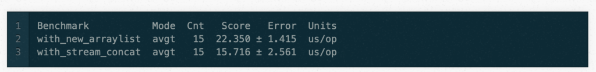
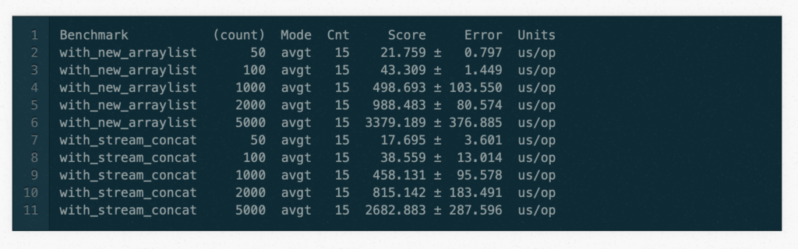
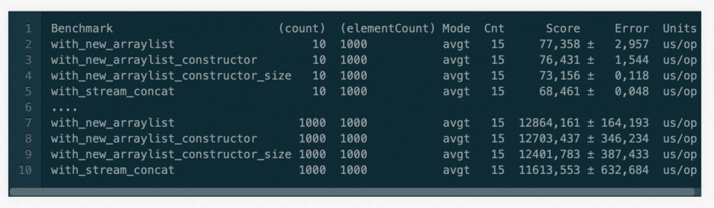
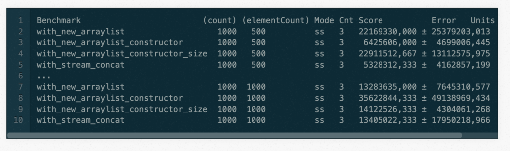

During a code review, I suggested some code improvements related to JDK8+ streams. The original code looked very similar to the following:

```java
List<Element> result = content.getFancyStuffs().stream()
  .flatMap(item -> {
        List<Element> objects = new ArrayList<>();
        objects.add(item.getElement());
        objects.addAll(item.getElements());
        return objects.stream();
      })
  .collect(toList());
```


Some more details here --- the `getFancyStuffs()` returns a list of `FancyStuff` elements. The `FancyStuff` class contains two getters where `getElement()` returns a single `Element` whereas the `getElements()` returns (guess what?) a list of `Element`s.

The interesting part was the lambda which creates a new `ArrayList` and adds a single element `objects.add(item.getElement())` and the second part which adds several elements via `objects.addAll(item.getElements)`.

My suggestion, based on better readability, was to use the following code instead:

```java
List<Element> result = content.getFancyStuffs().stream()
  .flatMap(fs -> 
      Stream.concat(
         Stream.of(fs.getElement()), 
         fs.getElements().stream())
      )
  .collect(Collectors.toList());
```


So far so good. But, after some time, I began to think about the two solutions. I asked myself: Which is faster? Which uses more memory? (The usual questions a developer is asking... don't you?)

So what would you guess is the faster solution? The first or the second? My guess was that the first solution will win, but based on some assumptions. This means the number of elements which are coming through `content.getFancyStuffs().stream()..` are more or less small (less than 20) and furthermore the number of elements wich are returned by `item.getElements()` are fairly small as well (less than 20).

The only thing which can help here to get a reliable answer is to measure it. No assumptions, no educated guesses etc. So I have to make a real performance measurement. So I created a [separate project](https://github.com/khmarbaise/performance-concat) which really measures the performance.

So the first code part for performance measurement looks like this:

### Solution 1

```java
Benchmark
public List<Element> with_new_arraylist(Container content) {
    return content.getFancyStuffs().stream().flatMap(item -> {
      ArrayList<Element> objects = new ArrayList<>();
      objects.add(item.getElement());
      objects.addAll(item.getElements());
      return objects.stream();
    }).collect(Collectors.toList());
}
```


and the second part:

### Solution 2

```java
@Benchmark
public List<Element> with_stream_concat(Container content) {
  return content.getFancyStuffs()
  .stream()
  .flatMap(fs -> Stream.concat(Stream.of(fs.getElement()),    
         fs.getElements().stream()))
  .collect(Collectors.toList());
}
```


while writing the above code, I thought about some parts of it and I came up with two other possible variations.

### Solution 3

The following example where I put elements directly into the constructor of the `ArrayList`. This means it could only happen that in rarer cases the size of the array list must be resized which depends on the number of elements in `item.getElements()`.

```java
@Benchmark
public List<Element> with_new_arraylist_constructor(Container content) {
  return content.getFancyStuffs().stream().flatMap(item -> {
    ArrayList<Element> objects = new ArrayList<>(item.getElements());
    objects.add(item.getElement());
    return objects.stream();
  }).collect(Collectors.toList());
}
```


### Solution 4

Finally, this one where I already calculate the size of the final list by giving the number of elements via the constructor. This will prevent the resizing of the array list at all cause the size will fit always.

```java
@Benchmark
public List<Element> with_new_arraylist_constructor_size(Container content) {
  return content.getFancyStuffs().stream().flatMap(item -> {
    ArrayList<Element> objects = 
         new ArrayList<>(item.getElements().size() + 1);
    objects.add(item.getElement());
    objects.addAll(item.getElements());
    return objects.stream();
  }).collect(Collectors.toList());
}
```


### Measurement

The measurement was done on an [Intel Xeon Machine with 3.50GHz](https://github.com/khmarbaise/performance-concat/blob/master/docs/tested-on-hardware.text) with [CentOS Linux release 7.6.1810 (Core)](https://github.com/khmarbaise/performance-concat/blob/e5dd257660a93670b203016fddb9a3ac2975f399/docs/tested-on-os.text).

The full source code of the project can be found here: <https://github.com/khmarbaise/performance-concat.>

#### Basic Measurement

So I began very simple only with the first two solutions (1+2):

* [The Code](https://github.com/khmarbaise/performance-concat/blob/8a666ee61cf117b96ab374dc402df996ff188b7c/src/main/java/com/soebes/performance/streams/BenchmarkStreamConcat.java)
* [The detailed measurement result](https://github.com/khmarbaise/performance-concat/blob/8a666ee61cf117b96ab374dc402df996ff188b7c/docs/result-i.txt)

The following is only an excerpt of the above [detailed measurement result](https://github.com/khmarbaise/performance-concat/blob/8a666ee61cf117b96ab374dc402df996ff188b7c/docs/result-i.txt) (I have remove the prefix `BenchmarkStreamConcat` from all results here in the post).


So, if you take a look at the results above, you can already see that for a small amount of elements (49 getElements, 50 FanceStuff instances) the one with `stream_concat` is faster. Hmmm... is this really true? Not a measuring error or coincidence?

#### Parameterized Measurement

To reduce the likelihood of stumbling over a coincidence or a measuring error, I changed the code which now takes a parameter and enhanced the number of elements. I stick with the two solutions (1+2).

* [The code](https://github.com/khmarbaise/performance-concat/blob/52480c0648a97e89d0e5007db01212baf7c80536/src/main/java/com/soebes/performance/streams/BenchmarkStreamConcat.java)
* [The detailed measurement result](https://github.com/khmarbaise/performance-concat/blob/52480c0648a97e89d0e5007db01212baf7c80536/docs/result-ii.text)

The `getElements()` results always in 49 elements whereas the number of `FancyStuff` elements varies (see `count`). The following result shows that the version with `stream_concat` is always faster.


Interestingly, this is not only the case for larger number of elements. It is also for a small number of elements the case.

#### Running all solutions

So, finally, I ran all solutions (1+2+3+4) with different numbers (count, elementCount) with different combinations. I honestly have to admit that I underestimated the time it would take to run that test (it took 13 hours+).

* [The detailed measurement result](https://github.com/khmarbaise/performance-concat/blob/e5dd257660a93670b203016fddb9a3ac2975f399/docs/result-vi.text)
* [The Code](https://github.com/khmarbaise/performance-concat/blob/e5dd257660a93670b203016fddb9a3ac2975f399/src/main/java/com/soebes/performance/streams/BenchmarkStreamConcat.java)

I just picked up some examples of the measured times here:


#### Another run

So I ran also a solution with all possible options im JMH which took very long (1 day + 15 hours+).

* [The detailed measurement result](https://raw.githubusercontent.com/khmarbaise/performance-concat/master/docs/result-v.text)

So I will pick up some examples of the measured times here:


So finally the question comes --- what do the numbers actually mean?

A quote from the [JMH](https://github.com/openjdk/jmh) output:

*REMEMBER: The numbers below are just data. To gain reusable insights, you need to follow up on why the numbers are the way they are. Use profilers (see -prof, -lprof), design factorial experiments, perform baseline and negative tests that provide experimental control, make sure the benchmarking environment is safe on JVM/OS/HW level, ask for reviews from the domain experts. Do not assume the numbers tell you what you want them to tell.*

**Note:** Used with permission and thanks --- originally written by Karl Heinz Marbaise and published on [Karl Heinz Marbaise's blog](https://blog.soebes.de/blog/2020/03/31/performance-stream-concat/).
