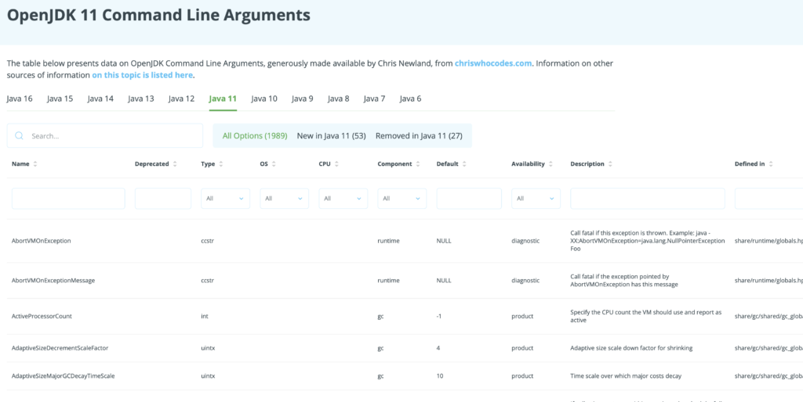
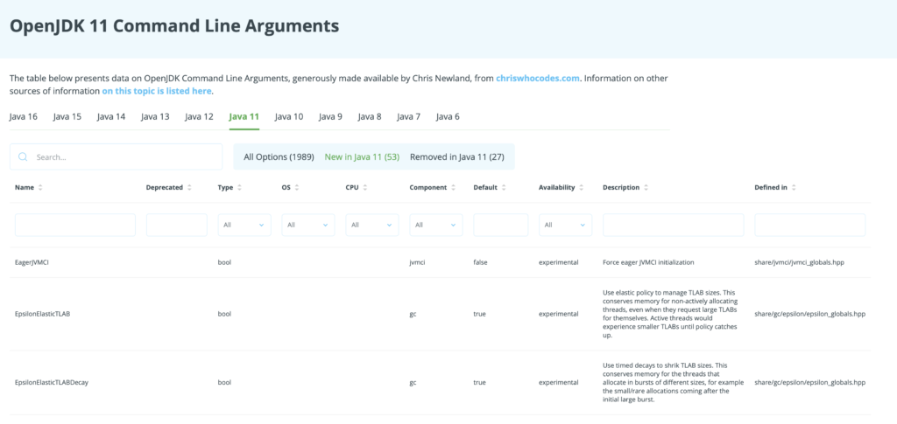

We're happy to announce that we're hosting Chris Newland's [VMOptionsExplorer](http://javaalmanac.io) [right here on foojay](https://javaalmanac.io/jdk/8/), providing all details per release on Java command line switches.

It also shows a diff between the currently selected release and the previous release, showing a tab for the switches that have been added and those that have been removed.

Go here to take a look, yourself: <https://chriswhocodes.com/hotspot_options_openjdk11.html>.

Let's meet Chris, here's a quick interview with him about his Java command line switches integrated into foojay!  



**Hi Chris, who are you and what does your Java life look like?**

I've been programming in Java since 1999, when I first used it to write "Intelligent Agent" software in a telecoms network management domain.

For the last 15 years, I've been using Java in the financial markets at [ADVFN.com](http://ADVFN.com), processing large amounts of fast-moving data and that's where my interest in software performance comes from.

**Starting with the basics, what is a JVM command line switch?**

I'd like to start by explaining what an amazing piece of technology the Java Virtual Machine is. It allows you to write software in many high level languages and execute it on almost any hardware and operating system platform and still get good performance because the JVM is adaptive to its workload and environment.

However, sometimes you will discover that the JVM needs a little guidance in how it should operate and you can use command line switches to control its behaviour.

**What are some of your favorite switches, which you use a lot?**

I think for most workloads it is important to understand your typical working set size (amount of memory required by your application) and to tune your maximum Java heap size accordingly using **-Xmx**. This can prevent the heap from growing larger than needed, which not only consumes unnecessary resources but can lead to performance-affecting GC pauses, when the collector does need to free memory from a larger-than-required heap.

Understanding your workload can also help you make informed choices about which garbage collection strategy to deploy. Some of my systems are low-allocation and latency sensitive so I configure my JDK 8 JVMs to use the G1 collector using **-XX:+UseG1GC** and I set a target pause time with **-XX:MaxGCPauseMillis=100**, which gives me regular short garbage collections, instead of infrequent but longer disruptive pauses.

Turning on GC logs is also useful for most applications and can be achieved in JDK 8 with**-XX:+PrintGCDetails -XX:+PrintGCDateStamps**.

**What are some of the lesser known really useful ones?**

If you're trying to squeeze the maximum performance from your application, it's useful to understand what the JVM's Just-In-Time (JIT) compilers were doing to dynamically optimise your workload at runtime.

To turn on JIT logging, you first need to enable an additional set of "diagnostic" options using the **-XX:+UnlockDiagnosticVMOptions** switch. This allows you to turn on advanced JIT logging using the **-XX:+LogCompilation** switch, which instructs the JVM to log all of the JIT optimisations it made.

All this information can be very verbose and hard to read but I created a tool called JITWatch (<https://github.com/AdoptOpenJDK/jitwatch>) to parse the compilation log file and presents the results in an understandable format.

You might discover that a "hot" method in your code was too big to be inlined into its callsite, which means you missed out on all of the further optimisations available when the callee code is local to its caller. This could highlight a refactoring opportunity to break up the large method or if you *really* know what you are doing, you can set JVM switches to override the default JIT compilation parameters.

**How did chriswhocodes.com come about and what are its main features?**

[chriswhocodes.com](http://chriswhocodes.com) started out as a community-build server for OpenJFX, after Oracle dropped support for JavaFX on ARM. It later became the home for VMOptionsExplorer, which one of my open source projects for building a dictionary of all the JVM switches across the HotSpot, OpenJ9, Zing, and GraalVM Java Virtual Machines. I knew of a few blogs listing popular VM switches, but realised that I could auto-generate a dictionary from the OpenJDK source code, if I built the right tools.

**How do you generate all that data?**

VMOptionsExplorer parses the OpenJDK HotSpot source code, which is publicly available from [hg.openjdk.java.net](http://hg.openjdk.java.net), to extract the switch names, descriptions, availability, and parameter types and ranges.

By keeping the various JVM repositories in sync, I can re-build the dictionaries and keep them up to date automatically. I used an off-the shelf JS library to format the HTML output and make it searchable.

**Do you use the JVM Options Explorer or your other tools there yourself? How often?**

I like to use the "diff" function of the tool to keep track of switches as they change between JDK releases. It's a good way to keep track of any new optimisations being added to the JVM. So far there have been 7 new switches added in JDK16 including the new -XX:+UseMD5Intrinsics switch which informed me about the work Microsoft has contributed to OpenJDK to optimise MD5 checksumming which is used a lot in the Azure platform.

I have created another project called JaCoLine (Java Command Line Inspector), which uses the dictionaries from VMOptionsExplorer to create an interactive Web Service where users can validate their Java command lines against different JDK versions.

**And now parts, or maybe all of it, will be on foojay! How do you feel about that direction?**

I'm happy to see VMOptionsExplorer and soon JaCoLine hosted on foojay to reach a wider audience.

And foojay is fast becoming the home of useful tools and information sources for the JVM!
