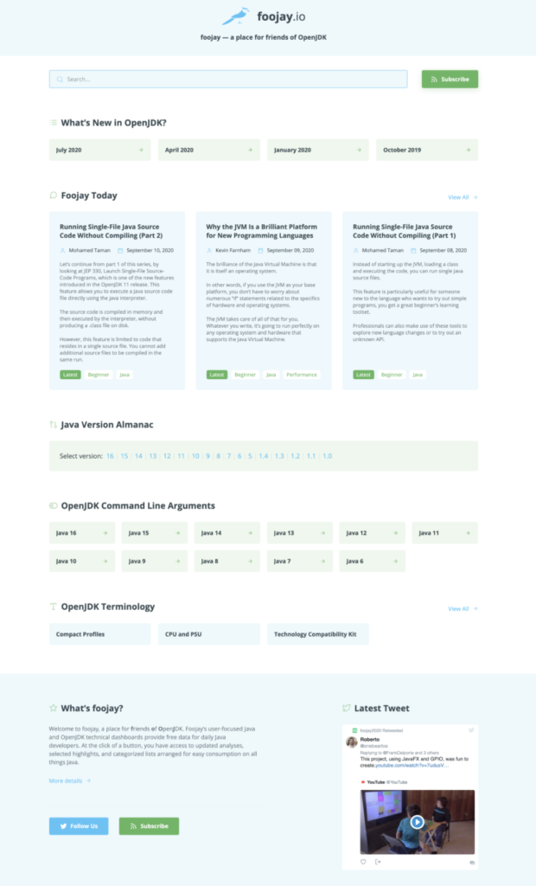

The site you're on, foojay.io, has had a bit of a facelift over the past week.

Now you can see directly on the homepage all the key pieces that make up foojay, a place for friends of OpenJDK... especially its focus on the integrated services provided by [Marc Hoffmann's Java Version Almanac](https://foojay.io/almanac/jdk-8/) and[Chris Newland's JVM Options Explorer](https://foojay.io/command-line-arguments/openjdk-11/), supported by the [OpenJDK Update Release Details](https://foojay.io/java-8/?tab=highlights), together with [Foojay Today](https://foojay.io/blog/) and the start of [Foojay Pedia](https://foojay.io/pedia/).

There's a lot more to be done, though this is a big step forward!

