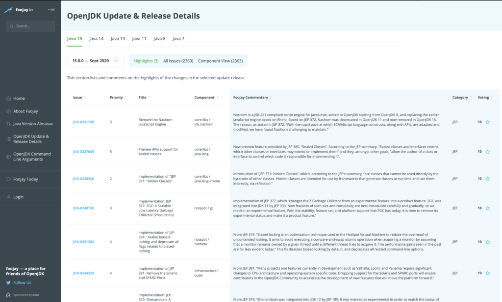

Now that Java 15 has been released, let's take a look at what's new!

[Here on foojay](https://foojay.io/java-15/?quarter=072020), the fixes that went into the release are listed, giving you a unique and readable changelog in helpful categories, with the invitation for you to vote on those that are most relevant to you:

### New Features

#### JVM

* Disable and Deprecate Biased Locking ( [JEP 374](https://openjdk.java.net/jeps/374) )
* ZGC ( [JEP 377](https://openjdk.java.net/jeps/377) )
* Shenandoah GC ( [JEP 379](https://openjdk.java.net/jeps/379) )
* Remove the Solaris and SPARC Ports ( [JEP 381](https://openjdk.java.net/jeps/381) )

#### Language

* Pattern Matching for instanceof Preview ( [JEP 375](https://openjdk.java.net/jeps/375) )
* Text Blocks ( [JEP 378](https://openjdk.java.net/jeps/378) )
* Records Preview ( [JEP 384](https://openjdk.java.net/jeps/384) )

#### API

* Edwards-Curve Digital Signature Algorithm (EdDSA) ( [JEP 339](https://openjdk.java.net/jeps/339) )
* Sealed Classes Preview ( [JEP 360](https://openjdk.java.net/jeps/360) )
* Hidden Classes ( [JEP 371](https://openjdk.java.net/jeps/371) )
* Remove the Nashorn JavaScript Engine ( [JEP 372](https://openjdk.java.net/jeps/372) )
* Reimplement the Legacy DatagramSocket API ( [JEP 373](https://openjdk.java.net/jeps/373) )
* Foreign-Memory Access API (Second Incubator) ( [JEP 383](https://openjdk.java.net/jeps/383) )
* Deprecate RMI Activation for Removal ( [JEP 385](https://openjdk.java.net/jeps/385) )

Go here for foojay's almanac of all the info about where to go to download Java 15, including a comparison of Java 15 APIs versus those from previous releases: [foojay.io/almanac/jdk-15](https://foojay.io/almanac/jdk-15)
