For my book "[Getting Started with Java on Raspberry Pi](https://webtechie.be/books/)", an example was described to store sensors and measurements in an H2-database through REST APIs with a Spring application on the Raspberry Pi.

The application takes some time to start on a Raspberry Pi, and [Adam Bien](https://twitter.com/AdamBien) who does the [airhacks.fm podcast](https://airhacks.fm/#episode_104) asked me if I could compare this to a similar Quarkus application, which resulted in some nice results.

## Application

The same application was developed in both Spring and Quarkus:

* Use embedded H2 database to store very simple one-on-many related data

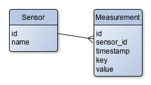

* REST with CRUD APIs for both sensor and measurement data
* Swagger UI to test the APIs

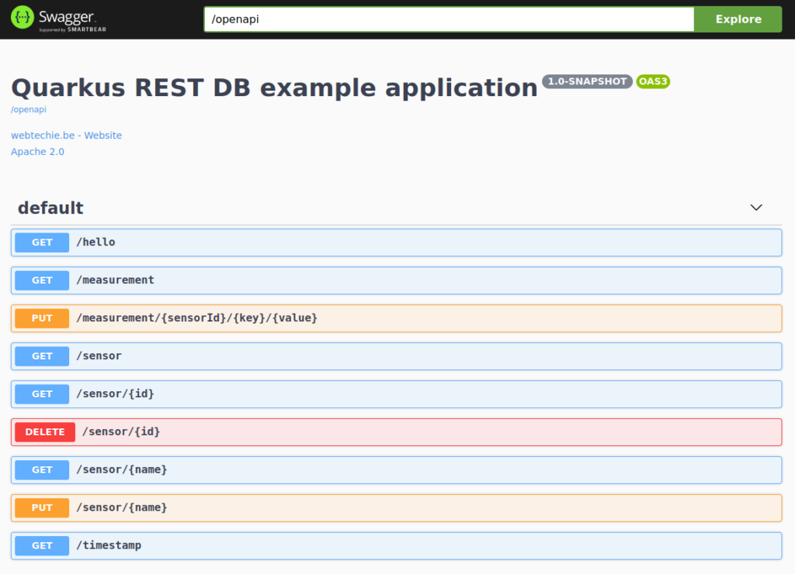

* Spring is using JPA, while Quarkus uses Panache

### Sources

Both projects are available on GitHub in "[JavaOnRaspberryPi \> Chapter_10_Spring \> java-spring-rest-db](https://github.com/FDelporte/JavaOnRaspberryPi/tree/master/Chapter_10_Spring/java-spring-rest-db)" and "[JavaQuarkusRestDb](https://github.com/FDelporte/JavaQuarkusRestDb)". If you like to get more information of the code itself, you can check the blog post links at the bottom of this page.

<figure class="wp-block-gallery columns-3 is-cropped wp-block-gallery-1 is-layout-flex wp-block-gallery-is-layout-flex">
 <ul class="blocks-gallery-grid">
  <li class="blocks-gallery-item">
   <figure>
    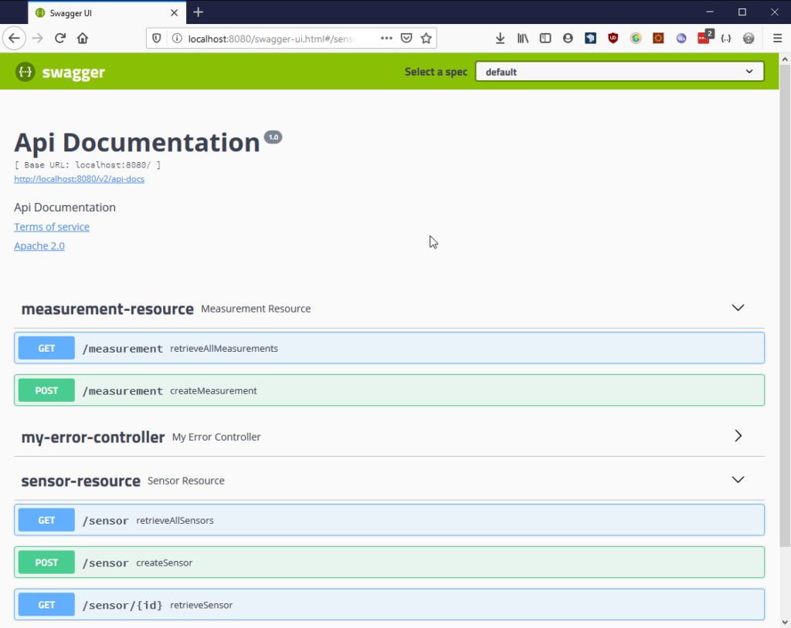
   </figure></li>
  <li class="blocks-gallery-item">
   <figure>
    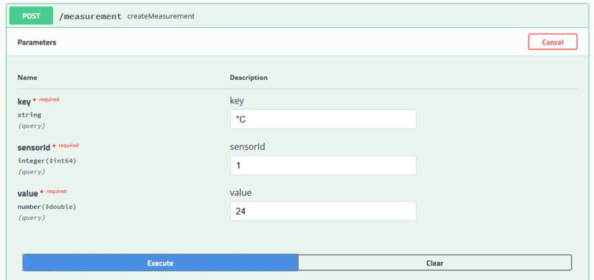
   </figure></li>
  <li class="blocks-gallery-item">
   <figure>
    
   </figure></li>
  <li class="blocks-gallery-item">
   <figure>
    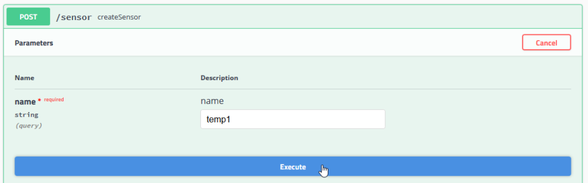
   </figure></li>
  <li class="blocks-gallery-item">
   <figure>
    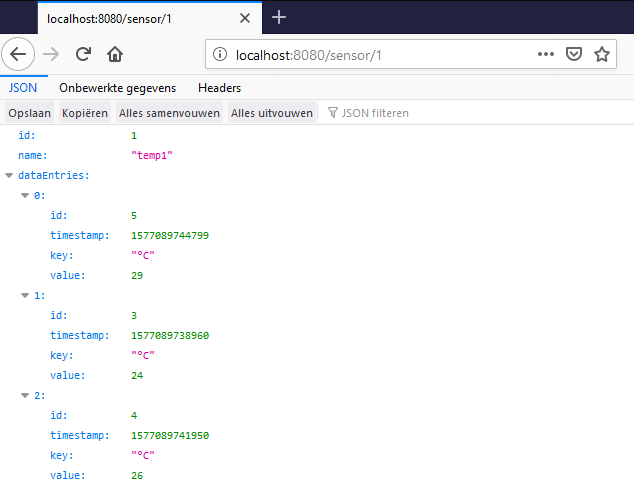
   </figure></li>
  <li class="blocks-gallery-item">
   <figure>
    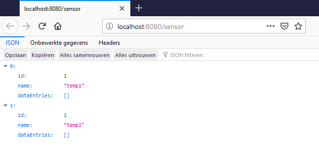
   </figure></li>
 </ul>
</figure>

I use Spring every day, but Quarkus was new for me. But thanks to [the detailed documentation](https://quarkus.io/guides/datasource), building a new application with the same functionality as the Spring version, only took a couple of hours. This post is not a guide pro or contra one of these frameworks, but just a non-scientific attempt to compare the start-up speeds.

Both applications were packaged to JAR with Maven and `m̀vn clean package`.

Some of the keynotes while developing:

#### Spring

* Quick start with [start.spring.io](https://start.spring.io/)
* Easy to integrate H2 web console to consult the database
* Overload of examples and documentation available

<figure class="wp-block-gallery columns-3 is-cropped wp-block-gallery-2 is-layout-flex wp-block-gallery-is-layout-flex">
 <ul class="blocks-gallery-grid">
  <li class="blocks-gallery-item">
   <figure>
    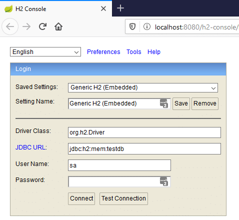
   </figure></li>
  <li class="blocks-gallery-item">
   <figure>
    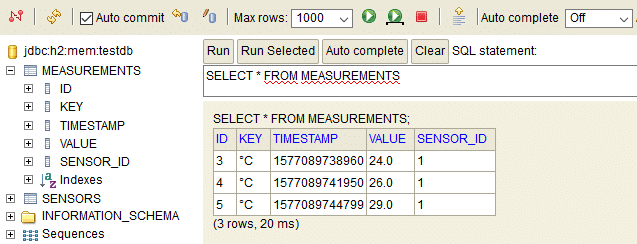
   </figure></li>
  <li class="blocks-gallery-item">
   <figure>
    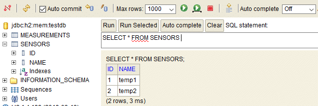
   </figure></li>
 </ul>
</figure>

#### Quarkus

* Quick start with [code.quarkus.io](https://code.quarkus.io/)
* Didn't find how to integrate H2 web console
* Good information available about Panache on [quarkus.io \> guides](https://quarkus.io/guides/rest-data-panache)
* Live coding and testing is amazing! Start your application with `mvn quarkus:dev` and have any change available for testing immediately
* Out-of-the-box native support with GraalVM (on PC, not (yet) on ARM)

## Running the Application

To run the application, two new fresh SD cards where prepared with the [Imager tool provided by Raspberry Pi](https://www.raspberrypi.org/downloads/), both having OpenJDK 11 pre-installed:

* Raspbian OS 32bit full edition
* Ubuntu 20.04 LTS (Raspberry Pi 3/4/, 64-bit server OS for arm64 architectures)

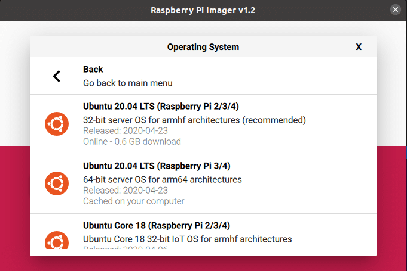

As both applications are packaged as a JAR, they can be started in the same way:

```java
$ java -jar target/java-spring-rest-db-0.0.1-SNAPSHOT.jar
$ java -jar target/javaquarkusrestdb-1.0-SNAPSHOT-runner.jar
```

## Results

Each JAR was started a few times to get an average value from the startup time reported in their logging.

```java
$ java -jar target/java-spring-rest-db-0.0.1-SNAPSHOT.jar

  .   ____          _            __ _ _
 /\\ / ___'_ __ _ _(_)_ __  __ _ \ \ \ \
( ( )\___ | '_ | '_| | '_ \/ _` | \ \ \ \
 \\/  ___)| |_)| | | | | || (_| |  ) ) ) )
  '  |____| .__|_| |_|_| |_\__, | / / / /
 =========|_|==============|___/=/_/_/_/
 :: Spring Boot ::        (v2.1.8.RELEASE)
...
Started JavaSpringRestDbApplication in 36.606 seconds (JVM running for 39.212)
```

```java
$ java -jar target/javaquarkusrestdb-1.0-SNAPSHOT-runner.jar
__  ____  __  _____   ___  __ ____  ______ 
 --/ __ \/ / / / _ | / _ \/ //_/ / / / __/ 
 -/ /_/ / /_/ / __ |/ , _/ ,< / /_/ /\ \   
--\___\_\____/_/ |_/_/|_/_/|_|\____/___/   
...
(main) javaquarkusrestdb 1.0-SNAPSHOT on JVM (powered by Quarkus 1.6.0.Final) started in 9.259s. Listening on: http://0.0.0.0:8080
```

|   Framework    |    PC     |   Pi3   |   Pi3   |   Pi4   |   Pi4   |
|----------------|:---------:|:-------:|:-------:|:-------:|:-------:|
|                |    (1)    | (2-32b) | (2-64b) | (3-32b) | (3-64b) |
| Spring JAR     |    7s     |   66s   |   60s   |   36s   | **34s** |
| Quarkus JAR    |    2s     |   17s   |   16s   |   9s    | **9s**  |
| Quarkus Native | **0.06s** |    -    |    -    |    -    |    -    |

The average startup speed of Quarkus JAR is 3 to 4 times faster compared to Spring JAR. The native one is extremely fast but I only got it working on my PC. It will be really fun to repeat this experiment when there is a GraalVM version for ARM.

* (1): Dell i7, 16 Gb RAM, Ubuntu 20.04 64-bit
* (2): Raspberry Pi 3B+ 1GB RAM, Broadcom BCM2837B0, Cortex-A53 (ARMv8) 64-bit SoC @ 1.4GHz
* (3): Raspberry Pi 4B 4GB RAM, Broadcom BCM2711, Quad core Cortex-A72 (ARM v8) 64-bit SoC @ 1.5GHz
* (32b): Raspbian OS 32-bit
* (64b): Ubuntu server OS 20.04 LTS 64-bit

**Note:** Used with permission and thanks --- originally written by Frank Delporte and published on [webtechie.be](https://webtechie.be) in the posts "[A Spring REST and H2 database application on the Raspberry Pi](https://webtechie.be/post/2020-07-13-spring-rest-h2-raspberry-pi/)" and "[Comparing a REST H2 Spring versus Quarkus application on Raspberry Pi](https://webtechie.be/post/2020-07-28-spring-versus-quarkus-rest-h2-db-on-raspberry-pi/)".
