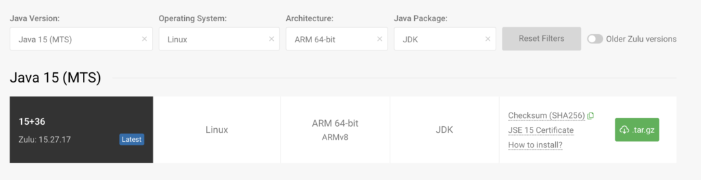
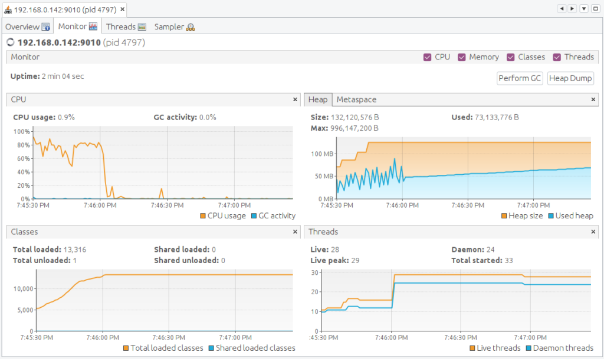
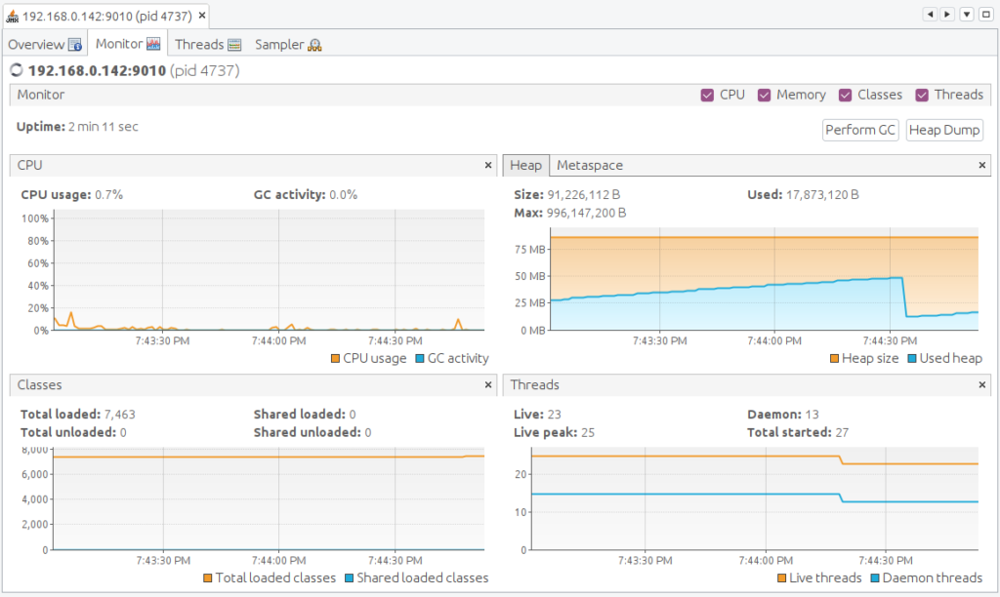
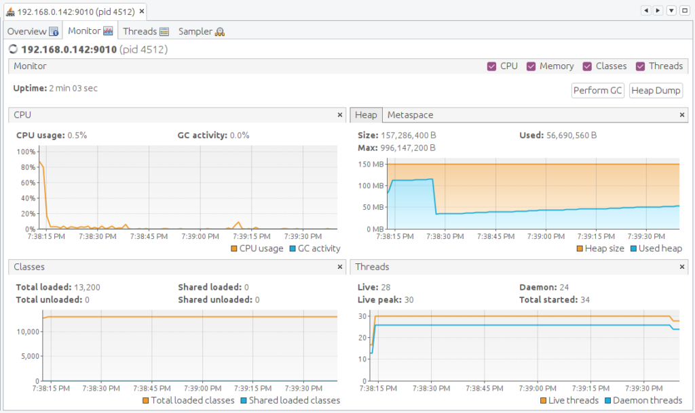
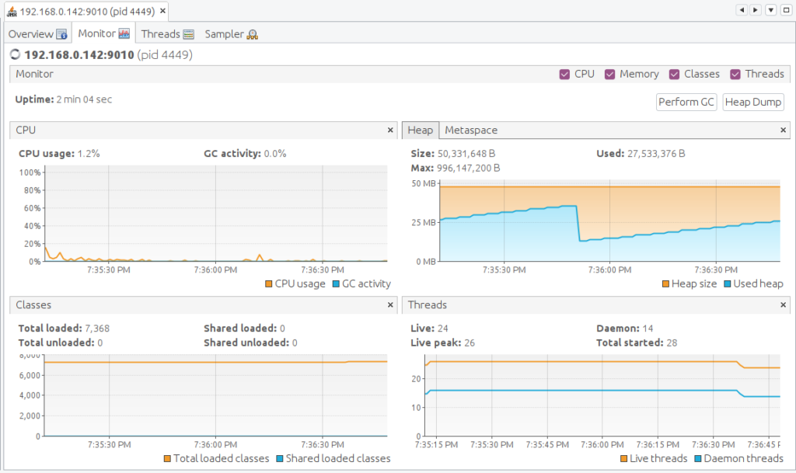
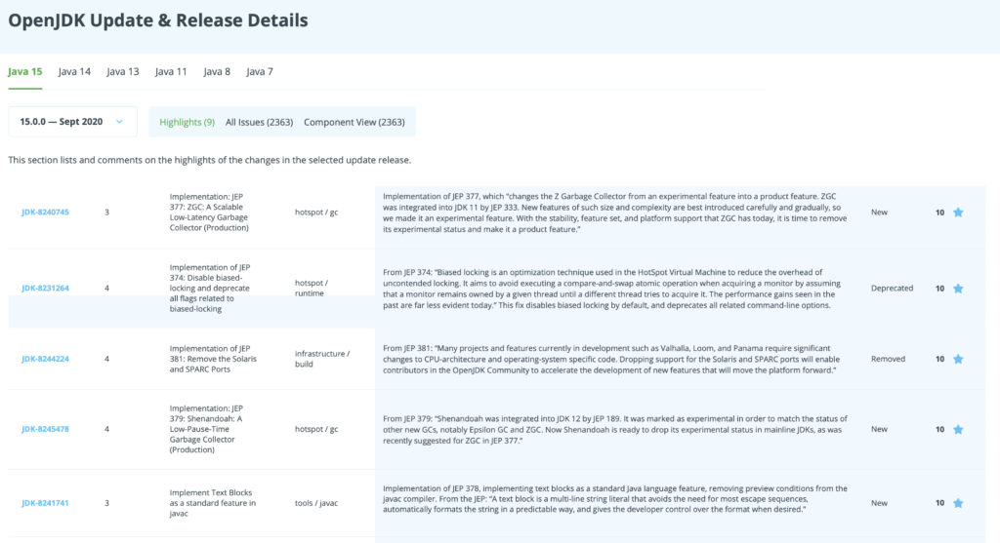

For this post I did some experiments with Java 15, reusing the Ubuntu 64bit SD card which was also used for my earlier post ["](http://localhost:1313/post/2020-07-28-spring-versus-quarkus-rest-h2-db-on-raspberry-pi/)[Startup Speed of Spring and Quarkus JARs on the Raspberry Pi](https://foojay.io/?p=35345)".

That version of Ubuntu comes with OpenJDK 11 pre-installed.

```java
$ java -version
openjdk version "11.0.8" 2020-07-14
OpenJDK Runtime Environment (build 11.0.8+10-post-Ubuntu-0ubuntu120.04)
OpenJDK 64-Bit Server VM (build 11.0.8+10-post-Ubuntu-0ubuntu120.04, mixed mode)
```

### Installing Azul Zulu OpenJDK 15

OpenJDK Java 15 was released on 2020-09-15, check out the [Java Version Almanac](https://foojay.io/almanac/jdk-15/) for more details.

Immediately after that, Azul released [Azul Zulu OpenJDK 15](https://www.azul.com/downloads/zulu-community/?architecture=x86-64-bit&package=jdk), including a new version of their free [Zulu Embedded JDK, including a version for ARM 64-bit](https://www.azul.com/downloads/zulu-community/?version=java-15-mts&os=linux&architecture=arm-64-bit&package=jdk), which is ideal for the latest Raspberry Pi boards!


With the [SDKMAN tool](https://sdkman.io/), you can get a list of available JDKs on your Raspberry Pi and switch to Java 15 with a single command: `sdk install java 15.0.0-zulu`.

```
$ sdk list java

================================================================================
Available Java Versions
================================================================================
 Vendor        | Use | Version      | Dist    | Status     | Identifier
--------------------------------------------------------------------------------
 AdoptOpenJDK  |     | 11.0.8.hs    | adpt    |            | 11.0.8.hs-adpt      
               |     | 8.0.252.hs   | adpt    |            | 8.0.252.hs-adpt     
 Amazon        |     | 11.0.8       | amzn    |            | 11.0.8-amzn         
               |     | 8.0.262      | amzn    |            | 8.0.262-amzn        
 Azul Zulu     |     | 15.0.0       | zulu    |            | 15.0.0-zulu         
 BellSoft      |     | 14.0.2.fx    | librca  |            | 14.0.2.fx-librca    
               |     | 14.0.2       | librca  |            | 14.0.2-librca       
               |     | 11.0.8.fx    | librca  |            | 11.0.8.fx-librca    
               |     | 11.0.8       | librca  |            | 11.0.8-librca       
               |     | 8.0.265      | librca  |            | 8.0.265-librca      
 Java.net      |     | 16.ea.15     | open    |            | 16.ea.15-open       
               |     | 15           | open    |            | 15-open             
================================================================================
Use the Identifier for installation:

    $ sdk install java 11.0.3.hs-adpt
================================================================================

$ sdk install java 15.0.0-zulu

$ java -version
openjdk version "15" 2020-09-15
OpenJDK Runtime Environment Zulu15.27+17-CA (build 15+36)
OpenJDK 64-Bit Server VM Zulu15.27+17-CA (build 15+36, mixed mode)
```

### Comparing Startup Speeds

To compare the startup speeds, I reused the Spring and Quarkus applications [of the previous article](https://foojay.io/blog/startup-spring-quarkus-raspberry-pi/).

```
$ cd JavaOnRaspberryPi/Chapter_10_Spring/java-spring-rest-db/target/
$ java -jar java-spring-rest-db-0.0.1-SNAPSHOT.jar
```

```
$ cd JavaQuarkusRestDb/target/
$ java -jar javaquarkusrestdb-1.0-SNAPSHOT-runner.jar
```

#### Startup Results

No important differences here, the newer JDK doesn't seem to have any influence here.

|     JDK      | Run | Spring | Quarkus |
|--------------|-----|--------|---------|
| OpenJDK 11   | 1   | 37s    | 10s     |
|              | 2   | 37s    | 9s      |
|              | 3   | 38s    | 10s     |
| Azul Zulu 15 | 1   | 39s    | 10s     |
|              | 2   | 36s    | 10s     |
|              | 3   | 37s    | 10s     |

### Thread and Memory Analysis with VisualVM

Let's go a step deeper and use [VisualVM](https://visualvm.github.io/) to inspect the application.

I installed this on my Ubuntu PC with `sudo apt install visualvm` and extended the startup commands on the Raspberry Pi so a connection can be made from another PC.

```
$ java -Dcom.sun.management.jmxremote \
       -Dcom.sun.management.jmxremote.port=9010 \
       -Dcom.sun.management.jmxremote.local.only=false \
       -Dcom.sun.management.jmxremote.authenticate=false \
       -Dcom.sun.management.jmxremote.ssl=false \
       -jar javaquarkusrestdb-1.0-SNAPSHOT-runner.jar
```

I waited two minutes before taking each screenshot below.

<figure class="wp-block-gallery columns-2 is-cropped">
 <ul class="blocks-gallery-grid">
  <li class="blocks-gallery-item">
   <figure>
    <a href="java-11-spring-1024x610.png"></a>
   </figure></li>
  <li class="blocks-gallery-item">
   <figure>
    <a href="java-11-quarkus-1024x612.png"></a>
   </figure></li>
  <li class="blocks-gallery-item">
   <figure>
    <a href="java-15-spring-1024x610.png"></a>
   </figure></li>
  <li class="blocks-gallery-item">
   <figure>
    <a href="java-15-quarkus-1024x609.png"></a>
   </figure></li>
 </ul>
</figure>

#### Profiling Conclusions

| Framework |    JDK     | Running CPU | Heap Size | Loaded classes |
|-----------|------------|-------------|-----------|----------------|
| Spring    | OpenJDK 11 | \< 20%      | 132 MB    | 13316          |
| Spring    | Zulu 15    | \< 10%      | 157 MB    | 13200          |
| Quarkus   | OpenJDK 11 | \< 10%      | 90 MB     | 7463           |
| Quarkus   | Zulu 15    | \< 10%      | 50 MB     | 7368           |

Quarkus seems to need less memory on Java 15 and both Spring and Quarkus have a bit less loaded classes.

### Conclusion

Do you need to switch from OpenJDK 11 to 15? No, not really, based on these results.

But each new version has bug and security fixes, new features, and generic improvements:


[Click here](https://foojay.io/java-15/?quarter=072020&tab=highlights) to see all the details and vote on your favorite new features and fixes!
