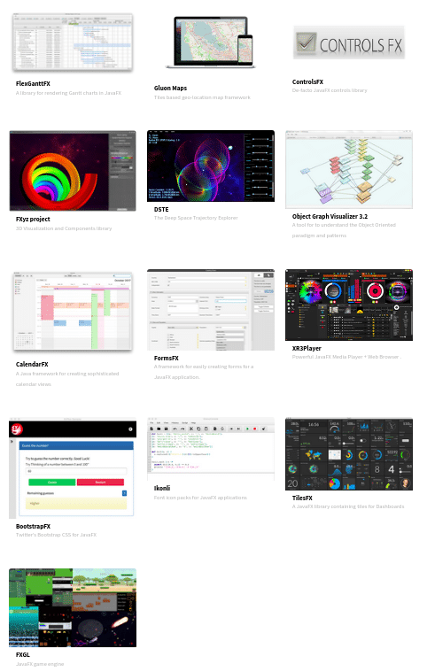

Thanks to Twitter and LinkedIn, I've been in touch with several developers who are doing cool Java stuff on the Raspberry Pi.

Here I want to share a number of projects with you, as they can be an inspiration for all of us to get started with Java development on the Raspberry Pi!

#### [Igor Souza](https://twitter.com/Igfasouza) - Kafka on the Raspberry Pi

Igor shared this [nice video where he set up a Kafka cluster on Raspberry Pi](https://twitter.com/Igfasouza/status/1293514673896202240). He also has a nice example where this is [combined with an e-ink display to show real-time bus information](https://twitter.com/Igfasouza/status/1297556313518616576). Some of his work is available on GitHub where you can find [Kafka and other example code](https://github.com/igfasouza?tab=repositories).

This week he also published a very nice example using [Quarkus, Qute, and Pi4J to control a LED number display](http://www.igfasouza.com/blog/quarkus-qute-with-raspberry-pi/). The [sources for this project are also available on GitHub](https://github.com/igfasouza/qute-example-pi4j).


igor-souza-kafka-300x260.png
igor-souza-realtimebus-300x260.png




#### [Roberto Marquez](https://twitter.com/onebeartoe) - GPIO and JavaFX

This project by Roberto uses the Raspberry Pi GPIOs to detect button presses for a game. JavaFX APIs were used to present the user interface on the Raspberry Pi's frame buffer. The project is further described on the [Adafruit website](https://learn.adafruit.com/press-your-button-for-raspberry-pi/) and [the code is available on GitHub](https://github.com/onebeartoe/press-your-button).



#### [Shamika Dalvi](https://twitter.com/ShamikaDalvi) - Several projects with Java and Pi4J

Shamika has multiple example projects on here website [cubeminx.com](http://www.cubeminx.com/). One demonstrates how you can control an OLED display using Java and Pi4J, while another one shows how to do UART communication between a Raspberry Pi and Arduino, also using Pi4J.

The data received on the Raspberry Pi is stored in a MySql database that can be read by a Java web application. Click on the "Machinestate \> Machine" button on [cubeminx.com](http://www.cubeminx.com/) to see the result.



#### Greg Flurry - Autonomous robot

On [instructables.com](https://www.instructables.com) you can find two nice manuals created by Greg. The first one is ["Efficient Java Development for the Raspberry Pi"](https://www.instructables.com/id/Efficient-Development-of-Java-for-the-Raspberry-Pi/) and describes how he uses NetBeans to build Java programs for the Raspberry Pi.

A second post is pretty spectacular as he has built ["An Autonomous Rover"](https://www.instructables.com/id/An-Autonomous-Rover/) which travels from one location in his house to another, with no help from a human, using Java code. He didn't share the Java code itself as it is very specific for his hardware, but describes all the steps he took to select the hardware and pseudocode to control his rover.



#### Daniel Mårtensson - PiJukeBox and OpenSourceLogger

Daniel used Java and Pi4J to turn an old Centrum U68 from 1940 into a MP3 player. The reason is that short wave, middle wave and long wave is today obsolete and not being used or sent in Sweden. Also, the electronics inside was a mess and very dangerous because it runs on both AC/DC current and all the wires began to lose their isolators.

With a Raspberry Pi B+, OpenJDK 8, and Pi4J inside this radio, it became a jukebox. The sources are available on [github.com/DanielMartensson/PiJukeBox](https://github.com/DanielMartensson/PiJukeBox).

Another project of Daniel, called "[OpenSourceLogger](https://github.com/DanielMartensson/OpenSourceLogger)" which is also shared on GitHub, provides a web application with Pi4J and Vaadin to control and measure analog inputs and outputs and store them into a MySQL database (requires a Raspberry Pi 4).


Radio.jpg
opensourcelogger-1024x711.png
opensourcelogger-wiring-1024x753.png


#### [Frank Delporte](https://twitter.com/frankdelporte) - Drumbooth controller

The main advantage of being the writer of an article? You can sneak in one of your very own projects 🙂

Based on several example applications from my book ["Getting Started with Java on Raspberry Pi"](https://webtechie.be/books/), I created a touch-screen JavaFX application for the drum booth of my son. He can use it to control 8 relays (for various lights on different voltages) and LED strips attached to an Arduino board. The application also contains a webserver, so we can trigger a "red alert" from anywhere in the house from our phone or PC to let him know dinner is on the table when we are too lazy to go up the stairs.

The full project is described [in this blog post](https://webtechie.be/post/2020-03-30-drumbooth-controller-with-java-javafx-raspberrypi-arduino/) and both [the Java and Arduino sources are available on GitHub](https://github.com/FDelporte/DrumBoothController).

<figure class="wp-block-embed-vimeo wp-block-embed is-type-video is-provider-vimeo wp-embed-aspect-16-9 wp-has-aspect-ratio">
 

  <iframe loading="lazy" title="Drum booth controller with Java, JavaFX, Raspberry Pi and Arduino" src="https://player.vimeo.com/video/402179641?dnt=1&amp;app_id=122963" width="500" height="281" frameborder="0" allow="autoplay; fullscreen; picture-in-picture; clipboard-write"></iframe>
 

</figure>

#### [openjfx.io](https://openjfx.io) - Community examples

If you need more JavaFX-inspiration to build beautiful user interfaces, check out the many JavaFX tools and frameworks listed on [openjfx.io](https://openjfx.io/index.html#fh5co-work). There is even a full game engine based on Java and JavaFX in that list: [FXGL](https://github.com/AlmasB/FXGL).

***Do you have a project on Raspberry Pi using Java (and JavaFX) you want to share?***

***Let me know (javaonraspberrypi at webtechie.be) as it would be big fun to be able to publish this kind of list on a regular basis!***
