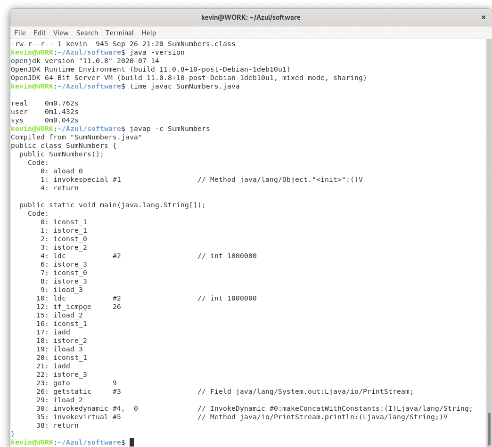

Java developers are familiar with the notion that the foundation of Java is "write once, run anywhere." That is, the same Java code will run on all the primary operating systems and hardware platforms. As I noted in my earlier post [Why Java, C, and Python Are Today's Most Utilized Programming Languages](https://foojay.io/blog/why-java-c-and-python-are-todays-most-utilized-programming-languages/), Python comes somewhat close to this (though in my experience what works on Linux may not work out-of-the-box on Windows or Mac), and of course C/C++ require immense adaptation of the software in order for it to work on different operating systems and hardware platforms.

The way Java accomplishes this is through the compilation of Java source code into bytecode, which is what the Java Virtual Machine (JVM) actually executes. Java bytecode is somewhat similar to the [Assembly Language](https://en.wikipedia.org/wiki/Assembly_language) utilized by languages like C. Bytecode is a low level instruction set that the JVM executes in order to enact the processing created by the developer with their Java (or any other JVM language) program.

**Comparing Java Code and Java Bytecode**

Here is a very simple Java program named SumNumbers.java that adds some numbers to come up with a sum, then prints the sum:

```java
public class SumNumbers { 

    public static void main(String args[]) {

        // compute 1 million by addition
        int x = 1;
        int sumx = 0;
        int count = 1000000;

        for(count = 0; count < 1000000; count = count + 1)
            sumx = sumx + 1;

        System.out.println("The total sum is " + sumx);

    }

}
```

We're going to count to 1 Million by adding 1 to 0 a million times. A very simple program.

So, what is happening when this program is run? First, the Java code is compiled into bytecode. In essence, the `javac` command is run to compile the Java source into Java bytecode, then the bytecode is executed using the JVM.

The performance timing of this is interesting (for reference, I'm running OpenJDK 11 on a fairly old 64-bit Debian Linux system). If I time this `javac` command:

```
time javac SumNumbers.java
```

I get this result:

```
real 0m0.762s
user 0m1.432s
sys 0m0.042s
```

These Linux timings can be a bit confusing. The `real` time is the total amount of time "from the start to the finish of the call." The `user` time appears to include the time I spent pressing the "Enter" key and the time that was taken for the result to be displayed on my console. The `sys` time is the amount of CPU time that was spent in Kernel mode. From these descriptions, I think the `real` time is what developers will be most interested in, when we're thinking about cloud applications. We don't have a developer press "Enter" every time a customer accesses our application.

**The Bytecode**

In executing this `javac` command, we asked the Java compiler to read our input `SumNumbers.java` file and convert into Java bytecode. If our Java source code is valid, the compiler produces a binary bytecode file named `SumNumbers.class`.

So, what's in `SumNumbers.class`? We can see this by executing the following command:

```
javap -c SumNumbers
```

Here's what we see:



As a matter of fact, though, understanding how Java bytecode works is critical if you are developing high-performance low-latency applications. It's actually possible to edit Java bytecode in order to improve performance. That is, your compiler produced a good first version of Java bytecode, but you have some ideas about how to further optimize the bytecode to increase the performance of your application.

**Directly Running Java Bytecode**

We can run the Java bytecode that `javac` produced using the following command:

```
java SumNumbers
```

When the `java` command sees no file extension, it looks for a file that ends with the extension `.class`; so that command runs the `SumNumbers.class` bytecode file. Here's the timing we see from doing that on my Linux system:

```
time java SumNumbers
```

```
The total sum is 1000000

real	0m0.088s
user	0m0.098s
sys	0m0.017s
```

So, we see that the time to execute the bytecode for this simple program is a small fraction of the time to compile it using `javac`.

**Non-Java JVM Languages**

Of course, there are many non-Java JVM languages, like Scala, Clojure, JPython. What type of bytecode do they produce compared with the `javac` compiler? And how efficient is the bytecode they produce?

I'll look into this in subsequent posts.
