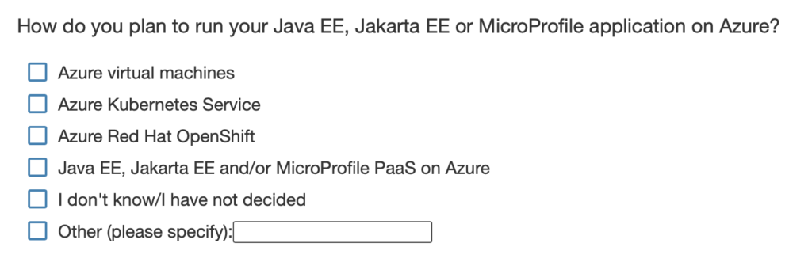

The Azure team at Microsoft has been strengthening its commitment and outreach to the [Jakarta EE](https://jakarta.ee/), [Java EE](https://www.oracle.com/java/technologies/java-ee-glance.html), and [MicroProfile](https://microprofile.io/) communities.

### Tools, Workshops, and More

This effort includes guidance, tools, scripts, workshops, and talks to help migrate workloads to virtual machines, Kubernetes, OpenShift, and managed service (PaaS) offerings.

We are working with key industry partners such as Oracle, IBM, Payara, and the Eclipse Foundation to better support runtimes such as WebLogic, WebSphere Traditional, Open/WebSphere Liberty, JBoss EAP, WildFly, Payara, and GlassFish on Azure.

### Real World Experience-Based Feedback

As we all know, there is no substitute to working closely, one-on-one with actual user-stakeholders. Solutions developed in a vacuum are rarely on-point. The ideal goal is to have a selected set of customers give us real world, experience-based feedback on the solutions we provide as we develop and release them iteratively.

Customers will work closely with the Microsoft Program Manager responsible for developing the solution as well as the engineering team. If desired, Microsoft is happy to help some customers with a free migration proof-of-concept.

### Quick Survey

If this sounds interesting, please fill out the survey below, by clicking on the image below, [or click here to go straight to the survey](https://aka.ms/migration-survey).

<https://aka.ms/migration-survey>

If you want us to contact you, please include your contact information at the end.

Even if you are not necessarily interested in migrating to Azure right away, it is still very helpful to fill out the survey and share your ideas on what you would like to see.

The survey attempts to understand the common use cases we need to cover in order to best serve your needs.

### Conclusion

We at Microsoft are working hard on your behalf and we are always glad to hear from you.
