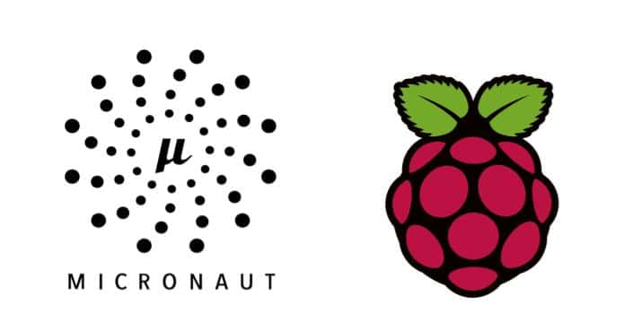
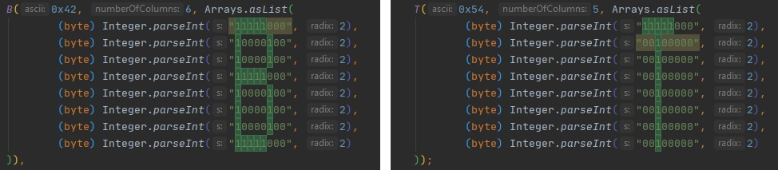

In a previous post, we looked at the project "[Electronics \& Quarkus Qute on Raspberry Pi](https://foojay.io/blog/electronics-quarkus-qute-on-raspberry-pi/)" by [Igor De Souza](https://twitter.com/Igfasouza).

In this article, we present you another great example of Java on Raspberry Pi created by Igor. It shows how to create a Micronaut Velocity demo using an 8x8 LED matrix display.


## Micronaut

[Micronaut](https://micronaut.io/) is a JVM-based framework for building lightweight, modular applications. Developed by [OCI](https://objectcomputing.com/), the same company that created [Grails](https://objectcomputing.com/products/grails), Micronaut is the latest framework designed to make creating microservices quick and easy.

One of the most exciting features of Micronaut is its compile time dependency injection mechanism. Most frameworks use reflection and proxies to perform dependency injection at runtime. Micronaut, however, builds its dependency injection data at compile time. The result is a faster application startup and smaller memory footprint.

Although Micronaut is primarily designed around message encoding/decoding there are occasions where it is convenient to render a view on the server-side. The views module provides support for view rendering on the server-side and does so by rendering them on the I/O thread pool in order to avoid blocking the Netty event loop.

More info on: <https://micronaut-projects.github.io/micronaut-views/latest/guide/>

## Velocity

Velocity is a Java-based template engine. It permits anyone to use a simple yet powerful template language to reference objects defined in Java code.

More info on: <http://velocity.apache.org/>

## Sense HAT



The Sense HAT is an add-on board for Raspberry Pi, made especially for the Astro Pi mission -- which launched to the International Space Station in December 2015 -- and is now [available to buy.](https://shop.pimoroni.com/products/raspberry-pi-sense-hat) The Sense HAT has an 8×8 RGB LED matrix, a five-button joystick, and includes the following sensors: Gyroscope, Accelerometer, Magnetometer, Barometer, Temperature sensor, and Relative Humidity sensor.

HAT stands for "Hardware Attached on Top" which is a new hardware specification for add-one modules for the Raspberry Pi.

You can check Igor's blog post with additional info on the Sense HAT [here](http://www.igfasouza.com/blog/sense-hat/).  



## Idea

Igor started with the idea to do something similar to the [Quarkus Qute 7 segment display demo](https://foojay.io/blog/electronics-quarkus-qute-on-raspberry-pi/), using Micronaut, but pivoted a little bit and ended up with a Micronaut Vecolcity interface that provides a way to control the 8×8 Led Matrix on the Sense HAT.

This project uses the [Java wrapper for Sense Hat](https://github.com/cinci/rpi-sense-hat-java).



## Code

The full code of this project is available on [GitHub](https://github.com/igfasouza/micronaut-velocity-8x8-led-matrix-sense-hat), below some highlights.

#### LedController.java

```java
@Controller("/display")
public class LedController {

    SenseHat senseHat = new SenseHat();

    @View("led")
    @Get("/create")
    public Map<String, Object> create() {
        senseHat.ledMatrix.clear();
        return createModelWithBlankValues();
    }

    @View("led")
    @Consumes(MediaType.APPLICATION_FORM_URLENCODED)
    @Post("/save")
    public Map<String, Object> save(@Valid @Body CommandLedSave cmd) {
        if(cmd != null) {
            if(cmd.getLeds() != null && !cmd.getLeds().equals("")) {
                String possitions[] = cmd.getLeds().split(",");
                Color[] pixels = createLedMatrix();
                int i = 0;
                int x = 0;
                int y = 0;
                while (i < possitions.length){
                    x = Integer.parseInt(possitions[i++]);
                    y = Integer.parseInt(possitions[i++]);
                    if(x != 0) {
                        x = x*8;
                    }
                    pixels[x+y] = Color.RED;

                }
                senseHat.ledMatrix.setPixels(pixels);
            }else {
                senseHat.ledMatrix.clear();
            }
        }

        final Map<String, Object> model = new HashMap<>();
        model.put("leds", cmd.getLeds());
        return model;
    }

    private Map<String, Object> createModelWithBlankValues() {
        final Map<String, Object> model = new HashMap<>();
        model.put("title", "");
        return model;
    }

    private Color[] createLedMatrix() {
        Color off = Color.of(0, 0, 0);
        Color[] pixels = new Color[64];
        for (int i = 0; i < pixels.length; i++) {
            pixels[i] = off;
        }
        return pixels;
    }
}
```

#### led.vm

Disclaimer, the CSS for the view is based on [VIrtual Led Display](https://codepen.io/djan/pen/FIkxC).

```java
<script>
function newLine(mat){
  var matrix = document.getElementById("matrix");
  var line = new Array();
  for (var i = 0; i < 8; i++){
   var led = document.createElement("div");
   led.onclick = function(){onOff(this, mat)};
   led.className = "led off";
   matrix.appendChild(led);
   line[i] = led;
 }
 return line;
}

function start(mat) {
 for (var i = 0; i < 8; i++)
   mat[i] = newLine(mat);
 return mat;
}

function onOff (led, mat) {
 if (led.className == "led off")
   led.className = "led";
 else
   led.className = "led off";

 getCoords(mat);
 document.getElementById("form_display").submit();
}

function getCoords (mat) {
 var coords = new Array();
 for ( var i = 0; i < mat.length; i++)
   for ( var j = 0; j < mat[i].length; j++)
     if (mat[i][j].className == "led") {
       coords.push(i);
       coords.push(j);
     }
 document.getElementById("leds").value = coords;
}

function write (mat,arr) {
 var i = 0;
 while (i < arr.length){
   mat[arr[i++]][arr[i++]].className = "led";
 }
}

window.onload = function() {
    var mat = new Array();
    var mat_final = start(mat);

    var leds = document.getElementById("leds").value;
    if (typeof leds !== 'undefined' && leds) {
        write(mat_final,leds.split(","));
    }
}
</script>

</head>
<body>
<h1>Led Display</h1>
<form action="/display/save" method="post" id="form_display">
    <input type="hidden" id="leds" name="leds" value="$leds" />
    <div id="base" class="base">
        <div id="matrix" class="matrix"></div>
    </div>
</form>
</body>
</html>
```

## Alternative approach with a cheaper 8x8 LED matrix

In most getting started kits for Arduino and Raspberry Pi, you will find a stand-alone 8x8 matrix which can be controlled with SPI (Serial Peripheral Interface) via a MAX7219 chip. Or you can buy these for around 3$ (search on ebay for "max7219 dot matrix module").

Using Java and Pi4J you can build an application to control the LED matrix as shown in the video below. The sources of this project, can be found as an [example project within the sources of the book "Getting Started with Java on the Raspberry Pi" on GitHub](https://github.com/FDelporte/JavaOnRaspberryPi/tree/master/Chapter_09_Pi4J/java-pi4j-spi).

<figure class="wp-block-embed-vimeo wp-block-embed is-type-video is-provider-vimeo wp-embed-aspect-16-9 wp-has-aspect-ratio">
 <div class="wp-block-embed__wrapper">
  <iframe loading="lazy" title="Raspberry Pi example application controlling with SPI an 8x8 LED matrix display" src="https://player.vimeo.com/video/395562339?dnt=1&amp;app_id=122963" width="500" height="281" frameborder="0" allow="autoplay; fullscreen; picture-in-picture; clipboard-write"></iframe>
 </div>
</figure>

The characters and images are created by converting the bit series to byte values inside enums. The number of definitions in the code is limited as this example is only a demonstration of what you can do, not a fully finished project. So some fun work left for you!

By using the "Find" function in the IDE for value "1" it becomes pretty clear how the defined columns and rows will end up on the matrix display.


## Conclusion

Both on hardware as software level, you have different possible approaches, but the result is the same... a fun project to learn new software technologies and getting introduced into electronics.

**Note:** Used with permission and thanks --- originally written and published on the blog of [Igor De Souza](http://www.igfasouza.com/blog/micronaut-velocity-with-raspberry-pi/) and [Frank Delporte](https://webtechie.be/post/2020-02-01-raspberry-pi-and-spi-8x8-led-matrix-example-with-java-and-pi4j/).
