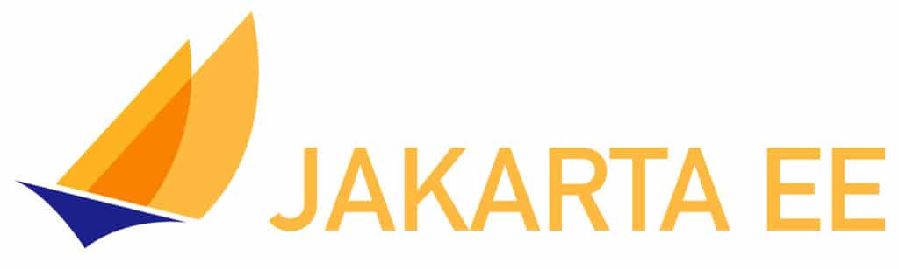

EclipseCon Community Day is on Monday, October 19 14:00 to 18:00 CET (the day before the start of the main EclipseCon conference). Community Day at EclipseCon has always been a great event for Eclipse working groups and project teams. This year both EclipseCon and Community Day is virtual and free. Space for Community Day is limited, so please [register](https://www.eclipsecon.org/2020/registration) and save your spot soon.

We have a packed agenda centered on the Jakarta EE, MicroProfile and Cloud Native Java communities. If there is a set of very focused sessions you should attend on these topics, the agenda offers the one place this year to do so. The sessions are intended not only for learning, but also for the community to actively engage with some key leaders. Note, after you register for EclipseCon, you will need to reserve your spot for Community Day through the Swapcard platform (let me know if you run into any issues).
 

Myself, Werner Keil and Thodoris Bais are organizing on behalf of the community. We are grateful to have a very strong line-up both in terms of speakers and content. Below is a very good snapshot. Please note that all times are Central European Time (CET).

|----------------------------------------------|---------------------------|-------------------------------------------------------------------------------------------------------------------------------------------------------|
| **Session**                                  | **Time**                  | **Speakers**                                                                                                                                          |
| Jakarta EE Community State of the Union      | 10/19/2020 14:30 -- 15:15 | Steve Millidge                                                                                                                                        |
| MicroProfile Community Current and Future    | 10/19/2020 15:15 -- 16:00 | Emily Jiang                                                                                                                                           |
| Jakarta EE/MicroProfile -- Key Features Demo | 10/19/2020 16:30 -- 17:15 | Josh Juneau, Edwin Derks                                                                                                                              |
| Jakarta EE 10 Round Table                    | 10/19/2020 17:15 -- 18:00 | Otavio Santana (Moderator) Steve Millidge (Payara), Kevin Sutter (IBM), Dmitry Kornilov (Oracle), David Blevins (Tomitribe), Werner Keil, Ryan Cuprak |

Steve Millidge will be providing a good overview of the current status of Jakarta EE in ***Jakarta EE Community State of the Union***. This will include Jakarta EE 8, Jakarta EE 9 as well as Jakarta EE 10. If there is one session to learn about Jakarta EE status, get involved and ask questions, this session is it.

Emily Jiang will be doing the same thing for MicroProfile in ***MicroProfile Community Current and Future***. So if you want to know about MicroProfile, this is the session you should make a point to attend. Emily will cover both MicroProfile 3.3 and MicroProfile 4.0.

If you have not seen Jakarta EE and MicroProfile in action, ***Jakarta EE/MicroProfile -- Key Features Demo*** is for you. Josh Juneau and Edwin Derks will be joining forces in this very code/demo heavy session to show you the key features of this technology stack, where to use it in the real world and how.

Finally, we will be bringing together some key leaders in the community to talk about the future of Jakarta EE in ***Jakarta EE 10 Round Table*** . You should show up not just to hear what this panel of experts thinks is most important for the success of the technology, but also to ask them questions. Anyone can pose their questions to the panel by just adding them [here](https://docs.google.com/document/d/1M2qu3NW2D0RJ8Q-1aA1LJhha6oc0Ci4ifveRZey3Ce8/edit?usp=sharing).

For further details, please look [here](https://www.eclipsecon.org/2020/community-day-jakarta). You will find session abstracts, speaker profiles and more. We have worked hard to organize a strong agenda on your behalf and we hope you will [join us](https://www.eclipsecon.org/2020/registration).

*Please note these views are my own and do not reflect the views of Microsoft as a company.*

Used with permissions and thanks, [originally written and published by Reza Rahman](https://reza-rahman.me/2020/10/06/why-you-should-join-eclipsecon-community-day).
