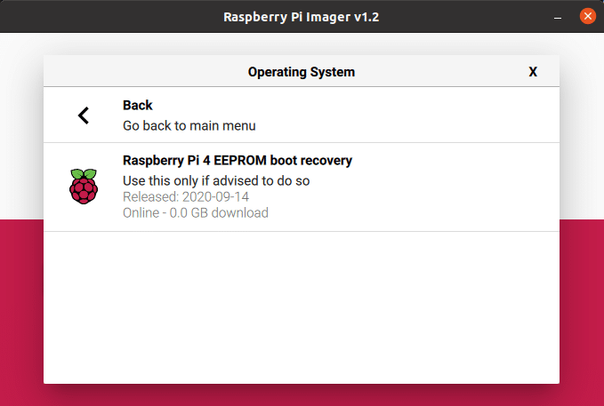
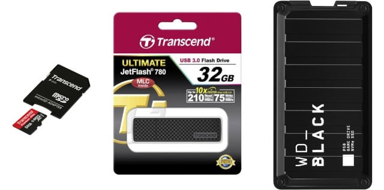
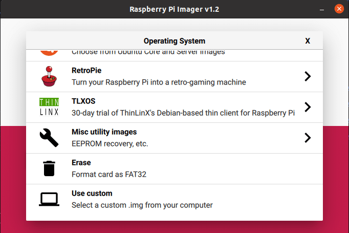
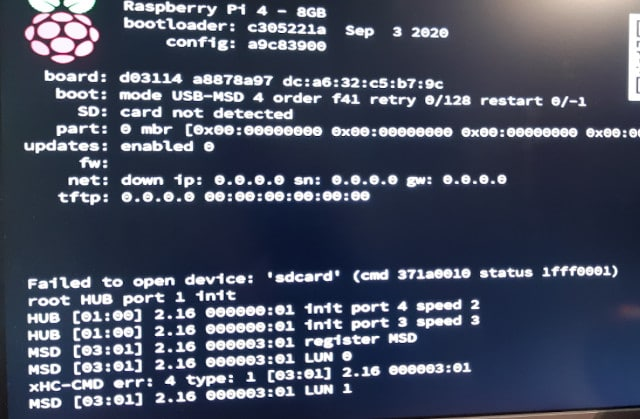

> In a future post, we will be building OpenJDK on a Raspberry Pi.
>
> This post is not really Java-related but a preparation for things to come...

A micro SD card is the default way to add an operating system to the Raspberry Pi. But there is an alternative approach that you need to consider if you want to make your system more reliable. SD cards are not super fast and can get quickly corrupted when you are writing a lot to disc.

There is a long thread on the Raspberry Pi forum ["STICKY: HOWTO: Move the filesystem to a USB stick/Drive"](https://www.raspberrypi.org/forums/viewtopic.php?f=29&t=44177) where you can find a lot of additional info, but this post contains the short version which worked out for me to turn my **Raspberry Pi 4 with 8GB memory into a real workhorse**.

### Prepare the Raspberry Pi to Boot from USB

The full process is described in ["USB mass storage boot"](https://www.raspberrypi.org/documentation/hardware/raspberrypi/bootmodes/msd.md), but these are the only steps needed for a Raspberry Pi 4:

* On PC, Apple or Raspberry Pi, download the ["Imager" tool](https://www.raspberrypi.org/downloads/) from the Raspberry Pi website
* With the "Imager" write the latest bootloader to an SD card (note: this is not really a bootloader but replaces the on-board bootloader)



As described in the "README.txt" file:

* Power off the Raspberry Pi
* Insert the sd-card.
* Power on Raspberry Pi
* Wait at least 10 seconds
* If successful
  * The green LED light will blink rapidly (forever)

  <!-- -->

  * If an HDMI display is attached the screen will display green
* If not successful
  * An error pattern will be displayed

  <!-- -->

  * If an HDMI display is attached the screen will display red

### Raspbian OS 64-bit

Raspbian OS (which recently was ["re-branded" to "Raspberry Pi OS"](https://unix.stackexchange.com/questions/602587/why-has-raspbian-apparently-been-renamed-into-raspberry-pi-os)) is the operating system provided by Raspberry Pi and is based on Debian. As only the latest Raspberry Pi-boards have a 64-bit chip, the official release of Raspbian OS is 32-bit only. But there is a work-in-progress-version of an OS-version which is fully 64-bit! Let's use that one...

For this post, I wrote this 64-bit beta-version to three different discs to compare the results.


* Download the OS-img file [from the Raspberry Pi forum](https://www.raspberrypi.org/forums/viewtopic.php?f=117&t=275370)
* Again use the "Imager" tool and select the file you just downloaded with the "Use custom" option



This 64-bit OS version is still in development and not fully finished. In case you have questions and remarks about it, you can check out this forum post ["STICKY: Raspberry Pi OS (64 bit) beta test version feedback"](https://www.raspberrypi.org/forums/viewtopic.php?f=63&t=275372).

### Micro SD card

The first test with the ["Transcend 64GB microSD"](https://www.kiwi-electronics.nl/transcend-64GB-class-10-microsd-sdxc-met-adapter) starts smoothly as expected.

### Flash Drive

For the second test, the SD card is removed, and the ["32GB Transcend JetFlash 780 USB 3.0 Flash Drive"](https://www.kiwi-electronics.nl/32gb-transcend-jetflash-780-usb-30-flash-drive-mlc-210mbs) is used... and **we have a winner! No configuration or other changes needed! Just plugin the Flash Drive in a USB 3 (blue) port and the Raspberry Pi starts similar to the SD card**.

### SSD Drive

Pushing the limits now... How cool would it be to have a 500Gb drive which is about the same size as the Raspberry Pi itself? Let's try out with a ["WD BLACK P50 Game Drive SSD 500GB"](https://www.coolblue.be/nl/product/853658/wd-black-p50-game-drive-ssd-500gb.html).

But no luck... Connected to USB 3 the Pi can't boot. It works when connected to USB 2 but the speed is a lot lower than expected. And after a few reboots, I seem to have messed up the disc, as I end up with the same error screen again...


Apparently, **not all SSD drives are supported (yet) with USB Boot on the Raspberry Pi** , so I need to investigate this further...**If you have an idea on how to fix this issue, please let me know!**

This is the "dmesg" info which is logged when this drive is connected while the board is booted with another disc:

```
[  567.261232] usb 2-2: new SuperSpeed Gen 1 USB device number 8 using xhci_hcd
[  567.282283] usb 2-2: New USB device found, idVendor=1058, idProduct=2642, bcdDevice=10.03
[  567.282293] usb 2-2: New USB device strings: Mfr=2, Product=3, SerialNumber=1
[  567.282298] usb 2-2: Product: Game Drive
[  567.282302] usb 2-2: Manufacturer: Western Digital
[  567.293640] scsi host1: uas
```

## Comparing Disk Speed

On this post ["Disk Speed Test (Read/Write): HDD, SSD Performance in Linux (shellhacks.com)"](https://www.shellhacks.com/disk-speed-test-read-write-hdd-ssd-perfomance-linux/) I found several test commands to test the speed of the discs. Let's use them with the different discs.

### Commands Used

Write a file:

```
$ sync; dd if=/dev/zero of=tempfile bs=1M count=1024; sync
```

Read a file, but using the cached file, so not the real speed:

```
$ dd if=tempfile of=/dev/null bs=1M count=1024
```

Read a file, but first clear the cache to get the real speed:

```
$ sudo /sbin/sysctl -w vm.drop_caches=3
$ dd if=tempfile of=/dev/null bs=1M count=1024
```

Test with hdparm as benchmarking tool for the read speed:

```
$ sudo apt-get install hdparm
$ sudo hdparm -Tt /dev/sda           # For the USB disc
$ sudo hdparm -Tt /dev/mmcblk0       # For the SD card
```

### Results

|                 |   MicroSD   | Flash disk (USB3) | WD_Black (USB2) |
|-----------------|-------------|-------------------|-----------------|
| Write           | 270 MB/s    | 267 MB/s          | 156 MB/s        |
| Read buffered   | 1.3 GB/s    | 1.3 GB/s          | 1.3 GB/s        |
| Read real       | **46 MB/s** | **246 MB/s**      | 33.3 MB/s       |
| hdparm cached   | 960 MB/s    | 980 MB/s          | 891 MB/s        |
| hdparm buffered | **44 MB/S** | **216 MB/s**      | 32 MB/s         |

## Conclusion

Switching from SD to USB Boot is **very easy if you have a Flash Drive which is supported** and the **read speed is a lot higher** ! Combined with the **higher reliability**, this makes the switch a go go go... 😉

**Note:** Used with permission and thanks --- originally written and published on [Frank Delporte](https://webtechie.be/post/2020-09-29-64bit-raspbianos-on-raspberrypi4-with-usbboot/)'s blog.
