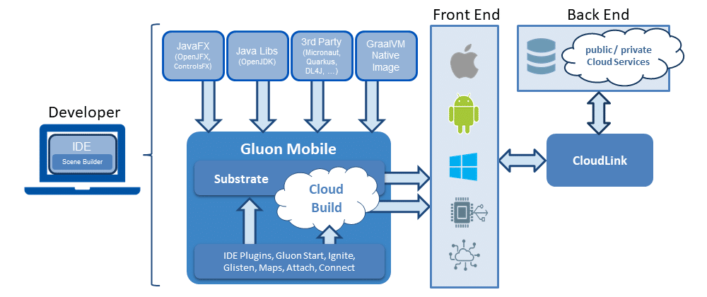
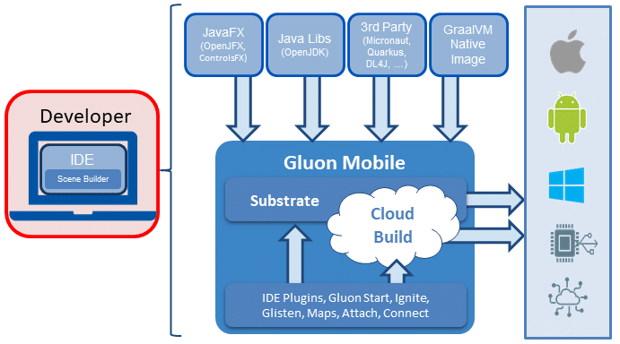
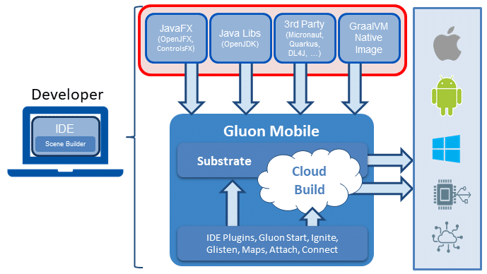
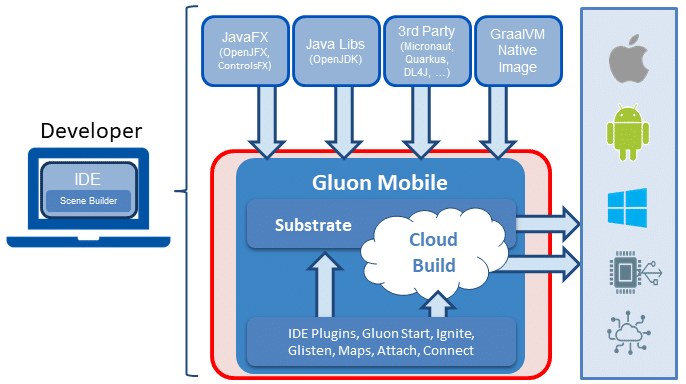
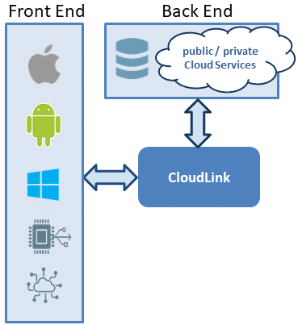

[Continued from part 1.](https://foojay.io/blog/cross-platform-development-in-java-with-gluon-and-graalvm/)

Introducing Gluon {#h2-0-introducing-gluon}
-------------------------------------------

[Gluon](https://gluonhq.com/) is a company that enables Java on desktop, embedded, and mobile with a rich, full-featured, JavaFX user interface. Gluon embeds GraalVM and brings GraalVM to an audience hungry for performance and full-featured user experiences. Gluon enables seamless cloud integration of mobile and embedded experiences, driving increased cloud consumption.

In short: Gluon is the company you're looking for if you want an end-to-end Java solution. Gluon offers products that fit right into your company's architecture.

Before we look at the different products mentioned in this overview, let's find out what GraalVM is about.

GraalVM {#h2-1-graalvm}
-----------------------

Software code can be written in different languages and the choice of language often defines how the code is executed.

* In the old days, a language such as BASIC was "interpreted". An interpreter looked at every line of code and executed the code step by step. The advantage of such an approach was that a developer can run his code as soon as it was written. The execution of such code is usually slow, which is a disadvantage ---and the reason why they aren't many interpreted languages anymore today.  
* Java code is compiled to bytecode that will be loaded into and executed by a virtual machine (VM). Compiled code is faster than interpreted code, but compiling introduces an extra step into the development process.  
* You'll get the best performance from code that is compiled and linked into a standalone executable that doesn't require a VM, a *native image*. In this case, the application runs directly on the operating system of the device you are using.

[GraalVM](https://www.graalvm.org/) is an effort from Oracle to offer developers all these possibilities at once. GraalVM supports different programming languages, it consists of a VM on which applications can run, but it also allows you to create native images that don't require a VM to be executed.

GraalVM is the holy grail in software development. *"What keeps developers from using this holy grail?"* you might ask. The answer is simple: developers need tools that lower the threshold to adopt GraalVM. Without those tools, using GraalVM can be cumbersome. Gluon offers the tools that take away the burden.

Developing mobile apps using Gluon Tools {#h2-2-developing-mobile-apps-using-gluon-tools}
-----------------------------------------------------------------------------------------

Developers use the Integrated Development Environment (IDE) of their choice to write code. C# developers use MS Visual Studio; Java developers typically use IntelliJ IDEA, Eclipse, or NetBeans IDE. Additionally, they can use Gluon's [Scene Builder](https://github.com/gluonhq/scenebuilder) as a WYSIWYG to create the User Interface.

While writing code, Java developers will use a series of tools, most of which are freely available:

* To compile and execute their code, Java developers need a Java Development Kit (JDK) and a Java Runtime Environment (JRE). [OpenJDK](http://openjdk.java.net/) is a free and open source implementation of the Java Platform.
* JavaFX can be used for the UI of the application. [OpenJFX](https://openjfx.io/) is a free and open source implementation of JavaFX; [ControlsFX](https://github.com/controlsfx/controlsfx) is a project developed by Gluon founders that extends the functionality of JavaFX with a series of extra controls.
* Depending on the nature of the application, developers will also use different third-party libraries such as [Micronaut](https://micronaut.io/), [Quarkus](https://quarkus.io/), [DL4J](https://deeplearning4j.org/), etc.
* Finally, they'll need [GraalVM Native Image](https://www.graalvm.org/reference-manual/native-image/) to create the applications.

While it's certainly possible to use all these components separately, using Gluon Mobile as the SDK for cross-platform development will save plenty of time, increasing the productivity of developers.

Gluon offers different components:

* [Gluon Start](https://start.gluon.io/) allows developers to select the necessary Gluon tools simply by clicking some checkboxes and buttons.
* [Gluon Ignite](https://gluonhq.com/labs/ignite/) allows developers to use popular dependency injection frameworks in their JavaFX applications.
* [Glisten](https://docs.gluonhq.com/charm/5.0.0/#_charm_glisten) offers a selection of controls that are useful in the context of a mobile application.
* [Gluon Maps](https://gluonhq.com/labs/maps/) will be helpful if you need to render maps in your application. And so on.
* [Gluon Attach](https://gluonhq.com/products/mobile/attach/) provides an API to hardware (such as a camera, Bluetooth) in an OS-independent way.
* [Gluon Connect](https://gluonhq.com/products/mobile/connect/) allows communicating with CloudLink and third party services..

Gluon and the upcoming Gluon Cloud Build use GraalVM Native Image to create native images for different platforms. These tools take away the complexity of using GraalVM Native Image directly.

* [Gluon Substrate](https://github.com/gluonhq/substrate) is used on the local development environment.
* With [Gluon Cloud Build](https://gluonhq.com/) (under development), this time-consuming process can be offloaded to the cloud.

Most of the Gluon products ---but not all of them--- are offered as open source software:

* [Gluon Scene Builder](https://github.com/gluonhq/scenebuilder) is offered for free under a permissive open source license.
* [Gluon Mobile](https://gluonhq.com/products/mobile/) is a closed source, proprietary SDK that can be extended with open and closes source components.
* [Gluon Substrate](https://github.com/gluonhq/substrate) is available under a restrictive open source license.
* [Gluon Cloud Build](https://gluonhq.com/) hasn't been made available to the public yet. It will be offered in a pay per use model in the future.

Support for these products is only available for customers who engage in a business relationship with Gluon Software.

Protecting the back end using Gluon CloudLink {#h2-3-protecting-the-back-end-using-gluon-cloudlink}
---------------------------------------------------------------------------------------------------

Exposing the back end directly to such an application isn't a good idea in terms of security. It's good practice to introduce an extra layer between the front end and the back end.

In a Gluon-based architecture, [Gluon CloudLink](https://gluonhq.com/products/cloudlink/) serves as an such a layer that allows companies to:

* Avoid direct access to the back-end infrastructure from the client app.
* Manage authentication and authorization, hosted in a secure cloud.
* Configure, manage, and monitor access to critical infrastructure.
* Off-load code and functionality from the device to the cloud, e.g. using serverless functions.
* Provide easier access to cloud services, based on required functionality.

Gluon offers CloudLink as a service. In select cases, CloudLink can be deployed on-premise on the customer's cloud infrastructure. In both cases, customers pay per use (recurring, volume-based revenue).

What can Gluon do for your company? {#h2-4-what-can-gluon-do-for-your-company}
------------------------------------------------------------------------------

Enterprises invest heavily in enterprise back ends. Back-end data and functionality are often exposed over the web, accessed via applications and browsers by customers, employees, partners, etc. Increasingly, these users also want access to data and functionality on mobile devices, and security is becoming an important key criterion for mobile app technology.

Unfortunately, the Java ecosystem is underserved towards mobile. Mobile development gets outsourced to teams with different skills, using different technologies, causing conflicts between the Java team and the new or external mobile team, resulting a higher total cost of the project.

Java is a clear leader in the enterprise market. Java is cross-platform, secure, mature, well-integrated. JavaFX is undervalued as technology to create slick user interfaces that look great, regardless of the platform or device. In a perfect world, Java-oriented enterprises would choose mobile app development tooling based on the programming language they are most familiar with.

That's also what Java developers need and want, but:

* Either they are served a disappointing experience on Android with its disregard for compatibility with the real Java---supporting only earlier features of Java֫---and its attempts to force developers towards other technologies, such as Flutter (and Dart).
* Or they are forced into Objective-C or Swift, or a different cross-platform offering such as Xamarin (C#), Cordova or React Native (JS).

Moreover, enterprises dislike rapid breaking changes, such as those between Objective-C and Swift, or between the various releases of Swift, or even the evolution of the Android APIs. They require stability and a long-term perspective of backwards compatibility.

***That's why Gluon has invested heavily in R\&D to create a full technology stack over the past five years. Gluon now offers a complete end-to-end Java solution, enabling Java developers to work productively on a secure and mature platform.***
