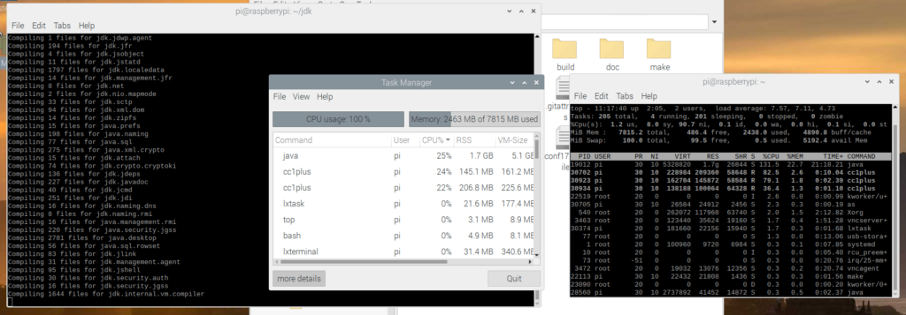
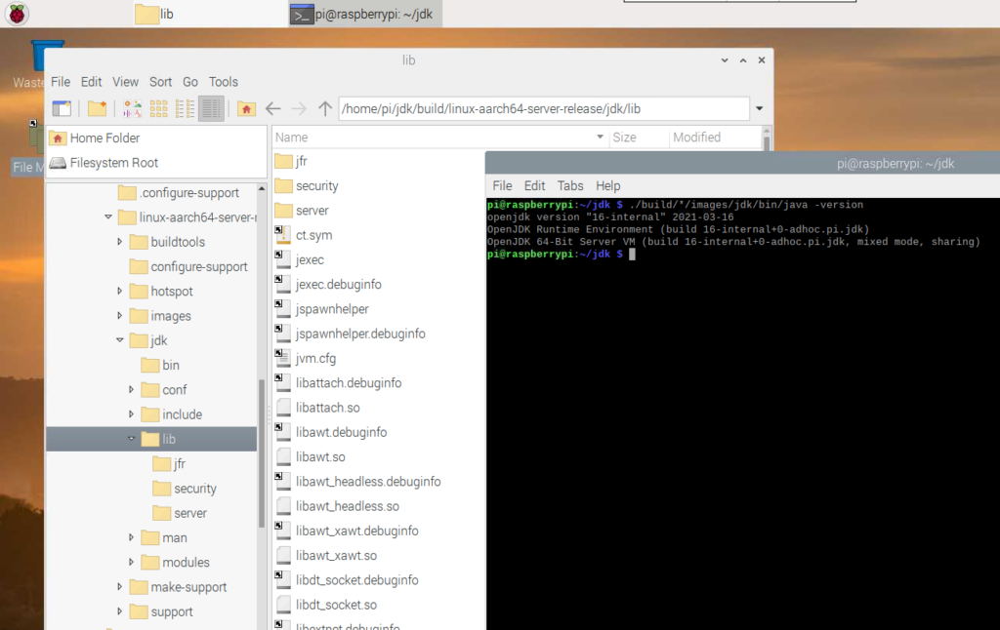

The OpenJDK sources are now [fully available and developed on GitHub](https://github.com/openjdk/jdk) as a result of [Project Skara](https://openjdk.java.net/projects/skara/). Thanks to a lot of work done by the community, the full Java development flow has been migrated to GitHub while keeping the repository history. This process has been [described on the GitHub blog](https://github.blog/2020-09-30-github-welcomes-the-openjdk-project/?s=09).

This also means we are now able to build OpenJDK ourselves from the latest sources, very easily, on any device where we want to use the latest not-yet-released-version.
> Consider switching your Raspberry Pi to USB Boot for higher read speeds and more reliable disc writes.
>
> For more info, see   
>
> "[Faster \& More Reliable 64-bit OS on Raspberry Pi 4 with USB Boot](https://foojay.io/blog/64-bit-raspbian-os-on-raspberry-pi-4-with-usb-boot/)"

The build process is [very well explained in the sources](https://github.com/openjdk/jdk/blob/master/doc/building.md). And each time you run one of the steps (e.g. \`bash configure\`), you will be alerted if additional tools are required and how to install them. By just running the given command, the missing tools will be installed and you can run the command again. That's how I ended up with this list of commands.

I used the [work-in-progress 64-bit version of Raspberry Pi OS](https://www.raspberrypi.org/forums/viewtopic.php?f=117&t=275370) for this blog post.

To be able to build, you need a recent (released) JDK. So we start with installing Java JDK 15 with SDKMAN:

```
$ sudo apt install zip
$ curl -s "https://get.sdkman.io" | bash
$ sdk install java 15.0.0.fx-librca
```

Now we are ready to install all the required tools, get the sources from GitHub, and create the JDK build configuration.

```
$ sudo apt-get install autoconf
$ sudo apt-get install libx11-dev libxext-dev libxrender-dev libxrandr-dev libxtst-dev libxt-dev
$ sudo apt-get install libcups2-dev
$ sudo apt-get install libfontconfig1-dev
$ sudo apt-get install libasound2-dev
$ git clone https://github.com/openjdk/jdk.git
$ cd jdk
$ bash configure

====================================================
A new configuration has been successfully created in
/home/pi/jdk/build/linux-aarch64-server-release
using default settings.

Configuration summary:
* Debug level:    release
* HS debug level: product
* JVM variants:   server
* JVM features:   server: 'aot cds compiler1 compiler2 epsilongc g1gc graal jfr jni-check jvmci jvmti management nmt parallelgc serialgc services shenandoahgc vm-structs zgc' 
* OpenJDK target: OS: linux, CPU architecture: aarch64, address length: 64
* Version string: 16-internal+0-adhoc.pi.jdk (16-internal)

Tools summary:
* Boot JDK:       openjdk version "15" 2020-09-15 OpenJDK Runtime Environment (build 15+36) OpenJDK 64-Bit Server VM (build 15+36, mixed mode)  (at /home/pi/.sdkman/candidates/java/current)
* Toolchain:      gcc (GNU Compiler Collection)
* C Compiler:     Version 8.3.0 (at /usr/bin/gcc)
* C++ Compiler:   Version 8.3.0 (at /usr/bin/g++)

Build performance summary:
* Cores to use:   4
* Memory limit:   7815 MB
```

With all the required tools being available and configured, we can start the compile process with \`make images\`. This will run for a longer time, compiling all components of the JDK. The Raspberry Pi 4 has enough resources as memory usage fluctuates between 1 and 3GB.

```
$ make images
```



In my case (Raspberry Pi 4 with 8 GB memory and 64-bit Raspbian OS) this took just under 60 minutes. For reference, on a Ubuntu 20.04 PC with Intel Core i7 with 16GB memory it takes about 15 minutes.

Now let's try-out our new JDK!

```
$ ./build/*/images/jdk/bin/java -version
openjdk version "16-internal" 2021-03-16
OpenJDK Runtime Environment (build 16-internal+0-adhoc.pi.jdk)
OpenJDK 64-Bit Server VM (build 16-internal+0-adhoc.pi.jdk, mixed mode, sharing)
```

Yep, there it is: **the cutting edge, not yet released, straight from the sources, freshly baked and served "**Java JDK 16-internal**" on a Raspberry Pi**! 🙂

