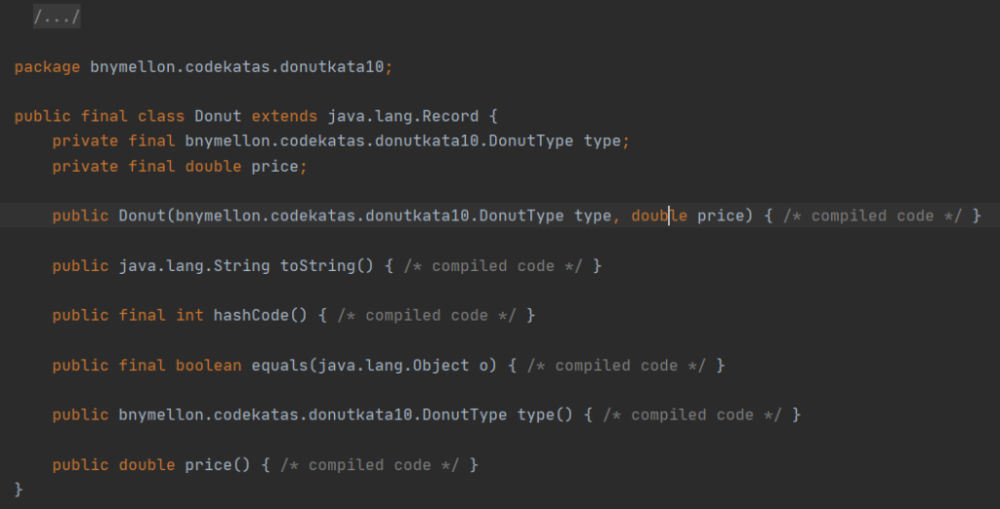
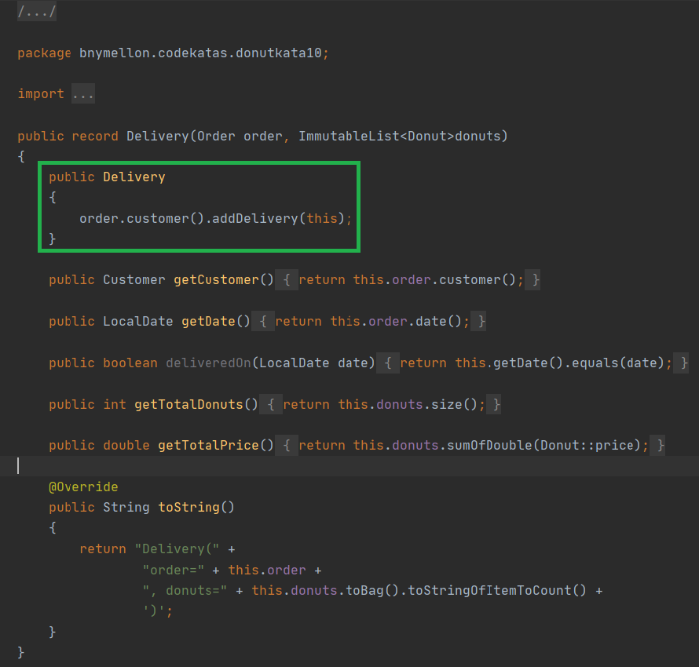
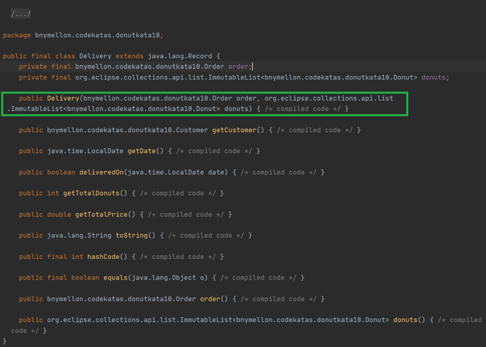
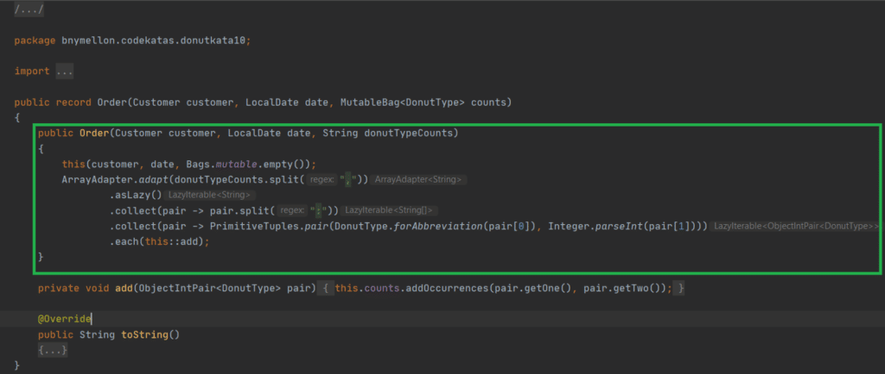
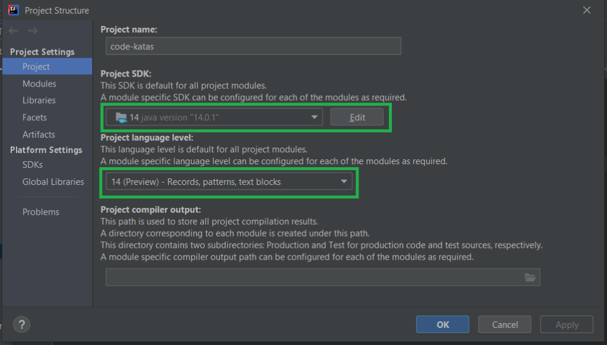
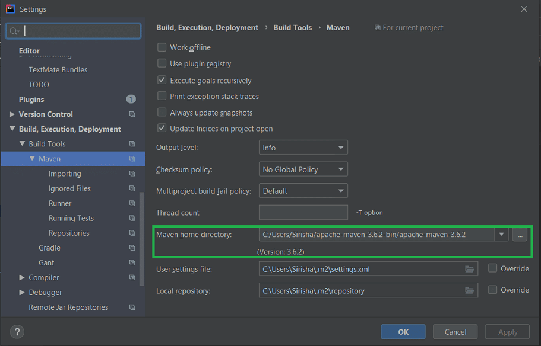

Ever since Java announced their 6-month release cycle, there is excitement around exploring new features and even more so with preview features.

See [JEP-12](https://openjdk.java.net/jeps/12) for the definition of the preview feature.
> A *preview feature* is a new feature of the Java language, Java Virtual Machine, or Java SE API that is fully specified, fully implemented, and yet impermanent. It is available in a JDK feature release to provoke developer feedback based on real world use; this may lead to it becoming permanent in a future Java SE Platform.

One such noteworthy preview feature called "Records" was introduced as part of Java 14 in March 2020. This caused quite a lot of interest in the Java community.

Now, what is a record?

It is a new variety of type declaration. It is also a sub-type of class.

A common type of class, as we all know, is the data-carrier class. They are classes that have some fields and their corresponding getters and setters. They usually have little to no logic.

Records help provide a way to succinctly describe the intent of these data-carrier classes. *A little less conversation, a little more action*.

### Show Me Some Code!

As mentioned earlier, data-carrier classes can now be simplified to just a few lines of code by adding the keyword `record`:



Refactoring this code resulted in 58 changes (2 additions, 56 deletions).



The following were generated by the compiler, referencing the image above

1. Two private final field variables called `type`and `price` that matches the record description, i.e., `record Donut(DonutType type, double price)` .
2. A public `toString()` method.
3. Public `equals()` and `hashCode()` methods.
4. A default public constructor with the fields specified in the record class. This is called a canonical constructor.
5. Public read accessors `type()` and `price()`. Notice the change in the method name from your conventional getters. They are not prefixed with "get".

### Constructors

1. Canonical constructor — as mentioned above, takes all the record fields as arguments and is also the default constructor.
2. Compact constructor — similar to the canonical constructor, in that, this too takes all the fields in the record as arguments. But without the formal parameter list and parenthesis.  
   In the example below, the compiler-generated code contains the same argument list as in the default canonical constructor. Also, note there is no need to specify `order` and `donuts` initialization as that is generated by default.  
   To create a new `Delivery`, you can simply do the below.  
   `var delivery = new Delivery(order, donutList);`

 Delivery class  
 Compiler-generated code for Delivery class (Right)
> One thing to note here is that there is no "no-argument" constructor here because all fields of a record are final and must be initialized as part of the default constructor logic.

3. Custom constructor — The argument list can be overridden from that of the canonical constructor. Custom constructors must delegate to the canonical constructor. See the example below.  

### Advantages \& Constraints of using Records

1. Readability and Transparency — With just fewer lines of code, it is significantly easier to understand what the class does. For example, `Donut` class is a data container for Donut type and its price.
2. Data Modelling — Records are best suited when the objective of a class is to represent a schema/model.
3. Possible reduced need for libraries that auto-generate boilerplate code like Lombok.

Now, there are some constraints with using records:

1. You can't declare it as an abstract class, as `record` is a `final` class.
2. You can't extend from other classes, as it already `extends` `java.lang.Record`. See the code generated by the compiler above.
3. You can't declare instance fields. The only fields available to you are those of the record descriptors.

Other than these limitations, records behave exactly like classes. You can use the `new` keyword to instantiate records, implement interfaces, declare static methods, add annotations to the record class or the fields.

### Setup \& Project Resources

* Download JDK 14 [here](https://www.oracle.com/java/technologies/javase/jdk14-archive-downloads.html).
* Download Apache Maven [here](https://maven.apache.org/download.cgi).
* I am using IntelliJ 2020.1 which supports JDK 14 including the preview features which makes learning about this feature so much easier. Download [link](https://www.jetbrains.com/idea/download/).

Here is how my setup looks in IntelliJ.
 

Examples mentioned above are all available in this GitHub [project](https://github.com/BNYMellon/CodeKatas/tree/master/donut-kata).

Some other resources to help solidify the concepts —

* [Java 14 Feature Spotlight: Records](https://www.infoq.com/articles/java-14-feature-spotlight)
* [JEP 359: Records (Preview)](https://openjdk.java.net/jeps/359)

Hope you enjoyed reading my blog. Thank you for your time!

*Used with permission and thanks,* originally published [here](https://pratha-sirisha.medium.com/for-the-record-1bfb3622f446).
