The post ["Starting a JavaFX Project with Gluon Tools"](https://foojay.io/today/starting-a-javafx-project-with-gluon-tools/) shows you how to start a Gluon Mobile Multiview project with a few clicks in IntelliJ IDEA thanks to the ["Gluon plugin"](https://plugins.jetbrains.com/plugin/7864-gluon).

In this post, we will use such a project and build it with GitHub Actions as a native application for Windows, MacOS, iOS, Linux, and Android from one single code base!
> Yes, that's right!  
>
> True "Write Once, Run Everywhere"!!!
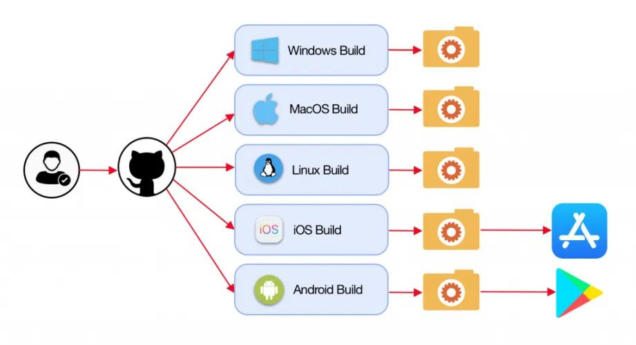

## The Application

This application is built around a Java library I created last year for my book ["Getting Started with Java on the Raspberry Pi"](https://webtechie.be/books/) which helps you to calculate the value of a resistor from its color rings. This library is further described on ["Resistor color codes and calculations as a Java Maven library"](https://webtechie.be/post/2019-11-25-resistor-color-codes-and-calculations-a-java-maven-library/).

<figure class="wp-block-gallery columns-2 is-cropped wp-block-gallery-1 is-layout-flex wp-block-gallery-is-layout-flex">
 <ul class="blocks-gallery-grid">
  <li class="blocks-gallery-item">
   <figure>
    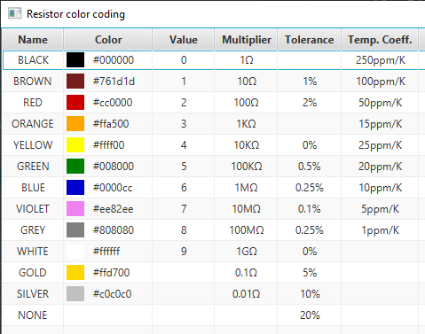
   </figure></li>
  <li class="blocks-gallery-item">
   <figure>
    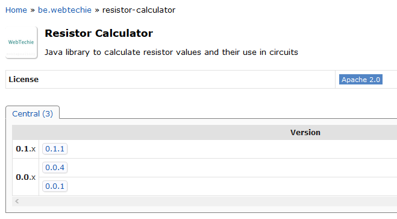
   </figure></li>
 </ul>
</figure>

### Based on "Gluon Mobile Multiview"

Based on a "Gluon Mobile Multiview" project, it was only a matter of hours to create a working application with two calculation views and one "About" view. Many thanks to [José Pereda](https://twitter.com/JPeredaDnr) of Gluon who was so kind to improve my ugly proof-of-concept to a much better-looking layout with some clever tweaks and CSS improvements.

<figure class="wp-block-gallery columns-6 is-cropped wp-block-gallery-2 is-layout-flex wp-block-gallery-is-layout-flex">
 <ul class="blocks-gallery-grid">
  <li class="blocks-gallery-item">
   <figure>
    <a href="app-about.png">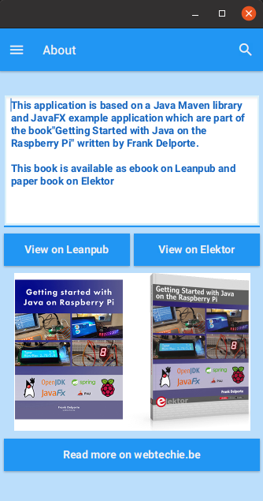</a>
   </figure></li>
  <li class="blocks-gallery-item">
   <figure>
    <a href="app-colors.png">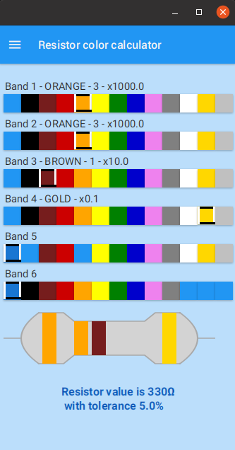</a>
   </figure></li>
  <li class="blocks-gallery-item">
   <figure>
    <a href="app-led.png">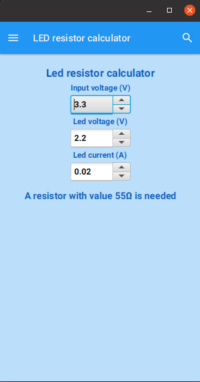</a>
   </figure></li>
  <li class="blocks-gallery-item">
   <figure>
    <a href="app-menu.png">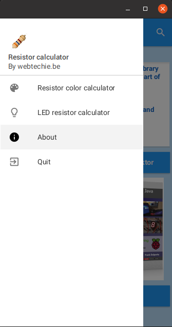</a>
   </figure></li>
  <li class="blocks-gallery-item">
   <figure>
    <a href="github-project-1.png">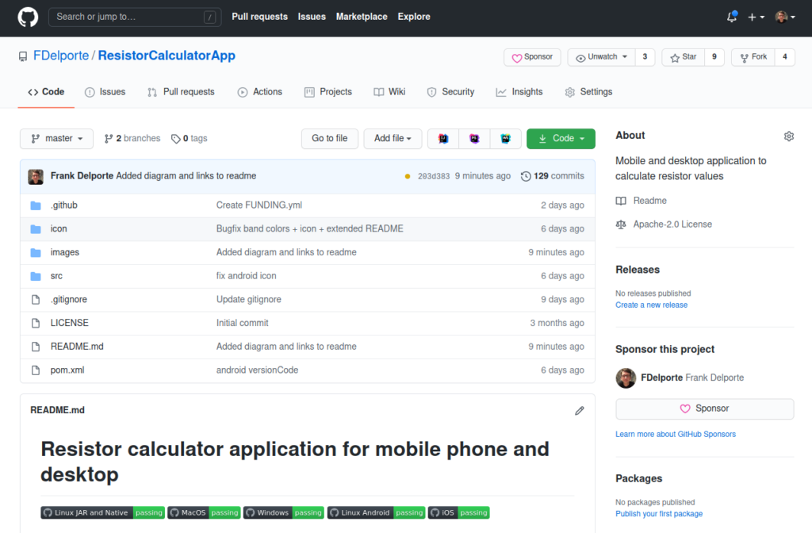</a>
   </figure></li>
  <li class="blocks-gallery-item">
   <figure>
    <a href="intellij-app.png">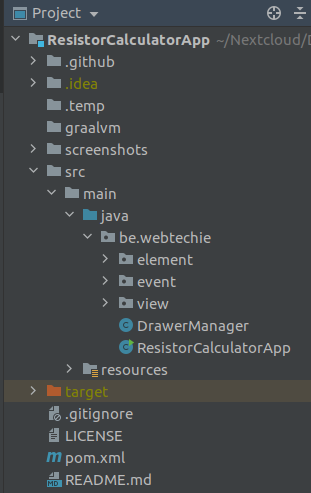</a>
   </figure></li>
 </ul>
</figure>

### **It's Not Finished Yet...**

As this first version was created to have a proof-of-concept flow from JavaFX application to native applications and app store publications, the code is not fine-tuned yet...

There are still some things to do:

* The buttons to open a web URL on the "About" screen, use `com.gluonhq.attach.browser.BrowserService` which only supports iOS and Android. So either the Gluon-library needs to be extended, or this app needs to check the environment and run the appropriate command.
* The layout of the color calculator screen doesn't fit in a landscape layout so needs to be reworked.
* The resistor drawing should scale to use the available space.
* General work to do for a pixel perfect layout on all devices.

Any help and pull requests are welcome on [the GitHub project](https://github.com/FDelporte/ResistorCalculatorApp) 😉

## **GitHub Actions**

[GitHub Actions](https://github.com/features/actions) allow you to automate your software workflows with Continuous Integration and Continuous Deployment right from GitHub.

By adding .yml-files to the directory ".github/workflows" in your project, these will be run as configured. A simple example is provided on ["Introduction to GitHub Actions"](https://docs.github.com/en/free-pro-team@latest/actions/learn-github-actions/introduction-to-github-actions) which checks out the pushed code, installs the software dependencies, and runs `bats -v`:

```
name: learn-github-actions
on: [push]
jobs: 
   check-bats-version:
   runs-on: ubuntu-latest
   steps:
      - uses: actions/checkout@v2
      - uses: actions/setup-node@v1
      - run: npm install -g bats
      - run: bats -v
```

## **Gluon**

Gluon provides an easy and modern approach to develop Java Client applications. These applications can run on the JVM or can be converted to platform-specific native-images, which have a lightning-fast startup and take a fraction of space. Moreover, applications can also be targeted to Android, iOS, and embedded apart from all the desktop environments.

### **Gluon Client Plugin**

The Gluon Client plugin leverages GraalVM, OpenJDK, and JavaFX by compiling the Java Client application and all its required dependencies into native code, so that it can be directly executed as a native application on the target platform.

One of the advantages is a much faster startup time, since the JVM no longer needs to be started. The resulting application will be entirely integrated into the native operating system.

More info is available on the [docs pages on the Gluon website](https://docs.gluonhq.com/).

### **Gluon GitHub Build License Action**

The GitHub Actions system allows to "plugin" build steps provided by third parties. These are GitHub-projects on their own which allow you to simplify your .yml-files.

Gluon created such a build action which you can integrate into the build process of your JavaFX native application: ["gluon-build-license"](https://github.com/gluonhq/gluon-build-license) to correctly use your Gluon license key in the build process. You will need to add this license to your GitHub project repository secrets.

**This license-step is optional!** If you don't have one, a popup will be shown at startup of your application. You can request a free license to Gluon if you are working on a student or open-source project, as described on ["Free Gluon Licenses"](https://gluonhq.com/programs/free-gluon-licenses/).

<figure class="wp-block-image size-medium">
 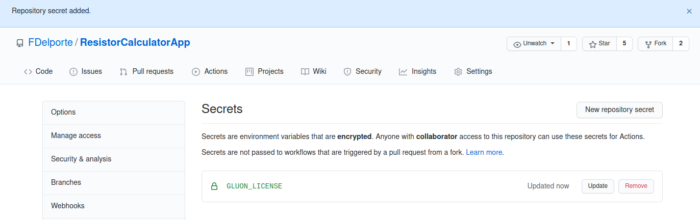
</figure>

### **Build as a Native Application with GraalVM**

Gluon Substrate takes away most of the complexity of using GraalVM Native Image. You can create an app in Java, test it on your desktop, and then compile and link the Java bytecode to a native image for a specific platform by defining a profile in Maven. The resulting binary can be deployed to the AppStore or Google Play.

## **The Build Process on GitHub Actions**

For the sake of this post, all the different build processes are split into separate .yml-files, but GitHub Actions allows you to combine different "jobs" into one such file.

### **General Description**

The .yml-structure is pretty similar for all build types and has this structure:

* Give the build file a name
* Define on which branch commits and/or pull requests you want the build to start
* Define the OS to run on
* Download GraalVM
* For desktop: Make a staging directory in which the build results will be copied
* Build the application with Maven, GraalVM and the Gluon client plugin
* Desktop: copy the application to the staging directory for desktop and upload staging into the Package which is the result of the build process
* Apps: upload to Apple TestFlight or Google Play

Based on the name, you can get a badge which you can add to the README of your project or... this post.
    

Depending on the OS some additional steps are settings are required as described further.

### **Desktop Applications**

#### **Linux JAR + Native Application**

Action file: [maven-ubuntu-linux.yml](https://github.com/FDelporte/ResistorCalculatorApp/blob/master/.github/workflows/maven-ubuntu-linux.yml)

For Linux, a list of extra libraries is required, which is done with an additional step after the download of GraalVM.

```
- name: Install libraries
  run: sudo apt install libasound2-dev libavcodec-dev libavformat-dev libavutil-dev libgl-dev libgtk-3-dev libpango1.0-dev libxtst-dev
```

This build process produces both a JAR and a Linux native application. For the first one we run a Maven package:

```
- name: Build JAR with Maven
  run: mvn -B package
```

Because the build process is running on a Linux machine, we can define the target as desktop to build a native Linux application with the Gluon Maven client plugin and need to provide the GraalVM location:

```
- name: Gluon Build
  run: mvn -Pdesktop client:build client:package
  env:
    GRAALVM_HOME: ${{ env.JAVA_HOME }}
```

#### **Windows Native Application**

Action file: [maven-windows.yml](https://github.com/FDelporte/ResistorCalculatorApp/blob/master/.github/workflows/maven-windows.yml)

To build the Windows version of the application, Visual Studio is required, which can be done with two additional steps:

* [microsoft/setup-msbuild](https://github.com/microsoft/setup-msbuild): GitHub Action to facilitate configuring MSBuild in the workflow PATH for building .NET Framework applications.
* [egor-tensin/vs-shell](https://github.com/egor-tensin/vs-shell): GitHub action to setup the Visual Studio shell environment.

```
- name: Add msbuild to PATH
  uses: microsoft/<a href="/cdn-cgi/l/email-protection" class="__cf_email__" data-cfemail="a5d6c0d1d0d588c8d6c7d0ccc9c1e5d3948b958b97">[email protected]</a>
- name: Visual Studio shell
  uses: egor-tensin/vs-shell@v1
```

The rest of the script is similar to the Linux one and at the end, we only copy the exe-file to the package.

#### **MacOS Native Application**

Action file: [maven-macos.yml](https://github.com/FDelporte/ResistorCalculatorApp/blob/master/.github/workflows/maven-macos.yml)

Xcode is required to build Apple applications. Again we can add this to our steps by using an existing action:

* [maxim-lobanov/setup-xcode](https://github.com/maxim-lobanov/setup-xcode): GitHub Action to setup your workflow with a specific version of Xcode.

```
- uses: maxim-lobanov/setup-xcode@v1
  with: xcode-version: '11.7.0'
```

And the resulting file "target/client/x86_64-darwin/Resistor Calculator" is copied to the package.

### **Smartphone Applications**

When I started working on this post and project, I just wanted to reach successful native builds for all platforms. But then Gluon stepped in and pushed this a lot further and guess what? This application is now on both "[Google Play](https://play.google.com/store/apps/details?id=be.webtechie.resistorcalculatorapp)" and the "[Apple App Store](https://apps.apple.com/us/app/gluon-resistor-calculator/id1540638756)" thanks to the work of [Erwin Morrhey](https://twitter.com/erwin1).

<figure class="wp-block-gallery columns-3 is-cropped wp-block-gallery-3 is-layout-flex wp-block-gallery-is-layout-flex">
 <ul class="blocks-gallery-grid">
  <li class="blocks-gallery-item">
   <figure>
    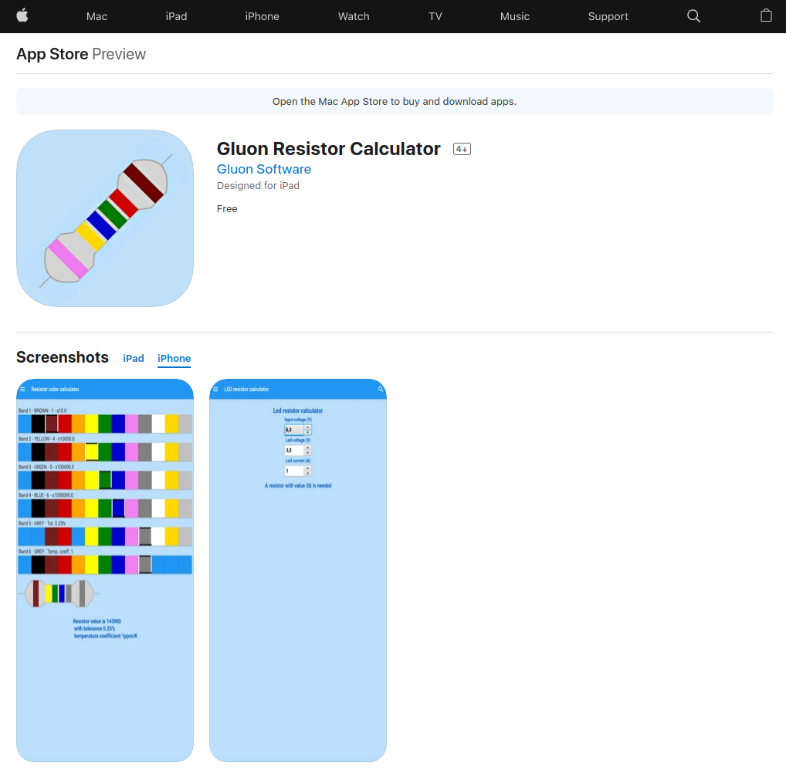
   </figure></li>
  <li class="blocks-gallery-item">
   <figure>
    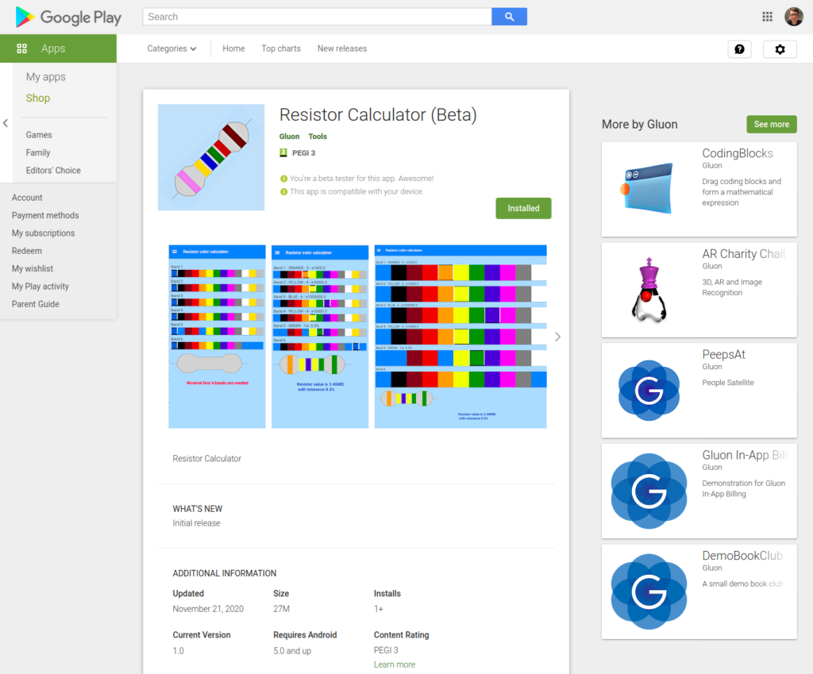
   </figure></li>
  <li class="blocks-gallery-item">
   <figure>
    
   </figure></li>
 </ul>
 <figcaption class="blocks-gallery-caption">
  The app in the stores and a QR code to install on your phone
 </figcaption>
</figure>

All the required steps to build AND upload to both the stores are included in the GitHub Actions!!!

You will need a developer account for both stores and the required keys. As I don't have them (yet), a fork has been made by Gluon and these steps only run fully if the needed keys are provided as you can see on the fork in the [GluonHQ GitHub repository](https://github.com/gluonhq/ResistorCalculatorApp).

#### **iOS App (MacOS Build)**

Action file: [maven-ios.yml](https://github.com/FDelporte/ResistorCalculatorApp/blob/master/.github/workflows/maven-ios.yml)

Additional settings are required which you can hide from your script by defining them in the secrets-section of your GitHub project, just like we already did with the Gluon license key.

<figure class="wp-block-gallery columns-2 is-cropped wp-block-gallery-4 is-layout-flex wp-block-gallery-is-layout-flex">
 <ul class="blocks-gallery-grid">
  <li class="blocks-gallery-item">
   <figure>
    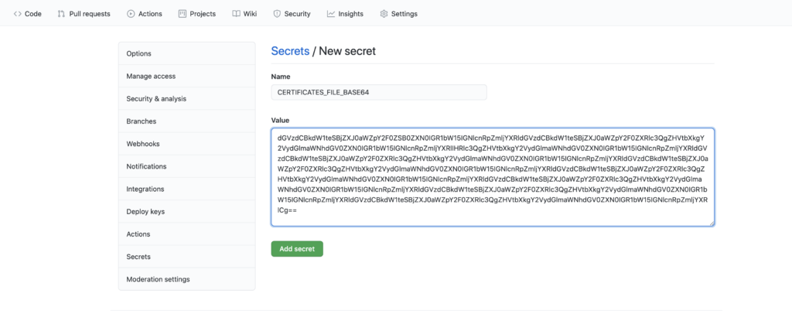
   </figure></li>
  <li class="blocks-gallery-item">
   <figure>
    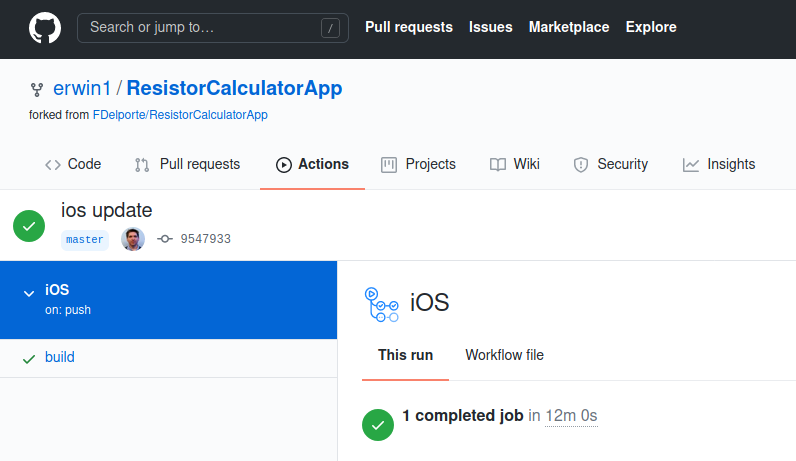
   </figure></li>
 </ul>
</figure>

Again we can use existing GitHub Actions to extend our previous "MacOS native" build file:

* [Apple-Actions/import-codesign-cert](https://github.com/Apple-Actions/import-codesign-certs): GitHub Action for Importing Code-signing Certificates into a Keychain.
* [Apple-Actions/download-provisioning-profiles](https://github.com/Apple-Actions/download-provisioning-profiles): Github Action for downloading provisioning profiles from Apple AppStore Connect.
* [Apple-Actions/upload-testflight-build](https://github.com/Apple-Actions/upload-testflight-build): A GitHub Action that Uploads a build to Apple TestFlight.

By using these with our secret keys, all the required steps can be run inside a single GitHub action. For instance, the final step to upload the application to TestFlight:

```
- uses: Apple-Actions/upload-testflight-build@master
  if: ${{ github.repository_owner == 'gluonhq' }}
  with:
    app-path: target/client/arm64-ios/Resistor Calculator.ipa
    issuer-id: ${{ secrets.APPSTORE_ISSUER_ID }}
    api-key-id: ${{ secrets.APPSTORE_KEY_ID }}
    api-private-key: ${{ secrets.APPSTORE_PRIVATE_KEY }}
```

#### **Android App (Linux Build)**

Action file: [maven-ubuntu-android.yml](https://github.com/FDelporte/ResistorCalculatorApp/blob/master/.github/workflows/maven-ubuntu-android.yml)

Actions used in this file (which is based on the previous "Linux native" file):

* [timheuer/base64-to-file](https://github.com/timheuer/base64-to-file): A GitHub action which takes a base64 string and decodes to a file for use in arguments in later actions.
* [r0adkll/upload-google-play](https://github.com/r0adkll/upload-google-play): A GitHub action to upload an Android .apk or .aab file to the Google Play Console.

The additional steps for Google Play include initialization of the Android Keystore:

```
- name: Setup Android Keystore
  if: ${{ github.repository_owner == 'gluonhq' }}
  id: android_keystore_file
  uses: timheuer/base64-to-file@v1
  with:
    fileName: 'my.keystore'
    encodedString: ${{ secrets.GLUON_ANDROID_KEYSTORE_BASE64 }}
```

And finally, the upload is done with:

```
- name: Upoad to Google Play
  if: ${{ github.repository_owner == 'gluonhq' }}
  uses: r0adkll/upload-google-play@v1
  with:
    serviceAccountJsonPlainText: ${{ secrets.ANDROID_SERVICE_ACCOUNT_JSON }}
    packageName: be.webtechie.resistorcalculatorapp
    releaseFiles: target/client/aarch64-android/gvm/Resistor Calculator.apk
    track: beta
```

## **Conclusion**

The power of JavaFX combined with the Gluon tools and GitHub actions is amazing. Building and distributing a truly cross-platform application has never been easier!

Really not a single code change is needed to run on different platforms. As you can see from the build processed, the exact same code is used to create native applications for both Windows, Linux, MacOS, iOS, and Android!

Gluon is also working on a sample using this work-flow, which is available on [github.com/gluonhq/hello-gluon-ci](https://github.com/gluonhq/hello-gluon-ci).

**Note:** Used with permission and thanks --- originally published on [webtechie.be](https://webtechie.be/post/2020-11-24-javafx-gluon-mobile-github-actions/).
