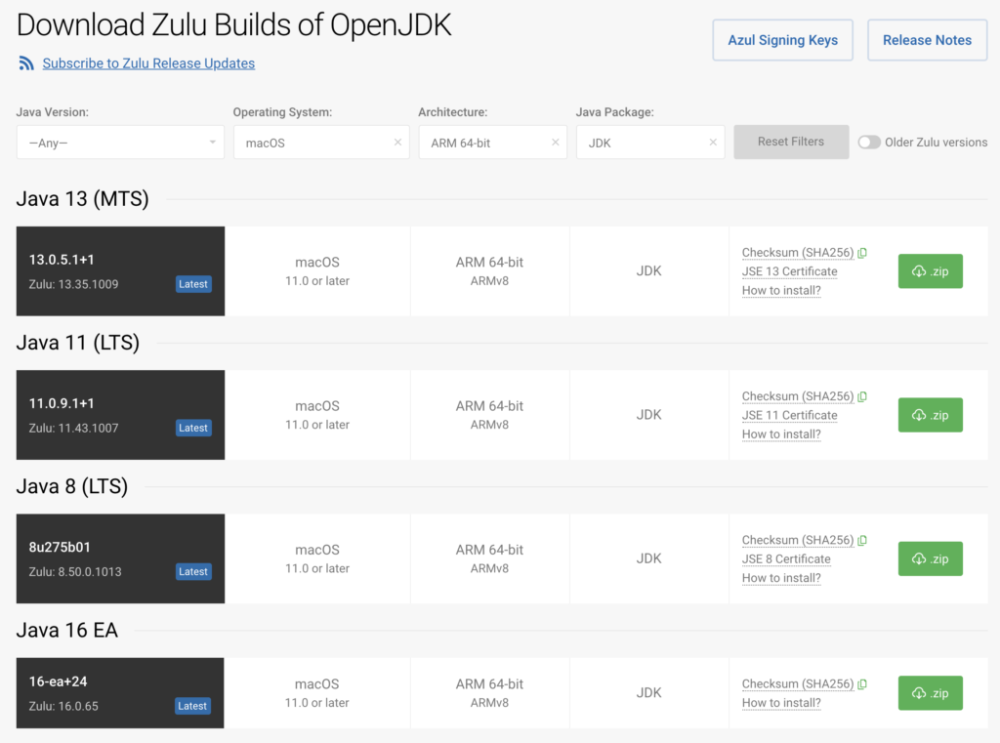

Azul has been leading the OpenJDK community effort ([JEP 391](http://openjdk.java.net/jeps/391)) initiated in August 2020 to add support for Apple Silicon, Arm-based Macs, in future versions of OpenJDK.

In addition to targeting future Java versions, Azul has made OpenJDK builds of currently popular Java versions, including Zulu builds of OpenJDK 8, 11, and 13, as well as 16-ea, widely available for use on Apple Silicon, Arm-based Macs.

In June 2020, Apple announced a two-year plan to transition the CPUs in its Macintosh line of computers from Intel's x86-64 processors to Apple-designed chips that use the ARM64 architecture. At its "One More Thing" event on November 10 2020, Apple followed through on its promise and debuted new MacBook Air, MacBook Pro and Mac Mini Arm-based models powered by Apple Silicon.

Azul Zulu builds of OpenJDK are tested and certified open source JDKs, and cover the industry's widest supported range of OpenJDK versions, target platforms, and package types. Here you see IntelliJ IDEA powered by Zulu OpenJDK and Apple Silicon:



[Azul Zulu builds of OpenJDK are free to download](https://www.azul.com/downloads/zulu-community/?os=macos&architecture=arm-64-bit&package=jdk) and use without restrictions, with optional support available from Azul via Zulu Enterprise subscription plans.

**"Given the popularity of Macs among Java developers, when Apple announced the transition of MacBooks and Mac Desktops to Apple Silicon, we recognized the resulting gap in Java support and anticipated a broad developer need for Java JDKs for these new platforms,"** said Scott Sellers, Azul president and CEO. **"We took action to fulfil that need, and to prevent discontinuity. The key for developers, and for users of their applications, is that the JDKs they rely on remain readily available on their environment of choice, and that those JDKs remain trustworthy---TCK-tested, Java certified, and secure. We are proud to enable developers to continue using Apple's Mac platforms for Java development using the popular Azul Zulu builds of OpenJDK, even as Apple transitions to new hardware architectures previously unsupported by OpenJDK."**

[Go here to download Zulu builds of OpenJDK for Apple Silicon.](https://www.azul.com/downloads/zulu-community/?os=macos&architecture=arm-64-bit&package=jdk)
