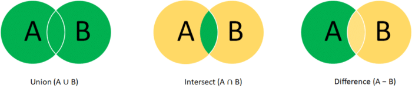
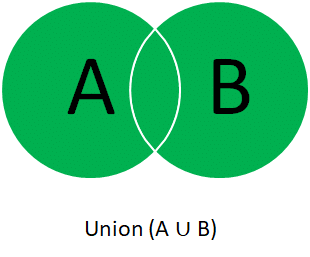
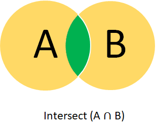
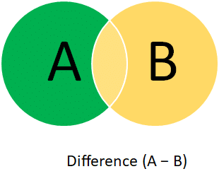

[Eclipse Collections](https://www.eclipse.org/collections/) has a rich assortment of data structures, and one of them is a Set.

Recently, I worked on an issue to implement union, intersect, and difference operations in sets for primitive types.

The sections below cover each operation's objective, design considerations, and code implementation.

The last section covers the takeaways.

### Union: What Does This Operation Do?

Method signature: `setA.union(setB)`

Union as the name indicates, it takes elements from two sets and combines them into one.



Set A --- 1, 2, 3, 4.

Set B --- 4, 5.

Union --- 1, 2, 3, 4, 5.

#### Union:  Design Considerations

1. **Size.**  My first approach was to take elements from Set A and add all the elements from Set B to the resulting set. But, what if Set B is larger than Set A. Is it then optimal to create a set from Set A first and then merge Set B into the resulting set? In the case of union, we know that the elements from both sets are part of the final set; hence it is reasonable to start with the larger set and iterate over the smaller set to add them to the larger set.
2. **Empty set(s).**  Does it matter that one of the two sets is empty? If one of the two sets is empty, the expected result is the non-empty set. If both sets are empty, then the expected result is an empty set. This can be confirmed by writing useful unit tests.

#### Union: Code Implementation

Eclipse Collections has an existing API `withAll` which allows you to add elements from one set to the other.

```java
`default MutableIntSet union(IntSet set)
{
    if (this.size() > set.size())
    {
        return this.toSet().withAll(set);
    }
    else
    {
        return set.toSet().withAll(this);
    }
}`
```

Unit tests for union covering scenarios for equal-sized, unequal-sized, and empty sets.

```java
`private void assertUnion(MutableIntSet set1, MutableIntSet set2, MutableIntSet expected)
{
    MutableIntSet actual = set1.union(set2);
    Assert.assertEquals(expected, actual);
}

@Test
public void union()
{
    this.assertUnion(
            this.newWith(1, 2, 3),
            this.newWith(3, 4, 5),
            this.newWith(1, 2, 3, 4, 5));

    this.assertUnion(
            this.newWith(1, 2, 3, 6),
            this.newWith(3, 4, 5),
            this.newWith(1, 2, 3, 4, 5, 6));

    this.assertUnion(
            this.newWith(1, 2, 3),
            this.newWith(3, 4, 5, 6),
            this.newWith(1, 2, 3, 4, 5, 6));

    this.assertUnion(
            this.newWith(),
            this.newWith(),
            this.newWith());

    this.assertUnion(
            this.newWith(),
            this.newWith(3, 4, 5),
            this.newWith(3, 4, 5));

    this.assertUnion(
            this.newWith(1, 2, 3),
            this.newWith(),
            this.newWith(1, 2, 3));
}
`
```

### Intersect: What Does This Operation Do?

Method signature: `setA.intersect(setB)`

Intersect takes two elements from two sets and only retains the common elements in the resulting set.



Set A --- 1, 2, 3, 4.

Set B --- 3, 4, 5, 6.

Intersect --- 3, 4.

#### Intersect: Design Considerations

1. **Size.**  This matters in the case of intersect too, but it works differently than the case above. Since we are only interested in the common elements between the two sets, the smaller set between them will be our starting point. For the sake of this argument, consider a case of million items in Set A and three items in Set B and we are interested in the common elements. It would make sense to start with the smaller set as we know the result set will contain only three elements at most.
2. **Empty set(s).** In this case, if either or both sets are empty, the resulting set will be empty. This can be confirmed quickly by adding unit tests.

#### Intersect: Code Implementation

Eclipse Collections has an existing API that allows us to select all elements that evaluate true for the given Predicate.

```java
`default MutableIntSet intersect(IntSet set)
{
    if (this.size() < set.size())
    {
        return this.select(set::contains);
    }
    else
    {
        return set.select(this::contains, this.newEmpty());
    }
}`
```

Unit tests for intersect covering [scenarios](https://github.com/eclipse/eclipse-collections/blob/00557933f648e2c3a2112bcfc7cfb349a7609844/eclipse-collections-code-generator/src/main/resources/test/set/mutable/abstractPrimitiveSetTestCase.stg#L502) for equal-sized, unequal-sized, and empty sets.

### Difference: What Does This Operation Do?

Method signature: `setA.difference(setB)`

Difference takes elements that are unique to Set A only and not Set B.  
  

Set A --- 1, 2, 3, 4.

Set B --- 3, 4, 5, 6.

Difference--- 1, 2.

#### Difference - Design considerations

As you may have guessed, the size of these two sets doesn't matter, as our starting point will always be Set A. If Set A is empty, then the resulting set will be empty, and if Set B is empty, then the resulting set will be Set A.

#### Difference: Code Implementation

Eclipse Collections has an existing API that allows us to reject which returns all elements that evaluate false for the Predicate. In other words, it is the opposite of select.

```java
`default MutableIntSet difference(IntSet set)
{
    return this.reject(set::contains);
}`
```

Unit tests for difference covering scenarios for equal-sized, unequal-sized, and empty sets.

### Takeaways

1. **Naming convention.**  Naming is of utmost significance when it comes to code readability. In Eclipse Collections, we have chosen to name these operations as union, intersect and difference to effectively communicate the mathematical set operations.
2. **Write Unit Tests.**  This point is worth reiterating. I started writing unit tests to confirm my understanding of how these new APIs should behave. Once I had the first implementation ready, the next step was to verify that the unit tests were still passing after adding the API's optimization logic.
3. **Think Optimization.** In my first implementation, the new APIs worked as expected. To further improve the code, I added optimization improvements to the algorithm, such as a simple size check, and other minor code refactoring.

I am a committer to the Eclipse Collections OSS project at Eclipse Foundation. Eclipse Collections is open for contributions.

This article was originally posted [here](https://pratha-sirisha.medium.com/primitive-set-operations-in-eclipse-collections-b126c9121d15?source=friends_link&sk=8c6645ba69f66b01c18796fa21b0163f) by the author.
