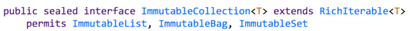
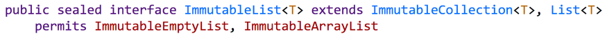
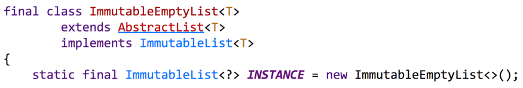
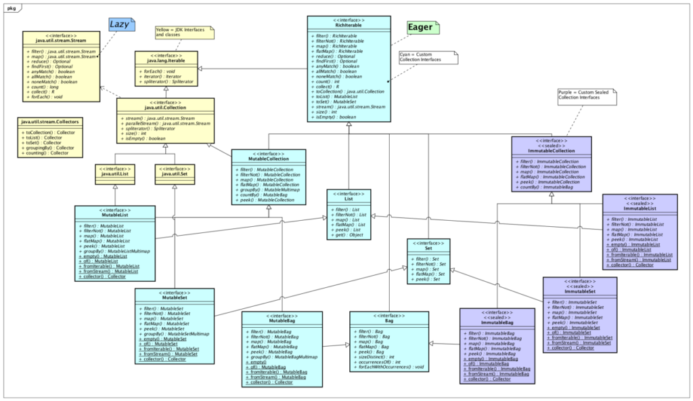



*Designing Immutable Collection using Sealed Types in JDK 15*{#caption-attachment-36538}

How to define contractual, structural, and verifiable immutable Java collections.

## Introducing Sealed Types

JDK 15 was released on September 15, 2020. [JEP 360](https://openjdk.java.net/jeps/360)Sealed Types was included as a preview feature in this release, with its second preview in JDK 16. Sealed Types is part of [Project Amber](https://openjdk.java.net/projects/amber/). Sealed classes or interfaces can be used to restrict the interfaces or classes that are allowed to extend them. This is accomplished by using the `sealed`, `non-sealed`, and `permits` modifiers.{#297e}

### What is contractual immutability?

An interface or class is contractually immutable if the available public methods do not allow an instance to be mutated after it is constructed. A contractually [immutable collection](https://javarevisited.blogspot.com/2018/02/java-9-example-factory-methods-for-collections-immutable-list-set-map.html) should not expose methods like `add`, `addAll`, `remove`, `removeAll`, `clear` and a mutable `Iterator` .{#9ff0}

These methods are available on the `Collection`, `List` and `Set` types in Java. Immutable collections that implement these interfaces are not contractually immutable.

### What is structural immutability?

An object is structurally immutable if all of its data members are [private](https://javarevisited.blogspot.com/2012/10/difference-between-private-protected-public-package-access-java.html#axzz6JDcu0RhH), [final](https://javarevisited.blogspot.com/2016/09/21-java-final-modifier-keyword-interview-questions-answers.html), and cannot be modified after the object is constructed. `String` is a great example of a class in Java that is structurally immutable. Once a `String` is constructed, it cannot be changed. Immutable objects like `String` sometimes have mutable counterparts like `StringBuilder`.{#961e}

### What is verifiable immutability?

A class or interface is verifiably immutable if all of the implementations are contractually and structurally immutable, and are restricted to a specific set of classes that can be verified. This is a capability that can now be more easily achieved via Sealed Types in JDK 15. With Sealed Types a developer can restrict the implementations of interfaces and classes to a specified set of types.{#b342}

### A Perfect Use Case for Sealed Types in Java

Immutable collection implementations for Java are available in the Java Collections Framework (since JDK 9), Google Guava and Eclipse Collections. None of the immutable collection alternatives provide the combination of *structural* , *contractual* and *verifiable* immutability today.{#eeff}

#### Java 9+

There are *structurally* immutable collections available in the Java Collection Framework via `List.of()`, `Set.of()`, `Map.of()`. The JDK immutable collections are not *contractually* immutable, because they implement the mutable `List`, `Set`, `Map` interfaces.{#f7d4}

#### Google Guava

Guava has collection types that are *structurally* immutable, but not *contractually* immutable. The immutable collections in Guava implement the mutable JDK interfaces --- `List`, `Set`, `Map`. Guava restricts the implementations of the immutable collection types by using `abstract` classes with `package` private constructors, which require all implementations to be in the same package. This restriction is a novel design approach and a key component of *verifiable* immutability, but is still lacking *contractual* immutability.{#812f}

#### Eclipse Collections

[Eclipse Collections](https://github.com/eclipse/eclipse-collections) has collection types that are both *contractually* and *structurally* immutable. Unfortunately, there is no way in Java 8 to restrict the implementations of interfaces like `ImmutableCollection`, `ImmutableList`, `ImmutableSet` so that *verifiable* immutability can be provided. It is possible to implement the `ImmutableCollection` interface and its subtypes outside of Eclipse Collections because they are public interfaces. Theoretically, a "bad actor" may implement the `ImmutableCollection` interface and pass a mutable implementation to a method call expecting an `ImmutableCollection`. In practice, it is doubtful that this would be an issue, but the potential does exist.{#e53c}

#### Sealed Types

The Sealed Types preview in JDK 15 gives developers the capability to finally provide the trifecta of c*ontractual* , *structural* and *verifiable* immutability in a collections framework. Using the Sealed Types preview feature, we can restrict the implementations of an `ImmutableCollection` interface using the `sealed` and `permits` modifiers.{#29a0}
 sealed interface ImmutableCollection

Similarly, we can restrict the implementations of `ImmutableList`.{#1867}
 sealed interface ImmutableList

The ImmutableEmptyList implementation of ImmutableList is then declared as final.
 class ImmutableEmptyList

Experimenting with Sealed Types in JDK 15 has been interesting and encouraging. I wish this feature was available a decade ago when we first defined the ImmutableCollection hierarchy in Eclipse Collections. I've been able to extend the design ideas that we implemented in Eclipse Collections years ago with a feature that provides a more restrictive modeling capability.

### The Deck of Cards Kata: Custom Collections

The source code for an experimental implementation of a collections framework can be found in the [Deck of Cards Kata repo](https://github.com/BNYMellon/CodeKatas/tree/master/deck-of-cards-kata). The Deck of Cards Kata can be taken to become familiar with multiple collections frameworks including the latest versions of the[Java Collections + Streams framework](https://medium.com/javarevisited/7-best-java-collections-and-stream-api-courses-for-beginners-in-2020-3ad18d52c38), Apache Commons Collections, Google Guava and Eclipse Collections.{#1d9d}

The custom collections framework interfaces and implementations can be browsed online [here](https://github.com/BNYMellon/CodeKatas/tree/master/deck-of-cards-kata/src/main/java/bnymellon/codekatas/deckofcards/custom/collections). The following class diagram shows the interfaces in the framework, including the immutable collection interfaces that leverage Sealed Types.{#0c46}
 A Custom Collections framework in the Deck of Cards Kata   

The experimental collections framework in the kata has been evolving to use [Project Amber](https://openjdk.java.net/projects/amber/) features as they become available as preview features in the JDK. The kata was upgraded to JDK 15 the day it was released. The framework now uses the following features from Project Amber:{#e45c}

* Local Variable Type Inference ([JEP 286](https://openjdk.java.net/jeps/286))
* Pattern Matching for instanceof ([JEP 375](https://openjdk.java.net/jeps/375))
* Sealed Types ([JEP 360](https://openjdk.java.net/jeps/360))

In addition, default methods and static interface methods are used extensively to build the rich interfaces in the framework.{#d975}

### A vision for the Future of Java Collections

The custom collection framework was initially developed to explore and demonstrate what it would be like to have eager methods directly on mutable collection interfaces using API names similar to [Java Streams](https://javarevisited.blogspot.com/2018/08/top-5-java-8-courses-to-learn-online.html).{#64e7}

The intent was to use the latest features available in the most current releases of Java where they were proved useful. The latest evolution shows what is possible by leveraging Sealed Types to implement immutable collection types. I'm quite encouraged by the results of the feature so far. I hope that this use case can be used and discussed as an example of the practical applicability of the Sealed Types feature.{#ba49}

The following blogs explain the evolution of the custom collections framework design over the past six months.{#d095}

<https://medium.com/javarevisited/java-streams-are-great-but-its-time-for-better-java-collections-42d2c04235d1>

<https://medium.com/javarevisited/eager-is-easy-lazy-is-labyrinthine-b12605f13048>

I hope you found this blog useful. Check out the source code and give the Deck of Cards kata and other code katas included in the repo a try.{#1f56}

Enjoy!{#0c15}

*I am a Project Lead and Committer for the* [*Eclipse Collections*](https://github.com/eclipse/eclipse-collections)*OSS project at the* [*Eclipse Foundation*](https://projects.eclipse.org/projects/technology.collections)*.* [*Eclipse Collections*](https://github.com/eclipse/eclipse-collections)*is open for* [*contributions*](https://github.com/eclipse/eclipse-collections/blob/master/CONTRIBUTING.md)*. If you like the library, you can let us know by starring it on GitHub.*{#0c2c}

This was originally posted on Medium [here](https://medium.com/javarevisited/immutable-collections-in-java-using-sealed-types-ae8eb580fc1e).
