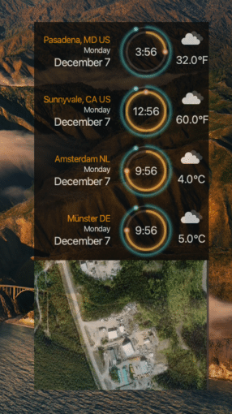
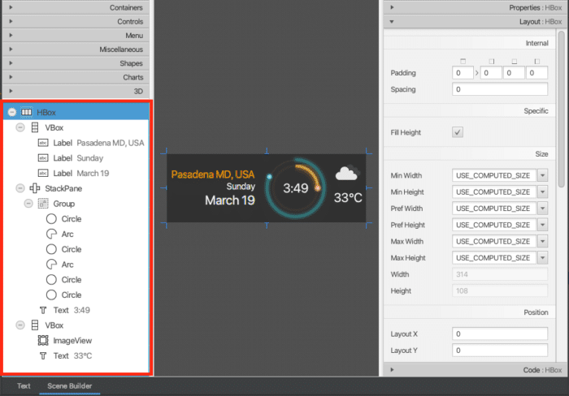
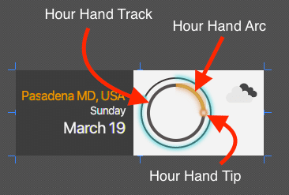
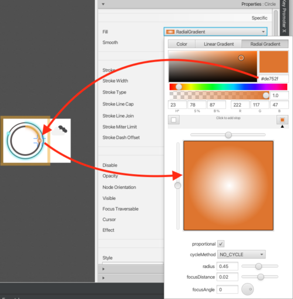

> Good design's not about what medium you're working in. It's about thinking hard about what you want to do and what you have to work with before you start." -- Susan Kare [\[6\]](https://en.wikipedia.org/wiki/Susan_Kare "Susan Kare")

### Introduction

Welcome to *Creating a JavaFX World Clock from Scratch (Part 1)*! In this series of blog entries I would like to show you how I created a "sci-fi" looking world clock that happens to be a cross-platform Java desktop application.



Here I will explain my thought process, development workflow, and of course JavaFX code details. Since it's still in the early stages, you can tune in by commenting or joining foojay's Slack channel at foojay.slack.com [\[2\]](https://foojay.slack.com/archives/C01GEEGDCHJ "foojay Slack channel #openjfx"), where I and others (Java experts \& friends of OpenJDK/OpenJFX) can offer advice.

Before we begin, I would like to mention some assumptions the reader (you) may expect. The tutorial will assume you have a basic knowlege of Java and JavaFX. If you are a beginner who is new to Java and JavaFX you may want to check out the numerous tutorials[\[5\]](https://foojay.io/?s=javafx&t=posts "JavaFX Tutorials") and books[\[3\]](https://www.apress.com/gp/book/9781484219607 "JavaFX 9 Intro by Example")[\[4\]](https://www.apress.com/gp/book/9781484249253 "The Definitive Guide to Modern Java Clients with JavaFX").

If you are a novice or an advanced Java developer, you can expect brief code snippets and links to GitHub in which you can dig deeper into the code. My intent is to make each blog entry concise and each concept and strategy easy to recall. If you are impatient and just want to see the code head over to GitHub at [](https://github.com/carldea/worldclock)<https://github.com/carldea/worldclock>

### What am I trying to solve?

We are all adjusting to a new normal[\[1\]](https://foojay.io/today/covid-19-time-series-analysis-with-software-ekg/ "JavaFX Covid 19 tracker"). Working remotely affords us the opportunity to work from home and attend virtual meetings and conferences. Even though this can be super convenient, developing a tool that can help us to be mindful of others (my coworkers) in different timezones is definitly a plus. Besides, it's fun to design and develop applications yourself.

**World Clock features:**

* Display city/state and country
* Display Date
* Display 12 hour clock
* Display weather icon
* Display temperature
* Display a map component

### Get Inspired, Experiment \& Repeat

When designing applications I usually ask myself this question, "*What kind of design look am I trying to achieve?*"

For this application, I would like to achieve a "sci-fi" look and feel. Once you know what kind of design look you're after, it is time to get inspired! So, you'll want to search for images or videos that will appeal to you.

**Places to search:**

* Pinterest[\[9\]](https://www.pinterest.com "Pinterest")
* Youtube[\[10\]](https://www.youtube.com/user/carldea "CarlFX's Youtube")[\[11\]](https://www.youtube.com/results?search_query=scifi+ui "Sci fi UIs")
* Google images
* Dribbble [\[12\]](https://dribbble.com "Dribbble")
* DevianArt[\[13\]](https://www.deviantart.com "DeviantArt")
* Books FUI[\[7\]](https://www.linkedin.com/pulse/first-book-fui-design-jono-yuen "FUI: How to Design User Interfaces for Film and Games")[\[8\]](https://www.hudsandguis.com "Huds and GUIs")

After searching for a clean minimalist clock design I found a few that I liked in terms of look. As far as the shape, color and size that's where experimentation comes into play. This is the part where you will use pencil and paper or a vector graphics application.

**Tools to draw**

* Pencil, Pen and Paper
* Adobe Illustrator
* Inkscape
* JavaFX Scene Builder by GluonHQ [\[14\]](https://gluonhq.com/products/scene-builder/ "Scene Builder by GluonHQ")
* IntelliJ's built-in Scene Builder

As with any tool, practice makes perfect. You will be surprised how easy it is to draw the main clock face using IntelliJ's built-in JavaFX Scene Builder. More on that later, but first let's see how things are laid out. Shown below is the world clock's component (JavaFX Node) hierarchy displayed at the lower left panel:  



JavaFX Scene Builder{#caption-attachment-36528}

**Basic Layout of the Clock Widget**   

Below is a the node hierarchy in more details:

* HBox - Background container
* VBox - Location and Date info
  * Label - City State, Country
  * Label - Week Day
  * Label - Month Day
* StackPane - Centering nodes
  * Group - Group clock children nodes
  * Circle - Minute hand track
  * Arc - Minute hand
  * Circle Minute hand tip
  * Circle - Hour hand track
  * Arc - Hour hand
  * Circle - Hour hand tip
  * Text - Digital clock display ie: 3:49
* VBox - Weather info
  * ImageView - Weather icon
  * Text - Temperature

Other than the nodes representing the clock face, I feel most of the other nodes in the hierarchy shown above are pretty self explanatory. For brevity, I will only describe how the clock face was assembled, specifically the hour hand (node) parts. Shown below are the parts that make up the hour hand nodes (shapes).  


Parts of the hour hand on the clock face{#caption-attachment-36529}

After showing you the hierarchy and what shapes consist of the clock face lets look at how they are styled. Instead of showing the styling properties in the Scene Builder UI, I will show you an excerpt of the code listing of its FXML file representing the Group node. We'll only focus on the containing hour hand nodes as children of the Group node.

An excerpt of the JavaFX Scene Builder's **FXML** representing the hour hand shape nodes:

```xml
`<Group>
   <children>
      <Circle id="hour-hand-shadow" fill="#1f93ff00" radius="35.0" stroke="#403939db" strokeWidth="4.0" />
      <Arc id="hour-hand-arc" fx:id="hourHandArc" fill="#1f93ff00" length="90.0" opacity="0.91" radiusX="35.0" radiusY="35.0" stroke="#de752ff7" strokeLineCap="BUTT" strokeLineJoin="ROUND" strokeMiterLimit="0.0" strokeWidth="4.0">
         <effect>
            <Glow level="0.34">
               <input>
                  <Bloom />
               </input>
            </Glow>
         </effect>
      </Arc>
      <Circle id="hour-hand-tip" fx:id="hourHandTip" radius="5.0" stroke="TRANSPARENT" strokeType="INSIDE" translateX="35.0">
         <fill>
            <RadialGradient centerX="0.5" centerY="0.5" focusDistance="0.023809523809523725" radius="0.45238095238095233">
               <stops>
                  <Stop>
                     <color>
                        <Color red="1.0" green="1.0" blue="1.0" />
                     </color>
                  </Stop>
                  <Stop offset="1.0">
                     <color>
                        <Color red="0.8705882430076599" green="0.4588235318660736" blue="0.18431372940540314" />
                     </color>
                  </Stop>
               </stops>
            </RadialGradient>
         </fill>
         <effect>
            <GaussianBlur radius="3.09">
               <input>
                  <Glow />
               </input>
            </GaussianBlur>
         </effect>
      </Circle>
   </children>
</Group>`
```

Looking at the XML above you'll notice the three children nodes Circle, Arc, and Circle representing the hour hand track, hour hand arc, and hour hand tip respectively. Each shape element will have its own styling attributes that I will describe in more details below.

### Hour Hand Track

The hour hand track is a subtle dark circle. This is layered underneath the hour hand arc shape.

|  property   |   value   |               Notes                |
|-------------|-----------|------------------------------------|
| fill        | #1f93ff00 | transparent, alpha channel is zero |
| radius      | 35.0      | medium size                        |
| stroke      | #403939db | gray black                         |
| strokeWidth | 4.0       | thick line stroke                  |

### Hour Hand Arc

The hour hand Arc is a glowing orange colored open arc with a transparent fill color. Layered over the hour hand track (circle) shape.

|     property     |      value      |                            Notes                             |
|------------------|-----------------|--------------------------------------------------------------|
| fill             | #1f93ff00       | transparent, alpha channel is zero                           |
| length           | 90.0            | angle in degrees of the extent angle                         |
| opacity          | .91             | a tiny bit of transparent subtly seeing the track underneath |
| radiusX          | 35.0            | medium size same as hour hand track                          |
| radiusY          | 35.0            | medium size                                                  |
| startAngle       | 0.0             | Start angle. Zero degrees is at the 3'o clock position       |
| stroke           | #de752ff7       | orange                                                       |
| strokeLineCap    | BUTT            | flat ends                                                    |
| strokeLineJoin   | ROUND           | ROUND, not noticeable or used                                |
| strokeMiterLimit | 0.0             | 0.0                                                          |
| strokeWidth      | 4.0             | thick line stroke                                            |
| effect           | Glow level 0.34 | make it look neon                                            |
| input effect     | Bloom 1.0       | make it brighter                                             |

### Hour Hand Tip

The hour hand tip is a glowing orange colored ball shape with a radial gradient fill color. Layered over the hour hand Arc's end and over the hour hand track.

|   property   |                                                                               value                                                                                |                               Notes                               |
|--------------|--------------------------------------------------------------------------------------------------------------------------------------------------------------------|-------------------------------------------------------------------|
| radius       | 5.0                                                                                                                                                                | small circle                                                      |
| stroke       | TRANSPARENT                                                                                                                                                        | eliminate outside stroke                                          |
| strokeType   | INSIDE                                                                                                                                                             | preserve size without outter stroke                               |
| translateX   | 35.0                                                                                                                                                               | same as radius of hour hand track (circle) making it at 3'o clock |
| translateY   | 0.0                                                                                                                                                                | same as radius making it at 3'o clock                             |
| fill         | RadialGradient centerX=0.5 centerY=0.5 focusDistance=0.023809523809523725 radius=0.45238095238095233 colorstops=rgb(1.0, 1.0, 1.0) to rgb(0.87058, 0.4588, 0.1843) | make it look spherical                                            |
| effect       | GaussianBlur radius 3.09                                                                                                                                           | make it look misty                                                |
| input effect | Glow 1.0                                                                                                                                                           | make it look neon                                                 |

When experimenting with Scene Builder, you get to play with changing a shapes fill color, stroke color, width, and much more. Below shows how to change the hour hand's tip (circle node) to appear as a spherical glowing ball.  



Scene Builder's fill color process{#caption-attachment-36540}

I want to draw your attention to two things you may not have noticed:

1. The `fx:id` attribute
2. Hard coded values for angles and position information.

Relating to fx:id attributes you'll notice the hour hand tip (circle node) has the value `fx:id="hourHandTip"`. These allow Java code (Controllers) to interact with JavaFX Node object during runtime (use of dependency injection). Of course this will be discussed further in [Part 2](https://foojay.io/today/creating-a-javafx-world-clock-from-scratch-part-2/ "Part 2") of this blog series.  


World Clock Widget{#caption-attachment-36542}

So there you have it a slick looking world clock!

While this looks cool so far, the clock face isn't able to move its arms (minute \& hour hands) based on time because of hard coded values for translateX/Y properties, etc.

In [Part 2](https://foojay.io/today/creating-a-javafx-world-clock-from-scratch-part-2/ "Part 2") I will show you how to make the world clock actually function.

### Conclusion

In part 1 of this blog series, I introduced how I wanted the world clock to look and to behave.

Then I listed some feature requirements. By determining the design direction I suggested places to search for images \& videos for inspiration.

After finding a few images to start experimenting with I suggested various tools to to use such as the JavaFX Scene Builder tool.

Using the JavaFX Scene Builder tool you get the chance to see the layout of components that comprise of the world clock widget.

Lastly, you got to see all the properties on styling the clock face nodes such as the Circle and Arc Nodes.

In Part 2[\[1\]](https://foojay.io/today/creating-a-javafx-world-clock-from-scratch-part-2/ "JavaFX World Clock from Scratch Part 2"), we will learn how to draw and enable the clock hands to move!
