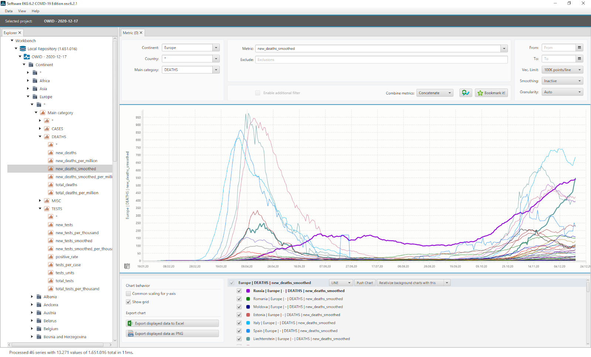
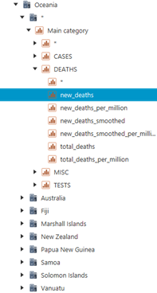
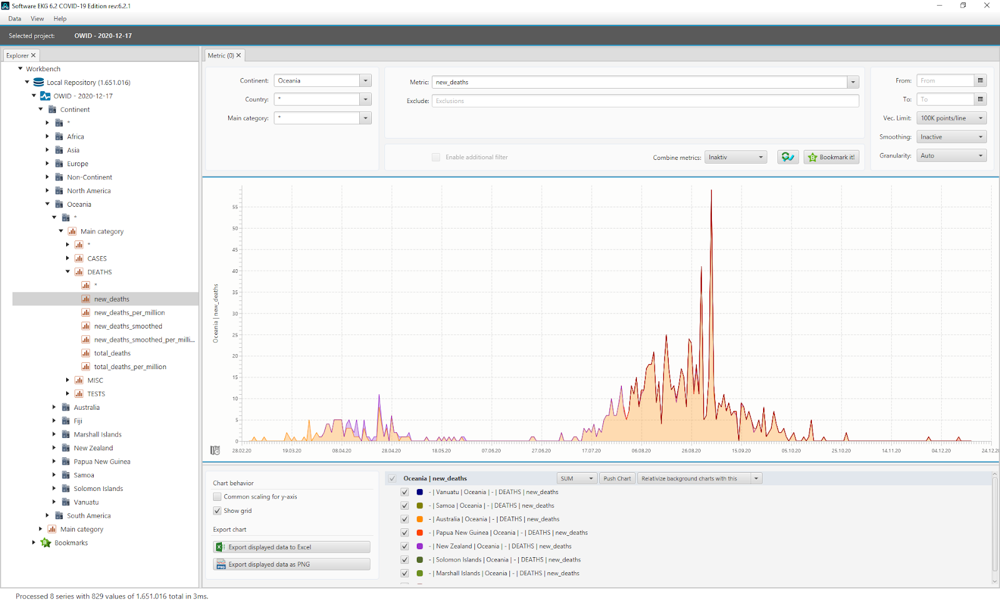
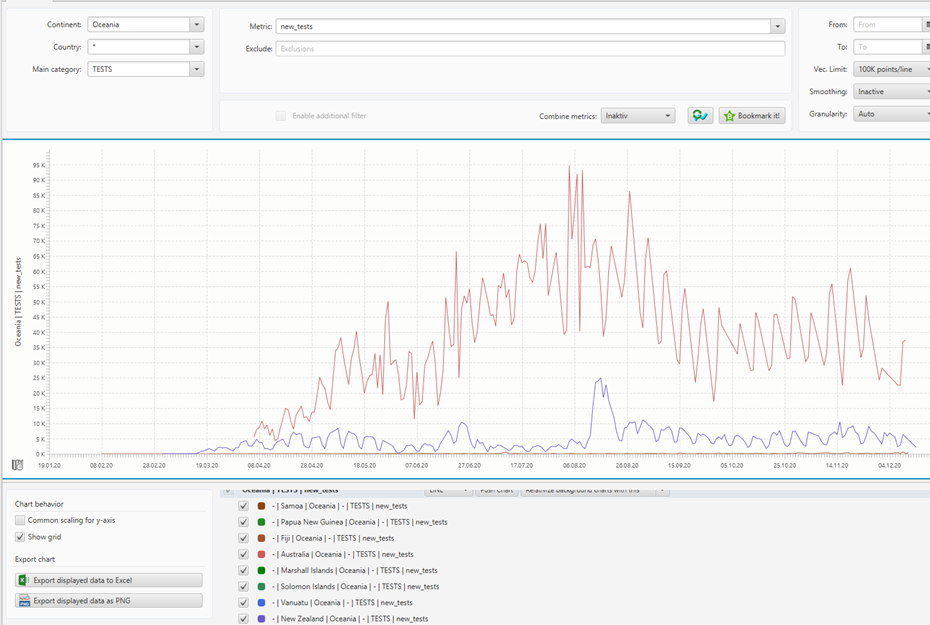
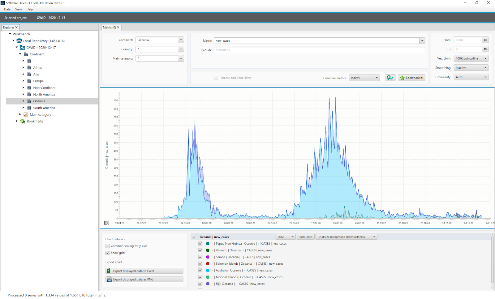
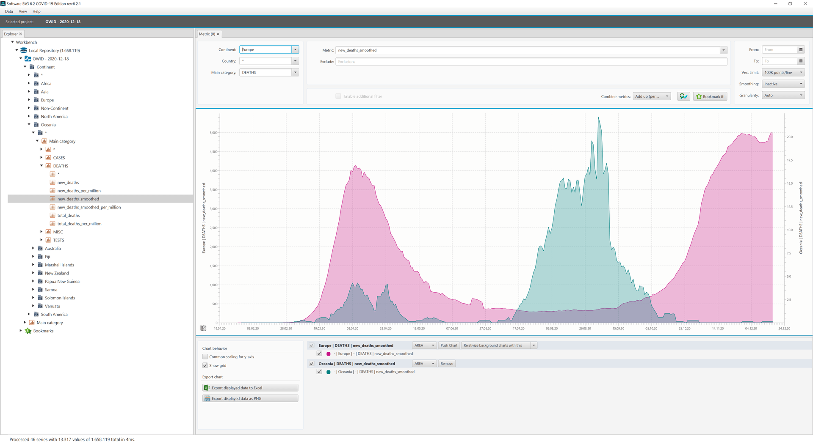

In this series of blogposts ([see part 1 here](https://foojay.io/today/covid-19-time-series-analysis-with-software-ekg/)), we're taking a look at the current figures of the Covid-19 pandemic with Software-ECG. Software-ECG is a free time series analysis tool originally developed for for system analysis of computer problems in distributed systems.

With the Covid-19 edition, QAware has adapted the tool so that the current data sets from the data hub of the University of Oxford are automatically loaded and immediately available for analysis. More information about the Software-ECG and download links [can be found here](https://foojay.io/today/covid-19-time-series-analysis-with-software-ekg/).

Software-ECG is build on Open-JDK and JavaFX. It leverages the power of a compiled language with a native Rich Client Framework.

### Overview

Over the last weeks, we looked at the current development in [Europe](https://foojay.io/today/the-second-wave-breaks-in-europe/), [China](https://foojay.io/today/where-is-the-2nd-wave-in-russia-and-china/) and [South America](https://foojay.io/today/separate-covid-19-waves-in-europe-and-south-america/). In Europe, we saw that the second wave is breaking and has already peaked in most countries.

However, the numbers in Germany and Russia have not dropped yet. Here, both the number of people who tested positive and the number of people who died (with a positive COVID-19 test result) have continued to rise.

The number of deaths are significantly higher in Germany (green line) and Russia (purple line) than in spring 2020.  

*Daily Covid-19 related deaths in Europe*{#caption-attachment-36609}

Don't get too depressed by looking at Europe. Let's take a look at the summer in the southern hemisphere.

In our last blog, we took a look at South America and, unfortunately, the recovery phase in Brazil during summer was not as significant as the one we observed in Europe in the summer of 2020.

### Oceania

The data from the Our World In Data (OWID) COVID-19 data set includes the pseudo-continent of "Oceania" as a collective term for all countries in Australia, New Zealand and Polynesia.

In Software-ECG COVID-19 Edition, all metrics from this region can be displayed individually or in an aggregated way. To achieve this, you need to select the continent "Oceania" in the tree view on the left side of the application.

As a sub-node, you can either select an individual country or the metrics of all countries with \*. By clicking on a metric in the category DEATHS, for example, you will get this metric for all countries in Oceania.

You can use this feature to look at the number of deaths in all countries with the region label "Oceania". The non-smoothed curves showing the numbers of new deaths associated with COVID-19 are remarkably low.

You can stack different countries by choosing a sum chart instead of a standard line chart.

  
*Daily Covid-19 related deaths in Oceania as stacked graph*

The curve shows the daily death counts associated with COVID-19 as a stacked graph. The highest value is still very low at 59. Since the curve is almost entirely made up of a yellow area, you can see that essentially only Australia was really affected.

In early October, the numbers dropped to almost 0 with the exception of a few isolated cases. This is exactly interlaced with the situation in Europe where the second wave was spreading at high speed at the beginning of October.

This curve looks today very good and it shows what you would actually expect during the summer months. In our last blog, however, we saw that unfortunately, South America is an exception here.

Looking at the testing situation, it is noticeable that Australia and New Zealand dominate the graph with regard to the daily number of tests performed. Also, the number of tests is relatively constant. This is good because it allows us to estimate the true prevalence of the virus from the graph of the current number of cases, since the number of tests correlates with the number of cases.

  
*Number of executed PCR tests per day over all countries in Oceania*

The cumulative view of the case numbers also shows very well that COVID-19 in Oceania has currently subsided to a background activity.

We have too little information about the political decisions and actions that may have influenced or favoured this development.

In sum, however, you can see that fear of COVID-19 in these countries does not seem to be appropriate:

  
*Number of positive PCR test cases in Oceania*

As Europeans, you might become envious, but let us not forget we also had a nice summer and were able to let some normality return to our lives. With this in mind, the people in Oceania should also be granted some normality.

However, those having relatives in Oceania should really consider moving their home offices into this region (at least until April):  

*Interleaving waves in Europe and Oceania*{#caption-attachment-36616}

### Working with the Software-ECG

We wanted to demonstrate that it is easy and fun to analyze the current COVID-19 situation with the latest available data in Software-ECG COVID-19 Edition.

Feel free to download the tool and draw your own conclusions for your country, region or even all countries worldwide!

More information, download links and more [can be found here](https://foojay.io/today/covid-19-time-series-analysis-with-software-ekg/).
