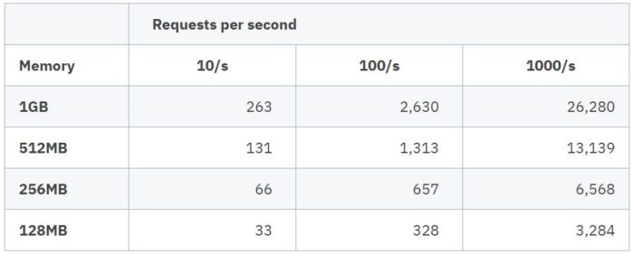
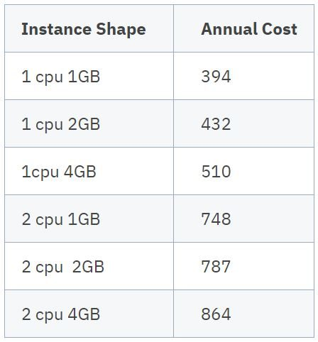

There is a lot of interest in the server-side Java community around using ahead of time (AOT) native compilation provided by [Graal Substrate VM](https://www.graalvm.org/reference-manual/native-image/SubstrateVM/ "Graal Substrate VM") to drive down memory usage and cold start times of Java microservices.

While these frameworks are technically interesting, the claim is if you spend time rewriting your Jakarta EE applications to utilise these new frameworks, then you will substantially reduce your cloud operational costs.

First, by enabling the adoption of a serverless deployment model and second by reducing your containers' memory usage.

### Cold Starts Mean You Need AOT to do Serverless

**Some History**   

If you were developing web applications in the early 1990s, you used [CGI scripts](https://en.wikipedia.org/wiki/Common_Gateway_Interface "CGI scripts") to build data-driven and interactive web applications. The execution model of CGI was:

* HTTP request came into the web server for a specified URL
* New process started to handle the request
* HTML dynamically generated based on passed environment variables
* HTML returned to the web server and then to the browser

Typically developers wrote CGI scripts in common scripting languages, such as shell script, Perl, or later PHP. CGI Scripts were also written in C and C++. Some of the problems with CGI were cold starts and vertical and horizontal scalability. The invention of Java Servlets in [1996](https://en.m.wikipedia.org/wiki/Jakarta_Servlet "1996") solved CGI problems and drove forward the dominance of server-side Java.

**Serverless Execution Model**   

The execution model of modern cloud provider's serverless offerings is very similar to the old CGI model. When an HTTP request arrives to your serverless endpoint, your serverless application is spun up to handle the request and then potentially shutdown after the request is processed. If you need to handle multiple requests concurrently, multiple copies of your serverless application are spun up on Amazon Lambda with one per concurrent request whereas Azure functions may be executed [multithreaded](https://docs.microsoft.com/en-us/azure/azure-functions/functions-reference "multithreaded").

**The Cold Start Problem**   

One of the inherent drawbacks of the serverless model is the cold start problem. The HTTP request for your application causes the creation of a new instance of your application, and the user must wait until it is ready before they get a response. Obviously, the faster your application can start, the quicker the user gets a response. Java frameworks that support AOT native compilation can achieve cold start times measured in 10s of milliseconds compared to traditional server-side Java runtimes like Jakarta EE running on the Java Virtual Machine (JVM), which may take 1 or 2 seconds. Therefore, the claim is that two orders of magnitude faster cold start time is a huge advantage in serverless.

Not so fast. In Amazon's serverless product, AWS Lambda, Amazon recognises the cold start problem and once your application is spun up they keep an instance of your application around to serve subsequent requests. The application instance is only shut down if it has not received any requests typically for [minutes](https://mikhail.io/serverless/coldstarts/aws/ "minutes").

Microsoft Azure is similar, they typically do not shutdown an instance of your application until it has been idle for 20 minutes. Given this behaviour, many users ensure their serverless functions do not suffer cold starts by "pinging" the service periodically. Amazon and Azure also provide prewarmed options and offerings at an additional cost.

The only other time when cold start time becomes important in serverless is in a spike of concurrency. Given the serverless model is generally one request per application instance, if you have a sudden spike in concurrent requests it may be necessary for the serverless provider to spin up new instances of your application and each of these will suffer a cold start on the first request.

Another disadvantage of cold starts which is not solved by the rapid start up times provided by AOT is the problem of connectivity to other systems. The majority of real world microservices need to talk to other systems - whether a database, another microservice, external security stores or content caches, etc. On a cold start, all of these connections need to be re-established and renegotiated. This delay can be significant and is not mitigated by AOT compilation. If you can avoid a cold start and ensure your instance is reused for subsequent requests then the application can take advantage of database connection pools, SSL session caches, etc. to ensure subsequent calls are fast.

A similar argument can be made for local caching. Many services will locally cache many forms of data to ensure subsequent requests are fast. These are lost on cold start. So no matter which framework you are using, cold starts should be avoided in high performance systems.

Now that we have established that cold starts are bad and to be avoided in serverless execution models - then a 50ms start-up time versus the 2s start-up time of a Jakarta EE runtime is in practice not important.

Then, there is a negative consequence of using AOT native compilation and that is the loss of the JIT compiler optimisations provided by the JVM. When your application instance is reused for subsequent requests then the JVM JIT will optimise your code making it run faster in subsequent requests. With AOT Native instances then this optimisation [does not occur](https://medium.com/graalvm/improving-performance-of-graalvm-native-images-with-profile-guided-optimizations-9c431a834edb "does not occur"). So ultimately a long running service on the JVM using the JIT compiler will execute faster. Now in reality if your services make network calls to other services, then this performance decrease will likely be negligible compared with the network call overheads.

### AOT Frameworks Use Less Memory And Cost Less

For AOT native images the memory usage of the JVM is reduced down to 10s of MB in size compared to base JVM memory sizes which are typically in the [200 -300 MB range](https://billykorando.com/category/openj9/ "200 -300 MB range"). Given that memory is a billing scale factor in cloud then AOT native images logically have a clear cost advantage? In practice the memory usage of a real world microservice is often more dependent on the live data set of the application which can often dwarf the Java runtime memory requirement. AOT native does not make your live object set smaller it only reduces the memory usage of the underlying Java runtime.

**Serverless Costs and Memory**   

Both [Amazon Lambda](https://aws.amazon.com/lambda/pricing/ "Amazon Lambda") and [Microsoft Azure](https://azure.microsoft.com/en-us/pricing/details/functions/ "Microsoft Azure") have a similar billing model for serverless functions. Both price on some combination of execution time and memory usage. As both an AOT natively compiled microservice and a microservice running on the JVM will likely have similar execution times the biggest cost factor will be service memory usage.

Imagine we have a microservice that takes 50ms to execute we will explore typical costs to run this on a serverless platform like AWS Lambda or Azure Functions.

In the table below, I use a "typical" cost based on Azure and AWS pricing, which is very similar.

The table shows annual cost (£) for running a serverless function at continuous request rates running from 10 requests per second through to 1000 requests per second for various memory usages. As you can see the annual cost for a service running at 10 requests per second utilising 1GB of memory is £263 whereas as a service utilising 128MB is £33 as expected 1/8th of the cost. This looks huge on a proportional basis however the absolute annual saving is £230 which is very small.

If you then scale up the number of requests per second to 1000 requests per second then the absolute cost saving is bigger approx. £23,000 however serverless is VERY expensive for running highly utilised microservices.

Conversely if your microservice is not sustaining request rates anywhere near 10/s then your serverless costs for that microservice are minimal and therefore any cost saving for smaller memory is also minimal.

A couple of things to note from the table. First is that billing for memory is not that granular. In fact Amazon round to the nearest 64MB and Microsoft to the nearest 128MB so small memory changes do not affect your costs greatly. The second thing to note is that serverless is a very cheap execution model for lightly used microservices when compared to VMs or container instances. However if you have highly utilised services then costs spiral dramatically on serverless platforms. When you compare the costs of container instances (in the table below) there is no way you would pay to run a highly utilised microservice on a serverless platform. It would be much cheaper to switch to a container instance or VM execution model.

**Container Costs and Memory**   

As we have seen, if you have highly utilised microservices, then serverless is an expensive execution model, and Container Instances would be better suited. Surely the reduced memory usage of AOT frameworks will give you substantial savings in cloud container services like Amazon Fargate and Azure Container Instances.

Well, it turns out that Container runtime costs aren't all that sensitive to memory usage. The cost for running container instances is determined by how long you run the image and how many virtual CPUs you designate, along with the memory size you specify. Memory size allocation is typically not very granular and comes in 1GB increments on both Microsoft Azure Container Instances and Amazon Fargate.

Typically a Jakarta EE microservice can easily run within a 1GB memory allocation. If your microservice live data set exceeds 1GB, you may have to utilise a larger instance memory size.

The table below shows the typical annual cost (£) of running a container instance 24/7/365 in different memory and CPU shapes.

From this, you can see that the cost is more sensitive to the number of CPUs allocated than the memory allocated to the container. For example the difference between an instance with 2 CPU and 1GB of memory and an instance with 2 CPU and 4 GB of memory is only £116 over the year.

### Cloud Resource Savings Dwarfed by Engineering Costs

As advocated by Java microservice frameworks that support AOT compilation, it may seem obvious that if you reduce the Java runtime memory footprint and reduce cold start times then there are significant cost savings and advantages for running on public cloud. Many cost savings are marginal and in practice absolute savings are trivial for lightly used serverless functions and not significant for container instances unless you are at hyper scale with 1000s of containers running 24/7.

Rewriting applications to use a non-Jakarta EE framework, supporting AOT native image creation, to achieve cloud cost reductions is a myth. In practice the cost of Java Developer [salaries](https://www.payscale.com/research/US/Job=Java_Developer/Salary "salaries") to rewrite applications from widely known standards like Jakarta EE to new frameworks focussed on AOT will significantly outweigh cloud infrastructure costs by a long way. Developer time cost and vendor lock-in outweighs any potential cloud infrastructure savings.

### Conclusion

The two main advantages of Java AOT natively compiled microservice frameworks are rapid boot times and reduced JVM memory usage. While technically impressive, the reality is that neither of these advantages delivers a significant economic or technical advantage when deploying to public clouds.

Many Jakarta EE runtimes (like [Payara Micro](https://www.payara.fish/products/payara-micro/ "Payara Micro")) are small and fast. They can run Jakarta EE applications as either monoliths or [microservices](https://www.payara.fish/solutions/eclipse-microprofile-and-the-payara-platform/#microservices "microservices") in the cloud now, with no need to adapt or rewrite your applications to proprietary frameworks.

\**Originally written by Steve Millidge (Payara Services CEO \& Founder)*
