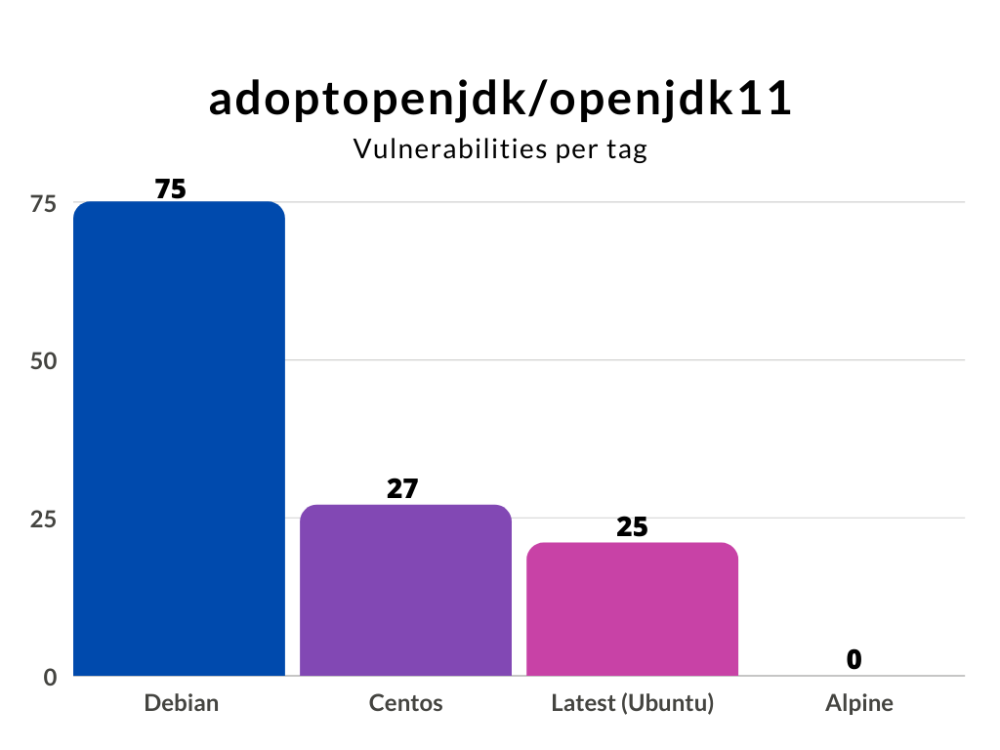

Docker is the most widely used way to containerize your application. With Docker Hub, it is easy to create and pull pre-created images. This is very convenient as you can use these images from Docker Hub to quickly build an image for your Java application.

However, the naive way of creating custom Docker images for your Java applications comes with many security concerns. So, how do we make security an essential part of Docker images for Java?

1. Choose the right Docker base image for your Java application
---------------------------------------------------------------

When creating a Docker image, we make this image based on some image we pull from Docker Hub. This is what we call the base-image. The base image is the foundation of the new image you are about to build for your Java application. The base image you choose is essential because it allows you to utilize everything available in this image. However, this comes at a price. When a base image has a vulnerability, you will inherit this in your newly created image.

Let's look at a popular set of Docker Java base images from Adoptopenjdk, [openjdk11](https://hub.docker.com/r/adoptopenjdk/openjdk11/). Using their default tag, this image is built on top of an ubuntu distribution. However, we can also choose tags for specific versions that are, for instance, based on Debian, Centos, or Alpine (note, alpine is not glibc based, and may not be compatible with applications that make native JNI calls).

We can conclude that choosing the right base image is critical from a security perspective. You probably do not need all the binaries that come with a full operating system. Building your new Docker Java image for your application is preferable based on a minimal base image. Binaries that you do not have cannot harm you.

Next to the security aspect, a minimal base image will reduce your newly created image's size. A smaller Docker image also means a smaller footprint and, most likely, a faster startup time.

2. Use a JRE, not a JDK
-----------------------

When creating a Docker image, we should only assign the necessary resources to function correctly. This means that we should start by using an appropriate Java Runtime Environment (JRE) for your production image and not the complete Java Development Kit (JDK). In addition, your production image should not include a build system like Maven or Gradle. The product of a build, for instance, your jar file, should be enough.

Even if you would like to build your application inside a Docker container, you can easily separate your build image from your production image using a multi-stage build.

**For example:**   

I want to create a Docker Java image for my java-code-workshop application. It is a spring-boot based application build with maven that needs Java version 8.

The naive way to create this Docker Java image would be something like this:

I picked a base image that includes maven and openjdk8, copy my source into the image, and call maven to build and run my application. This example works perfectly fine. My application will launch and runs smoothly. However, the Docker image that I just created has a size of 631 MB.

Let's change this Dockerfile and use a multi-stage build:

What happens now is that I still use the maven-openjdk8 image to build my project. However, this will not be the output. I create a new image based on a significantly smaller java 8 JRE image and copy only the executable spring-boot jar. Now I just have to execute the `jar-file`, and I am done! The result is a Docker image that does not include the JDK or maven but only the JRE. The image size reduces dramatically to 132 MB.

Smaller images are not only easier to upload and save startup time but are also much safer. Can you imagine what happens if some reason, an attacker gets access to a running container that had the JDK, your source code, and a build tool available?

You can also use this when you have to include secrets for accessing a private repository. You don't want these kinds of secrets in the cache of your production image. You don't use the build image in production, so it is perfectly acceptable to use the secrets over there. With this technique, you can cherrypick the stuff you need from other images and create a product Docker image with only the resources it needs.

3. Don't run your Docker container as root
------------------------------------------

When creating a Docker container, by default, you will run it as root. Although this is convenient for development, you do not want this in your production images. Suppose, for whatever reason, an attacker has access to a terminal or can execute code. In that case, it has significant privileges over that running container, as well as potentially accessing host filesystems via filesystem bind mounts with inappropriately high access rights.  

The easiest way to do to prevent this is to create a specific user like here:

On the third line, I am creating a new group and adding a user. This user is a system user (-r) without a password and home directory. I am also adding it to the newly created group.

Next, I give the user permission to the application folder on line 6. Don't forget line 7. Here, I am setting the user I want to use. This way, the newly created restricted user does the command on the last line.

4. Scan your Docker image and Java application during development
-----------------------------------------------------------------

Creating a Docker image from a Dockerfile and even rebuilding an image can introduce new vulnerabilities in your system. Scanning your docker images during development should be part of your workflow to catch vulnerabilities as early as possible.

You scan your Docker image easily when with the [Snyk CLI](https://support.snyk.io/hc/en-us/articles/360003812538-Install-the-Snyk-CLI). Use it on your local machine, as part of your pipeline, or both. After installing and authenticating the Snyk CLI the only thing you have to do to scan an image is

    $ snyk container test <imageName>

If I want to scan an `adoptopenjdk` image as I mentioned in the first section, the commands will be like this.

    $ docker pull adoptopenjdk/opendjdk11:latest
    $ snyk container test adoptopenjdk/opendjdk11:latest

Output:

You can both test and monitor the Docker image. For monitoring, you use `snyk container monitor <image>`. Monitoring takes a snapshot and monitors if new vulnerabilities or fixes are available for your image over time.

When you scan an image and have the Dockerfile (you created a new Docker Java image), you should add the flag `--Dockerfile=<dockerfile>` to either `snyk container test` and `snyk container monitor`. Now you get better remediation advice. For instance, if there is a base image available that reduces the number of vulnerabilities available, you will know.

Example:

    $ snyk container test myImage:mytag --Dockerfile=path/Dockerfile
    $ snyk container monitor myImage:mytag --Dockerfile=path/Dockerfile

#### Scan your Java application

The Docker Java image you are building also contains your application. Obviously, this is also a possible point of attack. You have to make sure that your Java application is free from security vulnerabilities, making a secure decision from the very beginning. Imagine that your application contains a library that allows remote code execution when calling a REST endpoint. Even if the rest of your image does not have any vulnerabilities, this can be disastrous.

The majority of the Java binary you put into your Docker image is probably code that you import. You can think of the libraries and frameworks your application has as a dependency. Checking your dependencies is easy using the Snyk CLI. This is the same CLI as we used to scan our image earlier. Call the `snyk test` or `snyk monitor `in your root folder, and you will scan or monitor your application for security vulnerabilities in your libraries.

For the code you wrote, it is wise to use a code analysis tool or linter like SonarLint, PMD, or spotbugs. These tools are general-purpose tools for creating better code but also help you prevent making obvious security mistakes.

5. Build to rebuild
-------------------

Build your Java application for your Docker image in such a way that you can throw it away and rebuild it at any time. Say you noticed something is wrong with your running container. It would be great if you can simply kill it and spin up a new instance. This means that you have to design stateless Java applications, such that the data is stored outside the container. A couple of things you can think of are:

* don't run a data store of a database in your container.
* don't store (log) files in your container
* make sure you cache auto-recovers (if applicable)

If you build your application so you can throw it away and launch a new instance at any time, you can also safely rebuilt your entire Docker image. Did you know that for [20% of vulnerable Docker images](https://snyk.io/blog/shifting-docker-security-left/), you can remediate one or more security issues just by rebuilding the image? Docker images are in many cases based on the "latest" tag of a base image. These "latest" changes over time and are replaced by newer, improved versions. The same holds for key binaries installed in your container using package managers like apt or yum. Of course, using the latest version is good from a security perspective as you'll automatically pick up the latest security fixes, however, you need to balance this with the knowledge that your base image will change over time and it's harder to recreate your image at a particular time snapshot as a result.

Even if your application did not change, regularly rebuild your Docker image, possibly with a newer or latest base image version tag. Improvements in the underlying layers like the OS layer can improve your image quality and reduce security vulnerabilities.

This article was originally posted on the Snyk.io blog: <https://snyk.io/blog/docker-for-java-developers/>
