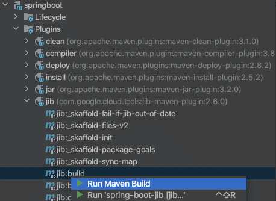
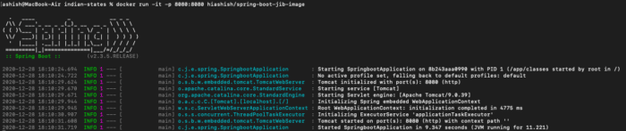

In this post, we will learn about how to create docker or [OCI](https://opencontainers.org/ "OCI") compliant images, without installing any docker client and without using a Dockerfile, for a Spring Boot application.

We will be doing all of this with the help of Jib.

#### What Is Jib?

> *Jib is Java containerizer from Google that lets Java developers build containers using build tools like Maven and Gradle.*

But that's not all that is really interesting about Jib because you don't need to know anything about installing docker, maintaining Dockerfiles, etc.

As a developer, you only care about the artifact (jar, war, etc.) you will produce, and you don't have to deal with any of the docker nonsense (build/push, etc.).

Wow, this is really powerful! But how?

#### How To Jib

With Jib, you can containerize your Java applications in no time by adding Maven or Gradle plugin to your pom.xml.or build.gradle file. It is that simple. However in this post I will be covering Maven for demonstration purpose. Let's get started then.

We will be using Spring [initializr](https://start.spring.io/ "initializr") to generate a working Spring Boot project. Source code of our Spring Boot application is available [here](https://github.com/yrashish/spring-boot-jib "here"), and it just prints a "Hello" message when the image is pushed via Jib and the image is run through docker.

Once we have set up ready with IDE, we can proceed with the next step.

#### Setting Up Maven

```xml
<plugin>
   <groupId>com.google.cloud.tools</groupId>
   <artifactId>jib-maven-plugin</artifactId>
   <version>2.6.0</version>
   <configuration>
      <from>
         <image>gcr.io/distroless/java:11</image>
      </from>
      <to>
         <image>registry.hub.docker.com/hiashish/spring-boot-jib-image</image>
      </to>
   </configuration>
</plugin>
```

For Maven, you can paste the above content in your pom.xml plugin section, and you are good to go. But I will try to explain `from` and `image` tags here.

`from`
> Configures the base image to build your application on top of.

Typically you don't need to provide `from` tag as by default, it uses distroless Java 8 image. However, I have used Java 11, so I have explicitly mentioned that here. Moreover, depending upon your use case, you may want to use a different base image.

`image`
> This refers to the target image that will pushed to the container registry.

I have used the docker registry, but you can use any cloud provider(ECS, GCR, ACR) container registry.

To use further options with the plugin, you can refer to the [documentation](https://github.com/GoogleContainerTools/jib/tree/master/jib-maven-plugin "documentation").

#### Setting Credentials For Registry

To push an image, we would need to add registry credentials to maven settings.xml. Since we are just doing a demo, it's ok to provide credentials this way but avoid using it as it is not secure. You may want to secure credentials as mentioned [here](https://maven.apache.org/guides/mini/guide-encryption.html "here").

```xml
<server>
    <id>registry.hub.docker.com</id>
    <username>username</username>
    <password>password</password>
</server>
```

#### Building an Image

To build an image, we can do it in the following ways.

1. **IDE.** For example, in IntelliJ, you can go to maven view of your project, then go under Plugins\>jib, then right-click and run the maven build. You may want to create an IntelliJ run configuration that can run maven goals like clean, compile, etc., then push your image.  
   
2. **Using the command line.** Just run the below command to build an image of your application. Make sure you have Maven installed first.

   ```shell
   mvn compile jib:build
   ```

   It will compile, build, and then push your application's image to the configured container registry.

Following is the output.

```shell
mvn compile jib:build
```

```
[INFO] Scanning for projects…
[INFO]
[INFO] — — — — — — — — — — < com.example:spring-boot-jib > — — — — — — — — — — -
[INFO] Building springboot 0.0.1-SNAPSHOT
[INFO] — — — — — — — — — — — — — — — — [ jar ] — — — — — — — — — — — — — — — — -
[INFO]
[INFO] — — maven-resources-plugin:3.1.0:resources (default-resources) @ spring-boot-jib — -
[INFO] Using ‘UTF-8’ encoding to copy filtered resources.
[INFO] Copying 1 resource
[INFO] Copying 0 resource
[INFO]
[INFO] — — maven-compiler-plugin:3.8.1:compile (default-compile) @ spring-boot-jib — -
[INFO] Nothing to compile — all classes are up to date
[INFO]
[INFO] — — jib-maven-plugin:2.6.0:build (default-cli) @ spring-boot-jib — -
[WARNING] ‘mainClass’ configured in ‘maven-jar-plugin’ is not a valid Java class: ${start-class}
[INFO]
[INFO] Containerizing application to registry.hub.docker.com/hiashish/spring-boot-jib-image…
[WARNING] Base image ‘gcr.io/distroless/java:11’ does not use a specific image digest — build may not be reproducible
[INFO] Using credentials from Maven settings file for registry.hub.docker.com/hiashish/spring-boot-jib-image
[INFO] Using base image with digest: sha256:b25c7a4f771209c2899b6c8a24fda89612b5e55200ab14aa10428f60fd5ef1d1
[INFO]
[INFO] Executing tasks:
[INFO]
[INFO] Executing tasks:
[INFO]
[INFO] Executing tasks:
[INFO] [======= ] 25.0% complete
[INFO]
[INFO] Executing tasks:
[INFO] [======= ] 25.0% complete
[INFO] > pushing blob sha256:6508f436f385b3751366f90b6…
[INFO]
[INFO] Executing tasks:
[INFO] [======= ] 25.0% complete
[INFO] > pushing blob sha256:6508f436f385b3751366f90b6…
[INFO] > pushing blob sha256:c5e22041fc97b838b93a2e18d…
[INFO]
[INFO] Executing tasks:
[INFO] [======= ] 25.0% complete
[INFO] > pushing blob sha256:6508f436f385b3751366f90b6…
[INFO] > pushing blob sha256:c5e22041fc97b838b93a2e18d…
[INFO] > pushing blob sha256:b25902383f9ee26808b68ca62…
[INFO]
[INFO] Executing tasks:
[INFO] [======= ] 25.0% complete
[INFO] > pushing blob sha256:6508f436f385b3751366f90b6…
[INFO] > pushing blob sha256:c5e22041fc97b838b93a2e18d…
[INFO] > pushing blob sha256:b25902383f9ee26808b68ca62…
[INFO] > checking base image layer sha256:31eb28996804…
[INFO]
[INFO] Executing tasks:
[INFO] [======== ] 27.8% complete
[INFO] > pushing blob sha256:c5e22041fc97b838b93a2e18d…
[INFO] > pushing blob sha256:b25902383f9ee26808b68ca62…
[INFO] > checking base image layer sha256:31eb28996804…
[INFO]
[INFO] Executing tasks:
[INFO] [========= ] 30.6% complete
[INFO] > pushing blob sha256:c5e22041fc97b838b93a2e18d…
[INFO] > checking base image layer sha256:31eb28996804…
[INFO]
[INFO] Executing tasks:
[INFO] [========== ] 33.3% complete
[INFO] > checking base image layer sha256:31eb28996804…
[INFO]
[INFO] Executing tasks:
[INFO] [=========== ] 35.0% complete
[INFO]
[INFO] Executing tasks:
[INFO]
[INFO]
[INFO]
[INFO] Container entrypoint set to [java, -cp, /app/resources:/app/classes:/app/libs/*, com.jib.example.spring.SpringbootApplication]
[INFO]
[INFO] Built and pushed image as registry.hub.docker.com/hiashish/spring-boot-jib-image
[INFO] Executing tasks:
[INFO] [=========================== ] 91.7% complete
[INFO] > launching layer pushers
[INFO]
[INFO] — — — — — — — — — — — — — — — — — — — — — — — — — — — — — — — — — — — —
[INFO] BUILD SUCCESS
[INFO] — — — — — — — — — — — — — — — — — — — — — — — — — — — — — — — — — — — —
[INFO] Total time: 8.746 s
[INFO] Finished at: 2020–11–16T02:34:33+05:30
[INFO] — — — — — — — — — — — — — — — — — — — — — — — — — — — — — — — — — — — —
```

```shell

```

#### Running an Image

We have successfully pushed the image(image name:spring-boot-jib-image) to a docker registry. Now we can run the image using docker.  



As you can see that our application is running inside a container. Now just run the curl command, and you can see that we got a hello message from our containerized spring-boot application.

```shell
curl localhost:8080/hello
Hello From Spring-Boot Jib
```

#### Conclusion

In this article, we have learned how we can containerize our Java applications without docker. Additionally, with Jib, you can build images using docker, but that's not the X factor.

Other benefits of using Jib for your Java applications include that it's super easy to integrate with Java applications, producing faster builds, reproducible builds, community support, etc.

You can go through this [link](https://www.google.com/amp/s/cloudblog.withgoogle.com/products/gcp/introducing-jib-build-java-docker-images-better/amp/ "link") to know about Jib's benefits in detail.
