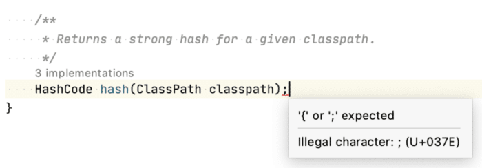

Roughly 12 years ago, I started to contribute to the Eclipse ecosystem in various functions. One of the most interesting experiences to this date was to work on developer tooling and handling the edge cases so others don't have to struggle. Though I stepped down as an Eclipse committer in the meantime, I'm still attached to working on productivity tooling nowadays as a member of the [Gradle Build Tool](https://github.com/gradle/gradle).

While working on Eclipse, I fondly remember working on various parts of the Java Tooling (JDT) and while working on refactorings and quick fixes. And not surprisingly, working on language-intensive pieces turned out to have the same hiccups as other non-trivial algorithms - the transition from "this is gonna be easy" to "why am I up at 3 am reading the Java Language Specification".



Working on language-specific tooling exposes you to all kinds of edge cases and delicate details and language has to offer. Some of them are well known and generally seen as "unprofessional" (hello `goto`). Others are actually not known at all. And with all due respect, I quite enjoy discovering the edge cases of the language syntax - a lot of times to confuse my co-workers who think they know the Java Language Syntax 😉 And given I love a good puzzle (especially the Java Puzzles), let's try a puzzle but using the Java syntax only, without any runtime behavior.

### Using Java for Phishing

Let us start off with a widely known fact about Java source files. You're allowed to use Unicode in most places of your code. While we can't use the full range of [Unicode in your class names](https://docs.oracle.com/javase/specs/jls/se7/html/jls-3.html#jls-3.8) (I still want to write `throw 🎂()`), you can add enough Unicode to play some pranks on your co-workers.

As an appetizer, in your next (remote) pairing session, just slip in a "Green Question Mark" (`U+037E`) into the code and watch your co-worker trying to find out what is wrong with that simple semicolon. This technique is most often used by phishing emails to make a URL look like the real one but actually points [to a very different domain](https://en.wikipedia.org/wiki/IDN_homograph_attack).



As it doesn't even compile, that's an easy one for your co-worker to recognize and fix. Let's start to be a little more sneaky.

Guess what the following program prints?

```
public static void main(String[] args) {
    if (1 == 2) { // one down, one to go: \u000a\u007d\u007b
        System.out.println("1 is 2");
    }
}
```

Indeed, in the context of the post, you correctly guessed that it is printing "1 is 2". Just...HOW? How is it possible to trick Java into thinking 1 == 2, even with Unicode magic? INSIDE A COMMENT. Any guesses? It actually doesn't change the expression. The following Unicode characters were harmed in the process:

* `\u000a` - the newline character `\n`
* `\u007d` - a closing curly brace `}`
* `\u007b` - an opening curly brace `{`

So the code we're actually looking at is this:

```java
public static void main(String[] args) {
   if (1 == 2) {
   }
   {
       System.out.println("1 is 2");
   }
}
```

Funny enough, most programmers would suspect something fishy with this comment when they see it. But what about indenting it so it's not shown in your editor anymore? 😉

### Blocks of Blocks

Let's move on to the [Java Language Specification](https://docs.oracle.com/javase/specs/) and see what interesting bits of syntax we can find in there.

Looking at the possibilities we have for implementing methods, Java defines method bodies to contain `Block` elements:

```java
MethodBody:
  Block

Block:
  { [BlockStatements] }

BlockStatement:
  LocalVariableDeclarationStatement
  ClassDeclaration
  Statement
```

Taking a closer look at the definition of `Block`, we learn that they can contain statements (so far so good) but also...`ClassDeclaration`s. Now it gets interesting. Let's see how deep the rabbit hole goes.

```java
public void howDeepCanWeGo() {
    class Foo {
        public void hello() {
            class Bar {
                public void helloFromBar() {
                    // You musn't be afraid to dream a little bigger, darling.
                } 
            }
            new Bar().helloFromBar();
        }
    }
    final Foo instance = new Foo();
    instance.hello();
}
```

Funnily enough, while this feature seems quite useless at first sight, it's the only one I've been using in actual test code in the past. While working on a framework that heavily relied on reflection, the inline class definitions came in quite handy to define classes under test and keeping them with the test. The alternative of having a bunch of nested classes scattered alongside tests was a good reason to move them closer to the test. You can read more about the quirks of local classes in [JLS 14.3](https://docs.oracle.com/javase/specs/jls/se15/html/jls-14.html#jls-14.3).

### This and That

Moving away from classes and closer to the action. Let's have a look at method parameters. As you may encounter several times yourself, you can't name things the same as keywords. Well, let's have a look at the following snippet.

```java
public class KeywordParameter {

    public static void main(String[] args) {
        KeywordParameter someObject = new KeywordParameter();
        someObject.callMe(3);
    }
    public void callMe(KeywordParameter this, int foo) {
        // ...
    }

}
```

So we're creating a new instance of `KeywordParameter` and calling the `callMe` method on it. Passing the `int` parameter. But wait, the method has two parameters. And one is even named after a keyword. That shouldn't even compile, right? It actually does. Looking at the JLS 8.4 Method Declarations, we can find the definition for method declarations.

```java
MethodDeclarator:
  Identifier ( [ReceiverParameter ,] [FormalParameterList] ) [Dims]
```

We see that the first parameter is a special, optional parameter not part of the formal parameter list. And it's actually defined to always have the name "this:

```java
ReceiverParameter:
  {Annotation} UnannType [Identifier .] this
```

The so-called "receiver parameter" is an "optional syntactic device" that represents the object it is invoked on (so it's really the same as what you'd expect from "this"). Its sole purpose is to be available in the source code to be annotated if necessary. Assuming we have an `@Immutable` annotation in our project and for some reason, we want to ensure that our IDE (or other static analyzers) understand that `this` in our current context represents an immutable data structure. With the explicit receiver parameter, we can annotate it correspondingly:

```java
public void callMe(@Immutable KeywordParameter this, int foo) { ... }
```

### @Everywhere

Talking about annotating things to analyze code. For the above snippets to work, the annotation needs to be targetable for `PARAMETER`. Did you ever look up what other targets an annotation can have? Going through the most common ones, there are no surprises: `TYPE`, `FIELD`, `METHOD`, `PARAMETER`, `CONSTRUCTOR`, `LOCAL_VARIABLE`, `ANNOTATION_TYPE`, `PACKAGE`, `TYPE_PARAMETER`, `MODULE` (since Java 9) and `RECORD_COMPONENT` (since Java 14).

But there is one that's not so obvious where to put it: `TYPE_USE`. From the name, it sounds like it can be used everywhere a type is used. Let's try and use it in some places:

```java
@TypeAnnotationsEverywhere.Immutable // ok, easy, similar to TYPE 
public class TypeAnnotationsEverywhere {

  public void giveMeMoreTypes() throws @Immutable RuntimeException {  // errr what?
     Object foo = new @Immutable Object(); // WHAT??????
  }

  class Foo implements @Immutable Function { ... }

}
```

In conclusion, using `TYPE_USE` allows us to put the annotation in the most unusual spots. [JLS 4.11](https://docs.oracle.com/javase/specs/jls/se8/html/jls-4.html#jls-4.11) defines all the spots that are covered by a "type usage".

Which one of those syntaxes were you aware of? Got all of them? The code for the post can be found on [GitHub](https://github.com/bmuskalla/java-syntax-puzzlers) as well. In the meantime, I'm still working on my museum of interesting cases of the language constructs, so please share anything you've encountered yourself. You can reach me on Twitter via [@bmuskalla](https://twitter.com/bmuskalla).

Note: This post was originally published on [bmuskalla.github.io](https://bmuskalla.github.io/blog/2021-01-04-java-syntax-puzzle/ "bmuskalla.github.io")
