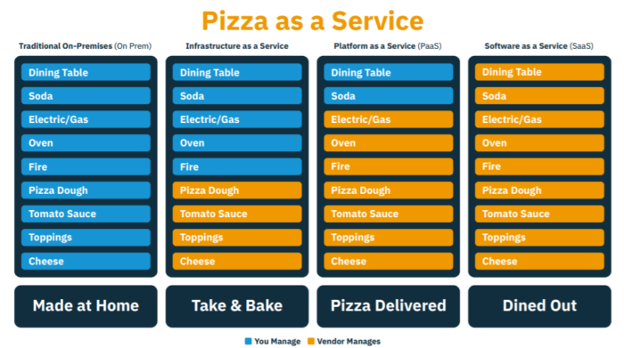

All companies are software companies, and businesses will always experience the challenge of keeping integrations between users and applications scalable, productive, fast, and of high quality. To combat this, cloud, microservices, and other modern solutions come up more and more in architectural decisions.

#### Here is the question---is Java prepared to deal with these diverse concepts in a corporate environment?

Yes, and to demonstrate how [Jakarta EE](https://jakarta.ee/ "Jakarta EE") and [Eclipse MicroProfile](https://microprofile.io/ "Eclipse MicroProfile") work very well and in the cloud, Payara and Platform.sh collaborated together on this webinar. You can watch the video presentation by Otavio Santana and Rudy de Busscher below:

[Click here to watch the video by Otavio Santana and Rudy de Busscher, exploring this subject in greater detail.](https://www.youtube.com/watch?v=3E5Pkh3iomg)

Software is everywhere. No matter where you look, there is software running. In human history, we've seen the number of machines/software increase with time, from one machine shared by a bunch of people, to a single person using thousands of software programs. Now, we can see software interacting with other software, such as when you buy a flight ticket: a system sends an email, another reads it and fires an event into your calendar. This new approach opens more business perspectives and opportunities for everybody, including machine learning. Make no mistake, Skynet is coming soon.

### Agile Manifesto

It's not just the amount of software that has increased, but also the number of interactions in a program itself. More users, more requirements, more feedback. It doesn't make sense to wait years to release a product, the time-to-market and the user feedback are vital to drive the product in the right direction. That's why in 2001, a small group of people, tired of the traditional approach to managing software development projects, designed the agile manifesto, which gave birth to the agile methodology. Agile is a process that helps teams provide quick and unpredictable responses to the feedback they receive on their project. It creates opportunities to assess a project's direction during the development cycle. Organizations evaluate the project in regular meetings called sprints or iterations.

In a more technical aspect aligning with Agile, the Domain-Driven Design (DDD) approach to developing software for complex needs deeply connects the implementation to an evolving model of the core business concepts. Techniques such as Ubiquitous Language are used to having the code closer to the business, decreasing the barrier between the developer and the user, and therefore, having more interactions than with an agile development.

More and more companies understand that all companies are software companies. As a result of relying heavily on software, companies frequently need to hire software developers. The question of how to handle several people working on just one project then arises. To solve this modern question, we can look at an ancient Roman military strategy: divide and conquer. Yes, divide a highly complex issue into small blocks of problems, split the team into small groups and divide the monolithic project into smaller ones. The Microservice architectural style is an approach to developing a single application into a suite of small services so that, for example, instead of an e-commerce company working with just one code-base and one implementation, it can split the teams/code in financial, product stock, marketing and so on. One thing to point out, the DDD context is still there. Indeed, it works alongside the approach for how to create useful services based on some of its bounded concepts; we're not discarding or deprecating that notion, but aggregating it into microservices.

### Microservices

Microservices, beyond making the team more agile, also bring several advantages such as independent scaling-up and releasing discrete services. However, it carries more twists in the operations side. Finalised code is not enough if it does not go to production. Thus the operations must follow the development team to release what the system needs to deploy every day. This is why: DevOps is a set of software development practices that combine software development (Dev) and information-technology operations (Ops) to shorten the systems development life cycle while delivering features, fixes, and updates frequently in close alignment with business objectives.

With both development and operations teams integrated and working together with the DevOps methodology, we're ready to handle software and operations. But how about hardware? Integrating the team means that equipment does not exist. What happens when a team needs more computer power? Does it make sense for somebody to go buy a new server? It isn't fast enough. In the global market and with the milliseconds battle to get less response time, a closer server to the client means less throughput time, but how do we buy/keep servers in several continents?

### Cloud Computing

With cloud computing that is available on-demand for computer system resources, especially data storage and computing power, without direct active management by the user, Cloud computing means: we don't care about the hardware itself. These services are broadly divided into three categories: Infrastructure-as-a-Service (IaaS), Platform-as-a-Service (PaaS) and Software-as-a-Service (SaaS).

These categories bring a new business concept to the market. Furthermore, each service brings new facilities, mainly fast delivery.

There is [a fantastic article](https://www.linkedin.com/pulse/20140730172610-9679881-pizza-as-a-service "a fantastic article") that explains the benefits of cloud computing with the most popular and delicious food in the world as an example. That's right, pizza!

In summary...

**Benefits of IaaS:**   

• No need to invest in your own hardware  

• Infrastructure scales on-demand to support dynamic workloads

**Benefits of PaaS:**   

• Develop applications and get to market faster  

• Reduce complexity with middleware as a service

**Benefits of SaaS:**   

• Apps and data are accessible from any connected computer.  

• No data is lost if your laptop breaks because the information is in the cloud.

A software project has fast delivery as the best strategic approach. A quick-release brings several benefits, such as receiving feedback, fixing bugs, and mainly driving the product in the right direction based on the user needs.

That's why several methodologies / technologies such as Agile, microservices, DevOps, or cloud were born. Nowadays, it is hard to think of waiting one year to release a project, running the risk of missing the right timing. The Java Community has decided to push a release every six months, and Jakarta EE seeks the same path.

### Cloud Native

Cloud computing has brought many methodologies and techniques that have revolutionized both the business and technical worlds. Among the terms that came up was cloud-native. To meet and cover these expectations in the Java universe, Jakarta EE emerged.

Like any new concept, there are several concepts with the same name; if you read books or articles about cloud-native, you may not find consensus about it. For example:
> *"Cloud-native is an approach to building and running applications that exploits the advantages of the cloud computing model."* --- [From Pivotal](https://pivotal.io/de/cloud-native)

> *"Cloud-native is a different way of thinking and reasoning about software systems. It embodies the following concepts: powered by disposable infrastructure, composed of bounded, scales globally, embraces disposable architecture."* --- [Architecting Cloud Native Applications: Design high-performing and cost-effective applications for the cloud.](https://www.amazon.com/Architecting-Cloud-Native-Applications-high-performing-ebook/dp/B07QTJ8WW8/ref=sr_1_4?keywords=cloud+native+applications&qid=1575059989&sr=8-4)

> *"In general usage, 'cloud-native' is an approach to building and running applications that exploits the advantages of the cloud-computing delivery model. 'Cloud-native' is about how applications are created and deployed, not where."* --- [InfoWorld](https://www.infoworld.com/article/3281046/what-is-cloud-native-the-modern-way-to-develop-software.html)

In a mutual consensus around the definitions from several articles, we can say that cloud-native is a term used to describe container-based environments. So cloud-native isn't related to specific programming languages or frameworks or even to a cloud provider company, but to containers.

(Originally written and presented by Otavio Santana and Rudy de Busscher and reposted with permission.)
