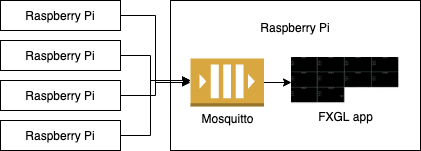
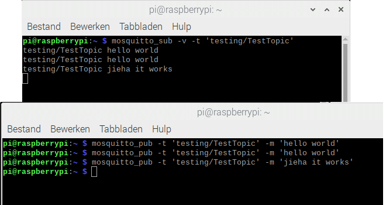
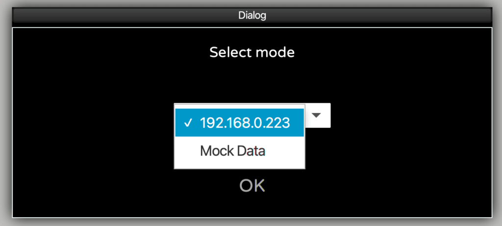
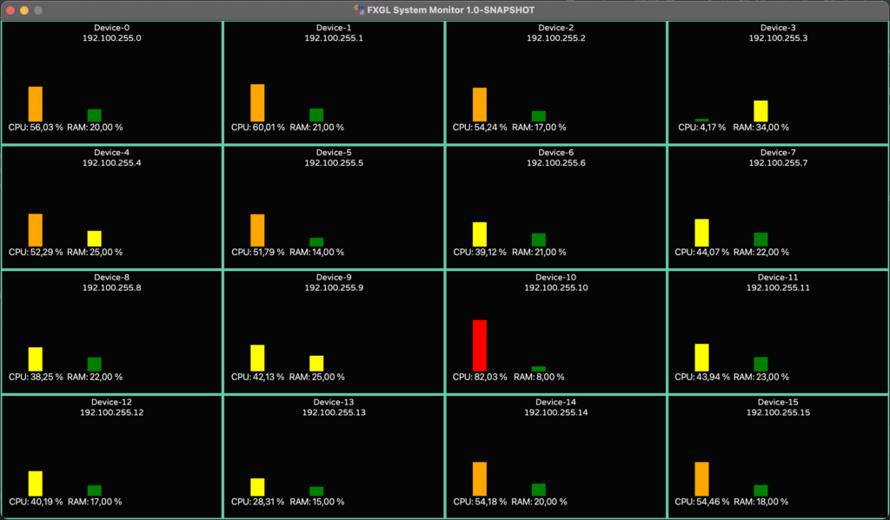
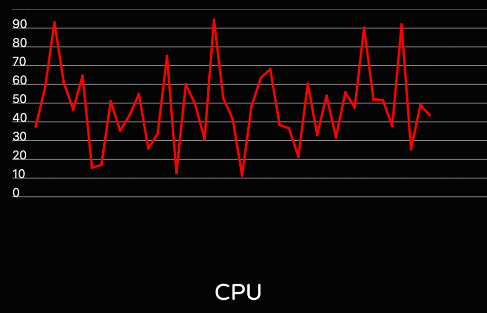

In a previous post ["Getting Started with FXGL Game Development"](https://foojay.io/today/category/java/javafx/) we already have taken a look at the [FXGL game development framework](https://github.com/AlmasB/FXGL) developed by [Almas Baimagambetov](https://twitter.com/AlmasBaim).

But, this game engine can also be used for other use cases. In this post, we will be building a system monitoring dashboard, which can run on a Raspberry Pi. The dashboard can be used to keep an eye on any device that can report its state to a queue. And, for me personally, it finally solves the problem of finding the IP addresses of all my Raspberry Pi's when my router decided to shuffle them... 😉

Application Description {#h2-0-application-description}
-------------------------------------------------------

A proof-of-concept has been set up using one Raspberry Pi as the "central system" to host the queue (Mosquitto). On this Raspberry Pi and others, a Python script runs to send the device state every second to the queue.  

For every new device (determined by the IP address) that appears in the list, a new dashboard "tile" is created to show some of the data. By clicking on this tile, we can enlarge the tile view to incorporate all of the data being received.

When the application starts, you can choose between "Mock Data", or an IP address of the board with the queue. This video shows the mocked result:

<figure class="wp-block-embed is-type-video is-provider-vimeo wp-block-embed-vimeo wp-embed-aspect-4-3 wp-has-aspect-ratio">
 

  <iframe title="FXGL JavaFX device dasboard with Mocked data" src="https://player.vimeo.com/video/497975677?dnt=1&amp;app_id=122963" width="500" height="313" frameborder="0" allow="autoplay; fullscreen; picture-in-picture; clipboard-write"></iframe>
 

 <figcaption>
  The running application with "Mock Data".
 </figcaption>
</figure>

The sources of this project are available on [GitHub in the FXGLSystemMonitoring repository](https://github.com/FDelporte/FXGLSystemMonitoring).

Mosquitto {#h2-1-mosquitto}
---------------------------

[Eclipse Mosquitto](https://mosquitto.org/) is an open-source message broker that implements the MQTT protocol which is lightweight and is suitable for use on all devices from low power single board computers to full servers. As such, it's a perfect match to use on the Raspberry Pi.

### Installing Mosquitto on the Raspberry Pi {#h3-2-installing-mosquitto-on-the-raspberry-pi}

Installing Mosquitto can be done with the following commands, which will also configure it as a service to start whenever your Raspberry Pi is (re)powered.

<pre class="EnlighterJSRAW" data-enlighter-language="generic" data-enlighter-theme="" data-enlighter-highlight="" data-enlighter-linenumbers="" data-enlighter-lineoffset="" data-enlighter-title="" data-enlighter-group="">$ sudo apt update
$ sudo apt install -y mosquitto mosquitto-clients
$ sudo systemctl enable mosquitto.service</pre>

We can check if it is installed correctly and running by requesting the version:

<pre class="EnlighterJSRAW" data-enlighter-language="generic" data-enlighter-theme="" data-enlighter-highlight="" data-enlighter-linenumbers="" data-enlighter-lineoffset="" data-enlighter-title="" data-enlighter-group="">$ mosquitto -v
1569780732: mosquitto version 1.5.7 starting
1569780732: Using default config.
1569780732: Opening ipv4 listen socket on port 1883.
1569780732: Error: Address already in use</pre>

The last line with the error message can be ignored.

### Testing Mosquitto on the Pi {#h3-3-testing-mosquitto-on-the-pi}

The installed mosquitto-clients can be used to easily test if Mosquitto is running OK on the Pi, by opening two terminal windows. In the first one we start a listener on topic "testing/TestTopic":

<pre class="EnlighterJSRAW" data-enlighter-language="generic" data-enlighter-theme="" data-enlighter-highlight="" data-enlighter-linenumbers="" data-enlighter-lineoffset="" data-enlighter-title="" data-enlighter-group="">$ mosquitto_sub -v -t 'testing/TestTopic'</pre>

In the second terminal we send multiple commands with a message for this specific topic, like this:

<pre class="EnlighterJSRAW" data-enlighter-language="generic" data-enlighter-theme="" data-enlighter-highlight="" data-enlighter-linenumbers="" data-enlighter-lineoffset="" data-enlighter-title="" data-enlighter-group="">$ mosquitto_pub -t 'testing/TestTopic' -m 'hello world'
$ mosquitto_pub -t 'testing/TestTopic' -m 'hello world'
$ mosquitto_pub -t 'testing/TestTopic' -m 'jieha it works'</pre>

Every "publish" from the second terminal window will appear in the first one as you can see in these screenshots:

Send State from Raspberry Pi {#h2-4-send-state-from-raspberry-pi}
-----------------------------------------------------------------

To send the state from all our Raspberry Pi-boards to Mosquitto, a [script is available in the GitHub project](https://github.com/FDelporte/FXGLSystemMonitoring/blob/main/python/statsSender.py). For this script, we are using Python as we only need some minimal example data which is easily available with the "psutil" library. Of course the same could be done with Java, but let's embrace Python for once 😉

### Extra Dependencies {#h3-5-extra-dependencies}

If you started from the default Raspberry Pi OS, Python is already installed. So we only need to add two extra libraries with the pip-command to send data to the queue (with paho) and get device status info (with psutil).

<pre class="EnlighterJSRAW" data-enlighter-language="generic" data-enlighter-theme="" data-enlighter-highlight="" data-enlighter-linenumbers="" data-enlighter-lineoffset="" data-enlighter-title="" data-enlighter-group="">pip install paho-mqtt
pip install psutil</pre>

In this example we are only using a subset of all the data which is available from psutil to show as a proof-of-concept. A full overview is available on [pypi.org/project/psutil](https://pypi.org/project/psutil/).

A small part of the Python code shows how the virtual memory info is used to construct a json-message:

<pre class="EnlighterJSRAW" data-enlighter-language="java" data-enlighter-theme="" data-enlighter-highlight="" data-enlighter-linenumbers="" data-enlighter-lineoffset="" data-enlighter-title="" data-enlighter-group="">virtual = psutil.virtual_memory()

jsonString = "{"
...
jsonString += " 'virtual_memory': {"
jsonString += "   'total':'" + str(virtual.total) + "',"
jsonString += "   'available':'" + str(virtual.available) + "',"
jsonString += "   'used':'" + str(virtual.used) + "',"
jsonString += "   'free':'" + str(virtual.free) + "',"
jsonString += "   'percent':'" + str(virtual.percent) + "'"
jsonString += " },"
...
jsonString = "}"</pre>

With the paho-library we can send such a message to the queue with:

<pre class="EnlighterJSRAW" data-enlighter-language="java" data-enlighter-theme="" data-enlighter-highlight="" data-enlighter-linenumbers="" data-enlighter-lineoffset="" data-enlighter-title="" data-enlighter-group="">client = paho.Client(hostname + ":" + str(address))
client.connect(mosquitto)
client.publish(topicName, jsonString)</pre>

Inside the Monitoring Application {#h2-6-inside-the-monitoring-application}
---------------------------------------------------------------------------

The application starts in MonitorApp which extends an FXGL GameApplication.

The [Java/JavaFX/FXGL Maven project](https://github.com/FDelporte/FXGLSystemMonitoring) is organized in data-, queue- and view-packages to make the code easy to understand. Besides the expected FXGL-specific overrides (initSettings, initGame), we can find some nice examples of the additional features FXGL provides.

For example the dialog box at start-up asks the user to select mock or real mode:

<pre class="EnlighterJSRAW" data-enlighter-language="java" data-enlighter-theme="" data-enlighter-highlight="" data-enlighter-linenumbers="" data-enlighter-lineoffset="" data-enlighter-title="" data-enlighter-group="">runOnce(() -&gt; {
    var choiceBox = getUIFactoryService().newChoiceBox(
            FXCollections.observableArrayList("192.168.0.223", "Mock Data")
    );
    choiceBox.getSelectionModel().selectFirst();

    var btnOK = getUIFactoryService().newButton("OK");
    btnOK.setOnAction(e -&gt; {
        var result = choiceBox.getSelectionModel().getSelectedItem();
        if ("Mock Data".equals(result)) {
            startWithMockData();
        } else {
            getExecutor().startAsync(() -&gt; startWithClient(result));
        }
    });

    getDialogService().showBox("Select mode", choiceBox, btnOK);
}, Duration.seconds(0.01));</pre>

Another one is the `run()` method which, every second, runs the provided code. In this case, the code generates random data for the "mock" mode using [Perlin noise](https://en.wikipedia.org/wiki/Perlin_noise):

<pre class="EnlighterJSRAW" data-enlighter-language="java" data-enlighter-theme="" data-enlighter-highlight="" data-enlighter-linenumbers="" data-enlighter-lineoffset="" data-enlighter-title="" data-enlighter-group="">run(() -&gt; monitors.forEach(m -&gt; {
    var t = random(0.5, 150000.0);

    var reading = new Reading(
            noise1D(t * 7) * 100,
            (long) (noise1D((t + 1000) * 2) * 40),
            (long) (noise1D((t + 3000) * 3) * 75)
    );

    m.onReading(reading);
}), DATA_UPDATE_FREQUENCY);</pre>

### Incoming Data {#h3-7-incoming-data}

By using JSONB the incoming data is converted to Java objects. For example, let's look at the `VirtualMemory` class which maps the Python data to a Java object. Each JsonbProperty has a name-value which is not required if the variable has the same name, but for clarity, I prefer to still define it to avoid errors later when the Java variable is renamed.

<pre class="EnlighterJSRAW" data-enlighter-language="java" data-enlighter-theme="" data-enlighter-highlight="" data-enlighter-linenumbers="" data-enlighter-lineoffset="" data-enlighter-title="" data-enlighter-group="">public class VirtualMemory {
    @JsonbProperty("total")
    private long total;

    @JsonbProperty("available")
    private long available;

    @JsonbProperty("used")
    private long used;

    @JsonbProperty("free")
    private long free;

    @JsonbProperty("percent")
    private double percent;

    public VirtualMemory() {
        // NOP needed for JSON mapping
    }

    // Getters - Setters
}</pre>

### Queue {#h3-8-queue}

By using the ["org.eclipse.paho.client.mqttv3" dependency](https://www.eclipse.org/paho/), we can easily connect to the queue:

<pre class="EnlighterJSRAW" data-enlighter-language="java" data-enlighter-theme="" data-enlighter-highlight="" data-enlighter-linenumbers="" data-enlighter-lineoffset="" data-enlighter-title="" data-enlighter-group="">MqttClient client = new MqttClient("tcp://" + ipAddress + ":1883", MqttClient.generateClientId());
client.setCallback(new ClientCallback(readings));
client.subscribe(topicName);</pre>

The ClientCallBack gets called each time a message is available for the topic that we mentioned earlier.

<pre class="EnlighterJSRAW" data-enlighter-language="java" data-enlighter-theme="" data-enlighter-highlight="" data-enlighter-linenumbers="" data-enlighter-lineoffset="" data-enlighter-title="" data-enlighter-group="">@Override
public void messageArrived(String s, MqttMessage mqttMessage) {
    String data = new String(mqttMessage.getPayload());
    System.out.println("Message received: " + data);
}</pre>

### The View Components {#h3-9-the-view-components}

All the views are split into separate JavaFX Nodes. The overall `MonitorView` is responsible for handling both the `CollapsedView` and the `ExpandedView`, which in turn delegate their responsibility to `LoadView`  

and `CanvasLineChart` respectively. An illustrative example of these relationships is provided below:

<pre class="EnlighterJSRAW" data-enlighter-language="generic" data-enlighter-theme="" data-enlighter-highlight="" data-enlighter-linenumbers="" data-enlighter-lineoffset="" data-enlighter-title="" data-enlighter-group="">App uses MonitorView

MonitorView uses CollapsedView and ExpandedView

CollapsedView uses LoadView

ExpandedView uses CanvasLineChart</pre>

All these views implement the `ReadingHandler` callback, which notifies each view when a new reading from the queue is available. Therefore, all views can easily be updated following this notification.

### Animations {#h3-10-animations}

Each dashboard tile expands on click to fill the entire window. This expansion happens as an animation, which seamlessly transforms the `CollapsedView` into the `ExpandedView`. The animation itself makes use of the FXGL animation system using "fluent" API, where we can configure various properties, such as duration and interpolation. We also provide the JavaFX observable property that we are animating (`bg.widthProperty()`) and the values at the start and end of the animation:

<pre class="EnlighterJSRAW" data-enlighter-language="java" data-enlighter-theme="" data-enlighter-highlight="" data-enlighter-linenumbers="" data-enlighter-lineoffset="" data-enlighter-title="" data-enlighter-group="">animationBuilder()
        .duration(ANIMATION_DURATION)
        .interpolator(Interpolators.EXPONENTIAL.EASE_OUT())
        .animate(bg.widthProperty())
        .from(MONITOR_WIDTH)
        .to(APP_WIDTH)
        .buildAndPlay();</pre>

### Running the Application with Mock Data {#h3-11-running-the-application-with-mock-data}

When the application starts, you have the choice to select between an IP address of the Raspberry Pi with the Mosquitto queue and "Mock Data". After selecting this second option, 16 devices will be created inside the application, where each device is driven by the randomly generated data. This is ideal for testing all of the application functions.

<figure class="wp-block-gallery columns-3 is-cropped wp-block-gallery-1 is-layout-flex wp-block-gallery-is-layout-flex">
 <ul class="blocks-gallery-grid">
  <li class="blocks-gallery-item">
   <figure>
    
   </figure></li>
  <li class="blocks-gallery-item">
   <figure>
    
   </figure></li>
  <li class="blocks-gallery-item">
   <figure>
    
   </figure></li>
 </ul>
 <figcaption class="blocks-gallery-caption">
  Screenshots of the application with "Mock Data"
 </figcaption>
</figure>

### Running the Application with Real Data {#h3-12-running-the-application-with-real-data}

Restart the application and select the IP address. As soon as data is received from a device with a new IP address, a new tile is created to visualize the data. Start the Python script on a few devices to see the result as shown in the video below.

<figure class="wp-block-embed is-type-video is-provider-vimeo wp-block-embed-vimeo wp-embed-aspect-4-3 wp-has-aspect-ratio">
 

  <iframe loading="lazy" title="FXGL JavaFX device dasboard with data from three Raspberry Pi boards" src="https://player.vimeo.com/video/497976030?dnt=1&amp;app_id=122963" width="500" height="313" frameborder="0" allow="autoplay; fullscreen; picture-in-picture; clipboard-write"></iframe>
 

 <figcaption>
  The running application with data from several devices using "stress" on one of them.
 </figcaption>
</figure>

As you can see in the video, my Pi's are not very busy. By using the stress-tool we can trigger additional load on the device to test the visualization in our dashboard.

On my Raspberry Pi (B4 8Gb memory) the cpu-command only impacts the CPU value, while the vm-command causes both higher CPU and memory usage.

<pre class="EnlighterJSRAW" data-enlighter-language="generic" data-enlighter-theme="" data-enlighter-highlight="" data-enlighter-linenumbers="" data-enlighter-lineoffset="" data-enlighter-title="" data-enlighter-group="">$ sudo apt install stress
$ stress --cpu 2
$ stress --vm 4 --vm-bytes 1024M</pre>

Conclusion {#h2-13-conclusion}
------------------------------

It should be noted that something similar could be done with the magnificent [TilesFX library by Gerrit Grunwald](https://github.com/HanSolo/tilesfx) but we deliberately took another approach to show you how you can create visualization components with JavaFX and FXGL yourself.

Combined with the right libraries for JsonB and Paho, Java proves, yet again, that very powerful applications can be created with minimal code which is easy to read and extend.

As this is just a proof-of-concept, there is still a lot of room for improvement... Just a few ideas:

* Indicate devices that haven't sent data in the last X seconds and turn the view background to red
* Combine multiple values on the chart
* Provide additional info inside the expanded view
* Add a dialog asking the user for the queue IP address

Feel free to use this project as a starting point or as an inspiration, but please share what you have created!

**Thanks a lot to Almas for his contributions to the example project and this post!**
