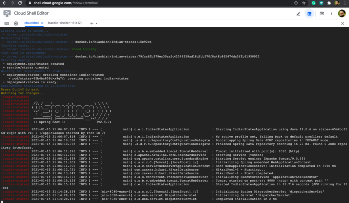
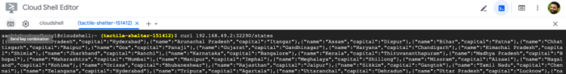

In this post, we will create a Local CI/CD workflow for a Spring Boot Application and deploy it to Kubernetes using Skaffold.  

It is a known fact that developing applications with Kubernetes is cumbersome. That is the reason there is an ecosystem being developed around it so that developers can focus on what matters most to them i.e. writing code. On that note, in this article, I will be covering another tool Skaffold developed by [Google](https://skaffold.dev/).

#### So what exactly is Skaffold?

> Skaffold handles the workflow for building, pushing and deploying your application.

#### What problem it is trying to solve?

As I said earlier developing applications with Kubernetes is not so easy task and that's where Skaffold comes into play as it eases the development and deployment of your applications running on Kubernetes. It manages the entire workflow and you get instant feedback while developing and deploying your application locally or on a remote Kubernetes cluster.{#rmm}

Following are some of the benefits of using Skaffold.

* **Lightweight**

It's is a client-side utility only so there is no cluster set up or anything to maintain.

* **Easy to share**

It's very easy to share among your team members as you only need to do the following to get started.

    git clone
    skaffold run

* **Ease of development**

To get your application containerized even locally you have to do a lot of things. For your local development, you might be doing something like building, pushing, and then deploying your application on Kubernetes. And there are a different set of commands (docker blah, kubectl blah blah, etc.) and the tools you use for each of these phases of your workflow. With Skaffold you just have one magical command `skaffold run or skaffold dev` and you are golden. This doesn't mean you don't have a dependency on those tools that require you to build and deploy applications to Kubernetes. It's just that development is a lot easier when you just run a single command.

OK. Enough theory let's get started.

#### Anatomy of the Spring Boot Application

In this tutorial, I will be using a Spring Boot application which when accessed via /states REST endpoint shows Indian states and their capitals. This application uses an in-memory H2 database which inserts rows at the start of the application and keeps it in memory. The source code is available [here](https://github.com/yrashish/indian-states).

Prerequisite
------------

For this demo following are required to be installed.

1. Installing [Skaffold](https://skaffold.dev/docs/install/)
2. Installing Docker Desktop for [Mac](https://docs.docker.com/docker-for-mac/install/)
3. Installing [kubectl](https://v1-18.docs.kubernetes.io/docs/tasks/tools/install-kubectl/)(Optional)
4. Minikube(Optional)

I have used macOS but you are free to use any preferred OS you like or have experience working with. I have mentioned Minikube and kubectl installation is optional because if you already have Docker desktop installed you can enable Kubernetes by following the steps mentioned in my other blog [post](https://ashishtechmill.com/deploying-spring-boot-application-on-kubernetes).

If you want to play around without going through the installation, then you can skip the above steps and use Google Cloud Shell instead, which provides a developer ready environment from the browser. I have covered this at the end of the article.

**Getting Started With Skaffold**

* ***skaffold init***

To start with Skaffold you would require a `skaffold.yaml` file. For that, we can run the below command.

    skaffold init

However, you will be greeted with the following error message.

    skaffold init
    one or more valid builder configuration (Dockerfile or Jib configuration) must be present to build images with skaffold; please provide at least one build config and try again or run `skaffold init --skip-build`

The error seems to be self-explanatory that Skaffold is looking for either Dockerfile or Jib configuration in your project.

Skaffold currently supports the following builders.

1. [Docker](https://skaffold.dev/docs/pipeline-stages/builders/docker/)
2. [Jib](https://skaffold.dev/docs/pipeline-stages/builders/jib/) (with `--XXenableJibInit` flag)
3. [Buildpacks](https://skaffold.dev/docs/pipeline-stages/builders/buildpacks/) (with `--XXenableBuildpacksInit` flag)

So to resolve this error I will be adding the Jib maven plugin in pom.xml file. If you are wondering what is Jib and its usage you can read my previous [article](https://ashishtechmill.com/containerizing-spring-boot-application-with-jib). You can enable Jib support by copy/pasting the below content to pom.xml file.

    <plugin>
       <groupId>com.google.cloud.tools</groupId>
       <artifactId>jib-maven-plugin</artifactId>
       <version>2.7.0</version>
       <configuration>
          <from>
             <image>gcr.io/distroless/java:11</image>
          </from>
          <to>
             <image>registry.hub.docker.com/hiashish/indian-states</image>
          </to>
       </configuration>
    </plugin>

As per official [documentation](https://skaffold.dev/docs/pipeline-stages/init/).
> `skaffold` init also recognizes Maven and Gradle projects, and will auto-suggest the `[jib](https://skaffold.dev/docs/pipeline-stages/builders/#/local#jib-maven-and-gradle)` builder. Currently `jib` artifact detection is disabled by default, but can be enabled using the flag `--XXenableJibInit`.

Now run `skaffold init` with `--XXenableJibInit.` However, it will fail again with the below error.

    skaffold init --XXenableJibInit
    one or more valid Kubernetes manifests are required to run skaffold

Since we have not created Kubernetes manifests(deployment, pod, service, etc.) and there is a known [issue](https://github.com/GoogleContainerTools/skaffold/issues/1651) with Skaffold and to resolve this error we will have to create them manually using the below kubectl command.

*Creating deployment*

    apiVersion: apps/v1
    kind: Deployment
    metadata:
      creationTimestamp: null
      labels:
        app: states
      name: states
    spec:
      replicas: 2
      selector:
        matchLabels:
          app: states
      strategy: {}
      template:
        metadata:
          creationTimestamp: null
          labels:
            app: states
        spec:
          containers:
            - image: docker.io/hiashish/indian-states
              name: indian-states
              resources: {}
    status: {}

*Creating service*

    apiVersion: v1
    kind: Service
    metadata:
      creationTimestamp: null
      labels:
        app: states
      name: states
    spec:
      ports:
        - port: 8080
          protocol: TCP
          targetPort: 8080
      selector:
        app: states
      type: NodePort
    status:
      loadBalancer: {}

We have created both deployment and service now. Please make sure to copy the output of the above command to YAML files in the `k8s` directory.

Now run `skaffold init --XXenableJibInit`

    apiVersion: skaffold/v2beta10
    kind: Config
    metadata:
      name: indian-states
    build:
      artifacts:
      - image: docker.io/hiashish/indian-states
        jib:
          project: com.example:indian-states
    deploy:
      kubectl:
        manifests:
        - k8s/mydeployment.yaml
        - k8s/myservice.yamlDo you want to write this configuration to skaffold.yaml? [y/n]: y
    Configuration skaffold.yaml was written
    You can now run [skaffold build] to build the artifacts
    or [skaffold run] to build and deploy
    or [skaffold dev] to enter development mode, with auto-redeploy

Finally, `skaffold.yaml` file is created.

* ***skaffold dev***

We have now completed the required setup to start continuous build and deployment of our Kubernetes application. Now we can simply run the below command to start our CI/CD workflow locally.

    skaffold dev
    Listing files to watch...
     - docker.io/hiashish/indian-states
    Generating tags...
     - docker.io/hiashish/indian-states -> docker.io/hiashish/indian-states:31ff588-dirty
    Checking cache...
     - docker.io/hiashish/indian-states: Found Locally
    Tags used in deployment:
     - docker.io/hiashish/indian-states -> docker.io/hiashish/indian-states:43f7c470a60b876c7579ed3041b64024b774e9808851ad83b6817701d0188cc5
    Starting deploy...
     - deployment.apps/states created
     - service/states created
    Waiting for deployments to stabilize...
     - deployment/states is ready.
    Deployments stabilized in 2.710870355s
    Press Ctrl+C to exit
    Watching for changes...
    [indian-states] 
    [indian-states]   .   ____          _            __ _ _
    [indian-states]  /\\ / ___'_ __ _ _(_)_ __  __ _ \ \ \ \
    [indian-states] ( ( )\___ | '_ | '_| | '_ \/ _` | \ \ \ \
    [indian-states]  \\/  ___)| |_)| | | | | || (_| |  ) ) ) )
    [indian-states]   '  |____| .__|_| |_|_| |_\__, | / / / /
    [indian-states]  =========|_|==============|___/=/_/_/_/
    [indian-states]  :: Spring Boot ::                (v2.4.0)
    [indian-states] 
    [indian-states] 2020-12-07 17:43:54.919  INFO 1 --- [           main] c.e.i.IndianStatesApplication            : Starting IndianStatesApplication using Java 11.0.6 on states-6f5bb746b6-9sglw with PID 1 (/app/classes started by root in /)
    [indian-states] 2020-12-07 17:43:54.938  INFO 1 --- [           main] c.e.i.IndianStatesApplication            : No active profile set, falling back to default profiles: default
    [indian-states] 2020-12-07 17:43:57.607  INFO 1 --- [           main] .s.d.r.c.RepositoryConfigurationDelegate : Bootstrapping Spring Data JDBC repositories in DEFAULT mode.
    [indian-states] 2020-12-07 17:43:57.670  INFO 1 --- [           main] .s.d.r.c.RepositoryConfigurationDelegate : Finished Spring Data repository scanning in 35 ms. Found 0 JDBC repository interfaces.
    [indian-states] 2020-12-07 17:44:00.130  INFO 1 --- [           main] o.s.b.w.embedded.tomcat.TomcatWebServer  : Tomcat initialized with port(s): 8080 (http)
    [indian-states] 2020-12-07 17:44:00.189  INFO 1 --- [           main] o.apache.catalina.core.StandardService   : Starting service [Tomcat]
    [indian-states] 2020-12-07 17:44:00.196  INFO 1 --- [           main] org.apache.catalina.core.StandardEngine  : Starting Servlet engine: [Apache Tomcat/9.0.39]
    [indian-states] 2020-12-07 17:44:00.387  INFO 1 --- [           main] o.a.c.c.C.[Tomcat].[localhost].[/]       : Initializing Spring embedded WebApplicationContext
    [indian-states] 2020-12-07 17:44:00.388  INFO 1 --- [           main] w.s.c.ServletWebServerApplicationContext : Root WebApplicationContext: initialization completed in 5249 ms
    [indian-states] 2020-12-07 17:44:01.673  INFO 1 --- [           main] com.zaxxer.hikari.HikariDataSource       : HikariPool-1 - Starting...
    [indian-states] 2020-12-07 17:44:02.375  INFO 1 --- [           main] com.zaxxer.hikari.HikariDataSource       : HikariPool-1 - Start completed.
    [indian-states] 2020-12-07 17:44:03.216  INFO 1 --- [           main] o.s.s.concurrent.ThreadPoolTaskExecutor  : Initializing ExecutorService 'applicationTaskExecutor'
    [indian-states] 2020-12-07 17:44:04.050  INFO 1 --- [           main] o.s.b.w.embedded.tomcat.TomcatWebServer  : Tomcat started on port(s): 8080 (http) with context path ''
    [indian-states] 2020-12-07 17:44:04.095  INFO 1 --- [           main] c.e.i.IndianStatesApplication            : Started IndianStatesApplication in 10.782 seconds (JVM running for 12.991)

As you can see that the application is built and deployed to the local Kubernetes cluster now. We first have to check the `NodePort` of our application using kubectl command to access the application locally.

    kubectl get all 
    NAME                          READY   STATUS    RESTARTS   AGE
    pod/states-7c55b8d5b6-vx5hq   1/1     Running   0          5m47s

    NAME                 TYPE        CLUSTER-IP       EXTERNAL-IP   PORT(S)          AGE
    service/kubernetes   ClusterIP   10.96.0.1        <none>        443/TCP          21h
    service/states       NodePort    10.110.135.236   <none>        8080:30925/TCP   5m47s

    NAME                     READY   UP-TO-DATE   AVAILABLE   AGE
    deployment.apps/states   1/1     1            1           5m48s

    NAME                                DESIRED   CURRENT   READY   AGE
    replicaset.apps/states-7c55b8d5b6   1         1         1       5m48s

`NodePort` assigned to our application is 30925. Let's invoke the /states REST endpoint of our application and see what happens.

    curl localhost:30925/states
    [{"name":"Andra Pradesh","capital":"Hyderabad"},{"name":"Arunachal Pradesh","capital":"Itangar"},{"name":"Assam","capital":"Dispur"},{"name":"Bihar","capital":"Patna"},{"name":"Chhattisgarh","capital":"Raipur"},{"name":"Goa","capital":"Panaji"},{"name":"Gujarat","capital":"Gandhinagar"},{"name":"Haryana","capital":"Chandigarh"},{"name":"Himachal Pradesh","capital":"Shimla"},{"name":"Jharkhand","capital":"Ranchi"},{"name":"Karnataka","capital":"Bangalore"},{"name":"Kerala","capital":"Thiruvananthapuram"},{"name":"Madhya Pradesh","capital":"Bhopal"},{"name":"Maharashtra","capital":"Mumbai"},{"name":"Manipur","capital":"Imphal"},{"name":"Meghalaya","capital":"Shillong"},{"name":"Mizoram","capital":"Aizawi"},{"name":"Nagaland","capital":"Kohima"},{"name":"Orissa","capital":"Bhubaneshwar"},{"name":"Rajasthan","capital":"Jaipur"},{"name":"Sikkim","capital":"Gangtok"},{"name":"Tamil Nadu","capital":"Chennai"},{"name":"Telangana","capital":"Hyderabad"},{"name":"Tripura","capital":"Agartala"},{"name":"Uttaranchal","capital":"Dehradun"},{"name":"Uttar Pradesh","capital":"Lucknow"},{"name":"West Bengal","capital":"Kolkata"},{"name":"Punjab","capital":"Chandigarh"}]

This looks great!!!

Let's do a small code change and see if Skaffold can re-trigger the entire workflow. I will just change the `replicas` from 1 to 2 and in a deployment YAML file and see if Skaffold can redeploy the application with increased `replicas`.

*Application redeployed*

    Tags used in deployment:
     - docker.io/hiashish/indian-states -> docker.io/hiashish/indian-states:43f7c470a60b876c7579ed3041b64024b774e9808851ad83b6817701d0188cc5
    Starting deploy...
     - deployment.apps/states configured
    Waiting for deployments to stabilize...
     - deployment/states is ready.
    Deployments stabilized in 4.109550864s
    Watching for changes...
    [indian-states] 
    [indian-states]   .   ____          _            __ _ _
    [indian-states]  /\\ / ___'_ __ _ _(_)_ __  __ _ \ \ \ \
    [indian-states] ( ( )\___ | '_ | '_| | '_ \/ _` | \ \ \ \
    [indian-states]  \\/  ___)| |_)| | | | | || (_| |  ) ) ) )
    [indian-states]   '  |____| .__|_| |_|_| |_\__, | / / / /
    [indian-states]  =========|_|==============|___/=/_/_/_/
    [indian-states]  :: Spring Boot ::                (v2.4.0)
    [indian-states]

Now check again `replicaset` for our application using kubectl.

    kubectl get all
    AME                          READY   STATUS    RESTARTS   AGE
    pod/states-7c55b8d5b6-br9zx   1/1     Running   0          20s
    pod/states-7c55b8d5b6-vx5hq   1/1     Running   0          16m

    NAME                 TYPE        CLUSTER-IP       EXTERNAL-IP   PORT(S)          AGE
    service/kubernetes   ClusterIP   10.96.0.1        <none>        443/TCP          21h
    service/states       NodePort    10.110.135.236   <none>        8080:30925/TCP   16m

    NAME                     READY   UP-TO-DATE   AVAILABLE   AGE
    deployment.apps/states   2/2     2            2           16m

    NAME                                DESIRED   CURRENT   READY   AGE
    replicaset.apps/states-7c55b8d5b6   2         2         2       16m

As you can see after redeployment number of replicas has increased to 2 which was expected.

* ***skaffold run***

This is similar to `skaffold dev` but the main difference is that the workflow described in `skaffold.yaml` is executed just once. This is recommended for your production workflow.

#### Using Cloud Shell

If you have all the required dependencies(docker, minikube, skaffold) installed locally then it's fine otherwise you can skip the installation part as I have described above in the prerequisite section by using Google's Cloud [Shell](https://cloud.google.com/shell) to replicate your local Kubernetes environment. Cloud Shell provides a browser-based terminal/CLI and editor and it comes with Skaffold, Minikube, and Docker pre-installed, and it's free.

Just run following commands and that's it. Make sure docker and minikube are up and running in Cloud Shell environment.  
`git clone https://github.com/yrashish/indian-states`  
`skaffold dev`  

Following are the screenshots from Cloud Shell.

Final Output

 

As you can see above we were able to run our Spring Boot application with Cloud Shell also and got the expected output.

#### Conclusion

In this article, I have just covered a handful of features that Skaffold provides. There are a lot of other features worth looking at like port-forwarding for debugging, health checks and templating deployment configurations, etc. It is worth considering Skaffold for continuous deployment of your Kubernetes applications.

#### Support me

If you like what you just read then you can buy me a coffee  

**Further reading**

You can also read some of my previous [articles](https://ashishtechmill.com/).
