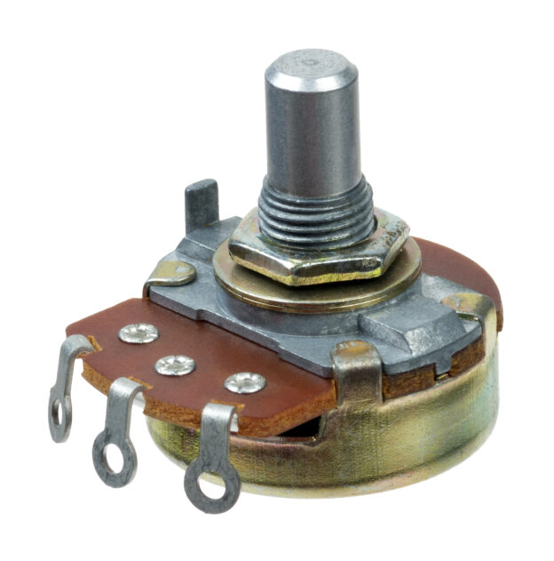
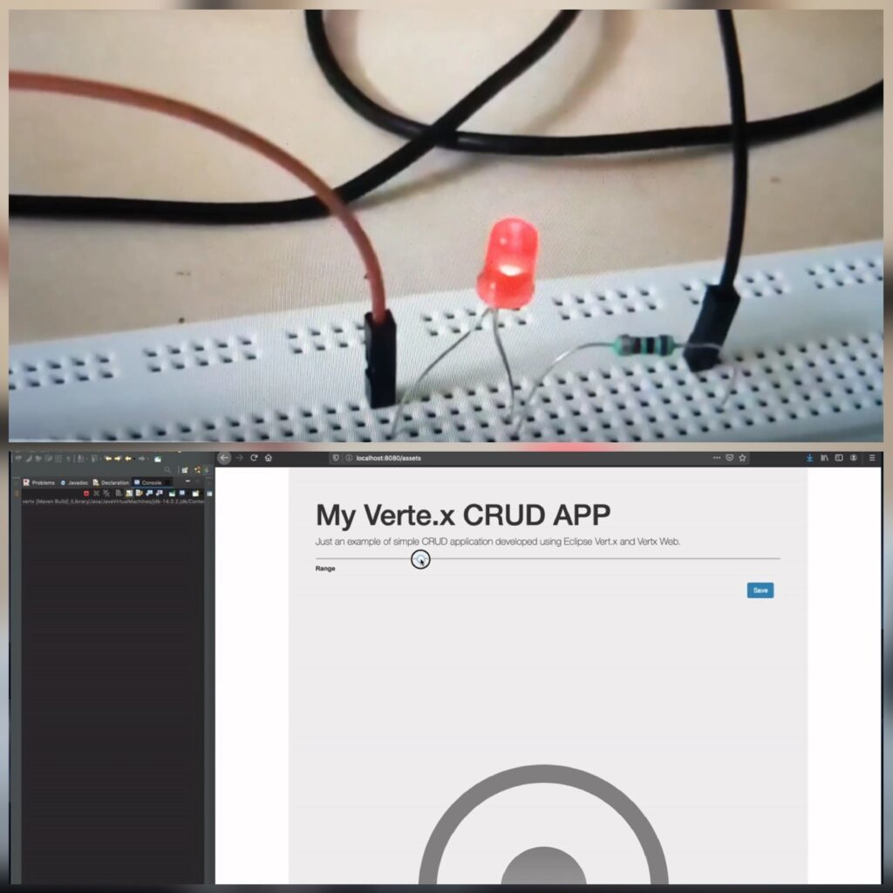
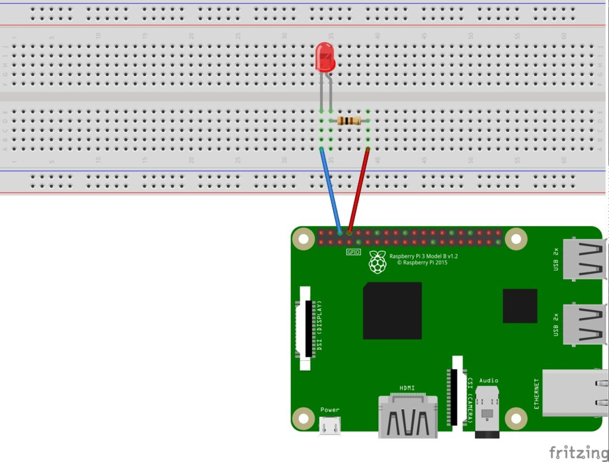

The Raspberry Pi allows us to do a lot of electronic projects without having to wait for ordered components... or to even buy them at all... by using virtual components: *"Invest your time before you invest your money and build something before you buy the component."* For example, If you don't have a 7 segment display you can follow [this](https://foojay.io/today/electronics-quarkus-qute-on-raspberry-pi/) and if you don't have an 8×8 Led Matrix you can follow [this](https://foojay.io/today/electronics-micronaut-velocity-with-raspberry-pi/) and so on.

You can go ahead and use this idea to start your project without wasting more time and without buying anything. Today, I want to show a way to play with a potentiometer:

<figure class="wp-block-image size-large is-resized">
 
</figure>

**From Wikipedia**: "A potentiometer is a three-terminal resistor with a sliding or rotating contact that forms an adjustable voltage divider. If only two terminals are used, one end and the wiper, it acts as a variable resistor or rheostat."

**From Google**: "An instrument for measuring an electromotive force by balancing it against the potential difference produced by passing a known current through a known variable resistance."



More details here: [potentiometers basic principles](https://passive-components.eu/resistors-potentiometers-basic-principles).

The Idea {#h2-0-the-idea}
-------------------------

The idea is to create a simple web application that I can use as a potentiometer:

This time I decided to do it with [Vert.X](https://github.com/eclipse-vertx/vert.x).

Vert.x is an open-source, reactive and polyglot software development toolkit from the developers of Eclipse. Vert.x is a tool-kit for building reactive applications on the JVM. It is called polyglot due to its support for multiple JVM and non-JVM languages like Java, Groovy, Ruby, Python, and JavaScript.

Being reactive, verticles remain dormant until they receive a message or event. Verticles communicate with each other through the event bus. The message can be anything from a string to a complex object. Message handling is ideally asynchronous, messages are queued to the event bus, and control is returned to the sender. Later it's dequeued to the listening verticle. The response is sent using Future and callback methods and with that, I can create something that calls the REST several times in a sequence without care about the answer and with no blocks.

If I use setPwm(), my LED can be any value between 0 and 100, and using an input range will only call one time to change the value. This will jump the value from current to select and not will create a potentiometer style.

But I can add some CSS style and create a knob and simulate a real potentiometer. Now I can call my REST interface for each value and simulate a real use of a potentiometer.



I can combine this with my [Duke robot](http://www.igfasouza.com/blog/raspberry-pi-servo-java-duke-robot/) and control the Duke's arm.

I can combine it with my [Christmas hats](http://www.igfasouza.com/blog/raspberry-christmas-hat/) and create a nice fade effect.

I can do a simple Led example:

Code {#h2-1-code}
-----------------

I simply used the Vert.X web "hello world" example:

<pre class="EnlighterJSRAW" data-enlighter-language="java" data-enlighter-theme="" data-enlighter-highlight="" data-enlighter-linenumbers="" data-enlighter-lineoffset="" data-enlighter-title="" data-enlighter-group="">    private void changePwmValue(RoutingContext routingContext) {
        String range = routingContext.pathParam("id");

        System.out.println(range); //just to see calls

        final GpioController gpio = GpioFactory.getInstance();
        Gpio.pwmSetMode(Gpio.PWM_MODE_MS);
        Gpio.pwmSetRange(100);
        Gpio.pwmSetClock(500);

        GpioPinPwmOutput led01 = gpio.provisionSoftPwmOutputPin(RaspiPin.GPIO_15, "LeftGreen");
        led01.setPwm(Integer.parseInt(range));

        routingContext.response()
                .putHeader("content-type", "application/json")
                .setStatusCode(200)
                .end(Json.encodePrettily(range));
    }</pre>

Disclaimer -- I got the CSS from [here](https://codepen.io/jean-emmanuel/pen/GpxYdg).

You can get the full code on my [GitHub](https://github.com/igfasouza/Vert.x-Potentiometer-web-Starter-example).



*** ** * ** ***

Originally posted on [Igor Souza](http://www.igfasouza.com/blog/raspberry-pi-vert-x-web-potentiometer/ "Igor Zouza")'s blog.
