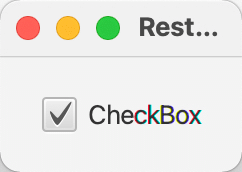
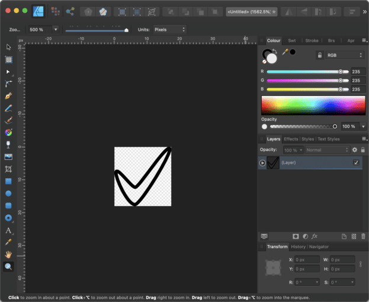
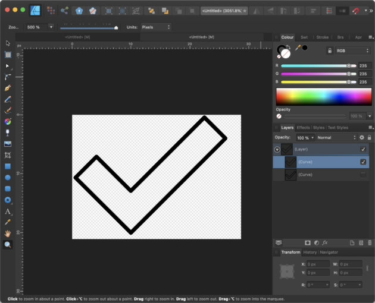
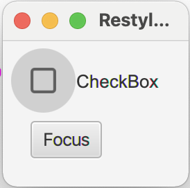
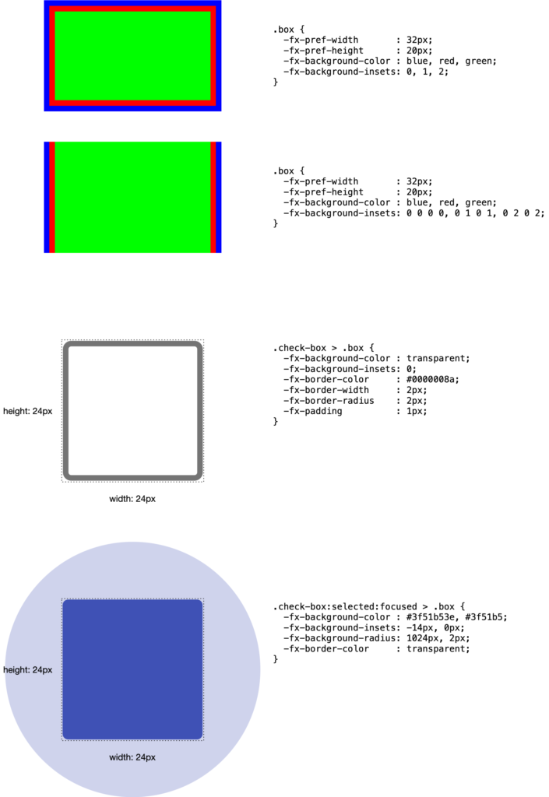
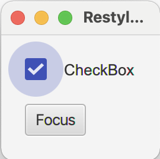
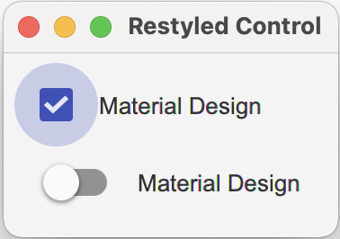

JavaFX is now already some years out in the wild and even if it is not as widely used as web applications, it has its place. It mainly is used in internal applications only, which leads to the impression that nobody is using it.

As long as you only would like to create a simple form-based application, the available UI controls in JavaFX will work totally fine. You need to take a look at how to style the controls using CSS, but from the coding point of view it's pretty straight forward.

But when it comes to special requirements, you quickly will run into problems where you need to create your own controls. Unfortunately, in JavaFX, the decision was made to make a lot of the code from the UI controls private and final. This leads to the fact that sometimes there is no simple way in extending controls because you simply cannot access/overwrite their internal structure.

In this case, it might sometimes be easier to just create a completely new control that fits your needs.

For this blog series, I will make use of JDK15 + OpenJFX15 but all of the code should also run fine on JDK11 and above. The code will be made available on [github](https://github.com/HanSolo/JavaFXCustomControls "github") so that you can fork it there and play around with it.

### Different Ways of Creating Custom Controls

So in JavaFX there are different ways to create a custom control. You could create a custom control by:

* Restyle existing controls by using CSS
* [Combine existing controls to a new one](https://foojay.io/today/custom-controls-in-javafx-part-ii/)
* [Extending an existing control](https://foojay.io/today/custom-controls-in-javafx-part-iii/)
* [Make use of Control + Skin class](https://foojay.io/today/custom-controls-in-javafx-part-iv/)
* [Make use of Region class](https://foojay.io/today/custom-controls-in-javafx-part-v/)
* [Make use of Canvas class](https://foojay.io/today/custom-controls-in-javafx-part-vi/)

As you can see, there are a lot of ways on how to create a custom control in JavaFX and all of them are valid choices depending on your needs.

We will go through all of these approaches in this series of blog posts.

### Part I - Restyle Existing Controls by Using CSS

In this part, we will create a custom JavaFX control by changing the style of an existing control. For the example, I will use a JavaFX CheckBox control.

The default JavaFX CheckBox looks as follows:



So what if we would like to change the design to a more MaterialDesign-like look?

Because we only would like to restyle the component we need to take a look at the existing CSS styles that define the current design of the CheckBox. For that, we need to look at the modena.css file contains all CSS styles for every control in JavaFX. The easiest way to get that file is to simply load it from the openjfx repository over at github ([modena.css](https://raw.githubusercontent.com/openjdk/jfx/master/modules/javafx.controls/src/main/resources/com/sun/javafx/scene/control/skin/modena/modena.css "modena.css")).

The predecessor to modena.css was caspian.css and the reason why I mention this is that the structure in caspian.css was different than in modena.css. In modena.css a lot of optimizations took place which not always made the file more readable. In caspian.css the styles have been grouped by control which made it easy to find for example all styles for a CheckBox. In modena.css these styles are more distributed over the file.

So, my personal approach is to collect all styles related to check-box from modena and copy them into a new css file, e.g., restyled.css.

This file then might look similar to the following...

```css
.check-box > .box {}
    -fx-background-color: -fx-shadow-highlight-color, -fx-outer-border, -fx-inner-border, -fx-body-color;
    -fx-background-insets: 0 0 -1 0, 0, 1, 2;
    -fx-background-radius: 3px, 3px, 2px, 1px;
    -fx-padding: 0.333333em 0.666667em 0.333333em 0.666667em;
    -fx-text-fill: -fx-text-base-color;
    -fx-alignment: CENTER;
    -fx-content-display: LEFT;
}
.check-box:hover > .box {
    -fx-color: -fx-hover-base;
}
.check-box:armed .box {
    -fx-color: -fx-pressed-base;
}
.check-box:focused > .box {
    -fx-background-color: -fx-focus-color, -fx-inner-border, -fx-body-color, -fx-faint-focus-color, -fx-body-color;
    -fx-background-insets: -0.2, 1, 2, -1.4, 2.6;
    -fx-background-radius: 3, 2, 1, 4, 1;
}
.check-box:disabled {
    -fx-opacity: 0.4;
}
.check-box:show-mnemonics > .mnemonic-underline {
    -fx-stroke: -fx-text-base-color;
}
.check-box:selected > .box > .mark,
.check-box:indeterminate  > .box > .mark {
    -fx-background-color: -fx-mark-highlight-color, -fx-mark-color;
    -fx-background-insets: 1 0 -1 0, 0;
}
.check-box {
    -fx-label-padding: 0.0em 0.0em 0.0em 0.416667em; /* 0 0 0 5 */
    -fx-text-fill: -fx-text-background-color;
}
.check-box > .box {
    -fx-background-radius: 3, 2, 1;
    -fx-padding: 0.166667em 0.166667em 0.25em 0.25em; /* 2 2 3 3 */
}
.check-box > .box > .mark {
    -fx-background-color: null;
    -fx-padding: 0.416667em 0.416667em 0.5em 0.5em; /* 5 5 6 6 */
    -fx-shape: "M-0.25,6.083c0.843-0.758,4.583,4.833,5.75,4.833S14.5-1.5,15.917-0.917c1.292,0.532-8.75,17.083-10.5,17.083C3,16.167-1.083,6.833-0.25,6.083z";
}
.check-box:indeterminate > .box {
    -fx-padding: 0;
}
.check-box:indeterminate  > .box > .mark {
    -fx-shape: "M0,0H10V2H0Z";
    -fx-scale-shape: false;
    -fx-padding: 0.666667em;
}
```

If you are not familiar with the CSS variant that is used in JavaFX, you might want to take a look [here](https://openjfx.io/javadoc/15/javafx.graphics/javafx/scene/doc-files/cssref.html "here").

In principle, it is very similar to the web CSS except that it based on CSS 2.1, all properties are prefixed with "-fx-" and it has some special things like inbuilt support for variables etc.

Overall it is a very powerful tool to style/restyle your controls.

As already mentioned we will try to use a more [MaterialDesign](https://material.io/develop/web/components/input-controls/checkboxes#checkboxes "MaterialDesign") like ui for the CheckBox which needs some changings in the existing CSS styles.

Here are the things that need to be changed..

* No gradients which leads to a more flat ui
* Different kind of checkmark
* Background filled when selected
* Different focus indicator

To get rid of the gradients is an easy task, we simply have to define some colors that we will use instead of the gradients. For that, I define them as follows in the restyled.css file:

```css
.check-box {
    -material-design-color: #3f51b5;
    -material-design-color-transparent-12: #3f51b51f;
    -material-design-color-transparent-24: #3f51b53e;
    -material-design-color-transparent-40: #3f51b566;
    ...
}
```

The nice thing about this is that we can now use -material-design-color everywhere we need it in the CSS file as long as we are in `.check-box`.

The next thing to change is the checkmark itself. In JavaFX CSS you will find a property named `-fx-shape`which takes a SVG path to style a region and the checkmark is implemented using this feature.

In the modena.css file it is the following code that defines the checkmark.

```css
.check-box > .box > .mark {
    -fx-background-color: null;
    -fx-padding: 0.416667em 0.416667em 0.5em 0.5em; /* 5 5 6 6 */
    -fx-shape: "M-0.25,6.083c0.843-0.758,4.583,4.833,5.75,4.833S14.5-1.5,15.917-0.917c1.292,0.532-8.75,17.083-10.5,17.083C3,16.167-1.083,6.833-0.25,6.083z";
}
```

As you can see it defines the `.mark`````````````inside the `````````````.box`````````````inside the `````````````.check-box`.

If you take the text that is defined in `-fx-shape`and create an SVG file from it, you will see the following shape in your vector drawing program.



And voilá here is the checkmark that you find in a JavaFX CheckBox control. But this also means that if you have a vector drawing program that is capable of creating SVG paths you can simply create a SVG path of your choice and paste it in the CSS file.

So in our case the new shape for the path should look as follows.



And the CSS with the SVG path will look like follows:

```css
.check-box > .box > .mark {
    -fx-background-color: null;
    -fx-padding: 0.45em;
    -fx-scale-x: 1.1;
    -fx-scale-y: 0.8;
    -fx-shape: "M9.998,13.946L22.473,1.457L26.035,5.016L10.012,21.055L0.618,11.688L4.178,8.127L9.998,13.946Z";
}
```

As you can see we also adjusted the scaling to make it fit better in the existing CheckBox.

The next thing we need to change is the box itself because it doesn't need a background gradient but only a border. So instead of setting a linear gradient to the background as in the modena.css, we set the background to transparent and instead set a border as follows:

```css
.check-box > .box {
    -fx-background-color: transparent;
    -fx-background-insets: 0;
    -fx-border-color: #0000008a;
    -fx-border-width: 2px;
    -fx-border-radius: 2px;
    -fx-padding: 0.083333em; /* 1px */
    -fx-text-fill: -fx-text-base-color;
    -fx-alignment: CENTER;
    -fx-content-display: LEFT;
}
```

Because the box should be filled when the CheckBox is selected we have to make the following adjustments to the CSS code:

```css
.check-box:selected > .box {
    -fx-background-color: -material-design-color;
    -fx-background-radius: 2px;
    -fx-background-insets: 0;
    -fx-border-color: transparent;
}
```

As you can see, we now simply fill the background and set the border to transparent

So the only thing that is missing right now is the hover, focused and selected state of the control. In the original MaterialDesign checkbox these states are visualized by drawing a circle around the checkbox.

Using CSS makes it really easy to add this circle. Let's take a look at the focused state. This is what the CSS looks like:

```css
.check-box:focused > .box {
    -fx-background-color: #6161613e, transparent;
    -fx-background-insets: -14, 0;
    -fx-background-radius: 1024;
}
```

There is one thing which is a bit special and that is the fact that the circle is larger than the control itself. To achieve this, we need to set two background colors in `-fx-background-color: #6161613e, transparent;`````` and define the areas for these background colors by setting ````````-fx-background-insets: -14, 0;`````````. `To get a circle we now simply have to set the background radius to ``````-fx-background-radius:1024;` and we are good to go. You could set the background radius also to a smaller number but it should not be smaller than the size of the circle, otherwise you will get a rounded rectangle instead of a circle.

Now with these modifications our JavaFX checkbox looks as follows...



Let me try to give you a short explanation on how the CSS properties -fx-background-insets and -fx-background-color do their work in JavaFX.

Let's start with the background insets. It takes a list of arguments that are comma separated. You can define one value e.g. -fx-background-insets: 0,1,2; which will define three layers where the first layer will be placed directly on the boundary of the control (insets = 0), the second layer will be placed 1px inside of the boundary (inset = 1) and the third layer will be placed 2px inside of the control.

But that's not all, because you can not only define the inset for all four sides but for each side separately, e.g., -fx-background-insets: 0 0 0 0, 0 1 0 1, 0 2 0 2;.

The order of the four sides is defined as follows: top, right, bottom and left. Here is a little drawing that shows the example above and also the CSS style of the box in the CheckBox for the standard and "selected:focused" state:



Now, with the insets in place, you can define a paint ("color" or "gradient") for each layer that was defined in the insets and put these paints in the -fx-background-color variable, separated by commas.

As mentioned earlier, the insets can also be negative, which makes it possible to create a circle around the box that could even be bigger than the control's size.

So, it's really all about playing around with the CSS insets, background colors, and padding.

And so, the only thing that is now missing is to add this circle with the right color to the other states, e.g., "selected:focused", which will need the following CSS code:

```css
.check-box:selected:focused > .box {
    -fx-background-color: -material-design-color-transparent-24, -material-design-color;
    -fx-background-insets: -14, 0;
    -fx-background-radius: 1024, 2px;
    -fx-border-color: transparent;
}
```

And the result of this change will look like this...



As you can see, by simply using CSS you can easily re-style an existing control to look totally different.

That was the CheckBox!

Next, if you take a look into MaterialDesign, you will also find a so-called [Switch](https://material.io/components/switches#behavior "Switch") control. The interesting part is that the Switch control is more or less the same as the CheckBox, just with the difference of having a different design. I don't want to go through all the details here, but you will find the code in the repository over at [github](https://github.com/HanSolo/JavaFXCustomControls "github"). Here is the result of a MaterialDesign-Switch control by pure CSS modification based on the JavaFX CheckBox:



So, the main idea is to copy all the .check-box related CSS entries and modify them in the way it's needed to create the Switch control.

If you're wondering about the units in the CSS file (sometimes it's px, sometimes em, and you also find no units at all)—if you don't put units after a numeric value, px will be taken. If you define the unit using em, you are more resolution independent and you will find good explanations about these units when searching the web.

***TIP:*** *If you write a cross platform JavaFX application (esp. when it should work on Windows and Mac) you should always use em as the unit for the fonts. The reason for that is that in JavaFX on Windows the default font-size is 12px (can change to 15px or 18px dependent on the screen DPI) and on MacOS the default is 13px. By using em as the unit for the font size you can work around the problem of having different font sizes on different platforms.*

I hope you now have a better understanding on how to style a JavaFX control.

In [Part II of the Custom JavaFX Control series](https://foojay.io/today/custom-controls-in-javafx-part-ii/), I will show you how you can combine existing controls to create a new control, so stay tuned...

Please find the code discussed here over at [github](https://github.com/HanSolo/JavaFXCustomControls "github")!
