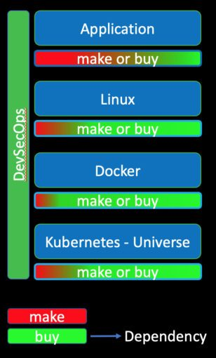
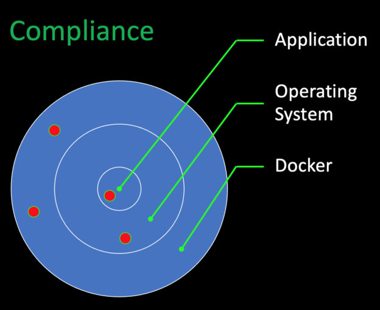
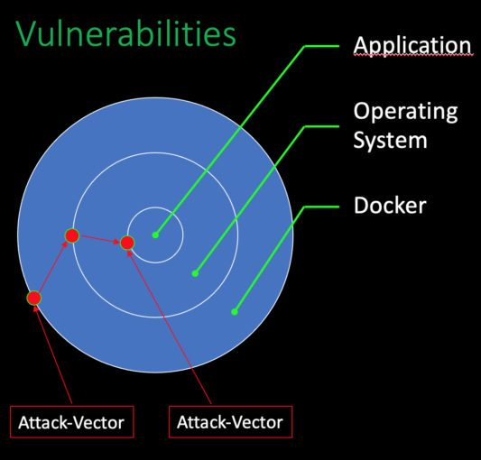
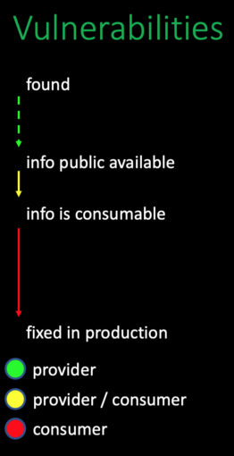
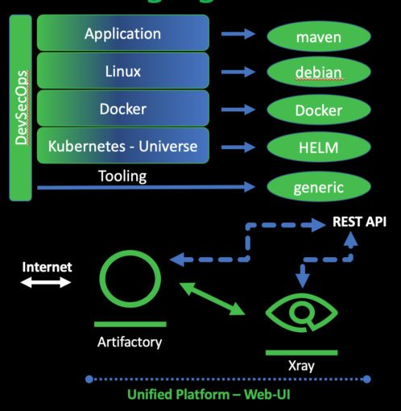

*Hello and welcome to my first DevSecOps article! Here in Germany, it's winter right now, and the forests are quiet. The snow slows down everything and it's a beautiful time to move undisturbed through the woods.* *Here you can pursue your thoughts, and I started thinking about a subject that customers or participants at conferences ask me repeatedly.*

The question I am asked is almost always: "What are the quick wins or low hanging fruits if you want to deal more with the topic of security in software development? And I want you to answer this question right **now!**"
> For the lazy ones, you can see it in a YouTube video as well, the low hanging fruits of DevSecOps:  
>
> 

Let's start with the definition of a phrase that often used in the business world.

### Make Or Buy

Even as a software developer, you will often hear this phrase during meetings with the company's management and sales part. The phrase is called "**Make or Buy**". Typically, we have to decide if we want to do something ourselves or spend money to buy the requested functionality. It could be less or more functionality or different so that we have to adjust ourself to use it in our context.

But as a software developer, we have to deal with the same question every day. I am talking about dependencies. Should we write the source code by ourselves or just adding the next dependencies? Who will be responsible for removing bugs, and what is the total cost of this decision? But first, let's take a look at the make-or-buy association inside the full tech-stack.

#### Differences Between Make / Buy On All Layers

If we are looking at all layers of a cloud-native stack to compare the value of "make" to "buy" we will see that the component "buy" is in all layers the bigger one. But first things first.

The first step is the development of the application itself. Assuming that we are working with Java and using maven as a dependency manager, we are most likely adding more lines of code indirectly as dependency compared to the number of lines we are writing by ourselves. The dependencies are the more prominent part, and third parties develop them. We have to be carefully, and it is good advice to check these external binaries for known vulnerabilities.

We should have the same behaviour regarding compliance and license usage. The next layer will be the operating system, in our case Linux. And again, we are adding some configuration files and the rest are existing binaries. The result is an application running inside the operating system that is a composition of external binaries based on our configuration.

The two following layers, Docker and Kubernetes, are leading us to the same result. Until now, we are not looking at the tool-stack for the production line itself. All programs and utilities that are directly or indirectly used under the hood called DevSecOps are some dependencies.All layers' dependencies are the most significant part by far. Checking these binaries against known Vulnerabilities is the first logical step.

### One Time and Recurring Efforts for Compliance/Vulnerabilities

Comparing the effort of scanning against known Vulnerabilities and for Compliance Issues, we see a few differences.

**Compliance issues:** The first step will be defining what licenses are allowed at what part of the production line. This definition of allowed license includes the dependencies during the coding time and the usage of tools and runtime environments. Defining the non-critical license types should be checked by a specialised lawyer. With this list of white labelled license types, we can start using the machine to scan on a regular base the full tool stack. After the machine found a violation, we have to remove this element, and it must be replaced by another that is licensed under a white-labelled one.

**Vulnerabilities:** The recurrent effort on this site is low compared to the amount of work that vulnerabilities are producing. A slightly different workflow is needed for the handling of found vulnerabilities. Without more significant preparations, the machine can do the work on a regular base as well. The identification of a vulnerability will trigger the workflow that includes human interaction. The vulnerability must be classified internally that leads to the decisions what the following action will be.

#### Compliance Issues: Just Singular Points in the Stack

There is one other difference between Compliance Issues and Vulnerabilities. If there is a compliance issue, it is a singular point inside the overall environment. Just this single part is a defect and is not influencing other elements of the environment.

#### Vulnerabilities: Combining in Different Attack Vectors

Vulnerabilities are a bit different. They do not only exist at the point where they are located. Additionally, they can be combined with other existing vulnerabilities in any additional layer of the environment. Vulnerabilities can be combined into different attack vectors. Every possible attack vector itself must be seen and evaluated. A set of minor vulnerabilities in different layers of the application can be combined into a highly critical risk.

#### Vulnerabilities: Timeline from Found to Active in Production

Next is the timeline from when the vulnerability is found until the fix is in production. After a vulnerability exists in a binary, we have nearly no control over the time until it is found. It depends on the person if the vulnerability is reported to the creator of the binary, a commercial security service, a government or it will be sold on a darknet marketplace. But, assuming that the information is reported to the binary creator, it will take some time until the data is publicly available. We have no control over the duration from finding the vulnerability to the time that the information is publicly available. The next period is based on the commercial aspect of this issue.
> As a consumer, we can only get the information as soon as possible is spending money. This state of affairs is not nice, but mostly the truth.

Nevertheless, at some point, the information is consumable for us. If you are using **JFrog Xray** , from the free tier, for example, you will get the information very fast. **JFrog** is consuming different security information resources and merging all information into a single vulnerability database. After this database is fed with new information, all **JFrog Xray** instances are updated. After this stage is reached, you can act.

### Test Coverage Safety Belt: Mutation Testing

Until now, the only thing you can do to speed up the information flow is spending money for professional security information aggregator. But as soon as the information is consumable for you, the timer runs. It depends on your environment how fast this security fix will be up and running in production. To minimise the amount of time a full automated CI Pipeline ist one of the critical factors.

But even more critical is excellent and robust test coverage. Good test coverage will allow you, to switch dependency versions immediately and push this change after a green test run into production. I recommend using a more substantial test coverage as pure line-coverages. The technique called "mutation test coverage" is a powerful one.
> If you want to know more about Mutation Test Coverage, check out my YouTube channel. I have a video that explains the theoretical part and the practical one for Java and Kotlin.  
>
> 

The need for a single point that understands all repo-types  

To get a picture of the full impact graph based on all known vulnerabilities, it is crucial to understand all package managers included by the dependencies. Focussing on just one layer in the tech-stack is by far not enough.

JFrog Artifactory provides information, including the vendor-specific metadata that is part of the package managers. JFrog Xray can consume all this knowledge and can scan all binaries that are hosted inside the repositories that are managed by Artifactory.

### Vulnerabilities: IDE Plugin

Shift Left means that Vulnerabilities must be eliminated as early as possible inside the production pipeline. One early-stage after the concept phase is the coding itself. At the moment you start adding dependencies to your project you are possibly adding Vulnerabilities as well.

The fastest way to get feedback regarding your dependencies is the **JFrog IDE Plugin**. This plugin will connect your IDE to your JFrog Xray Instance. The free tier will give you access to Vulnerability scanning. The Plugin is OpenSource and available for IntelliJ, VS-Code, Eclipse,... If you need some additional features, make a feature request on GitHub or fork the Repository add your changes and make a merge request.
> Try it out by yourself: [JFrog Free Tier](https://jfrog.com/artifactory/start-free/)

## Using the IDE Plugin

If you add a dependency to your project, the IDE Plugin can understand this information based on the used package manager. The IDE Plugin is connected to your JFrog Xray instance and will be queried if there is a change inside your project's dependency definition. The information provided by Xray includes the known vulnerabilities of the added dependency. If there is a fixed version of the dependency available, the new version number will be shown.
> If you want to see the IDE Plugin in Action without registering for a Free Tier, have a look at my youtube video:  
>
> 

### Conclusion

With the JFrog Free Tier, you have the tools in your hands to practice Shift Left and pushing it into your IDE. Create repositories for all included technologies, use Artifactory as a proxy for your binaries and let Xray scan the full stack.

With this, you have a complete impact graph based on your full-stack and the pieces of information about known Vulnerabilities as early as possible inside your production line. You don't have to wait until your CI Pipeline starts complaining. This will save a lot of your time.

### Next Steps

If you liked this blog post, I would appreciate to have you as a new subscriber on Youtube. I have two channels, one in [English](https://www.youtube.com/channel/UCNkQKejDX-pQM9-lKZRpEwA) and one in [German](https://www.youtube.com/user/svenruppert). On my channel, you will find videos about the topics Core Java, Kotlin and DevSecOps. Please give me a thumbs up and see you on my channel.
