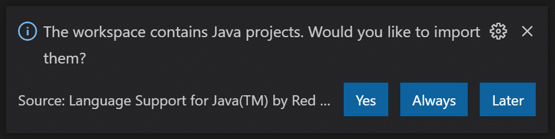
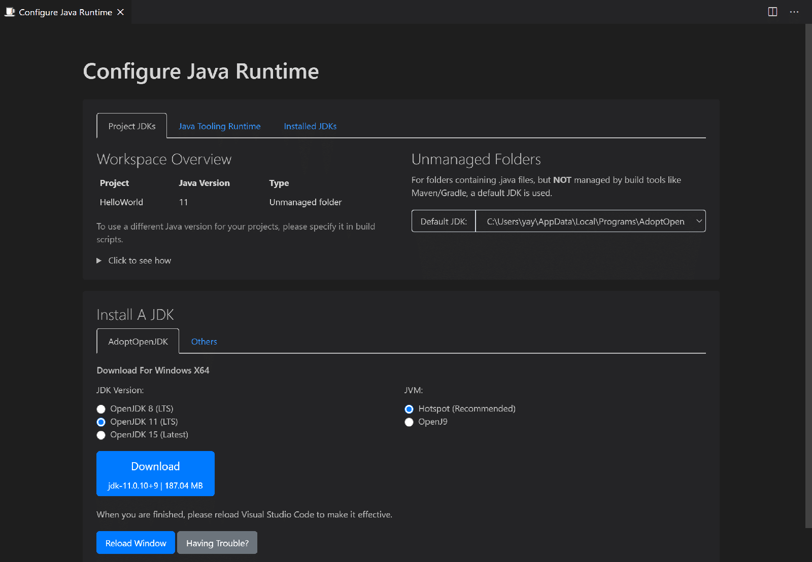
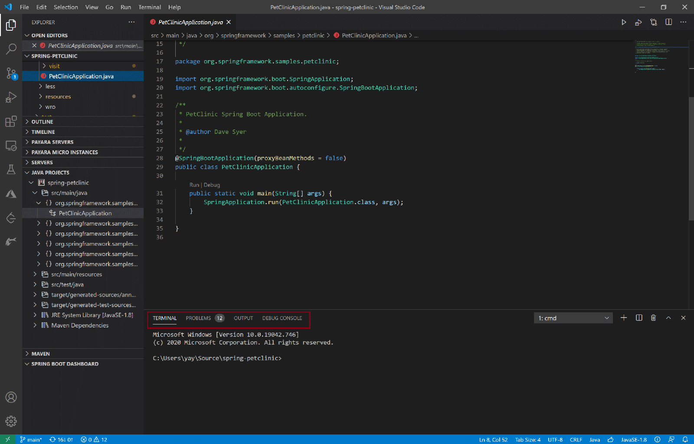
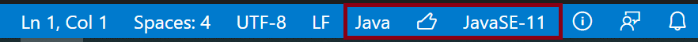

VS Code, a.k.a. Visual Studio Code, is a modern editor available for Windows, macOS and Linux. It supports many languages and runtimes including Java. Besides editing features like IntelliSense, Code Action, etc., developers and students also like its lightweight, modern UI, extensibility, and the comprehensive support of remote development. Also, it's free. You can refer to [VS Code Overview](https://code.visualstudio.com/docs "VS Code Overview") for more details.

On Java, thanks to the investments communities and Microsoft have been constantly making, VS Code has been used by more and more Java developers to edit, build, run, debug, test and deploy their code and manage their projects, and by more and more students and educators to learn and teach Java language.

In this article, I will walk you through how to get started for Java on VS Code.

### Installation

On VS Code, although you can read and write your code without installing extension, to take advantage of Java specific features, you need install some extensions. There are three options for installation:

* If you are new to VS Code on either Windows or macOS, we recommend installing the **Coding Pack for Java** , which is the bundle of VS Code, the Java Development Kit (JDK), and a collection of suggested extensions by Microsoft. The pack takes care of JDK configuration for you. After installing it, editing with IntelliSense, run, debugging, testing, Maven, and project management are supported out of box.
  * [Installing the Coding Pack for Java -- Windows](https://aka.ms/vscode-java-installer-win "Installing the Coding Pack for Java – Windows")
  * [Installing the Coding Pack for Java - macOS](https://aka.ms/vscode-java-installer-mac "Installing the Coding Pack for Java - macOS")

  **Note:** for Linux users, we recommend installing VS Code firstly and then following the 2nd option.
* If you are an existing VS Code user and want to add support for Java, we recommend installing the **Java Extension Pack** , a collection of suggested extensions by Microsoft. You can get [the pack](https://marketplace.visualstudio.com/items?itemName=vscjava.vscode-java-pack "the pack") from VS Code Marketplace, or when you first-time open a .java file on VS Code, you will be promoted to install.
* Alternatively, you can install extensions with your own choice from [VS Code Marketplace](https://marketplace.visualstudio.com/VSCode "VS Code Marketplace").

### Starting a Project

Regardless of a new project or an existing project, it's easy to get started with VS Code.

* To create a new project, launch the Command Palette by using **Ctrl+Shift+P** on Windows or Linux or **⌘+Shift+P** on macOS, type "**create java project**" to execute creation command, and then follow the command's steps.
* To open an existing project, open project root folder via menu item **File \> Open Folder** on Windows or **Code \> Open Folder** on macOS. For project using build tool such as Maven or Gradle, you will be prompted to import dependencies by a pop-up message as below. Just accept it and wait till importing completes.

One thing a new user may find a bit tricky in the beginning is JDK configuration. On VS Code, there are two related settings, **JDK used by your project** and **JDK used by VS Code** for Java language support. While we support JDK version 1.5 or above for the former setting, we require JDK version 11 or above for the latter setting. To help you easily get the settings right, we offer a Java Runtime Configuration wizard. You can open the wizard by launching the Command Palette using **Ctrl+Shift+P** on Windows or Linux or **⌘+Shift+P** on macOS, and then type "**configure java runtime**". Yes, you have used Command Palette again. Remember, it's a tool that can give you access to all the functionality of VS Code.

### Run and Debugging

Once your project is opened and imported, VS Code is smart enough to detect the main() method. What you have to do is only to decide whether clicking **Ctrl+F5** for running without debugging or **F5** for starting debugging.

We would recommend you playing with [PetClinic](https://github.com/spring-projects/spring-petclinic "PetClinic") application, one of our favorite reference applications, built in Spring Boot in a reasonable size. You will feel the power of VS Code, which is beyond a traditional editor.

### Tips

As an introduction, we won't go too deep on listing what VS Code can do for you. In fact, it is impossible to do so, as communities and Microsoft are building more and more on top of it. However, before closing this writing, I would like to share some tips that are worth to know before dive in.

#### Open File vs. Open Folder vs. Open Workspace

* Using Open Folder if your project contains single-root folder.
* Using Open Workspace if your project contains multi-root folders.
* Using Open File if you only want to do a quick file reading or editing.

#### Creating a new file

VS Code supports many languages, so it relies on file extension to determine what features serve you best. When create a new file, we recommend you firstly save empty file with file extension and then work on the file. In Java world, the file extension is '.java'.

#### Monitoring application launch status

Both Terminal and Debug Console can be used to monitor application launch status. They are in the bottom of VS Code window. By default, status is printed in Terminal. You can change to use Debug Console via setting option "**java.debug.settings.console**".

#### Status bar

On the bottom of your VS Code window, there is a blue bar called status bar. It's a place to know the status of your project environment. For beginner, I found three icons on the right side of the bar are very useful.

* Java: indicate currently activated file in editor window is a Java file.
* Thumb up: your project has been imported; if you see a rocket icon here, it means your project is pending for importing.
* JavaSE-11: indicate your project's language level.

#### Setting and Command Palette

All VS Code settings are accessible via **menu item File \> Preference \> Settings** on Windows or **Code \> Preference \> Settings** on macOS; all VS Code commands are accessible via Command Palette. Both settings and Command Palette offer powerful search and auto completion capabilities. Once you get used to them, you will love this VS Code unique experience of making setting changes and launching commands.

#### Online resources

VS Code offers rich sets of documents to help you. You can find them from [here](https://code.visualstudio.com/docs "here"). For extensions, you can explore from [VS Code Marketplace](https://marketplace.visualstudio.com/VSCode "VS Code Marketplace").

**Happy Coding!**
