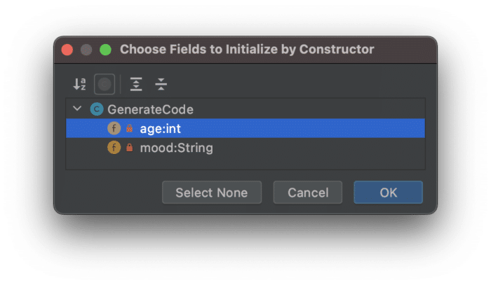
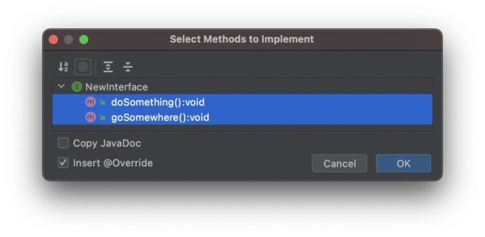

One of the super cool things about IntelliJ IDEA is how much code you can generate with minimum effort. Yes, it's not the 1990s anymore, we're no longer measured on how many lines of code we generate (thankfully), but you also know that Java has its fair share of *boilerplate* code.

Well, there's a [shortcut in IntelliJ IDEA](https://www.jetbrains.com/help/idea/generating-code.html "shortcut in IntelliJ IDEA") that generates a lot of code for you:

* `⌘N` on macOS
* `Alt+Insert` on Windows and Linux

These shortcuts load the **Generate** menu. Here's a quick tour of where you can use it in Java projects in IntelliJ IDEA. It's not a complete list; let me know where else we can use it please!

New Java Class
--------------

In the [Project Window](https://www.jetbrains.com/help/idea/project-tool-window.html "Project Window"), you can use this shortcut to create a whole host of things which are project and folder specific. If you use the shortcut on your directory that is [marked as your sources root](https://www.jetbrains.com/help/idea/content-roots.html#folder-categories "marked as your sources root") (usually src) in a Java project you get the option to create a new Java file (among other things). You're then asked to select between a Class, Interface, Record (Preview), Enum or Annotation. It's a speedy way of creating new classes for your project.

Before we move on, a closely related shortcut is the one we use for a new Scratch File. It's **⌘⇧N** on macOS, or **Ctrl+Shift+Alt+Ins** on Windows/Linux. You can select to create a new Scratch file using **⌘N** on macOS, or **Alt+Ins** on Windows and Linux in the Project Tool window, but it's worth committing the scratch file shortcut to memory too as it's handy to be able to dump some code or notes in an area outside your project and share it across IntelliJ IDEA projects.

### Constructors

Now that you've got your class, you may want to generate a constructor or two. However, before we do that, let's add a couple of variables to our class:

```java
public class GenerateCode {
   private final String name = "Helen";
   private int age;
   private String mood;
}
```


We can use the same shortcut to make ourselves a constructor. We get some options here because we've got some fields in our class:  
  

IntelliJ IDEA is asking us if we want to pass our fields into our Constructor. If we select both and click **OK** we have our Constructor with the parameters passed in.

```java
public class GenerateCode {
   private final String name = "Helen";
   private int age;
   private String mood;

   public GenerateCode(int age, String mood) {
       this.age = age;
       this.mood = mood;
   }
}
```


Other Class-Based Generate Options
----------------------------------

We don't need to stop there either. There's a whole host of code that IntelliJ IDEA can generate for us at this stage including:

* Getter
* Setter
* Getter and Setter
* equals() and hashCode()
* toString()
* Override Methods
* Delegate Methods
* Test

While we're here, [Java Records](https://openjdk.java.net/jeps/359 "Java Records") are coming and IntelliJ IDEA is ready. Another way you could generate code if you're not ready to move to Java Records is to use the Generate shortcut to create a new Java record, and then you can convert the Java record to a normal Java class with **⌥⏎** on macOS, or **Alt+Enter** on Windows and Linux with your caret on the class name.

Implement Methods
-----------------

When our Java class implements an interface, we need to ensure that we implement that interface's methods. The Generate menu helps us here too. Let's say that our code looks like this, and we're implementing `NewInterface`:

```java
public class GenerateCode implements NewInterface {
   private final String name = "Helen";
   private int age;
   private String mood;
}
```


When we use **⌘N** on macOS, or **Alt+Insert** on Windows and Linux this time, we see select a new option call Implement Methods:  


The keyboard shortcut is **⌃I** on macOS, or **Ctrl+I** on Windows/Linux. This allows you to generate the code required to implement the methods in the Java interface that we're implementing with the `@Override` annotation.

Now IntelliJ IDEA has generated that code for us:

```java
public class GenerateCode implements NewInterface {
   private final String name = "Helen";
   private int age;
   private String mood;

   @Override
   public void doSomething() {
   }

   @Override
   public void goSomewhere() {
   }
}
```


This also works for overriding methods from superclasses/super abstract classes.

Add Parameters / Arguments
--------------------------

Another useful trick you so is to use **⌘N** on macOS, or **Alt+Insert** on Windows and Linux when you're in a dialogue, and you need to add more rows or data. For example, we added a default constructor to our class, but we now want to refactor it to change the signature. Our code currently reflects the default constructor:

```java
public class GenerateCode{
   private final String name = "Helen";
   private int age;
   private String mood;

   public GenerateCode() {
   }
}
```


Let's refactor the Constructor with **⌘F6** on macOS, or **Ctrl+F6** on Windows/Linux. In the Change Signature dialogue, you can use **⌘N** on macOS, or **Alt+Insert** on Windows/Linux to add a new parameter. This saves you using your mouse to click the little **+** icon.

This trick works in all the dialogue boxes that require additional lines to be added that I've found so far.

Generate Test Methods
---------------------

Finally, everyone loves a good test and rightly so. We've already mentioned that you can use the **Generate** menu from a Java method to generate a corresponding test class. However, once you're in the test class, you can use **⌘N** on macOS, or **Alt+Insert** on Windows and Linux again to create much of the boilerplate code you might need, including (for JUnit5 at least):

* Test Method
* SetUp Method
* TearDown Method
* BeforeClass Method
* AfterClass Method

If you are working with a different testing framework, your **Generate** menu will give you other relevant options.

Summary
-------

Java may be a little clunky on the boilerplate side of things, but IntelliJ IDEA takes the heavy lifting out of that to a large extent so along with the shorcut for [intention actions](https://www.jetbrains.com/help/idea/intention-actions.html#apply-intention-actions "intention actions"), it's a compelling combination.
