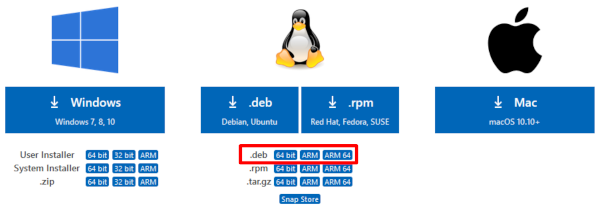
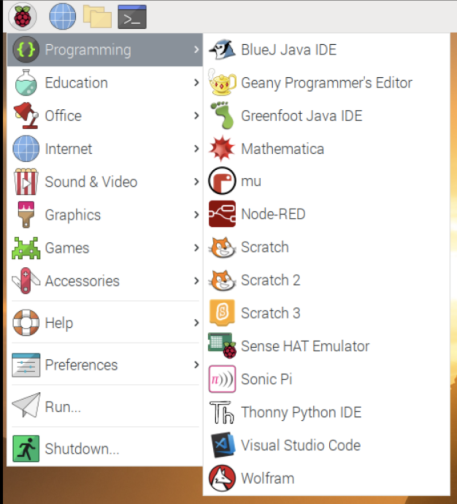
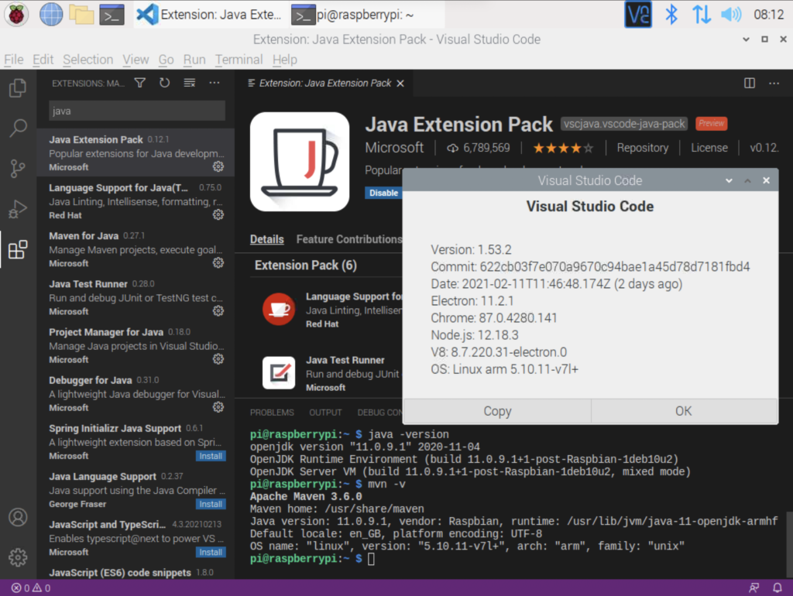
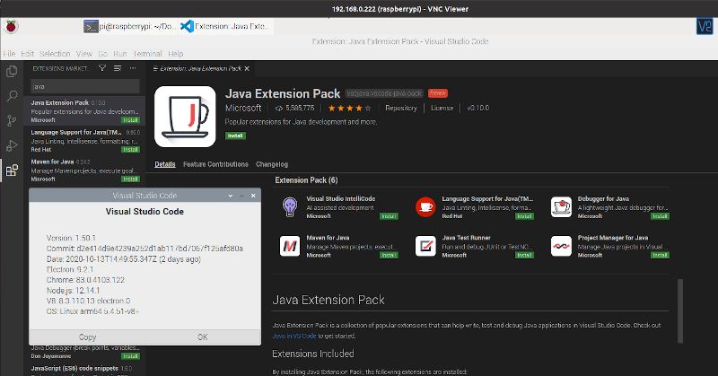
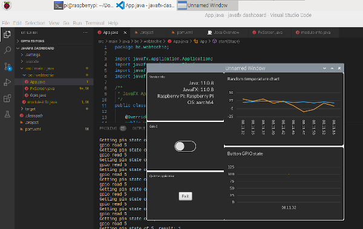

In the post ["Welcome to VS Code for Java"](https://foojay.io/today/welcome-to-vs-code-for-java/) you can find a full description and a list of tips and plugins for Java development with Visual Studio Code.

But... did you know you can also use it on the ARM-processor-powered Raspberry Pi? Until recently this was not available in an official version for the Raspberry Pi, but luckily Microsoft decided to release **new versions with installers for both 32-bit and 64-bit Raspberry Pis** .   

Let's install and test them!

On your Raspberry Pi open a browser and go to the [Visual Studio Code download page](https://code.visualstudio.com/Download). We will be using the Linux .deb-files.
 Visual Studio Code dowload page with ARM 32bit and 64bit version

### Raspberry Pi OS 32-bit

If you are using a "default" Raspberry Pi OS - which is an 32-bit version - you need to download the "ARM" file. Once downloaded, start a terminal and run the installation with:

```
$ cd /home/pi/Downloads
$ sudo apt install ./code_1.50.1-1602600660_armhf.deb
```


And there is even an easier way, as Visual Studio Code is now available as a Raspberry Pi OS apt package (**which is very controversial, see below**)! Use the following commands:

```
sudo apt update 
sudo apt install code -y
```


You can now start VSC from the start button and you will find it in the "Programming" list.

<figure class="wp-block-gallery columns-2 is-cropped wp-block-gallery-1 is-layout-flex wp-block-gallery-is-layout-flex">
 <ul class="blocks-gallery-grid">
  <li class="blocks-gallery-item">
   <figure>
    
   </figure></li>
  <li class="blocks-gallery-item">
   <figure>
    
   </figure></li>
 </ul>
</figure>

There it is, version 1.53.2 on a Linux ARM processor, in the screenshot with Maven and the Java Extension Pack installed!

### Raspberry Pi OS 64-bit

If you are already using the newer work-in-progress 64-bit Raspberry Pi OS (see more info in my post ["64-bit Raspbian OS on Raspberry Pi 4 with USB BOOT"](https://foojay.io/today/64-bit-raspbian-os-on-raspberry-pi-4-with-usb-boot/), you will need another version.

Select the "ARM 64" version from the download page. The installation command is the same as before, but with a slightly different filename.

```
$ cd /home/pi/Downloads
$ sudo apt install ./code_1.50.1-1602600638_arm64.deb
```


Also here you'll now find Visual Studio Code in the Programming list in the start menu. Let's also here add the "Java Extension Pack" (or one from the others mentioned in [the previous post](https://foojay.io/today/welcome-to-vs-code-for-java/)), so we can test a Java application.
 Visual Studio Code running on Raspberry Pi OS (64bit)

Maven and BellSoft JDK with JavaFX are already installed on my board:

```
$ mvn -version
Apache Maven 3.6.0
Maven home: /usr/share/maven
Java version: 11.0.8, vendor: BellSoft, runtime: /home/pi/.sdkman/candidates/java/11.0.8.fx-librca
Default locale: en_GB, platform encoding: UTF-8
OS name: "linux", version: "5.4.51-v8+", arch: "aarch64", family: "unix"

$ java -version
openjdk version "11.0.8" 2020-07-14 LTS
OpenJDK Runtime Environment (build 11.0.8+10-LTS)
OpenJDK 64-Bit Server VM (build 11.0.8+10-LTS, mixed mode)
```


Without any further installation, we can now try out [this demo application which you can get from GitHub](https://github.com/FDelporte/JavaOnRaspberryPi/tree/master/Chapter_07_JavaFX/javafx-dashboard).
 JavaFX demo application started by Visual Studio Code on the Raspberry Pi

### Is Microsoft Spying On You?

To allow the installation of Visual Studio Code with `apt install`, the Microsoft repository is included in the Linux Raspberry Pi OS distribution.

Doing this without any notification or discussion with the community caused a lot of controversies over the last few days. This all started with [this blog post on the Raspberry Pi website](https://www.raspberrypi.org/blog/visual-studio-code-comes-to-raspberry-pi/). Not least because Eben Upton, the creator of the Raspberry Pi, seems to [decline all critical questions](https://twitter.com/EbenUpton/status/1357058711873871872).

A very clear overview is given in this video by [Jeff Geerling](https://twitter.com/geerlingguy):



### Conclusion

The Raspberry Pi was already a powerful PC at a low price. Now with Visual Studio Code being released with versions for our beloved board, and all the extensions which are available for this IDE, **we can use the Raspberry Pi as a real developer PC for Java and many other programming languages**!

If you don't like the changes in the Raspberry Pi OS there is a long list of alternatives as listed on "[Awesome Raspberry Pi](https://github.com/thibmaek/awesome-raspberry-pi)". Ubuntu, for example, has a 64bit version of their OS which also works great on the Pi, and you can download and install VSC yourself [as shown in this post](https://webtechie.be/post/2020-10-23-ubuntu-desktop-on-raspberrypi4/).


**Note:** originally written and published on the blog of [Frank Delporte](https://webtechie.be/post/2020-10-15-visual-studio-code-on-raspberry-pi/) but updated for foojay.io with info of the last week regarding the changes in Raspberry Pi OS.
