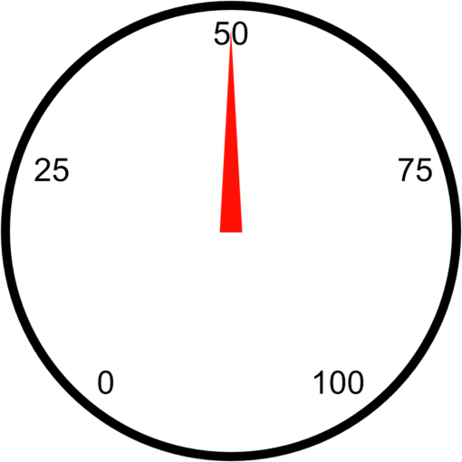
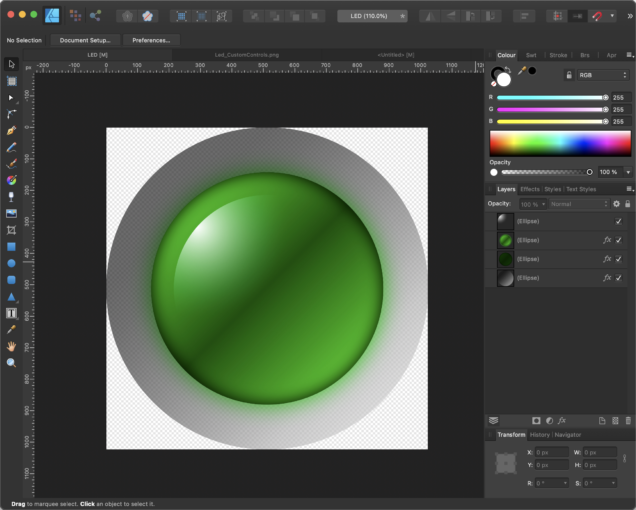
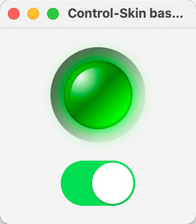
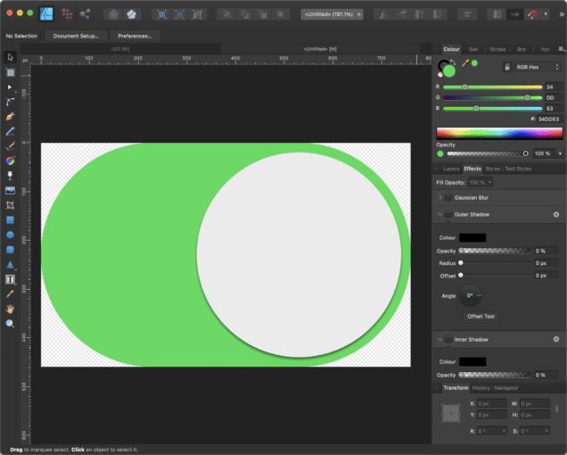
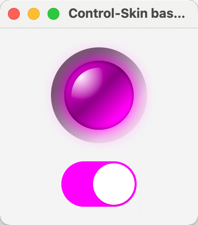

I hope you found some time to play around with the custom controls that I showed you in [the previous part of this series](https://foojay.io/today/custom-controls-in-javafx-part-iii/).

This time, I will show you how to create a custom control in JavaFX by using Control and Skin classes.
> *A custom control created by a Control and Skin class only makes sense if you will provide more than one Skin for your control or if you would like to give people the ability to create their own Skins for your Control.*
> *In any other case, you should choose another approach (e.g., use a Region or Canvas based control).*
>
> *So, usually, the Control and Skin approach is used in UI libraries where you have one Control with multiple Skins.*

In JavaFX you will find a Control class that extends Region and implements Skinnable. And this implementation of Skinnable makes it possible to create a Skin that will define the UI of your control.

So the Control will contain all the logic and the Skin will contain all the UI related code. One thing to keep in mind is, the more Skins you will provide the more properties your Control will get. The Control should contain all properties that will be used in the different Skins.

I always use my favourite control to explain the creation of custom controls... the LED control. This thing is simple, contains some graphics code, and is also usable.

Before we start looking into the code let me tell you one thing... if you are really interested in creating custom controls you should definitely take a look at vector drawing programs first... just say'n.

I worked more than 10 years in a company doing research and development in the Nanotechnology and Semiconductor area. It was one of the best times in my career being surrounded by so many super-smart people and we really created top-notch stuff. Well there also was a drawback... our software looked terrible to normal user eyes. That usually happens when the developers are scientists... they simply love to be able to adjust every variable on the UI which often leads to terrible user interfaces. To come back to custom controls, let me give you a short example of what I'm talking about.

One day one of our product managers went to one of our developers and told him that we need a gauge in our software that should visualize a numeric value and handed the developer a simple sketch. Well the developer just took the sketch and transformed it into a control which looked close to this:



Awesome isn't it...

Well that's what I usually call "design by keyboard". The developer saw the sketch and started coding. I often saw developers in a coding-loop where they changed a little thing, compiled the code, ran it, checked the result and made another change.

My advice...use a vector drawing program, in this case this is like visual coding. You simply draw the control the way it should look like and once you are ready you transfer the drawing into code. By using a vector drawing program you directly get the numbers, colors and gradients you need.

After that little advice let's go back to our LED control, here is a drawing that shows the LED in it's final state:



In principle the whole LED is just made from three circles, filled with different gradients. Here is a little drawing that hopefully explains it better:


The first circle is filled with a semitransparent gradient from a darker gray to a lighter gray and defines the frame or background of the LED. The second circle is filled with a gradient from green to dark green and back to green and defines the main LED which will also change it's color dependent on the status (on/off). The third circle is just for the light effect and is filled with a radial gradient from white to transparent. That's all we need to draw to get a nice looking green LED.

A LED is an indicator that has two states, on and off where the off state is the one that you see in the last image and the on state is the one that is in the drawing programm screenshot.

So after we have drawn the LED in our vector drawing program, we can now start creating a Control class.

We need two properties for our control, the first one should define the state of the LED and the second one the color of the LED.

As you know we have the ability of using CSS to style controls in JavaFX, the question is how can we link the CSS property to the property that we define in code?

The answer is by using so called StyleableProperties. This properties have a link to a CSS property which means if we load a CSS file that overwrites e.g. a -color property it will trigger a property that we have defined in our code. This is great because with this we can either change the property by calling the setColor() method in our code or by loading a CSS file that overwrites the -color property.

Defining a styleable property in JavaFX needed a lot of code in the first versions but got better over time. In our LED control we need a StyleableProperty and here is the code to realize that:

```java
private static final StyleablePropertyFactory<CustomControl> FACTORY = 
   new StyleablePropertyFactory<>(Control.getClassCssMetaData()); 

// CSS Styleable property 
private static final CssMetaData<CustomControl, Color> COLOR = 
   FACTORY.createColorCssMetaData("-color", s -> s.color, Color.RED, false); 
private final StyleableProperty<Color> color = 
   new SimpleStyleableObjectProperty<>(COLOR, this, "color");
```


As you can see, we defined a CssMetaData object called COLOR which defines the property that will be used in CSS.

This CssMetaData object will be passed into the constructor of the SimpleStyleableObjectProperty and with this the link is established.

Now we need to define this CSS property in our CSS file for our control wich would look like this:

```css
.custom-control {
    -color: red;
}
```


That was the color and now we need a BooleanProperty for the state of the control. For this we can also make use of a CSS feature in JavaFX, the CSS PseudoClass. This can be seen as a boolean switch that if triggered in CSS can be used to define a separate style for the true/false state.

In our case the code for our state property will look like follows:

```java
// CSS pseudo classes
    private static final PseudoClass ON_PSEUDO_CLASS = PseudoClass.getPseudoClass("on");
    private BooleanProperty state = new BooleanPropertyBase(false) {
            @Override protected void invalidated() { pseudoClassStateChanged(ON_PSEUDO_CLASS, get()); }
            @Override public Object getBean() { return this; }
            @Override public String getName() { return "state"; }
        };
```


The PseudoClass ON_PSEUDO_CLASS defines the link to the CSS pseudo class "on" and to make use of it we trigger it in the invalidated() method of our state property by calling pseudoClassStateChanged(ON_PSEUDO_CLASS.get()).

To make this work we will also need the on pseudo class in our CSS file. Remember that the main LED part (the green one) is the one that should change from a dark green gradient to a light green gradient in case the LED is on. So here is the CSS code that's needed to achieve this effect:

```css
.custom-control .main {
    -fx-background-color : linear-gradient(from 15% 15% to 83% 83%,
                                      derive(-color, -80%) 0%,
                                      derive(-color, -87%) 49%,
                                      derive(-color, -80%) 100%);
    -fx-background-radius: 1024px;
}
.custom-control:on .main {
    -fx-background-color: linear-gradient(from 15% 15% to 83% 83%,
                                     derive(-color, -23%) 0%,
                                     derive(-color, -50%) 49%,
                                    -color 100%);
}
```


So in case we trigger the :on pseudo class we only change the gradient from a darker to a brighter version and thats it.

Because this time we create a custom control using a Control and Skins I would like another Skin besides the LED. The LED has the states on and off which are the same that are used to define a switch control. So why not creating another Skin for our Control that simply looks like a switch?

But first let me show you the final result to keep you going...



The fun thing here is that we will use the Switch to toggle the LED 🙂

Now let's take a look at our Control code:

```java
public class CustomControl extends Control {
    public enum SkinType { LED, SWITCH }

    private static final StyleablePropertyFactory<CustomControl> FACTORY = new StyleablePropertyFactory<>(Control.getClassCssMetaData());

    // CSS pseudo classes
    private static final PseudoClass ON_PSEUDO_CLASS = PseudoClass.getPseudoClass("on");
    private BooleanProperty state;

    // CSS Styleable property
    private static final CssMetaData<CustomControl, Color> COLOR = FACTORY.createColorCssMetaData("-color", s -> s.color, Color.RED, false);
    private final StyleableProperty<Color> color;

    private static String defaultUserAgentStyleSheet;
    private static String switchUserAgentStyleSheet;

    // Properties
    private SkinType skinType;

    // ******************** Constructors **************************************
    public CustomControl() {
        this(SkinType.LED);
    }
    public CustomControl(final SkinType skinType) {
        getStyleClass().add("custom-control");
        this.skinType = skinType;
        this.state = new BooleanPropertyBase(false) {
            @Override protected void invalidated() { pseudoClassStateChanged(ON_PSEUDO_CLASS, get()); }
            @Override public Object getBean() { return this; }
            @Override public String getName() { return "state"; }
        };
        this.color    = new SimpleStyleableObjectProperty<>(COLOR, this, "color");
    }

    // ******************** Methods *******************************************
    public boolean getState() { return state.get(); }
    public void setState(final boolean state) { this.state.set(state); }
    public BooleanProperty stateProperty() { return state; }

    // ******************** CSS Styleable Properties **************************
    public Color getColor() { return color.getValue(); }
    public void setColor(final Color color) { this.color.setValue(color); }
    public ObjectProperty<Color> colorProperty() { return (ObjectProperty<Color>) color; }

    // ******************** Style related *************************************
    @Override protected Skin createDefaultSkin() {
        switch(skinType) {
            case SWITCH: return new SwitchSkin(CustomControl.this);
            case LED   :
            default    : return new LedSkin(CustomControl.this);
        }
    }

    @Override public String getUserAgentStylesheet() {
        switch(skinType) {
            case SWITCH:
                if (null == switchUserAgentStyleSheet) { switchUserAgentStyleSheet = CustomControl.class.getResource("switch.css").toExternalForm(); }
                return switchUserAgentStyleSheet;
            case LED   :
            default    :
                if (null == defaultUserAgentStyleSheet) { defaultUserAgentStyleSheet = CustomControl.class.getResource("custom-control.css").toExternalForm(); }
                return defaultUserAgentStyleSheet;
        }
    }

    public static List<CssMetaData<? extends Styleable, ?>> getClassCssMetaData() { return FACTORY.getCssMetaData(); }
    @Override public List<CssMetaData<? extends Styleable, ?>> getControlCssMetaData() { return FACTORY.getCssMetaData(); }
}
```


I don't want to go into detail here because most of it is self explaining. You see that we define an enum SkinType that has LED and SWITCH which will be used in the method getUserAgentStyleSheet(). Dependent on the skinType variable we load a different stylesheet. The default is the LED which is defined in custom-control.css and the switch is defined in switch.css.

Now that we know the Control class let's take a look at the Skin class.

```java
public class LedSkin extends SkinBase<CustomControl> implements Skin<CustomControl> {
    private static final double PREFERRED_WIDTH = 16;
    private static final double PREFERRED_HEIGHT = 16;
    private static final double MINIMUM_WIDTH = 8;
    private static final double MINIMUM_HEIGHT = 8;
    private static final double MAXIMUM_WIDTH = 1024;
    private static final double MAXIMUM_HEIGHT = 1024;
    private double size;
    private Region frame;
    private Region main;
    private Region highlight;
    private InnerShadow innerShadow;
    private DropShadow glow;
    private CustomControl control;
    private InvalidationListener sizeListener;
    private InvalidationListener colorListener;
    private InvalidationListener stateListener;

    // ******************** Constructors **************************************
    public LedSkin(final CustomControl control) {
        super(control);
        this.control  = control;
        sizeListener  = o -> handleControlPropertyChanged("RESIZE");
        colorListener = o -> handleControlPropertyChanged("COLOR");
        stateListener = o -> handleControlPropertyChanged("STATE");
        initGraphics();
        registerListeners();
    }

    // ******************** Initialization ************************************
    private void initGraphics() {
        if (Double.compare(control.getPrefWidth(), 0.0) <= 0 || Double.compare(control.getPrefHeight(), 0.0) <= 0 ||
            Double.compare(control.getWidth(), 0.0) <= 0 || Double.compare(control.getHeight(), 0.0) <= 0) {
            if (control.getPrefWidth() > 0 && control.getPrefHeight() > 0) {
                control.setPrefSize(control.getPrefWidth(), control.getPrefHeight());
            } else {
                control.setPrefSize(PREFERRED_WIDTH, PREFERRED_HEIGHT);
            }
        }

        frame = new Region();
        frame.getStyleClass().setAll("frame");

        main = new Region();
        main.getStyleClass().setAll("main");
        main.setStyle(String.join("", "-color: ", control.getColor().toString().replace("0x", "#"), ";"));

        innerShadow = new InnerShadow(BlurType.TWO_PASS_BOX, Color.rgb(0, 0, 0, 0.65), 8, 0, 0, 0);

        glow = new DropShadow(BlurType.TWO_PASS_BOX, control.getColor(), 20, 0, 0, 0);
        glow.setInput(innerShadow);

        highlight = new Region();
        highlight.getStyleClass().setAll("highlight");

        getChildren().addAll(frame, main, highlight);
    }

    private void registerListeners() {
        control.widthProperty().addListener(sizeListener);
        control.heightProperty().addListener(sizeListener);
        control.colorProperty().addListener(colorListener);
        control.stateProperty().addListener(stateListener);
    }

    // ******************** Methods *******************************************
    @Override protected double computeMinWidth(final double height, final double top, final double right, final double bottom, final double left)  { return MINIMUM_WIDTH; }
    @Override protected double computeMinHeight(final double width, final double top, final double right, final double bottom, final double left)  { return MINIMUM_HEIGHT; }
    @Override protected double computePrefWidth(final double height, final double top, final double right, final double bottom, final double left) { return super.computePrefWidth(height, top, right, bottom, left); }
    @Override protected double computePrefHeight(final double width, final double top, final double right, final double bottom, final double left) { return super.computePrefHeight(width, top, right, bottom, left); }
    @Override protected double computeMaxWidth(final double width, final double top, final double right, final double bottom, final double left)  { return MAXIMUM_WIDTH; }
    @Override protected double computeMaxHeight(final double width, final double top, final double right, final double bottom, final double left)  { return MAXIMUM_HEIGHT; }

    protected void handleControlPropertyChanged(final String property) {
        if ("RESIZE".equals(property)) {
            resize();
        } else if ("COLOR".equals(property)) {
            main.setStyle(String.join("", "-color: ", (control.getColor()).toString().replace("0x", "#"), ";"));
            resize();
        } else if ("STATE".equals(property)) {
            main.setEffect(control.isOn() ? glow : innerShadow);
        }
    }

    @Override public void dispose() {
        control.widthProperty().removeListener(sizeListener);
        control.heightProperty().removeListener(sizeListener);
        control.colorProperty().removeListener(colorListener);
        control.onProperty().removeListener(stateListener);
        control = null;
    }

    // ******************** Layout ********************************************
    @Override public void layoutChildren(final double x, final double y, final double width, final double height) {
        super.layoutChildren(x, y, width, height);
    }

    private void resize() {
        double width  = control.getWidth() - control.getInsets().getLeft() - control.getInsets().getRight();
        double height = control.getHeight() - control.getInsets().getTop() - control.getInsets().getBottom();
        size          = width < height ? width : height;

        if (size > 0) {
            innerShadow.setRadius(0.07 * size);
            glow.setRadius(0.36 * size);
            glow.setColor(control.getColor());

            frame.setMaxSize(size, size);

            main.setMaxSize(0.72 * size, 0.72 * size);
            main.relocate(0.14 * size, 0.14 * size);
            main.setEffect(control.isOn() ? glow : innerShadow);

            highlight.setMaxSize(0.58 * size, 0.58 * size);
            highlight.relocate(0.21 * size, 0.21 * size);
        }
    }
}
```


So, the main idea is to use three Region objects (for each layer of the LED one Region) and style them using CSS. With this approach we only have to take care about sizing and positioning the Regions. All the rest will be done in CSS.

The Skin class has a dispose method which you should use to de-register listeners and clean up to avoid memory leaks when changing the Skin of a Control.
> *Avoid changing the scene graph during runtime if possible.*
>
> *Adding/removing nodes from the scene graph comes with a big overhead so ideally you prepare the scene graph once and then only switch on/off nodes.*
>
> *If you would like to switch off a node completely from rendering, you should not only use setVisible(false) but in addition also setManaged(false) on that node.*

In our LedSkin we defined listeners for our properties so that we can react on changes in state and color.

If you look at the code you will see that I've also added an glow effect (dropshadow) in case the state is on. You could of course also add this effect in CSS but unfortunately you cannot make the effect responding to the current size in CSS. And because I would like to adjust the radius of the dropshadow according to the current size of the LED I set this effect in code.

To make it complete, here comes the CSS file for the LED:

```css
.custom-control {
    -color: red;
}

.custom-control .frame {
    -fx-background-color : linear-gradient(from 14% 14% to 84% 84%,
                                       rgba(20, 20, 20, 0.64706) 0%,
                                       rgba(20, 20, 20, 0.64706) 15%,
                                       rgba(41, 41, 41, 0.64706) 26%,
                                       rgba(200, 200, 200, 0.40631) 85%,
                                       rgba(200, 200, 200, 0.3451) 100%);
    -fx-background-radius: 1024px;
}
.custom-control .main {
    -fx-background-color  : linear-gradient(from 15% 15% to 83% 83%,
                                       derive(-color, -80%) 0%,
                                       derive(-color, -87%) 49%,
                                       derive(-color, -80%) 100%);
    -fx-background-radius: 1024px;
}
.custom-control:on .main {
    -fx-background-color: linear-gradient(from 15% 15% to 83% 83%,
                                     derive(-color, -23%) 0%,
                                     derive(-color, -50%) 49%,
                                    -color 100%);
}
.custom-control .highlight {
    -fx-background-color : radial-gradient(center 15% 15%, radius 50%, white 0%, transparent 100%);
    -fx-background-radius: 1024;
}
```


In the CSS file we really just define the background radius of each Region and the paint which are always gradients here.

So that's it for the LED, now let's take a look at the switch. This Control even only needs two Regions. One for the background and one for the thumb.

Again... first we draw the control which might look similar to this:



To give the thumb a bit more depth we simply add a dropshadow to it. Because this post is already long enough I won't add resizing logic to the SwitchSkin but will simply define a fixed size for it in CSS.

Besides the visual design the biggest difference between the LED and the switch is the fact that you can interact with the switch by clicking on it. Meaning to say we need to add a listener to MouseEvent.MOUSE_PRESSED to the background Region and make the thumb Region mouse transparent. When the mouse event listener is triggered we need to toggle the state and animate the thumb to the other side.

So here is the code of the SwitchSkin:

```java
public class SwitchSkin extends SkinBase<CustomControl> implements Skin<CustomControl> {
    private static final double PREFERRED_WIDTH = 76;
    private static final double PREFERRED_HEIGHT = 46;
    private Region switchBackground;
    private Region thumb;
    private Pane pane;
    private TranslateTransition translate;
    private CustomControl control;
    private InvalidationListener colorListener;
    private InvalidationListener state;
    private EventHandler<MouseEvent> mouseEventHandler;

    // ******************** Constructors **************************************
    public SwitchSkin(final CustomControl control) {
        super(control);
        this.control = control;
        colorListener = o -> handleControlPropertyChanged("COLOR");
        state = o -> handleControlPropertyChanged("STATE");
        mouseEventHandler = e -> this.control.setState(!this.control.getState());
        initGraphics();
        registerListeners();
    }

    // ******************** Initialization ************************************
    private void initGraphics() {
        switchBackground = new Region();
        switchBackground.getStyleClass().add("switch-background");
        switchBackground.setStyle(String.join("", "-color: ", control.getColor().toString().replace("0x", "#"), ";"));

        thumb = new Region();
        thumb.getStyleClass().add("thumb");
        thumb.setMouseTransparent(true);
        if (control.getState()) { thumb.setTranslateX(32); }

        translate = new TranslateTransition(Duration.millis(70), thumb);

        pane = new Pane(switchBackground, thumb);
        getChildren().add(pane);
    }

    private void registerListeners() {
        control.colorProperty().addListener(colorListener);
        control.stateProperty().addListener(state);
        switchBackground.addEventHandler(MouseEvent.MOUSE_PRESSED, mouseEventHandler);
    }

    // ******************** Methods *******************************************
    @Override public void layoutChildren(final double x, final double y, final double width, final double height) {
        super.layoutChildren(x, y, width, height);
        switchBackground.relocate((width - PREFERRED_WIDTH) * 0.5, (height - PREFERRED_HEIGHT) * 0.5);
        thumb.relocate((width - PREFERRED_WIDTH) * 0.5, (height - PREFERRED_HEIGHT) * 0.5);
    }

    protected void handleControlPropertyChanged(final String property) {
        if ("COLOR".equals(property)) {
            switchBackground.setStyle(String.join("", "-color: ", control.getColor().toString().replace("0x", "#"), ";"));
        } else if ("STATE".equals(property)) {
            if (control.getState()) {
                // move thumb to the right
                translate.setFromX(2);
                translate.setToX(32);
            } else {
                // move thumb to the left
                translate.setFromX(32);
                translate.setToX(2);
            }
            translate.play();
        }
    }

    @Override public void dispose() {
        control.colorProperty().removeListener(colorListener);
        control.stateProperty().removeListener(state);
        switchBackground.removeEventHandler(MouseEvent.MOUSE_PRESSED, mouseEventHandler);
    }
}
```


When reading the code you will find that it has a lot of stuff in common with the LedSkin. Because we don't have a resizing logic here I've simply put the positioning of the Regions in the layoutChildren() method. When looking at other ones controls you might find that they do most of the resize/layout related things in the layoutChildren() method. I usually don't do this because in this case you should also add variables like isDirty and such to avoid to often resizing/relayouting. I found that for most of my controls it is enough to resize/relayout when the size of the control changed. For that reason you will most of the times find a resize() method in my controls.

Now, the only thing that is missing is the switch.css file which looks like this:

```css
.custom-control {
    -color: #4bd865;
}

.custom-control .switch-background {
    -fx-pref-width          : 76;
    -fx-pref-height         : 46;
    -fx-min-width           : 76;
    -fx-min-height          : 46;
    -fx-max-width           : 76;
    -fx-max-height          : 46;
    -fx-background-radius: 1024;
    -fx-background-color  : #a3a4a6;
}
.custom-control:on .switch-background {
    -fx-background-radius: 1024;
    -fx-background-color : -color;
}
.custom-control .thumb {
    -fx-translate-x          : 2;
    -fx-translate-y          : 2;
    -fx-pref-width           : 42;
    -fx-pref-height          : 42;
    -fx-min-width            : 42;
    -fx-min-height           : 42;
    -fx-max-width           : 42;
    -fx-max-height          : 42;
    -fx-background-radius: 1024;
    -fx-background-color : white;
    -fx-effect                  : dropshadow(two-pass-box, rgba(0, 0, 0, 0.3), 1, 0.0, 0, 1);
}
```


You can see that I not only restrict the size of the control in CSS but also place the thumb using the -fx-translate-x and -fx-translate-y in it's initial position. CSS in JavaFX is really powerful and one can do a lot of things if you know how to do it 🙂

If you take a look a the code over at [github](https://github.com/HanSolo/JavaFXCustomControls "github") you will see in the DemoControlSkinBased.java a comment as follows:

```java
//scene.getStylesheets().add(DemoControlSkinBased.class.getResource("styles.css").toExternalForm());
```


If you uncomment this line it will load the styles.css which looks like this:

```css
.custom-control {
    -color: magenta;
}
```


And if you then start the demo it will look like this:



This shows the power of CSS, we simply can overwrite one property in our CSS file and the controls will look different without changing one line of code.

Man that was a long post and I hope you get at least an idea on how the whole Control and Skin thing works.

I suggest you get the code from [github](https://github.com/HanSolo/JavaFXCustomControls "github") and play around with the parameters, which is most of the time the best thing to learn new stuff.

That's it for today, there is more to come in Part V, so stay tuned... and keep coding!
