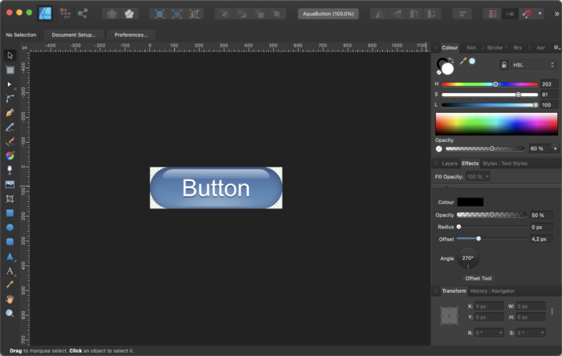
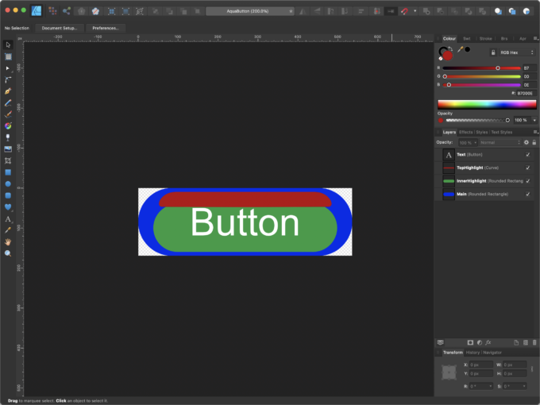
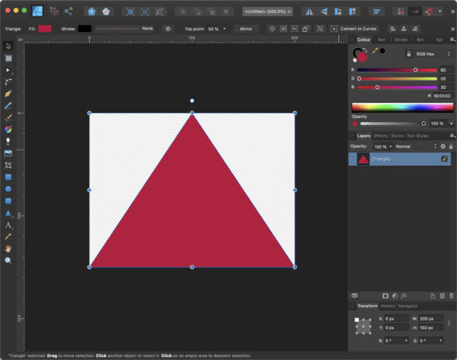
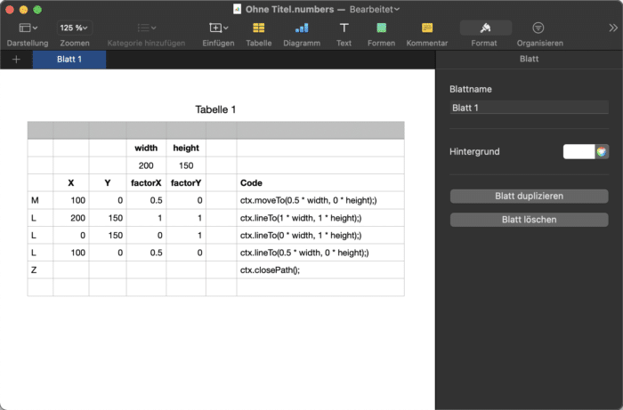
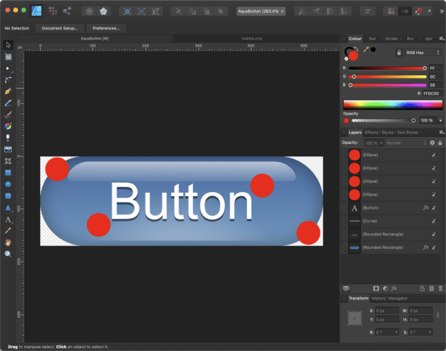
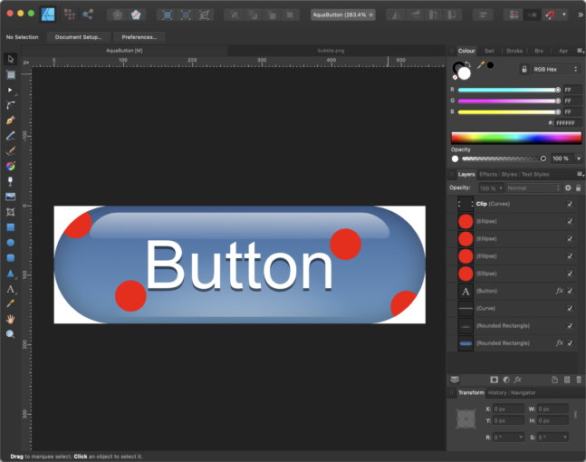
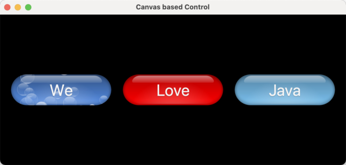

We are slowly coming to the end of [all the different ways](https://foojay.io/today/custom-controls-in-javafx-part-i/) in which one can create a custom control in JavaFX. Today I will show you how to create a custom control that is based on the JavaFX Canvas node.

To understand the Canvas node and why it is good to have it, let me briefly explain how rendering in JavaFX is done.

In JavaFX, the so-called[retained mode rendering](http://https://en.wikipedia.org/wiki/Retained_mode " retained mode rendering") is used. That means that you, as a developer, don't have to take care about when to render which area of the screen when you change something (remember rendering artefacts in Swing?). Instead, JavaFX takes care of the rendering of the scene graph. That makes developing applications a lot less complicated because you do not have to track dirty areas and trigger repaints, etc.

But, as nice as this is, it also takes away the ability for you to do so yourself, which sometimes is bad. The opposite of retained mode rendering is the so-called [immediate mode rendering](http://https://en.wikipedia.org/wiki/Immediate_mode_(computer_graphics) "immediate mode rendering"), where the responsibility of the rendering process is in the hands of the developer. In Swing, where we have immediate mode rendering, we sometimes had the problem of rendering artefacts, which mainly have been caused by not triggering dirty areas correctly. To overcome that problem, in JavaFX retained mode rendering was implemented, which is great for application programming but, for example, not good for game programming. When you would like to develop a game, you need absolute control over rendering and usually you create your own game-loop, in which you control rendering.

This is not possible in JavaFX because the scene graph is updated with max. 60 fps and there is no way to modify this rendering procedure. In addition, we have the problem that the scene graph comes with an overhead compared to immediate mode rendering that has an impact on performance. The more so-called nodes the scene graph has to handle, the more computing power it needs to keep track of all things involved. Even if in the end everything will be drawn by the ultra fast graphics hardware, it would be much faster if the highly optimized graphics hardware could do the job directly.

That leads to the fact that a scene graph with more than 10000 nodes will get slower the more nodes you add. This, of course, heavily depends on things like effects that are being applied, etc.

So, you can imagine that if you create a very complex control with lots of graphical elements, this control can bring down the performance of your app when used a lot. The good news is that in JavaFX there is a solution for such things which is called the Canvas node.

And, yes, it does not only have the same name as the HTML Canvas element, it is more or less the same as the HTML Canvas element. Except things like colors, paints and angle units (JavaFX uses degrees where HTML uses radians) everything else is the same.

That means you can at least draw complex graphics in 1 single node on the scene graph which is still rendered at 60 fps. Because I wanted to know how powerful the JavaFX Canvas node is, I've created a little game which is completely based on it. You can find it over at [github](https://github.com/HanSolo/SpaceFX "github").

But now back to our custom controls topic 🙂

Drawing on the Canvas node will directly go down to the graphics hardware, which makes it really fast. Of course, this also comes with a drawback, because all the things that you draw on the Canvas node are part of that one node. Meaning to say that if you would like to implement something like mouse interaction, you have to implement the whole mouse interaction on your own (tracking the mouse position, calculate if the mouse is inside/outside of objects you draw, keeping track of objects that should interact with the mouse etc.).

So, you should only use the Canvas node for controls if the control is so complex that it would use too many nodes on the scene graph.

The control we are building today does not necessarily make sense but clearly shows what I've tried to explain above. It will be a simple button that should look similar to the aqua style buttons that we saw in older Mac OS X versions. And as always... first we create a graphical prototype in a vector drawing program. Here is my prototype:



The control is made out of several shapes, the main shape is a rounded rectangle, in the center there is another rounded rectangle which will be filled with a radial gradient just for the lighter color in the bottom center. On top you will see the other shape that will give us the reflection. And finally in the center there is the text itself.

Because some of these shapes are hard to identify on the above screenshot I've created a version that shows the shapes withouth effects but only filled with a color and with this it's more clear what I'm talking about:



These are the exact same shapes just without making use of gradients and transparency. The idea is to draw these shapes in a Canvas node and fill them with the appropriate gradients and apply effects like drop shadows, inner shadows etc.

To create a custom control that is based on the Canvas node you could either extend the Canvas node but because this is not styleable by CSS I prefer wrapping the Canvas node in a Region which could then later on also make use of CSS feature like StyleableProperties and CSSPseudoClasses.  

So in principle the Canvas based custom control looks similar to the Region based custom control. The difference is that we only add one Canvas node to it in which all UI related things will happen.

When using Canvas we need to take care about when to do the redraw and what to draw. Also cleaning the canvas is our job. For this you usually have a draw() method where you first clear the canvas and then start drawing all things dependent on the properties of your control.

Because this button alone is kind of boring and does not really explain why using the Canvas node makes sense I've decided to add some eye candy to it.  

The idea is to add some particles that will move around the button when you hover it with the mouse.

For this I've added an inner class to the Canvas control which is the ImageParticle. Because I won't go into particle systems here I suggest you take a look at the code, it's easy to understand. A particle has some properties for it's position, speed an image and the opacity of the image and that's more or less all we need.

The nice thing with particle systems is that they are not hard to understand because each particle follows some simple rules. In this case the particles should simply move from the bottom to the top of the control and if they move out of the control on the top they should be respawned on the bottom.

That means we only have to move the particle with a given speed in x and y and check it's position.

So here is the code for our ImageParticle:

<pre class="EnlighterJSRAW" data-enlighter-language="generic"> class ImageParticle {
    private final Random rnd = new Random();
    private final double velocityFactorX = 1.0;
    private final double velocityFactorY = 1.0;
    private final Image image;
    private double  x;
    private double  y;
    private double  vx;
    private double  vy;
    private double  opacity;
    private double  size;
    private double  width;
    private double  height;
    private boolean active;

    // ******************** Constructor ***********************************
    public ImageParticle(final double width, final double height, final Image image) {
        this.width = width;
        this.height = height;
        this.image = image;
        this.active = true;
        init();
    }

    // ******************** Methods **************************************
    public void init() {
        // Position
        x = rnd.nextDouble() * width;
        y = height + image.getHeight();

        // Random Size
        size = (rnd.nextDouble() * 0.5) + 0.1;

        // Velocity
        vx = ((rnd.nextDouble() * 0.5) - 0.25) * velocityFactorX;
        vy = ((-(rnd.nextDouble() * 2) - 0.5) * size) * velocityFactorY;

        // Opacity
        opacity = (rnd.nextDouble() * 0.6) + 0.4;
    }

    public void adjustToSize(final double width, final double height) {
        this.width = width;
        this.height = height;
        x = rnd.nextDouble() * width;
        y = height + image.getHeight();
    }

    public void update() {
        x += vx;
        y += vy;

        // Respawn particle if needed
        if(y &lt; -image.getHeight()) {
            if (active) { respawn(); }
        }
    }

    public void respawn() {
        x = rnd.nextDouble() * width;
        y = height + image.getHeight();
        opacity = (rnd.nextDouble() * 0.6) + 0.4;
    }
}</pre>

As you can see it's not really complex. The most complex thing we have to do when creating this control is to convert the top hightlight of the button from our vector drawing code to Java code.

Here is a workflow that I use to transfer a path from a drawing program into code. Let's take the following triangle as an example, here is the drawing:



It's just a simple triangle, 200px wide and 150px tall. Now I export this path to an SVG file that looks as follows:

<pre class="EnlighterJSRAW" data-enlighter-language="generic">&lt;?xml version="1.0" encoding="UTF-8" standalone="no"?&gt;
&lt;!DOCTYPE svg PUBLIC "-//W3C//DTD SVG 1.1//EN" "http://www.w3.org/Graphics/SVG/1.1/DTD/svg11.dtd"&gt;
&lt;svg width="100%" height="100%" viewBox="0 0 200 150" version="1.1" xmlns="http://www.w3.org/2000/svg" xmlns:xlink="http://www.w3.org/1999/xlink" xml:space="preserve" xmlns:serif="http://www.serif.com/" style="fill-rule:evenodd;clip-rule:evenodd;stroke-linejoin:round;stroke-miterlimit:2;"&gt;
    &lt;path d="M100,0L200,150L0,150L100,0Z" style="fill:#bd003d;"/&gt;
&lt;/svg&gt;</pre>

The shape is defined in the element. Now I cope the string into a spreadsheet program like Excel or Numbers where I split the path string by comma and put each command in a separate line.  

Here is a screenshot of such a spreadsheet:



Because we would like to have the path scalable we need to get the factors for width and height for each point of the shape. So in the column factorX and factorY I simply divide the X and Y coordinates by the width and the height (e.g. 100 / 200 = 0.5).  

As soon as you have these factors you can use a concatenate method to create a string that will give you the code that you see in the "Code" column.

The thing that you need to know to be able to create such a spreadsheet is the different path elements in SVG and their corresponding JavaFX Canvas node commands. So here is a little list of the things you will use most often:

* M =\> GraphicsContext.moveTo
* L =\> GraphicsContext.lineTo
* C =\> GraphicsContext.bezierCurveTo
* Q =\> GraphicsContext.quadraticCurveTo
* Z =\> GraphicsContext.closePath

So it makes sense to read more about the SVG standard and it's Path element [here](https://svgwg.org/specs/paths/#PathData "here").

So after the conversion is done our code for the triangle will look like follows:

<pre class="EnlighterJSRAW" data-enlighter-language="java">Canvas canvas = new Canvas(200, 150);
GraphicsContext ctx = canvas.getGrapicsContext2D();
...
ctx.clearRect(0, 0, width, height);
ctx.beginPath();
ctx.moveTo(0.5 * width, 0 * height);)
ctx.lineTo(1 * width, 1 * height);)
ctx.lineTo(0 * width, 1 * height);)
ctx.lineTo(0.5 * width, 0 * height);)
ctx.closePath();
ctx.setFill(Color.web("#BD003D"));
ctx.fill();</pre>

So with this code you can now draw our triangle dependent on the width and the height. Keep in mind that we did not take care about the aspect ratio here.

Using this procedure to convert the top hightlight of our button will give us the following code:

<pre class="EnlighterJSRAW" data-enlighter-language="java">ctx.beginPath();
         ctx.moveTo(width * 0.825886194029851, height * 0.0588235294117647);
         ctx.bezierCurveTo(width * 0.892958955223881, height * 0.0585176470588235, width * 0.92440671641791, height * 0.277141176470588, width * 0.887195895522388, height * 0.278105882352941);
         ctx.bezierCurveTo(width * 0.886925373134328, height * 0.278117647058824, width * 0.887389925373134, height * 0.276729411764706, width * 0.500067164179104, height * 0.282352941176471);
         ctx.bezierCurveTo(width * 0.500009328358209, height * 0.282352941176471, width * 0.113149253731343, height * 0.278117647058824, width * 0.112880597014925, height * 0.278105882352941);
         ctx.bezierCurveTo(width * 0.075669776119403, height * 0.277141176470588, width * 0.107117537313433, height * 0.0585176470588235, width * 0.174190298507463, height * 0.0588235294117647);
         ctx.lineTo(width * 0.825886194029851, height * 0.0588235294117647);
         ctx.closePath();</pre>

Now you might understand why I said this is the most complex thing we need to do when creating this control.

The main drawing routine in our Canvas based custom control is structured as follows:

* Create the color for background top based on the hovered state
* Create the color for background bottom based on the hovered state
* Clear the graphics contexts
* Set the fill for the background dependent on the pressed state
* Fill the rounded rectangle that defines the background (the blue one in the image above)
* Set the fill for the inner highlight which is a radial gradient
* Fill the rounded rectangle that is used for the inner highlight (the green one in the image above)
* Construct the path for the top highlight (the red one in the image above)
* Fill the top hightlight with a linear gradient
* Set the fill for the text
* Fill the given text in the center of the button
* Iterate over all particles and draw them if active == true

I won't show the whole code here because it would not really help, instead you could better fork the code on [github](https://github.com/HanSolo/JavaFXCustomControls "github") and play around with it in your IDE.

Using the Canvas always reminds me a lot on using Java Swing. You have to take care about a lot more things than using the JavaFX scene graph. Because the whole drawing is done in one Canvas node on the scene graph we also have to take care about the clipping if needed.

In our example the button has the shape of a rounded rectangle which means that the particles which move from bottom to top might be draw outside the button because the node is rectangular but our button is not. Here is a screenshot that shows what I am talking about:



The red circles should represent our particles and as you can see the upper left and lower right particle are outside of our button shape but still inside of the Canvas node.

So the trick is to use the inbuild capability of JavaFX to clip nodes with shapes.

To use this we create a JavaFX Rectangle which is a Shape and give it the name clip.

With the following line of code we can set this rectangle as a clip for the Canvas node:

<pre class="EnlighterJSRAW" data-enlighter-language="java">Java canvas.setClip(clip);</pre>

Now we only have to make sure that the clipping rectangle always has the exact same shape as the rounded rectangle that represents our button. To achieve this we resize the clip shape every time the control will be resized.

With such a clipping shape in place it would like like this:



Here you see that the particles will be clipped at the border of the rounded rectangle.

So here is a screenshot of the Canvas based control that you will find in the github repository:



Because the Control is based on a Region it doesn't have method to register a consumer for ActionEvents. So I simply added the following method to get the same behavior as a standard JavaFX button:

<pre class="EnlighterJSRAW" data-enlighter-language="java">public void setOnAction(final Consumer&lt;ActionEvent&gt; actionConsumer)   { 
    this.actionConsumer  = actionConsumer; 
}</pre>

```

```

Now we just have to make sure that when our Control received an event of type MouseEvent.MOUSE_PRESSED we pass an ActionEvent to the actionConsumer. For this we register an EventFilter for the MouseEvent.MOUSE_PRESSED as follows:

<pre class="EnlighterJSRAW" data-enlighter-language="java">canvas.addEventFilter(MouseEvent.MOUSE_PRESSED, e -&gt; {
    pressed = true;
    redraw();
    if (null == actionConsumer) { return; }
    actionConsumer.accept(new ActionEvent());
});</pre>

```

```

We add an EventFilter to make sure we are the first that receive the mouse event, before all EventHandlers will be triggered.

The same technique we use to detect the hovered state. For this we register EventFilters to MouseEvent.MOUSE_ENTERED and MouseEvent.MOUSE_EXITED.

Well, that was a really long post with lots of text... sorry for that! And, like mentioned before, the best thing is to fork the code and play around with it.

That's all I have for today... so, keep coding!
