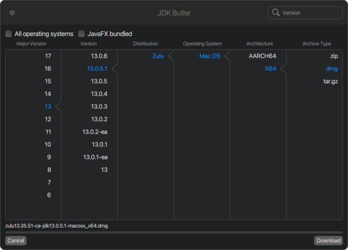
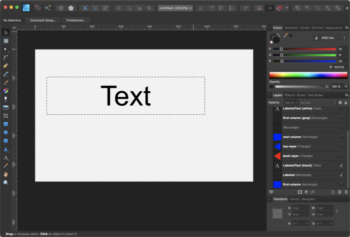
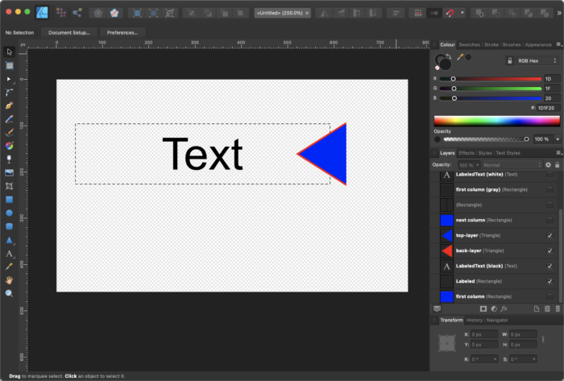
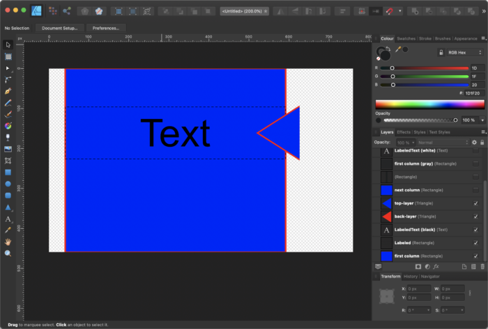
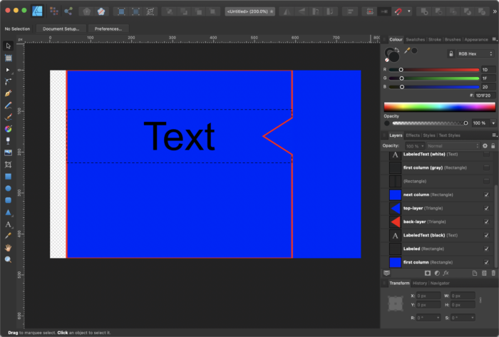
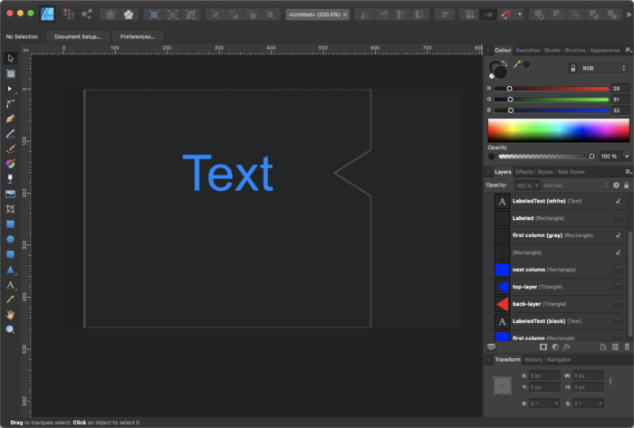
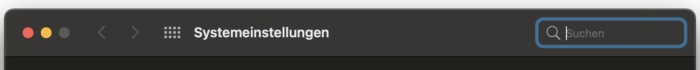
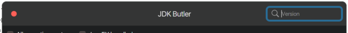
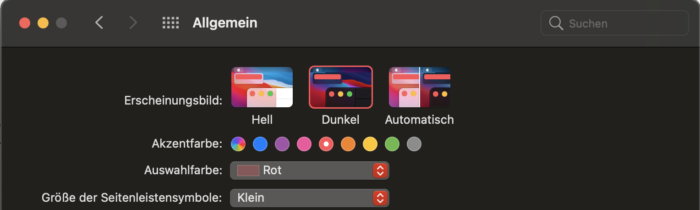
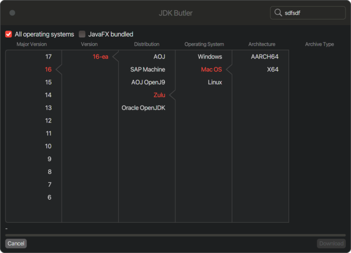

Welcome the [final article of this little series](https://foojay.io/today/custom-controls-in-javafx-part-i/) about custom controls in JavaFX.

This time, I have created an application that makes use of custom controls. I won't go through the whole code on how I've created this application but only on the custom controls that I've created for it.

But first, let me show you the application...



The [JDK Butler](https://github.com/HanSolo/jdkbutler) is an app that makes use of the [Foojay Disco API](https://github.com/foojay2020/discoapi) to enable you to drill down to a JDK of your choice and download it to your machine. As you can see in the screenshot, we have columns where we can select things like major version, version, distribution etc.

Every time you select something, the selected text will be colored in a specific color and you will see a small triangle pointing into the direction of the selected item. So, the question is, how did I create this triangle? To explain this, let me show you some screenshots from my vector drawing program to explain what I did.

First of all, I extended a JavaFX Label which is made from a Labeled container that wraps a LabeledText. In the following screenshot the dashed rectangle represents the border of the Labeled container and the Text represents the LabeledText.



In the SelectableLabel class I've added a Region to the Label using the setGraphics() method and aligned it to the right by calling setContentDisplay(ContentDisplay.RIGHT) as you can see in the following code snippet:

```java
selectionArrow = new Region();
selectionArrow.getStyleClass().add("selection-arrow");
selectionArrow.prefWidthProperty().bind(heightProperty());
selectionArrow.prefHeightProperty().bind(heightProperty());

if (selectionArrowEnabled) { setGraphic(selectionArrow); }
setContentDisplay(ContentDisplay.RIGHT);
```

To the added Region named selectionArrow I've added the style class named "selection-arrow".

Now let's take a look at the CSS code that is involved here:

```java
.jdk-butler .selectable-label > .selection-arrow,
.jdk-butler:dark .selectable-label > .selection-arrow {
    -fx-background-color : transparent;
    -fx-scale-shape      : true;
    -fx-shape            : "M0,10 L10,0 L10,20 L0,10z";
    -fx-translate-x      : 4;
}
.jdk-butler:dark .selectable-label:selected > .selection-arrow {
    -fx-background-color : -dark-border-color, -dark-content-background;
    -fx-scale-x          : 1;
    -fx-scale-y          : 1.5;
    -fx-background-insets: -1 0 -1 0, 0 0 0 2.5;
}
.jdk-butler .selectable-label:selected > .selection-arrow {
    -fx-background-color : -light-border-color, -light-content-background;
    -fx-scale-x          : 1;
    -fx-scale-y          : 1.5;
    -fx-background-insets: -1 0 -1 0, 0 0 0 2.5;
}
```

So first we add a simple svg shape (the triangle) to the Region (.selection-arrow) which will be filled with the transparent color to hide it as default. We also shift the path 4px to the right.

The most interesting part is in the next blocks where the .selectable-label is :selected.

We scale the whole shape in x and y a bit to make it look better but that is not the interesting part. We set 2 colors for the -fx-background-color, the border color that is used for the border of the columns and the background color that is used to fill the columns.

The "magic" is in the -fx-background-insets entry, here we stretch the shape in y direction by applying -1 to the top and bottom part for the first layer (the one that is filled with the border color). Then we compress the second layer (which is filled with the background color of the columns) in x direction but only on the left side by 2.5px.

Because it is easier to understand when looking at a picture, here are some screenshots that hopefully explain it. So let's assume the background color of our columns is blue and the border color is red. So let's first take a look at the triangle:



Here you can see that the triangle will stand out on the right side of our SelectableLabel and because of the stretching and compressing it looks like it has only a red border on the left side. If we now add the column with it's blue background and red border it will look as follows:



Ok so if we now add the next column on the right side and make sure that it will be added to the scene graph after the first column it will look as follows:



And here we go, now it looks like we wanted it to look. If we adjust the colors to the real ones it will look as follows:



With this technique one can create interesting effects by just tweaking the CSS code without the need of creating complex custom controls. So the take away here is that you should keep in mind that background-insets can also be negative which enables a lot of things.

Another custom control that I use here is the one that we created in [Part V of this blog series (the Mac OS window button)](https://foojay.io/today/custom-controls-in-javafx-part-v/).

And there is TextField in the upper right corner of the application. Because I'm working on a Mac I've created a SearchTextField control that looks like the TextField that one can find in Mac OS. Here is a screenshot of the system settings in Mac OS:



In this control you see that we have a loupe on the left side and what you don't see in the screenshot is that as son as you type in some text there will also be a circular button on the right side of the text field to clear the text.  

For this control I used the Control+Skin approach where I extended the TextField and also the TextFieldSkin to be able to add some functionality and visual stuff like the loupe and the button.

To keep the post short I won't go into detail here but just tell you that I've added 2 additional Regions to the TextFieldSkin. Both Regions are styled using CSS. So in the end you simply have to enable/disable the button on the right side by listening to the textProperty of the TextField and add a mouse listener to the right Region to be able to reset the text when clicking on it.

So my own SearchTextField looks similar to the original one in MacOS and good enough for me 🙂



Some of you (probably the ones working on Mac) might already wonder why JDK Butler comes in dark mode. Because JavaFX does not recognize dark/light modes you have to create the whole window on your own. Fortunately that is possible in JavaFX because you can set the Stage style to transparent by calling:

```java
stage.initStyle(StageStyle.TRANSPARENT);
```

The thing you have to keep in mind is that, if you set the stage style to transparent, you also lose the ability to resize and move the window. So that's another thing you have to take care of on your own. Lucky us because there are solutions to handle this, [in the tools package of JDK Butler](https://github.com/HanSolo/jdkbutler/blob/main/src/main/java/eu/hansolo/fx/jdkbutler/tools/ResizeHelper.java) you will find a class called ResizeHelper which has a method called addResizeListener(). You simply call this method and pass your stage object to it and resizing is done. 🙂 The window dragging can simply be realized by adding a listener to the MousePressed and MouseDragged events on the header.

So now that we know that we have to create the window on our own the question is how do we detect if we are in dark mode or not. Well there are solutions for this which mainly involve jni/jna to call native operating system routines to detect the screen mode.

This is probably the right way to go but I thought by myself if there are no other ways on figuring out the dark/light mode. Well, there are shell commands that you can use on Mac OS and on Windows that will tell you if the system is in dark or light mode. For that reason I've created a little class called Detector, [which you can also find in the tools package of JDK Butler](https://github.com/HanSolo/jdkbutler/blob/main/src/main/java/eu/hansolo/fx/jdkbutler/tools/Detector.java). The Detector has methods for detecting:

* operating system
* dark mode
* accent color (only Mac OS)

With these methods, the JDK Butler cannot only detect if it should start in dark or light mode but also which accent color it should use to highlight text, focus etc.

For Mac OS, I've added all system colors that are defined in Mac OS for aqua (light) and dark mode. In Mac OS the accent color will be used in combination with so called vibrancy. That means that if you select for example blue as the accent color, a blueish color that fits good the accent color will be use to draw the focus on e.g., the TextField. So I've picked all shades for the different accent colors you can choose and added them to the MacOSAccentColor enum in the Detector class. With this I can on Mac OS also react on the choosen accent color and use it in my JavaFX app.

For example, if I choose red as the accent color in Mac OS, as follows...



...if I now start JDK Butler, it will look like this:



Because this is only a demo application, I did not implement this for all kinds of controls but just for the stuff I needed. At least it will give you an idea of what you can do using JavaFX. 🙂

The code for JDK Butler is as always available on [github](https://github.com/HanSolo/jdkbutler "github"), so feel free to fork it and take a look.

That's it with the [JavaFX custom control series](https://foojay.io/today/custom-controls-in-javafx-part-i/), I hope you enjoyed it at least a little bit. If you have further questions, do not hesitate to contact me. And keep coding!
