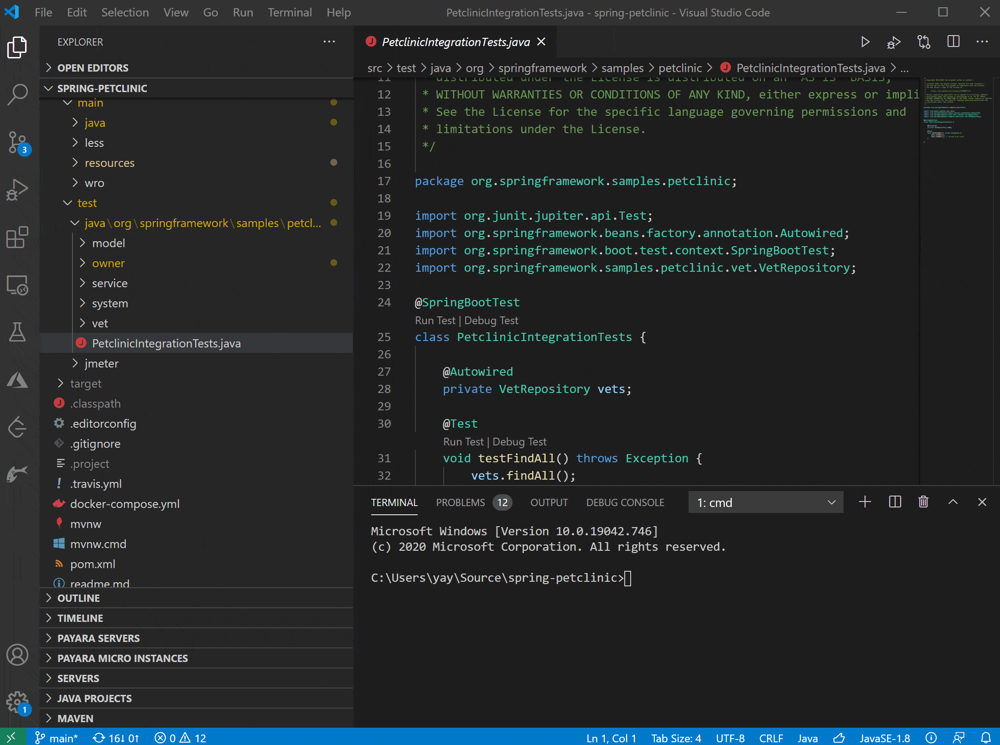
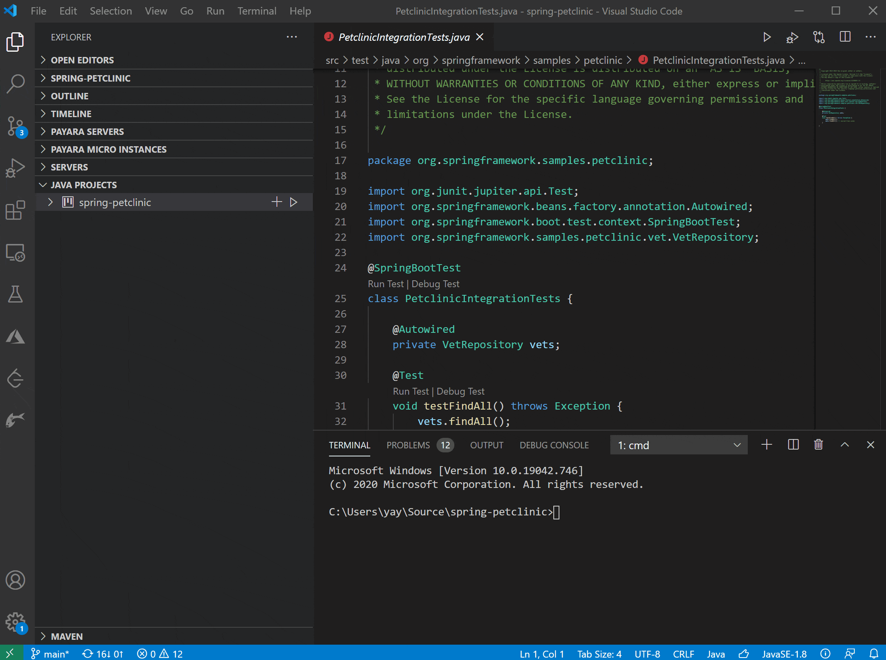
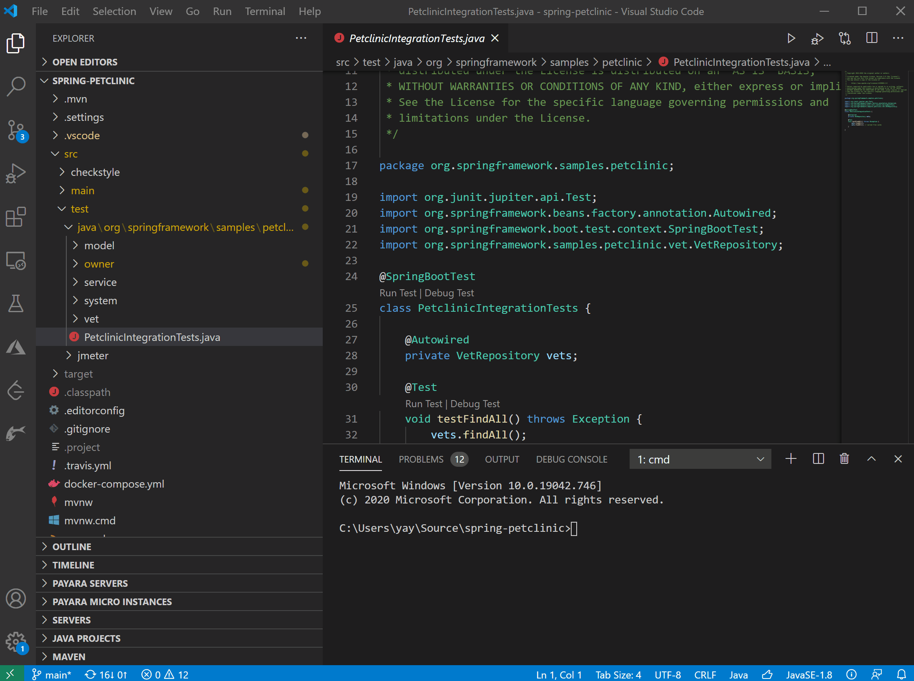

In our [last post](https://foojay.io/today/welcome-to-vs-code-for-java/ "last post"), we talked about starting a new Java project and running and debugging it with VS Code. In this post, we will cover testing.

To run Java tests on VS Code, we recommend using the [Java Test Runner extension](https://marketplace.visualstudio.com/items?itemName=vscjava.vscode-java-test "Java Test Runner extension") or the [Java Extension Pack](https://marketplace.visualstudio.com/items?itemName=vscjava.vscode-java-pack "Java Extension Pack"), which includes the extension. The extension supports the JUnit4, JUnit5, and TestNG frameworks.

### Running Tests {#h3-0-running-tests}

When a project with test cases is imported into VS Code, VS Code can automatically detect the test cases and get them ready for you to run.

There are a couple of options to run them, as demonstrated below.

#### Running from Test Explorer

Test Explorer offers the most comprehensive support for testing. In addition to running cases individually, you can Run All Tests, as shown below.

#### Running from Java Project Explorer

Java Project Explorer provides access to all project-related functionality, including testing. You can run tests at project level or at individual package or class level, as demonstrated below.

#### Running from CodeLens

CodeLens is a VS Code feature that provides context-aware actions through links next to your code.

When VS Code detects testing annotations in code, it will provide a link of "Run Test" and a link of "Debug Test" next to the annotation for you to quickly start an action without jumping out of your code.

It's a handy feature that allows you to focus on coding by minimizing context switching.

### Accessing Testing Reports {#h3-1-accessing-testing-reports}

After running tests, VS Code generates a testing report for you.

You can access the report through status bar as shown in demos above or using Command Palette by **Ctrl+Shift+P** to launch the palette and then typing "**java show test report**" to open the report.

Until next time, happy coding!
