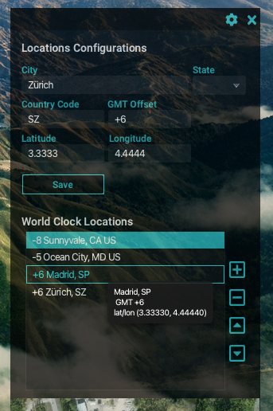
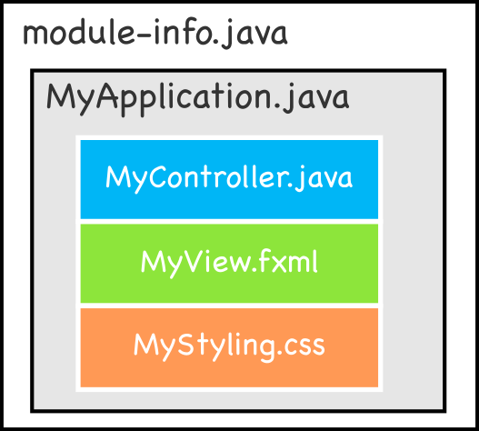
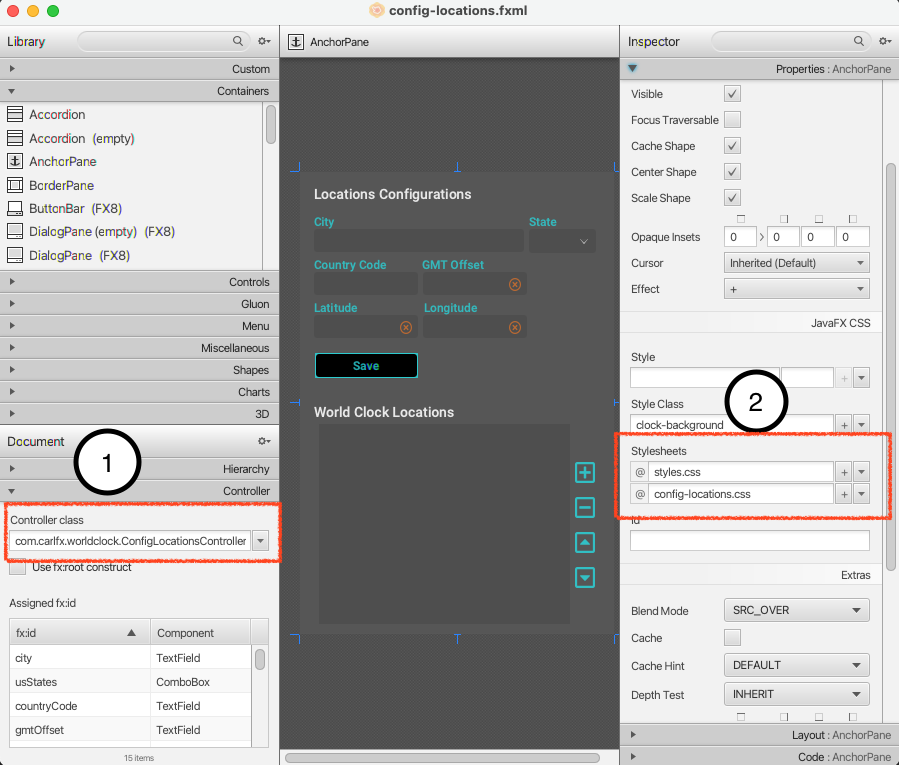
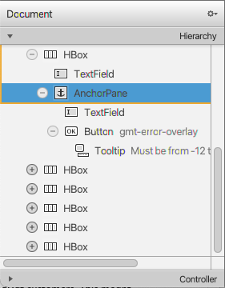
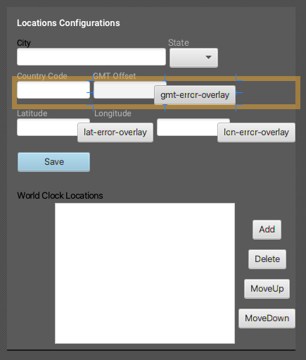
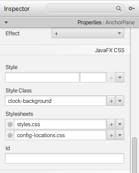
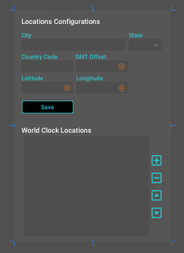
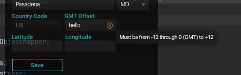

> An old trick well done is far better than a new trick with no effect. -- Harry Houdini

Welcome back to the series of blog entries on how I created a "sci-fi" looking world clock using JavaFX. If you are new to this series you can visit Part [\[1\]](https://foojay.io/today/creating-a-javafx-world-clock-from-scratch-part-1/ "Creating a JavaFX World Clock from Scratch (Part 1)") \& [\[2\]](https://foojay.io/today/creating-a-javafx-world-clock-from-scratch-part-2/ "Creating a JavaFX World Clock from Scratch (Part 2)").

As a small recap from Part 1, I mention how I get my inspiration and tools that were used in designing the clock face. In [Part 2](https://foojay.io/today/creating-a-javafx-world-clock-from-scratch-part-2/) the focus was on using the Scene Builder tool by GluonHQ [\[3\]](https://gluonhq.com "GluonHQ") to layout UI elements comprised of the clock face, and later implementation code using trig and JavaFX to animate the clock arms.

### JavaFX UI Forms Validation \& Java Modules {#h3-0-javafx-ui-forms-validation-java-modules}

Do you ever get bored of the plain old UI Forms? Often, UI forms will have nice visual cues and validation icons as feedback when the user has typed something incorrectly.

In Part 3, I'll be discussing the UI form section of the JavaFX World Clock that allows the user to add and modify timezone locations. While building Java apps using the new module system can be a bit of a challenge, here I will show you how I was able to successfully build a modern MVC based JavaFX UI!

#### **Novel or Blog?**

While the JFX World Clock UI config Form is chock full of features, I will only be discussing how I implemented validation overlay icons behavior when a user enters invalid information into TextField UI controls.

#### Fosdem 2021

Ah, one more thing to mention before we begin! Part 3 was in the form of a talk I did for Fosdem 2021 conference, in the Friend's of OpenJDK devroom, [here](https://fosdem.org/2021/schedule/track/friends_of_openjdk/). Also, on foojay.io, [here](https://foojay.io/today/friends-of-openjdk-at-fosdem-2021/).

To view the pre-recording of the talk click here: <https://video.fosdem.org/2021/D.openjdk/javafxclock.mp4>

Let's begin already!

### JavaFX Puzzle Pieces (Modules) {#h3-1-javafx-puzzle-pieces-modules}

When developing modular apps in Java (9+) you can take advantage of encapsulation that non-modular apps cannot. Because non-modular apps use the Java class path many of packages are exposed. An example would be if you are making a library that depends on a 3rd party library.

In this scenario, you wouldn't want the 3rd party APIs exposed to the users of your library/APIs. New to Java since JDK 9 is the module path where you can expose (exports / opens) module packages to other modules to have certain visibility. Let's look at how the JavaFX World Clock's module definition was implemented.

#### Requires {module}

The JavaFX World Clock project is implemented using Java modules. Because of this you will have to create a `module-info.java` file that will describe dependencies and visibility (scope) of modules and packages. Here I defined the world clock's `module-info.java` shown below:

<pre class="EnlighterJSRAW" data-enlighter-language="java">module worldclock {
    requires javafx.controls;
    requires javafx.fxml;
    requires javafx.web;
    requires com.fasterxml.jackson.core;
    requires com.fasterxml.jackson.databind;
    requires com.fasterxml.jackson.annotation;
    opens com.carlfx.worldclock to com.fasterxml.jackson.core, com.fasterxml.jackson.databind, com.fasterxml.jackson.annotation, javafx.fxml;
    exports com.carlfx.worldclock;
}
// Listing 3.1
</pre>

You'll notice all the `requires` such as `javafx.controls` and `javafx.fxml` that enables us to import classes in code. For those who didn't catch it, but the `javafx.*` modules also depend on the module `javafx.base`. So, you may ask "Should we specify a `requires javafx.base`?" The answer is "no".

Modules such as `javafx.base` are not needed because the module system will automatically pull in any transitive dependencies, thus simplifying the definition above. Another transitive dependency not listed is the module `javafx.graphics`.
> **Tip:** As a reminder, anytime you are coding in your favorite IDE that has an auto-import feature, you might assume it will work, however it will NOT work! You have to add the **requires** of the module, in the **module-info.java** file, first and then the auto-import will work.

#### Opens {package} to {module} \[,{module}\]

Whenever 3rd party libraries modules are using dependency injection or reflection they will inevitable need access to your code or resources. In the case of with JavaFX where FXML is loaded onto the Scene Graph, the module `javafx.fxml` will need access to the World Clock's controller code and fxml file that resides in the package namespace `com.carlfx.worldclock`.

The following is how to open the world clock's package namespace to the `javafx.fxml` module.

<pre class="EnlighterJSRAW" data-enlighter-language="java">opens com.carlfx.worldclock to javafx.fxml;</pre>

In the module-info above, you'll also notice the `opens com.carlfx.worldclock` to the Jackson Serialization library module also. Jackson will need to have access to POJOs in the world clock's package namespace. I use Jackson's module to save clock configuration info as a JSON file in the home directory under `$home/worldclock`.

#### Exports {package}

Exports are used to open access to your package namespace to others who will potentially use your module.

The basic syntax to export world clock's package namespace:

<pre class="EnlighterJSRAW" data-enlighter-language="java">exports com.carlfx.worldclock;</pre>

Now that you know a little more about the basics of Java modules let's look at a high-level view on how to go about creating a JavaFX UI Form.

### JavaFX UI Forms (MVC) {#h3-2-javafx-ui-forms-mvc}

When creating a JavaFX UI form, you will have to know how a JavaFX application will assemble a controller, FXML, and CSS files into a displayable node on the scene graph.

When the application begins, the application thread will invoke the `start()` method to begin loading and dropping nodes onto the scene graph.

Listing 3.2, below, shows how to load an FXML as a node (Parent) object using the FXMLLoader utility class. The FXML's top level node is an AnchorPane. All Panes (layout type nodes) extend from the `javafx.scene.Parent` class.

<pre class="EnlighterJSRAW" data-enlighter-language="java">FXMLLoader configLocationLoader = new FXMLLoader(App.class.getResource("config-locations.fxml"));
Parent configPane = configLocationLoader.load();
ConfigLocationsController configController = configLocationLoader.getController();
// Listing 3.2</pre>

Another nice feature of the `FXMLLoader` class is to get the **controller** instance by calling the `FXMLLoader.getController()` method.

#### Files: JFX World Clock MVC (Model/View/Controller)

At a high-level I want to reiterate what files are involved when following the JavaFX MVC architectural pattern.

The files that make up a MVC JavaFX UI Form:

1. **Model** - Various Domain and Presentation Models used for UI controls  
   a. Location.java, USLocation.java (POJOs)  
   b. RowLocation.java (having properties used in JavaFX controls)
2. **View** - config-locations.fxml, config-locations.css
3. **Controller** - com.carlfx.worldclock.ConfigLocationsController.java

Now, that you know what files are responsible for (separation of concerns) let's look at my development workflow. Next, I will be talking about steps (in no particular order) that I'll call dev workflow ingredients in order to create a JavaFX UI Form. Because the files are separate (MVC) you can basically work on them independently from one another.

#### JavaFX UI Form - Dev Workflow / Ingredients

From a high-level here are the ingredients and steps to create a JavaFX UI Form.

1. Module definition (module-info.java)
2. FXML (Scene Builder)  
   a. Add `fx:id` unique name to UI controls  
   b. Reference Controller class  
   c. Reference CSS files
3. JavaFX CSS (\*.css)
4. Controller (MyController.java)  
   a. Know that the constructor cannot access UI components  
   b. Use `@FXML` on a public void initialize() method  
   c. Use `@FXML` on instance variables of UI controls.  
   d. Use `@FXML` on instance methods for actions such as buttons  
   e. Name variables the same as the `fx:id` specified in Scene Builder
5. Application class (using FXMLLoader)  
   a. Load and Add fxml views as a node (`Parent`) onto the scene graph  
   b. Optionally obtain the controller instance to invoke public methods

> Warning: Don't use a controller's constructor to initialize UI controls. Instead you'll want to create an annotated (@FXML) `public void initialize()` method to access UI controls. For example, if your controller's constructor tries to access instance variables (UI controls) you get a NullPointer Exception. After UI elements are realized (live) the `initialize()` method will be invoked.

Once the controller and CSS files exist (created) you can reference them in Scene Builder tool as shown below:

On the left (1) shows the controller class referencing the `com.carlfx.worldclock.ConfigLocationsController.java` class. And on the right (2) you'll notice the references to the CSS files for styling the UI Form (AnchorPane).

Now that you know how to load and display an FXML file onto a scene graph, let's look at how I created the World Clock's FXML Config UI Form.

### Designing a Form {#h3-3-designing-a-form}

When creating a form you'll typical read UI/UX design books and websites to provide a great user experience, however I just wing it! Well, in all seriousness I basically have an idea of a look that I'm trying to shoot for such as a dark theme similar to aspects in the movie Tron[\[imdb\]](https://www.imdb.com/title/tt1104001/ "Tron Legacy"). I also will explore other great UI designs from others and take their UIs apart to examine their techniques (the magic behind the curtain) and try to mimic their style \& behavior.

When it comes to UI forms and making things look cohesive or themed, it is no easy task and will likely take some time to experiment (but quite satisfying). For the World Clock, I try to strike a balance between its functionality (behavior of controls) and its visual appeal. I can always come back and refine the UI as long as it functions at a basic level while looking somewhat decent. 😉

### Protyping a Form {#h3-4-protyping-a-form}

When I sketch (wireframe) UIs I typically use a pen\&paper or a vector tool like Inkscape or Adobe Illustrator. Once I am settled with the wireframe, I will use the Scene Builder tool to layout components as close as possible similar to the wireframe.

If you remember in Part 2, I used the Scene Builder to build the initial clock face. Once again, in this blog post I will use the Scene Builder to prototype the locations configuration UI form. Here is the FXML file Scene Builder generates of the UI form as a prototype:

<https://github.com/carldea/worldclock/blob/main/src/main/resources/com/carlfx/worldclock/config-locations-prototype.fxml>.

Once the file is loaded you will see the **Document** section's Hierarchy of JavaFX UI elements on the bottom left as shown below:

In the cavas area shown below, you'll see UI controls and layouts not having much styling and/or layout constraints:

You'll also see unusual buttons oddly positioned that overlap other textfields. These overlapping buttons are what is known as **validation icons** that appear when a user is entering invalid input. Validation icons will also show a tooltip popup text of the warning or error. These overlay buttons will be styled using JavaFX CSS with an SVG vector icon that will appear as a round icon with an 'X' denoting an error.

### Styling a Form {#h3-5-styling-a-form}

To apply JavaFX CSS you simply can add them to the main Parent Node (AnchorPane). After selecting the top level AnchorPane node from the Document Hiearchy, I then add the CSS files from the Properties panel in the upper right side of the Scene builder tool as shown below:

After applying the JavaFX CSS styling files the UI form should look like the following:

The following JavaFX CSS files were applied to the UI Form:

* styles.css [\[styles-css\]](https://github.com/carldea/worldclock/blob/main/src/main/resources/com/carlfx/worldclock/config-locations.css "styles.css File")
* config-locations.css [\[location-config-css\]](https://github.com/carldea/worldclock/blob/main/src/main/resources/com/carlfx/worldclock/config-locations.css "location-config.css")

A good reference on how to custom style UI controls check out the JavaFX CSS Reference here: <https://openjfx.io/javadoc/16/javafx.graphics/javafx/scene/doc-files/cssref.html>

### Validation Overlay Icons: Styling a Button {#h3-6-validation-overlay-icons-styling-a-button}

In the Scene Builder tool the `gmtErrorOverlayIcon` Button is styled with `.error-overlay` CSS class. To make the JavaFX Button `gmtErrorOverlayIcon` into an overlay icon used in validation the following JavaFX CSS was used. (located in the config-locations.css file):

<pre class="EnlighterJSRAW" data-enlighter-language="css">.error-overlay {
    -fx-shape: "M256 8C119 8 8 119 8 256s111 248 248 248 248-111 248-248S393 8 256 8zm0 448c-110.5 0-200-89.5-200-200S145.5 56 256 56s200 89.5 200 200-89.5 200-200 200zm101.8-262.2L295.6 256l62.2 62.2c4.7 4.7 4.7 12.3 0 17l-22.6 22.6c-4.7 4.7-12.3 4.7-17 0L256 295.6l-62.2 62.2c-4.7 4.7-12.3 4.7-17 0l-22.6-22.6c-4.7-4.7-4.7-12.3 0-17l62.2-62.2-62.2-62.2c-4.7-4.7-4.7-12.3 0-17l22.6-22.6c4.7-4.7 12.3-4.7 17 0l62.2 62.2 62.2-62.2c4.7-4.7 12.3-4.7 17 0l22.6 22.6c4.7 4.7 4.7 12.3 0 17z";
    -fx-background-color: "#de752fce";
    -fx-fill: "#000000";
    -fx-stroke: "#de752fce";
    -fx-stroke-width: 1.5;
    -fx-min-height: 12;
    -fx-min-width: 12;
    -fx-max-height: 12;
    -fx-max-width: 12;
}</pre>

Here you'll notice the vector shape specified for the `-fx-shape` attribute to appear as an 'x' inside of a circle shape:

### Validation Overlay Icons: Tooltips {#h3-7-validation-overlay-icons-tooltips}

In Scene Builder, I added a tooltip to the button with `fx:id` of `gmtErrorOverlayIcon`. When the button is visible (meaning there's a validation error) a tooltip pops up explaining the problem. In this case the GMT offset text field only allows an integer value between -12 to 12 (hour) inclusive.

The FXML or the view will contain the XML markup generated from the Scene Builder tool. Below is the button that represents the overlay icon `gmtErrorOverlayIcon` for the GMT Offset TextField control.

<pre class="EnlighterJSRAW" data-enlighter-language="css">&lt;Button fx:id="gmtErrorOverlayIcon" alignment="CENTER" contentDisplay="CENTER" focusTraversable="false" layoutX="86.0" layoutY="6.0" mnemonicParsing="false" styleClass="error-overlay" text="Button"&gt;
   &lt;tooltip&gt;
     &lt;Tooltip text="Must be from -12 through 0 (GMT) to +12" /&gt;
   &lt;/tooltip&gt;
&lt;/Button&gt;</pre>

### Validation Overlay Icons: Behavior {#h3-8-validation-overlay-icons-behavior}

When a user enters invalid data an error icon is overlayed just to the right side of the text field. Also, a tooltip message will popup to offer a suggestion. For example, when a user enters a number outside the range of GMT Offset, or entering non digit characters a overlay icon would appear.

The example of the GMT Error Overlay Icon button uses the `@FXML` annotation to bind the UI control with its `fx:id` attribute set to `gmtErrorOverlayIcon` of the Button node within the SceneBuilder tool (FXML) and the named instance variable within the controller class presented below.

#### Instance Variables

Excerpts from the controller class com.carlfx.worldclock.ConfigLocationsController.java [\[3\]](https://github.com/carldea/worldclock/blob/main/src/main/java/com/carlfx/worldclock/ConfigLocationsController.java "ConfigLocationsController.java").

<pre class="EnlighterJSRAW" data-enlighter-language="java">@FXML
public Button gmtErrorOverlayIcon;

@FXML
public TextField gmtOffset;</pre>

#### The initialize() method

When the form is loaded and instance variables are associated (injected) with UI elements, the `initialize()` method will be called as shown below:

<pre class="EnlighterJSRAW" data-enlighter-language="java">@FXML
public void intitialize() {
    addValidationRangeCheckInt(-12, 12, gmtOffset, gmtErrorOverlayIcon);
    // The rest of the code ...
}</pre>

Above you'll notice the method `addValidationRangeCheckInt()` that will attach a listener onto the `gmtOffset` (TextField) control with the ability to show and hide the `gmtErrorOverlayIcon` (Button) during input validation.

#### Attaching a ChangeListener

I created a `addValidationRangeCheckInt()` method to attach a listener for text fields (TextField) to validate against an integer value within a range. The code will show or hide a validation overlay icon when the user enters invalid or valid data respectively. In this scenario the GMT Offset TextField will only allows values between -12 to 12 (inclusive).

<pre class="EnlighterJSRAW" data-enlighter-language="java">private void addValidationRangeCheckInt(int min, int max, TextField field, Button errorOverlayIcon) {
    errorOverlayIcon.setVisible(false);
    field.textProperty().addListener((observable, oldValue, newValue) -&gt; {
        try {
            String str = "0";
            if (!"".equals(newValue.trim())) {
                str = newValue;
            }
            Integer value = Integer.parseInt(str.trim());
            errorOverlayIcon.setVisible((value &lt; min || value &gt; max));
        } catch (Exception e) {
            errorOverlayIcon.setVisible(true);
        }
    });
}</pre>

#### Output

The following illustrates the validation icon overlay appearing when the user enters invalid input. You'll also notice the tooltip popup showing the error message:

While there is much more to talk about in regard to what other features the UI form is capable of, I wanted to keep this blog entry brief. So, I trust you will examine the Controller code in depth here: [\[3\]](https://github.com/carldea/worldclock/blob/main/src/main/java/com/carlfx/worldclock/ConfigLocationsController.java "ConfigLocationsController.java").

### Features Not Discussed {#h3-9-features-not-discussed}

* Config/Close buttons in the window title
* State ComboBox field will find a state code based on key strokes
* Latitude and Longitude fields contain validation code
* Save button will save locations as a JSON file in your home directory under `worldclock`
* Up/Down buttons will order items
* Add/Remove buttons will clear or remove locations
* The use of Custom Events to pass information up to the root node or down to children nodes.

### Conclusion {#h3-10-conclusion}

In Part 3, you got a chance to see how I prototyped and styled the UI Form. Then, we looked at JavaFX's MVC facility to inject UI controls and bind methods using the @FXML annotation. Lastly is an example of using validation overlay icons to provide feedback to the user when input is invalid.

Next, in [Part 4](https://foojay.io/today/creating-a-javafx-world-clock-from-scratch-part-4/), I want to fast forward things a bit and talk about how to build the World Clock application using the excellent build tool called [Bach](https://sormuras.github.io/bach/ "Bach Java Modules build tool") by Christian Stein ([@sormuras](https://twitter.com/sormuras "Christian Stein")). Here I'll discuss how to create an executable to be distributed, such as a dmg, pkg, msi, etc., among your friends and relatives. 🙂

As always comments \& questions are welcome. If you see any issues or how to improve things let me know! Happy coding.

### References {#h3-11-references}

* JFX WorldClock on GitHub [\[jfx-world-clock\]](https://github.com/carldea/worldclock "JFX World Clock at GitHub")
* GluonHQ [gluonhq](https://gluonhq.com "GluonHQ")
* Bach [bach](https://sormuras.github.io/bach/ "Bach Java Modules build tool")
* JavaFX CSS [\[javafx-css\]](https://openjfx.io/javadoc/16/javafx.graphics/javafx/scene/doc-files/cssref.html "JavaFX 16 CSS Reference")
* JFX WorldClock Part 1 [\[1\]](https://foojay.io/today/creating-a-javafx-world-clock-from-scratch-part-1/ "Creating a JavaFX World Clock from Scratch (Part 1)")
* JFX WorldClock Part 2 [\[2\]](https://foojay.io/today/creating-a-javafx-world-clock-from-scratch-part-2/ "Creating a JavaFX World Clock from Scratch (Part 2)")
