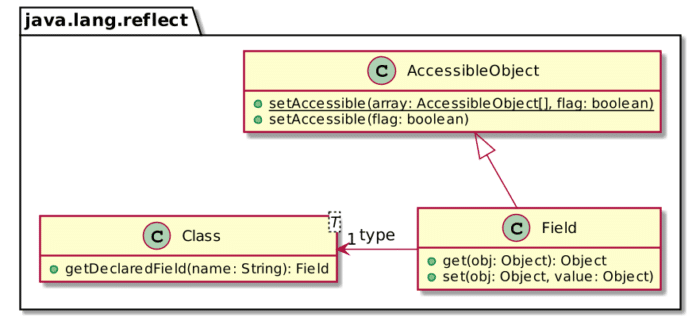
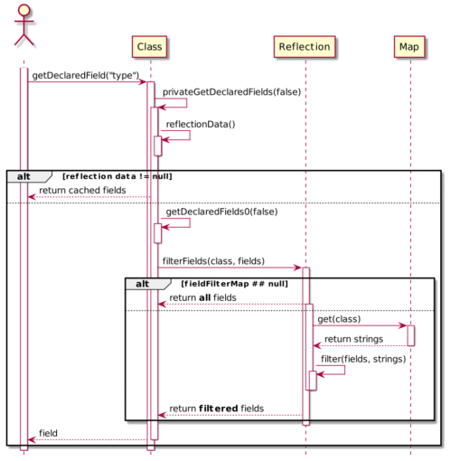
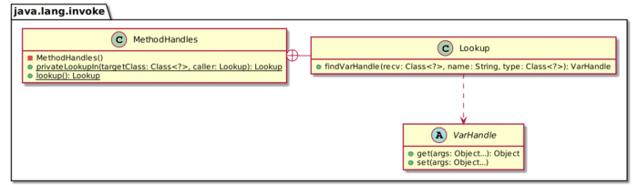

A couple of years ago, I attended a talk by my former colleague (but still friend) [Volker Simonis](https://twitter.com/volker_simonis). It gave me the idea to dig a bit into the subject of how to secure the JVM. From the material, I created a [series of blog posts](https://blog.frankel.ch/focus/jvm-security/) as well as [a talk](https://www.youtube.com/watch?v=Bgo7dcCbqV8).

From that point on, I submitted the talk at meetups and conferences, where it was well-received. Because I like to explore different areas, I stopped to submit other proposals. Still, the talk is in my portfolio, and it was requested again in 2021. I have already presented it twice since the beginning of the year at the time of this writing.

It allowed me to update the demo with version 16 of the JDK. In this blog post, I want to share some findings regarding the security changes regarding changing a field's type across JDK versions.

### Fun with JDK 8 {#h3-0-fun-with-jdk-8}

Let's start with the JDK. Here's a quiz I show early in my talk:

```
Foo foo = new Foo();
Class<Foo> clazz = foo.getClass();
Field field = clazz.getDeclaredField("hidden");
Field type = Field.class.getDeclaredField("type");
AccessibleObject.setAccessible(
        new AccessibleObject[]{field, type}, true);
type.set(field, String.class);
field.set(foo, "This should print 5!");
Object hidden = field.get(foo);
System.out.println(hidden);

class Foo {
    private int hidden = 5;
}
```


Take some time to guess the result of executing this program when running it with a JDK 8.

Here's the relevant class diagram to help you:



As can be seen, `Field` has a `type` attribute that contains... its type. With the above code, one can change the type of `hidden` from `int` to `String` so that the above code executes and prints `"This should print 5!"`.

With JDK 16, the snippet doesn't work anymore. It throws a runtime exception instead:

```
Exception in thread "main" java.lang.NoSuchFieldException: type
    at java.base/java.lang.Class.getDeclaredField(Class.java:2549)
    at ch.frankel.blog.FirstAttempt.main(FirstAttempt.java:12)
```


The exception explicitly mentions line 12: `Field.class.getDeclaredField("type")`. It seems as if the implementation of the `Field` class changed.

### Looking at the Source Code of JDK 16 {#h3-1-looking-at-the-source-code-of-jdk-16}

Let's look at the source code in JDK 16:

```java
public final class Field extends AccessibleObject implements Member {

    private Class<?>            clazz;
    private int                 slot;
    // This is guaranteed to be interned by the VM in the 1.4
    // reflection implementation
    private String              name;
    private Class<?>            type;     // 1

    // ...
}
```


1. Interestingly, the `field` type is there.

If the field is present, why do we get the exception? We need to dive a bit into the code to understand the reason.

Here's the sequence diagram of `Class.getDeclaredField()`:



The diagram reveals two interesting bits:

1. The `Reflection` class manages a cache to improve performance.
2. A field named `fieldFilterMap` filters out the fields that reflective access return.

Let's investigate the `Reflection` class to understand the runtime doesn't find the `type` attribute:

```java
static {
    fieldFilterMap = Map.of(
        Reflection.class, ALL_MEMBERS,
        AccessibleObject.class, ALL_MEMBERS,
        Class.class, Set.of("classLoader", "classData"),
        ClassLoader.class, ALL_MEMBERS,
        Constructor.class, ALL_MEMBERS,
        Field.class, ALL_MEMBERS,           // 1
        Method.class, ALL_MEMBERS,
        Module.class, ALL_MEMBERS,
        System.class, Set.of("security")
    );
    methodFilterMap = Map.of();
}
```


1. All of the `Field` attributes are filtered out!

For this reason, none of the attributes of `Field` are accessible via reflection!

### An Alternative Way to Change the Type {#h3-2-an-alternative-way-to-change-the-type}

Since version 9, the JDK offers a new API to access fields as part of the `java.lang.invoke` package.

Here's a quite simplified class diagram focusing on our usage:



One can use the API to access the `type` attribute as above. The code looks like the following:

```java
var foo = new Foo();
var clazz = foo.getClass();
var lookup = MethodHandles.privateLookupIn(Field.class, MethodHandles.lookup());
var type = lookup.findVarHandle(Field.class, "type", Class.class);
var field = clazz.getDeclaredField("hidden");
type.set(field, String.class);
field.setAccessible(true);
field.set(foo, "This should print 5!");
var hidden = field.get(foo);
System.out.println(hidden);
```


But running the code yields the following:

```
Exception in thread "main" java.lang.IllegalArgumentException: Can not set int field ch.frankel.blog.Foo.hidden to java.lang.String
    at java.base/jdk.internal.reflect.UnsafeFieldAccessorImpl.throwSetIllegalArgumentException(UnsafeFieldAccessorImpl.java:167)
    at java.base/jdk.internal.reflect.UnsafeFieldAccessorImpl.throwSetIllegalArgumentException(UnsafeFieldAccessorImpl.java:171)
    at java.base/jdk.internal.reflect.UnsafeIntegerFieldAccessorImpl.set(UnsafeIntegerFieldAccessorImpl.java:98)
    at java.base/java.lang.reflect.Field.set(Field.java:793)
    at ch.frankel.blog.FinalAttempt.main(FinalAttempt.java:16)
```


Though the code compiles and runs, it throws at `field.set(foo, "This should print 5!")`. We reference the `type` field and can change it without any issue, but it still complains.

The reason lies in the last line of the `getDeclaredField()` method:

```java
public Field getDeclaredField(String name)
    throws NoSuchFieldException, SecurityException {
    Objects.requireNonNull(name);
    SecurityManager sm = System.getSecurityManager();
    if (sm != null) {
        checkMemberAccess(sm, Member.DECLARED, Reflection.getCallerClass(), true);
    }
    Field field = searchFields(privateGetDeclaredFields(false), name);
    if (field == null) {
        throw new NoSuchFieldException(name);
    }
    return getReflectionFactory().copyField(field);      // 1
}
```


1. Return a copy of the `Field` object, not the `Field` itself.

Since the JDK code returns a copy of the field, the change happens on this copy, and we cannot change the original field's type.

### Conclusion {#h3-3-conclusion}

Though Java touts itself as a statically-typed language, version 8 of the JVM allows us to change the type at runtime dynamically. One of my favorite jokes during the talk mentioned above is that though we have learned that Java is statically-typed, it is dynamically-typed in reality.

We can track the change precisely in Java 12: the [version 11](https://code.yawk.at/java/11/java.base/jdk/internal/reflect/Reflection.java) of the `Reflection` class shows a basic `fieldFilterMap`; the [version 12](https://code.yawk.at/java/12/java.base/jdk/internal/reflect/Reflection.java) shows a fully-configured one. Hence, if you want to avoid nasty surprises, you should upgrade to the latter, if not the latest.

**To go further:**

* [Focus on JVM Security](https://blog.frankel.ch/focus/jvm-security/)
* [What does the sun.reflect.CallerSensitive annotation mean?](https://stackoverflow.com/questions/22626808/what-does-the-sun-reflect-callersensitive-annotation-mean)
* [Secure Coding Guidelines for Java SE](https://www.oracle.com/java/technologies/javase/seccodeguide.html#9-8)

*Orginally published at [A Java Geek](https://blog.frankel.ch/changing-field-type-recent-jdks/) on April 4^th^, 2021*
