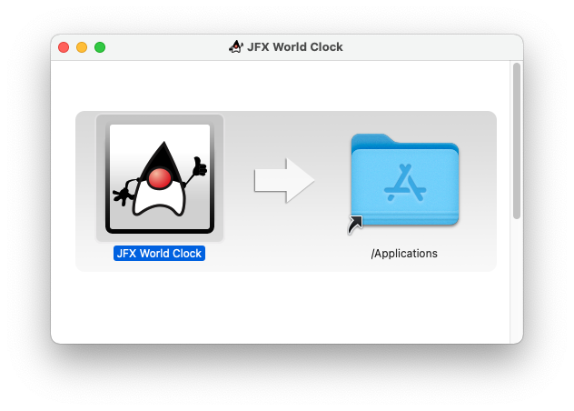
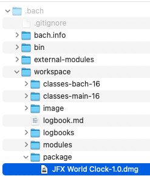

> "The tools we use have a profound (and devious!) influence on our thinking habits, and, therefore, on our thinking abilities." -- Edsger W. Dijkstra, 18 June 1975



Hello and welcome to Part 4 of a series of blog entries on how I created a "sci-fi" looking world clock using JavaFX. If you are new to this series you can visit Part [1](https://foojay.io/today/creating-a-javafx-world-clock-from-scratch-part-1/ "Part 1"), [2](https://foojay.io/today/creating-a-javafx-world-clock-from-scratch-part-2/ "Part 2"), \& [3](https://foojay.io/today/creating-a-javafx-world-clock-from-scratch-part-3/ "Part3").

If you've been following me to this point take a moment to stand up, breath, take a bow and then pat yourself on the back. You are more than half way through the series.

In Part 4 I will be fast forwarding my progress of the JFX World Clock and jump right into how to build and create an installer that you can distribute. I will be using a new Java build tool called [Bach](https://github.com/sormuras/bach "Bach Build tool") by Christian Stein [@sormuras](https://twitter.com/sormuras "Twitter"). Later on, I will also show you my original build approach using the Maven build tool.

For the impatient go to check out the Readme.md on the simple steps to build the app at <https://github.com/carldea/worldclock>

### Requirements

Install your favorite OpenJDK distribution.

* JDK 16+ (with JavaFX)
* Maven 3.6.3+ (optional)
* SDKMan (optional)

### Installing Java 16+ (with JavaFX)

Out of convenience I have been using the [SDKMAN](https://sdkman.io) for easy installs and being able to switch between versions of the JDK on the command prompt (terminal).

Below I'm using SDKMan to install Azul's Zulu (OpenJDK) distro containing the JavaFX modules.

```
$ sdk install java 16.0.0.fx-zulu
$ sdk use java 16.0.0.fx-zulu
```

For see more information on newer Java distros go to: <https://www.azul.com/downloads/zulu-community/?package=jdk-fx>

### Clone JFX World Clock repo

Assuming you have Java 16 or greater installed do the following:

#### Linux/Mac OS

```
$ mkdir -p ~/projects && cd ~/projects
$ git clone https://github.com/carldea/worldclock
$ cd worldclock
```

#### Windows (Power shell)

```
# C:\Users\username\Documents
> cd ~/documents
> md projects
> cd projects
> git clone https://github.com/carldea/worldclock
> cd worldclock
```

#### Updating an upstream Repo

Whenever I make a change to the JFX World Clock repo your locally cloned repo can be stale (out of date). So, every now and then you could update from the upstream repo (mine). Below, is how to add the original repo as a remote upstream branch so you can do a pull to get the latest.

```
$ git remote add upstream https://github.com/carldea/worldclock
$ git remote -v
$ git pull upstream main
```

If you ever want to suggest a fix or change code locally (assuming you've forked), you'll want to do a rebase, which will put your changes on top of the latest. That way you could create a pull request if you so choose. 😉

So, let's build the JFX World Clock to be run.

### Bach Build

Bach is a build tool that uses executable tools that comes with your installed Java 16+ JDK such as `javac`, `jar`, `jlink`, etc. Bach is a lightweight build tool but does the heavy lifting for you when building a Java based modular application.

After cloning the project, and sitting in the `worldclock` directory you can execute Bach's build command as shown below:

```
$ ./bach/bin/bach build
```

You're probably wondering, "I don't remember installing Bach!", Where did it come from? Well it was checked into the world clock git repo project. A little more on that later, but for now it just works when you are sitting in the `worldclock` directory.

What's really cool about Bach is that you don't need to use build tools like [Maven](https://maven.apache.org) or [Gradle](https://gradle.org)to handle dependencies and to generate artifacts such as jar, exe, dmg, etc.

So, what's the catch? No catch, well except one thing...You gotta go modular! Bach is really designed for Java projects that are pure modular apps and libraries.

While there are ways to use non-modular libraries designed for the Java class path, it is NOT advisable (or not worth the time). What will happen is that you can get into weird mismatch problems within your IDE when building and running the application (inside the IDE) as opposed to being on the command line.

**Tip:** A word to the wise: Once you use Java modules, don't look back. Meaning, you'll need to look for a suitable modular library (equivalent) to replace your non-modular library. Also you might want to ask or encourage library owners to create a modular version (buy them a beverage). In the case with JFX World Clock I used the Jackson library's modular version for serialization (JSON).

Bach, is still relatively new and is always getting updates with new features, so keep an eye over at: <https://github.com/sormuras/bach>

Oh, and let Christian know that Carl sent ya. 😉

Out of convenience you can set-up your PATH environment variable so you can perform the following (without having to fully qualify the path):

```
$ bach build
```

### Setup Environment Variables

After building the world clock with the above command you will inevitably perform builds often, so let's make it more convenient by setting your PATH environment.

Add to your .bashrc or .bash_profile as the following:

```
# Linux / MacOS
export PATH=$PATH:./bach/bin
```

On Windows you'll add to your environment variables as the following:

```
# Windows
set PATH=%PATH%;.bach\bin
```

### Learning from Bach

After calling the `bach build` command you should see the following:

#### logbook.md

```
cdea$ bach build
Bach 17-ea+ce2b495 (Java 16+36, Mac OS X, /Users/cdea/projects/worldclock)
Build worldclock 17-bach
Verify external modules located in file:///Users/cdea/projects/worldclock/.bach/external-modules/
Verified 3 external modules
Build 1 main module: worldclock
  javac    --module worldclock --module-version 17-bach --module-source-path worldclock=src/main/java --module-path .bach/e[...]
  jar      --create --file .bach/workspace/modules/<a href="/cdn-cgi/l/email-protection" class="__cf_email__" data-cfemail="fe89918c929a9d92919d95becfc9d39c9f9d96d0949f8c">[email protected]</a> -C .bach/workspace/classes-main-16/worldclock . -[...]
Assemble custom runtime image
  jlink    --add-modules worldclock --module-path .bach/workspace/modules:.bach/external-modules --launcher worldclock=worl[...]
Build took 3.739s
Logbook written to file:///Users/cdea/projects/worldclock/.bach/workspace/logbook.md
cdea$
```

Above you'll notice Bach 17-ea+ce2b495, which is the version \& build of Bach. It's neat to also know that Bach builds itself with Bach (yeah, I know right?!). This is nice to know whenever Bach gets new features or bug fixes, I can simply perform the following:

```
$ bach init 17-ea
```

I believe once Bach is GA (general availability) it'll be `bach init 17`. Bach's binaries (itself), resides in the `.bach/bin` directory. As the owner of the JFX World Clock repo(project), I would need to check-in these Bach binary files. This is why Bach is available without having to install Bach. Like other build tools I want to make sure I can exclude the build artifact such that they don't get pushed in Git. But most importantly check-in these Bach binaries in as `.bach/bin/`.

I needed to ensure a few things in the `.bach/.gitignore` file I created. I made sure to exclude the `/workspace/` directory and \*.jar files that are generated from the build process. However, I do **NOT** exclude the `.bach/bin` directory as shown below:

#### .bach/.gitignore

```
$ cat .bach/.gitignore
/workspace/
*.jar
!bin/*.jar
```

Continuing our look at the above output of the command `bach build` you'll see the steps that Bach had performed to build the JFX World Clock as a modular app. You'll notice it used javac to compile, jar to create the module, and jlink to build a custom image of Java runtime. Lastly in the last line outputted is further details in a log file in a file called `logbook.md`:

```
…
Build took 3.739s
Logbook written to file:///Users/cdea/projects/worldclock/.bach/workspace/logbook.md
```

### Running JFX World Clock as a Module

After the application is built let's run it as a Java module as shown below:

```
java --add-modules worldclock --module-path .bach/workspace/modules/:.bach/external-modules/ com.carlfx.worldclock.Launcher
```

To run an executable on the command line do the following:

```
# Linux/MacOS
$ .bach/workspace/image/bin/worldclock

# Windows 
$ .bach\workspace\image\bin\worldclock
```

#### How does Bach work?

To allow Bach to infer my project's build intent I have to create a special Java file located at `.bach/bach.info/module-info.java`. Since it's pure Java your IDE will be able to assist and warn if the file is invalid. The following is JFX World Clock's Bach info definition:

#### .bach/bach.info/module-info.java

```java
@ProjectInfo(
    version = "17-bach",
    lookupExternals = @Externals(name = Name.JAVAFX, version = "16"),
    tools = @Tools(limit = {"javac", "jar", "jlink"}),
    tweaks = {
      @Tweak(
          tool = "jlink",
          option = "--launcher",
          value = "worldclock=worldclock/com.carlfx.worldclock.Launcher")
    },
    lookupExternal = {
            @External(module = "com.fasterxml.jackson.core", via = "com.fasterxml.jackson.core:jackson-core:2.12.1"),
            @External(module = "com.fasterxml.jackson.annotation", via = "com.fasterxml.jackson.core:jackson-annotations:2.12.1"),
            @External(module = "com.fasterxml.jackson.databind", via = "com.fasterxml.jackson.core:jackson-databind:2.12.1")
    })
module bach.info {
  requires com.github.sormuras.bach;
}
```

Bach's API is in the form of Java annotations. A Bach annotation called `@ProjectInfo` allows me to specify what JDK tools to use and the project's external module dependencies. Any transitive dependencies would be resolved and placed into the `external-modules` directory. There are other attributes that I'm still learning about and so by the time you read this the documentation should be updated at Bach's site ;-).

Now that you know how to build a modular app using Bach let's create an installer to distribute to others.

### Creating an Installer

Wouldn't it be nice to distribute your application that is packaged into an installer program such as dmg, msi, or rpm?

**Now you can.**

#### jpackage

New to Java 16 or greater contains the new and improved version of the `jpackage` application that lets you create native installers for your specific OS platform. Bach has plans to support this capability in the future but it doesn't mean we can't create one ourselves.

Since, Bach has already built my project using `jlink`, the `jpackage` tool is now able to create a native installer such as a dmg, pkg, msi, exe, file. Once packaged the distro contains the application and the custom Java runtime image (JRE 16) along with modules. When the end user double clicks the installer (dmg) you will get instructions to install the application.

**To run jpackage, do the following:**

```
$ jpackage --verbose \
      --name "JFX World Clock" \
      --description "JavaFX World Clock Application" \
      --vendor "Carl Dea" \
      --runtime-image .bach/workspace/image \
      --module worldclock/com.carlfx.worldclock.Launcher \
      --dest .bach/workspace/package
```

After, it is completed the output of the distro would be in the `.bach/workspace/package` directory as shown below:  


JFX World Clock dmg{#caption-attachment-43833}

On MacOS, it created a dmg, and the user would double click on the file and popup the install dialog as shown below:  


JFX World Clock \& JPackage{#caption-attachment-43829}

Well, there you have it, a nice distributable application you can give to friends and relatives. There's a lot more that I haven't discussed, but this should be enough to get you started.

Topics not discussed regarding jpackage following:

* Launchers
* Signing Apps
* Custom Icons
* License File
* Overriding resources

### Maven Build and Run

This project originally used Maven to build the project. While Maven and Gradle are often the de-facto standard when it comes to building apps, I only went as far as building it and running it as a modular app in development. I did not use Maven to build a custom image and installer.

**To run the JFX World Clock run the following:**

```
$ mvn clean
$ mvn javafx:run
```

### Conclusion

In Part 4, instead of working on the other features of the JFX World Clock I wanted to show you how to build the app using the Bach build tool and also how to use the jpackage tool from JDK 16 to create a native installer to be distributed. Lastly, I showed you how to build and run the app using Maven.

Next, in [Part 5](https://foojay.io/today/creating-a-javafx-world-clock-from-scratch-part-5/) we'll be looking at Maps.

Happy coding!
