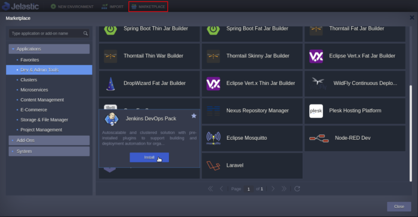

Jenkins is an open-source continuous integration and delivery system designed to ensure build and deploy automation. It is well-suited to be installed in the cloud to run self-hosted pipelines.

Jenkins supports clustering via master-slave mode. A build process can be delegated to several slave (worker) nodes. This allows serving multiple projects in a single Jenkins cluster setup.

In this article, we'll describe how to install Jenkins cluster with slave nodes auto-discovering and self-registering inside a master node. Jelastic PaaS implemented this solution in **Jenkins DevOps Pack** that can be installed from the [Marketplace](https://docs.jelastic.com/marketplace/) or through environment setup wizard as a **New Environment**. In this tutorial we'll cover both. Also, you will find out how to build a simple Java project hosted on GitHub using Jelastic Maven plugin.

## Jenkins DevOps Pack Installation

### Installation from Marketplace

1. Access the platform dashboard, click on **Marketplace \> Dev \& Admin Tools** , find Jenkins **DevOps Pack** and press **Install**.



2. If required, change the number of **Workers** (slaves), **Environment name** and destination **Region**.


3. As shown in the picture below, the deployed Jenkins topology comprises one master node and two worker nodes.


### Installation as New Environment

In order to simplify cluster provisioning our team has prepared Jenkins certified templates for master and worker nodes. Once you click on the **New Environment** and add Jenkins application server, the **Auto-Clustering** functionality creates cluster topology which comprises one master node and one worker node by default. The worker nodes can be scaled out horizontally up to 16 nodes being automatically detected and registered at master node and vice versa.


## Jenkins Cluster Specifics

Each worker node has an [executor](https://wiki.jenkins.io/display/JENKINS/Terminology) process that is used for building the projects. By default one job at a time can be run since there is one executor configured in a worker. You may change the number of executors. To do this click on **Build Executor Status** and press **Configure** at node you need to change the number of executors in.


Change the number of executors and apply changes with the **Save** button.


For example you build tasks stuck in a long queue, the worker nodes can be [scaled out horizontally](https://jelastic.com/blog/horizontal-scaling-of-cloud-environments-stateless-stateful-automatic/) either manually or automatically for speeding up a large number of the project builds. In such cases, the package ensures an automatic discovery of new worker nodes by the Jenkins master node. It takes just a couple minutes to expand cluster e.g. up to 10 workers.


Press **Change Environment Topology** and choose Workers layer (Java Engine) and do horizontal scaling with + button in the **Horizontal Scaling** section of the wizard. It's also preferable to choose **stateless** scaling mode as we do not store any important state in the workers.


Once scaling is completed, make sure the all newly created worker nodes were discovered and registered automatically at master. Go back to the Jenkins admin panel and click on **Build Executor Status** link once again to see all of available cluster members in a friendly format.


## Create a New Job through Jenkins Admin Panel

Now let's see how to create a job that builds and publishes a simple project to a remote application server hosted on Jelastic PaaS. Here we use a [Maven](https://maven.apache.org/) to build [HelloWorld](https://github.com/jelastic/helloworld) project from GitHub and deploy it with the help of Jelastic Maven plugin.

1.After installation, log in to the admin panel with credentials from the respective email.


2.At the top of the page click on create new jobs.


3.Specify the project name (e.g. *My Java Project* ), choose **Maven project** and press **OK**.


4.Define the project **Description** , click on the **GitHub project** and specify the repository URL. Within this tutorial, we use <https://github.com/jelastic/helloworld.git>.


5.The Jelastic Maven plugin requires the destination environment access parameters to be defined and passed to the [pom.xml](https://github.com/jelastic/helloworld/blob/master/pom.xml) file located in the repository of the application you build.

The plugin's section in the **pom.xml** looks as follows:

```java
<plugin>
     <groupId>com.jelastic</groupId>
     <artifactId>jelastic-maven-plugin</artifactId>
     <version>1.9.4</version>
     <configuration>
     <apiToken>${TOKEN}</apiToken>
     <context>${CONTEXT}</context>
     <environment>${TARGET_ENV}</environment>
     <comment>test-plugin</comment>
     <api_hoster>${JELASTIC_API_ENDPOINT}</api_hoster>
     <deployParams>
        <delay>1000</delay>
        <param2>value2</param2>
       ...
        <paramN>valueN</paramN>
     </deployParams>
     </configuration>
</plugin>
```

For defining parameters via project variables click on the checkbox This project is parameterized and add the first variable clicking on **Add Parameter \> String Parameter**.


As for our example, we use four variables defined globally for the project:

* **JELASTIC_API_ENDPOINT** - Defines destination hosting platform hostname. See Hoster Domain field in the list of [Jelastic Hosting Providers](https://docs.jelastic.com/jelastic-hoster-info).
* **TARGET_ENV** - deployment destination environment [shortdomain](https://docs.jelastic.com/create-env-api) name within the destination hosting platform. The destination environment must have a Java application server, here we use [Tomcat](https://docs.jelastic.com/tomcat). You can deploy to a single node environment or clusterized one.  


* **TOKEN** - access token for the platform on which the deployment environment is located.Set the **Description** for new access token and expiry date, then in the **API** field use a predefined **Maven Plugin** template which will allow the DeployApp API method to be executed. The respective access parameters will be selected automatically.  
  

<!-- -->

* **CONTEXT** - the context path the application will be deployed to. The **ROOT** context is equivalent to the "/" path (e.g. *http://myenv.vip.jelastic.cloud/* ). In other occurrences (e.g. *helloworld* ), the context path is added to the environment name *http://myenv.vip.jelastic.cloud/**helloworld/***

Finally, the variables section should look like in the picture below.


6.Then scroll down to the **Source Code Management** section and specify the **Repository URL**.


7.In the **Build** section set the phases the Maven will execute: **clean** , **package** and **jelastic:deploy** . Finally, press the **Save** button.


Resulting from the **clean** and **package** phases you will get a war archive file. In our case, it will be **helloworld.war** file as for <https://github.com/jelastic/helloworld> project.

The **jelastic:deploy** is performed by Jelastic Maven plugin on the fly during project build. The plugin allows you to deploy just built war file to Java application server in the remote environment at any available Jelastic Cloud Provider.

## Build Java Project with Maven Plugin

1.Click on **Build Now**. Then confirm the parameters to be passed to the Jelastic Maven plugin.


2.In the **Build History** , you can see that the build is performed successfully and marked with a green sign next to the **#1**.


## Build Debug inside Jenkins

By hovering over the sign next to the build, you can open the **Console Output** that may help you to debug project building.


The output contains all of the commands executed during the build. Jenkins does job distribution among all of the available worker nodes trying to load them equally.

If you want to execute project building on the specific node, go to the **General** section and enable **Restrict where this project can be run** option. Fill out the **Label Expression** field with hostname like node${nodeID}.


## Java Project Deployment via Jenkins

If the build procedure succeeds, it means that Jenkins deployed the result application archive to the application server (e.g. *myenv.vip.jelastic.cloud*).

Click on the **Open in Browser** button at the destination server to make sure the deployment was performed properly.


The *helloworld.war* application web page should be displayed as follows.


That's it! Now you know how to easily get Jenkins cluster installation in the cloud with the Maven project build and deploy. Register at one of [Jelastic cloud service providers](https://jelastic.com/) to automate continuous integration and delivery of your Java applications using pre-configured master-slave Jenkins cluster.
