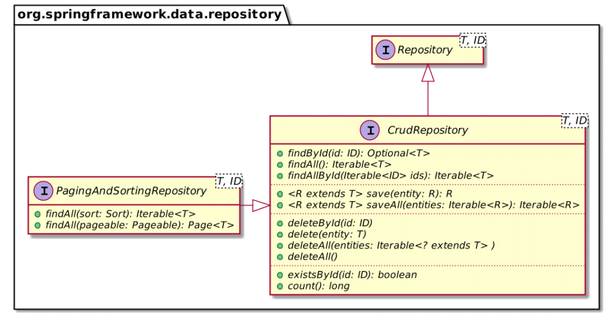
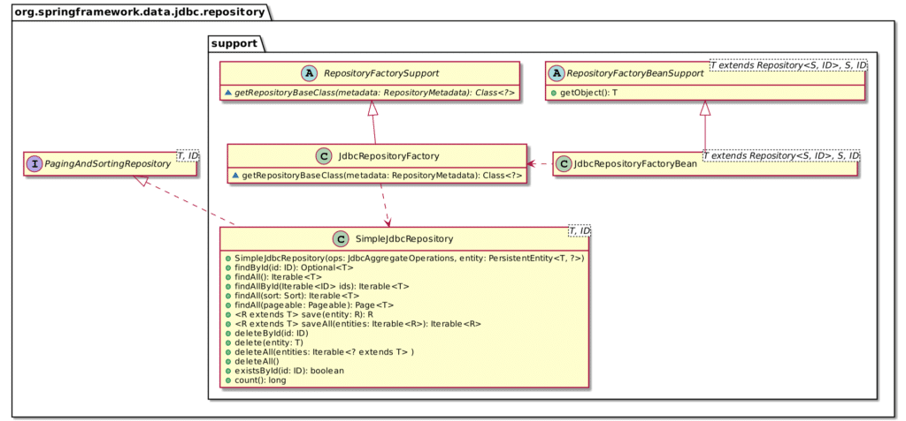

Frameworks promise to speed up one's development pace provided one follows the mainstream path.

The path may be more or less narrow. I'm a big fan of the Spring ecosystem because its design is extensible and customizable at different abstraction levels: thus, the path is as large as you need it to be.

Functional Programming is becoming more and more popular. Spring provides a couple of s for the Kotlin language. For example, the [Beans DSL](https://docs.spring.io/spring-framework/docs/current/reference/html/languages.html#kotlin-bean-definition-dsl) and the [Routes DSL](https://docs.spring.io/spring-framework/docs/current/reference/html/languages.html#router-dsl) allow for a more functional approach toward Spring configuration. On the *type* side, [Vavr](https://www.vavr.io/) (previously Javaslang) is pretty popular in Java, while Kotlin has [Arrow](https://arrow-kt.io/docs/core/).

In this post, I'd like to describe how one can use Arrow's type system with Spring Data. Ultimately, you can benefit from the explanations to craft your custom Spring Data repository.

### The starting architecture

The starting architecture for my application is pretty standard:

1. A REST controller with two `GET` mappings
2. A Spring Data JDBC repository interface

Because it's standard, Spring handles a lot of the plumbing, and we don't need to write a lot of code. With Kotlin, it's even more concise:

```kotlin
class Person(@Id val id: Long, var name: String, var birthdate: LocalDate?)

interface PersonRepository : CrudRepository<Person, Long>

@RestController
class PersonController(private val repository: PersonRepository) {

    @GetMapping
    fun getAll(): Iterable<Person> = repository.findAll()

    @GetMapping("/{id}")
    fun getOne(@PathVariable id: Long) = repository.findById(id)
}

@SpringBootApplication
class SpringDataArrowApplication

fun main(args: Array<String>) {
    runApplication<SpringDataArrowApplication>(*args)
}
```

### Toward a more functional approach

This step has nothing to do with Spring Data and is not required, but it fits the functional approach better. As mentioned above, we can benefit from using the Routes and Beans DSL. Let's refactor the above code to remove annotations as much as possible.

```kotlin
class PersonHandler(private val repository: PersonRepository) {                   // 1

  fun getAll(req: ServerRequest) = ServerResponse.ok().body(repository.findAll()) // 2
  fun getOne(req: ServerRequest): ServerResponse = repository
    .findById(req.pathVariable("id").toLong())
    .map { ServerResponse.ok().body(it) }
    .orElse(ServerResponse.notFound().build())                                    // 3
}

fun beans() = beans {                                                             // 4
  bean<PersonHandler>()
  bean {
    val handler = ref<PersonHandler>()                                            // 5
    router {
      GET("/", handler::getAll)
      GET("/{id}", handler::getOne)
    }
  }
}

fun main(args: Array<String>) {
  runApplication<SpringDataArrowApplication>(*args) {
    addInitializers(beans())                                                      // 6
  }
}
```

1. Create a handler class to organize the routing functions
2. All routing functions should accept a `ServerRequest` parameter and return a `ServerResponse`
3. Add an additional capability: if the entity is not found, return a 404
4. Use the Routes DSL to map HTTP verbs and path to routing functions
5. `ref()` retrieves bean with the configured type from Spring's application context
6. Explicitly call the `beans()` function, no more magic!

### Introducing Arrow

> Functional companion to Kotlin's Standard Library
>
> -- [Arrow](https://arrow-kt.io/)

Arrow comes with four different components:

1. Core
2. FX: Functional Effects Framework companion to KotlinX Coroutines
3. Optics: Deep access and transformations over immutable data
4. Meta: Metaprogramming library for Kotlin compiler plugins

The Core library offers the `Either` type. Arrow advises using `Either` to model an optional value. On the other side, Spring Data JDBC `findById()` returns a `java.util.Optional`.

### Bridging the gap

How do we bridge the gap between `Optional` and `Either`?

Here's a first attempt:

```kotlin
repository
    .findById(req.pathVariable("id").toLong())      // 1
    .map { Either.fromNullable(it) }                // 2
    .map { either ->
        either.fold(
            { ServerResponse.notFound().build() },  // 3
            { ServerResponse.ok().body(it) }        // 3
        )
    }.get()                                         // 4
```

1. `Optional`
2. `Optional<Either>`
3. `Optional`
4. At this point, we can safely call `get()` to get a `ServerResponse`

I believe the usage of `Optional<Either>` is not great. However, Kotlin can help us in this regard with extension functions:

```kotlin
private fun <T> Optional<T>.toEither() =
    if (isPresent) Either.right(get())
    else Unit.left()
```

With this function, we can improve the existing code:

```kotlin
repository
    .findById(req.pathVariable("id").toLong())    // 1
    .toEither()                                   // 2
    .fold(
        { ServerResponse.notFound().build() },    // 3
        { ServerResponse.ok().body(it) }          // 3
    )
```

1. `Optional`
2. `Either`
3. `ServerResponse`

It looks nicer this way, but it would be so much better to have the repository return an `Either` directly.

### Spring Data customization

Let's check how we can customize Spring Data to achieve that.

By default, a Spring Data repository offers all generic functions you can expect, *.e.g.*:



I believe that one comes to Spring Data for ease of use, but that one stays for its extensibility capabilities.

At the base level, one can add functions that follow a certain naming pattern, *e.g.* , `findByFirstNameAndLastNameOrderByLastName()`. Spring Data will generate the implementing code without you needing to write a single line of SQL. When you hit the limits of this approach, you can annotate the function with the SQL that you want to run.

In both cases, you need to set the return type. While the [number of possible return types](https://docs.spring.io/spring-data/jdbc/docs/current/reference/html/#repository-query-return-types) is pretty huge, it's still limited. The framework cannot account for every possible type, and specifically, the list doesn't contain `Either`.

The next extensibility level is to add any function with the desired signature via a custom implementation. For that, we need:

* An interface that declares the wanted function
* A class that implements the interface

```kotlin
interface CustomPersonRepository {                                         // 1
    fun arrowFindById(id: Long): Either<Unit, Person>                      // 2
}

class CustomPersonRepositoryImpl(private val ops: JdbcAggregateOperations) // 3
    : CustomPersonRepository {                                             // 4

    override fun arrowFindById(id: Long) =
        Either.fromNullable(ops.findById(id, Person::class.java))           // 5
}

interface PersonRepository
    : CrudRepository<Person, Long>, CustomPersonRepository                 // 6
```

1. New custom interface
2. Declare the wanted function
3. New implementing class...
4. ... that implements the parent interface
5. Implement the function
6. Just extend the custom interface

Now, we can call:

```kotlin
repository.arrowFindById(req.pathVariable("id").toLong())
    .fold(
        { ServerResponse.notFound().build() },
        { ServerResponse.ok().body(it) }
    )
```

This approach works but has one major flaw. To avoid a clash in the functions' signature, we have to invent an original name for our function that returns `Either` *i.e.* `arrowFindById()`.

### Changing the default base repository

To overcome this limitation, we can leverage another extension point: change the default base repository.

Spring Data applications define interfaces, but the implementation needs to come from somewhere. The framework provides one by default, but it's possible to switch it with our own.

Here's an overview of the class diagram:



The detailed flow is pretty complex: the important part is the `SimpleJdbcRepository` class. Spring Data will find the class via the `JdbcRepositoryFactoryBean` bean, create a new instance of it and register the instance in the context.

Let's create a base repository that uses `Either`:

```kotlin
@NoRepositoryBean
interface ArrowRepository<T, ID> : Repository<T, ID> {               // 1
    fun findById(id: Long): Either<Unit, T>                          // 2
    fun findAll(): Iterable<T>                                       // 3
}

class SimpleArrowRepository<T, ID>(                                  // 4
    private val ops: JdbcAggregateOperations,
    private val entity: PersistentEntity<T, *>
) : ArrowRepository<T, ID> {

    override fun findById(id: Long) = Either.fromNullable(
        ops.findById(id, entity.type)                                // 5
    )

    override fun findAll(): Iterable<T> = ops.findAll(entity.type)
}
```

1. Our new interface repository...
2. ...with the signature we choose without any collision risk.
3. I was too lazy to implement everything.
4. The base implementation for the repository interface. The constructor needs to accept those two parameters.
5. Don't reinvent the wheel; use the existing `JdbcAggregateOperations` instance.

We need to annotate the main application class with `@EnableJdbcRepositories` and configure the latter to switch to this base class.

```kotlin
@SpringBootApplication
@EnableJdbcRepositories(repositoryBaseClass = SimpleArrowRepository::class)
class SpringDataArrowApplication
```

To ease the usage from the client code, we can create an annotation that overrides the default value:

```kotlin
@EnableJdbcRepositories(repositoryBaseClass = SimpleArrowRepository::class)
annotation class EnableArrowRepositories
```

Now, the usage is straightforward:

```kotlin
@SpringBootApplication
@EnableArrowRepositories
class SpringDataArrowApplication
```

At this point, we can move the Arrow repository code into its project and distribute it for other "client" projects to use. No further extension is necessary, though Spring Data offers much more, *e.g.*, switching the factory bean.

### Conclusion

Spring Data provides a ready-to-use repository implementation out-of-the-box. When it's not enough, its flexible design makes it possible to extend the code at different abstraction levels.

This post showed how to replace the default base repository with our own, which uses an Arrow type in the function signature.

Thanks to [Mark Paluch](https://twitter.com/mp911de) for his review.

The complete source code for this post can be found on [Github](https://github.com/ajavageek/spring-data-arrow) in Maven format.

**To go further:**

* [Working with Spring Data repositories](https://docs.spring.io/spring-data/data-commons/docs/2.5.x/reference/html/#repositories)
* [Custom Implementations for Spring Data Repositories](https://docs.spring.io/spring-data/data-commons/docs/2.5.x/reference/html/#repositories.custom-implementations)
* [Customize the Base Repository](https://docs.spring.io/spring-data/data-commons/docs/2.5.x/reference/html/#repositories.customize-base-repository)

*Orginally published at [A Java Geek](https://blog.frankel.ch/custom-spring-data-repository/) on April 11^th^, 2021*

*[DSL]: Domain-Specific Language
