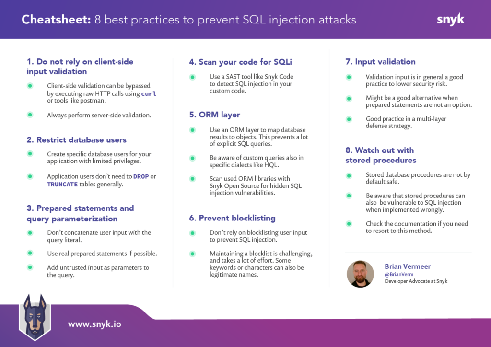

SQL injection is one of the most dangerous vulnerabilities for online applications. It occurs when a user adds untrusted data to a database query. For instance, when filling in a web form. If SQL injection is possible, smart attackers can create user input to steal valuable data, bypass authentication, or corrupt the records in your database.

There are different types of SQL injection attacks, but in general, they all have a similar cause. The untrusted data that the user enters is concatenated with the query string. Therefore the user's input can alter the query's original intent.

These are the 8 best practices we discuss in [this article](https://snyk.io/blog/sql-injection-cheat-sheet/).

1. Do not rely on client-side input validation
2. Use a database user with restricted privileges
3. Use prepared statements and query parameterization
4. Scan your code for SQL injection vulnerabilities
5. Use an ORM layer
6. Don't rely on blocklisting
7. Perform input validation
8. Be careful with stored procedures

[Read the full article](https://snyk.io/blog/sql-injection-cheat-sheet/).

