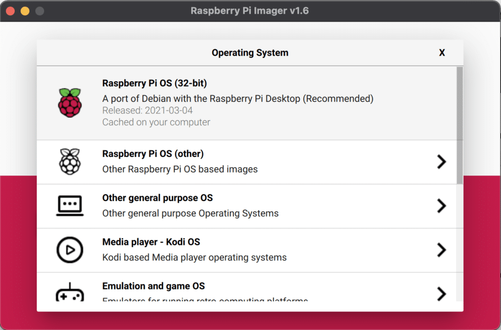
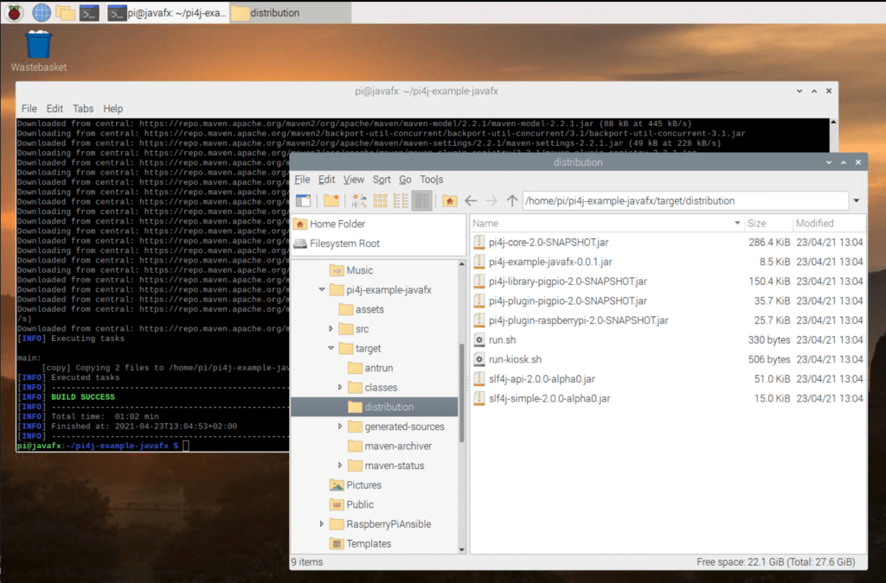
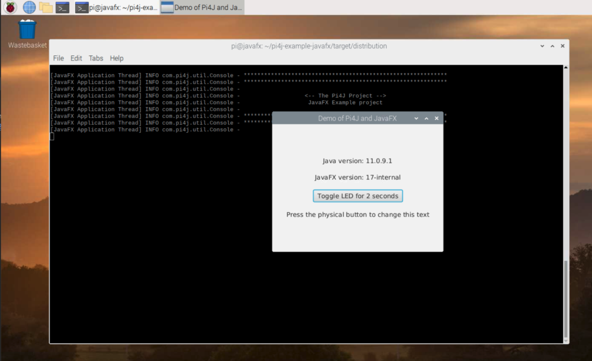

Combined with an inexpensive touch screen, the Raspberry Pi makes for a perfect controller for a machine or game console. Let's see how we can use Java and JavaFX to build a test application that also communicates with the pins of the Raspberry Pi to control a LED.

We have done something before already in the post ["Light Up your Christmas Tree with Java and Raspberry Pi"](https://foojay.io/today/light-up-your-christmas-tree-with-java-and-raspberry-pi/), so what's new here?

1. We are going to use [V2 of Pi4J](https://pi4j.com/), the friendly object-oriented I/O API and implementation libraries for Java programmers to access the full I/O capabilities of the Raspberry Pi platform.
2. We will combine this with Gluon's JavaFX 17-ea to run the application in two modes: desktop window versus "kiosk mode".

### Prepare the Raspberry Pi

This demo will work with any Raspberry Pi with an ARMv7 or ARMv8: Raspberry Pi A (version 3), B (version 2 or higher), or Compute (version 3 or higher).

#### SD with Operating System

Download the [Raspberry Pi Imager tool](https://www.raspberrypi.org/software/) and burn the "Raspberry Pi OS (32-bit)" (with Desktop) to an SD card. When finished, put it in your Raspberry Pi, start the board, and follow the steps to configure Wifi, language... to fit your needs.


*Remark: in the Imager tool you can also select "Raspberry Pi OS (Other)" \> "Raspberry Pi OS Full (32-bit)" which includes extra software and has Java 11 pre-installed. If you only need Java, you can select this version. The steps below will provide additional other tools which are not included in any of the Raspberry Pi OS versions.*

#### Add Additional Tools

For this demo, we will use Maven to build and run the project on the Raspberry Pi itself. Of course, you can build on your development PC, but using the Raspberry Pi as a programming computer works really well. It's not as fast as a "full-blown" PC, but a perfect solution for some quick testing, or when you are in need of a very cheap computer.

If you want to take the approach I've used to build and run on the Raspberry Pi, you need to install:

* Java JDK
* JavaFX 17-ea
* Maven
* (Optional) Visual Studio Code

You can manually install all of these, or follow the following steps to run this automatically with Ansible.

*Remark: this Ansible project can also be used to install the tools from a PC. See the [README in the GitHub project](https://github.com/FDelporte/RaspberryPiAnsible) for more info.*

On the Raspberry Pi, open a terminal and run the following commands to install the Ansible tool:

```
$ sudo apt update
$ sudo apt install -y ansible sshpass
```

Now clone this project:

```
$ git clone https://github.com/FDelporte/RaspberryPiAnsible.git
$ cd RaspberryPiAnsible
```

Create the inventory file `hosts` for which the Ansible scripts will run, with 'localhost' as content:

```
$ nano hosts
```

Check the content of this 'hosts' file:

```
$ cat hosts
localhost
```

You can now execute the Ansible playbook with the following command (this will take some time...):

```
$ ansible-playbook -c local -i hosts all_for_java.yml
```

When finished, check the installed versions:

```
$ java -version
openjdk version "11.0.9.1" 2020-11-04
OpenJDK Runtime Environment (build 11.0.9.1+1-post-Raspbian-1deb10u2)
OpenJDK Server VM (build 11.0.9.1+1-post-Raspbian-1deb10u2, mixed mode)

$ mvn -v
Apache Maven 3.6.0
Maven home: /usr/share/maven
Java version: 11.0.9.1, vendor: Raspbian, runtime: /usr/lib/jvm/java-11-openjdk-armhf
Default locale: en_GB, platform encoding: UTF-8
OS name: "linux", version: "5.10.17-v7l+", arch: "arm", family: "unix"
```

### Get the Example Project

The Pi4J project and website provide multiple example projects. Let's use the "minimal JavaFX example". This application is fully documented on the [Pi4J website \> "Getting Started" \> "User interface with JavaFX"](https://pi4j.com/getting-started/user-interface-with-javafx/). We can get the sources from GitHub and build it with Maven.

```
$ cd /home/pi
$ git clone https://github.com/Pi4J/pi4j-example-javafx.git
$ cd pi4j-example-javafx
$ mvn package
```

When the build is finished, we will find all the required files to run the application in "/home/pi/pi4j-example-javafx/target/distribution".

```
pi4j-core-2.0-SNAPSHOT.jar
pi4j-example-javafx-0.0.1.jar
pi4j-library-pigpio-2.0-SNAPSHOT.jar
pi4j-plugin-pigpio-2.0-SNAPSHOT.jar
pi4j-plugin-raspberrypi-2.0-SNAPSHOT.jar
run.sh
run-kiosk.sh
slf4j-api-2.0.0-alpha0.jar
slf4j-simple-2.0.0-alpha0.jar
```



## Run Modes

### Desktop Mode

When we want to run our application as a "normal desktop application", we need to use **GTK, which depends on a Window Manager, e.g. X11**. That's what desktop users use as a Window Manager and allows you to have multiple windows, where you can drag a window, open new ones etc.

The example project has a file "run.sh" which contains the full java-command to start the application as a desktop application.

```
java \
  -Dglass.platform=gtk \
  -Djava.library.path=/opt/javafx-sdk-17/lib \
  --module-path .:/opt/javafx-sdk-17/lib \
  --add-modules javafx.controls \
  --module com.pi4j.example/com.pi4j.example.JavaFxExample
```

To run the application, use the the provided script `run.sh`:

```
$ cd /home/pi/pi4j-example-javafx/target/distribution
$ sudo bash run.sh
```

<figure class="wp-block-embed is-type-video is-provider-vimeo wp-block-embed-vimeo wp-embed-aspect-16-9 wp-has-aspect-ratio">
 <div class="wp-block-embed__wrapper">
  <iframe title="JavaFX application on Raspberry Pi in desktop mode" src="https://player.vimeo.com/video/540641530?dnt=1&amp;app_id=122963" width="500" height="281" frameborder="0" allow="autoplay; fullscreen; picture-in-picture; clipboard-write"></iframe>
 </div>
</figure>

As you can see in the video, because we are using an example application from the Pi4J project, we are able to control a LED with the button in the application.


### Kiosk Mode

There is also a different approach with "kiosk mode", where our application is the only thing you see on the screen. This prevents the user to open any other applications or mess up your system. In this case, there is no need for a window manager, and the application directly uses the underlying (hardware) framebuffer. To achieve this, we use Monocle with EGL and DRM, as that is the Linux approach to directly address the hardware acceleration, without a window manager. The JavaFX application is using Direct Rendering Mode (DRM) to be visualized. An extra benefit is the performance boost, as your program is the only thing that needs to be handled towards the screen.

There is also a file 'run-kiosk.sh' provided to start the demo application in kiosk mode, which contains some extra commands.

* By using `/sbin/init 3` before the application starts, the desktop mode is stopped.
* As DRM in JavaFX 17-ea is part of the commercial license of Gluon, we need to set the environment value `ENABLE_GLUON_COMMERCIAL_EXTENSIONS`, for more info see [Gluon docs: "JavaFX on Embedded" \> "Legal notice"](https://docs.gluonhq.com/#_legal_notice).
* The display id needs to be defined, if `card0` is not working and you get the error `[GluonDRM] Device /dev/dri/card0 could be opened, but has no drm capabilities.`, try `card1`. More info is provided on [Gluon docs: "JavaFX on Embedded" \> "Testing JavaFX"](https://docs.gluonhq.com/#_testing_javafx).
* After the application is stopped, we call `/sbin/init 5` to restart the regular desktop environment.

```
/sbin/init 3
export ENABLE_GLUON_COMMERCIAL_EXTENSIONS=true
java \
  -Degl.displayid=/dev/dri/card0 \
  -Dmonocle.egl.lib=/opt/javafx-sdk-17/lib/libgluon_drm-1.1.3.so \
  -Djava.library.path=/opt/javafx-sdk-17/lib \
  -Dmonocle.platform=EGL \
  --module-path .:/opt/javafx-sdk-17/lib \
  --add-modules javafx.controls \
  --module com.pi4j.example/com.pi4j.example.JavaFxExample 
/sbin/init 5
```

By using the provided script, we can also start the kiosk approach with the following command. Do this via SSH so you can still interact with the terminal and see the application log in case something goes wrong. Press `CONTROL+C` to stop the application from the SSH terminal.

```
$ cd /home/pi/pi4j-example-javafx/target/distribution
$ sudo bash run-kiosk.sh
```

<figure class="wp-block-embed is-type-video is-provider-vimeo wp-block-embed-vimeo wp-embed-aspect-16-9 wp-has-aspect-ratio">
 <div class="wp-block-embed__wrapper">
  <iframe loading="lazy" title="JavaFX application on Raspberry Pi in kiosk mode" src="https://player.vimeo.com/video/540641983?dnt=1&amp;app_id=122963" width="500" height="281" frameborder="0" allow="autoplay; fullscreen; picture-in-picture; clipboard-write"></iframe>
 </div>
</figure>

### Extra Tips

#### Gluon Documentation

Gluon keeps the documentation for Raspberry Pi constantly updated, keep an eye on [docs.gluonhq.com/#_javafx_on_embedded](https://docs.gluonhq.com/#_javafx_on_embedded) to stay up-to-date.

#### 64-bit OS and JavaFX

If you want to go 64-bit, you can use the same approach. There is no official 64-bit Raspberry Pi OS yet, but you can find more information on ["Faster \& More Reliable 64-bit OS on Raspberry Pi 4 with USB Boot"](https://foojay.io/today/64-bit-raspbian-os-on-raspberry-pi-4-with-usb-boot/).

The matching JavaFX SDK is available at [gluonhq.com/download/javafx-17-ea-sdk-linux-aarch64](https://gluonhq.com/download/javafx-17-ea-sdk-linux-aarch64/).

#### Unclutter

Another great addition for a kiosk approach is [Unclutter](https://wiki.archlinux.org/index.php/Unclutter), a small tool which hides your mouse cursor when you do not need it. You only have to move the mouse for the cursor to reappear.

```
sudo apt install unclutter
```

### Conclusion

Write once, run everywhere? Yes, even on Raspberry Pi and in kiosk mode! Java and JavaFX rule once more!

Thanks again to the [Gluon team](https://gluonhq.com/) for their support while setting up the startup scripts for this post and their  

ongoing work to support and push the [OpenJFX project](https://openjfx.io/).
