

This article is for the beginner who wants to get started developing JavaFX applications using [Jetbrains' IntelliJ](https://www.jetbrains.com/idea/) IDE. The article will create three flavors of a HelloWorld JavaFX application as follows:

* Plain - Create a new project from scratch using no build tools
* Maven - Create a new project using the Maven build tool
* Gradle - Create a new project using the Gradle build tool

While this article may seem elementary for some, I believe it can help newcomers to the JavaFX platform avoid some pitfalls and really hit the ground running.

Warning: This tutorial will touch the basics on how to create a JavaFX project using the new Java Platform Module System (JPMS) since Java 9. There are redundant naming of directories that may look peculiar to you. This is in regards to the naming of a module directory and Java package namespace in the initial creation of the project. To learn more about Java Platform Module System's naming convention check out [Java SE 9 - JPMS module naming](https://blog.joda.org/2017/04/java-se-9-jpms-module-naming.html) by [Stephen Colebourne](https://blog.joda.org/). For a deep dive into modules check out [Understanding Java 9 Modules](https://www.oracle.com/corporate/features/understanding-java-9-modules.html) by Paul Deitel.

New comers to the JavaFX platform that want things even more basic (fundamental) such as using the command line or terminal should look at "[A JavaFX App on ZuluFX in 60 Seconds](https://foojay.io/blog/a-javafx-app-on-zulufx-in-60-seconds/)".

Next, you'll need to download and install the required software.

## Requirements

The following are requirements for this tutorial.

* [IntelliJ IDE](https://www.jetbrains.com/idea/) - <https://www.jetbrains.com/idea/>
* [ZuluFX](https://www.azul.com/downloads/zulu-community/?version=java-14&architecture=x86-64-bit&package=jdk) - <https://www.azul.com/downloads/zulu-community/?package=jdk-fx>

When downloading IntelliJ the free version is called the community edition.

To see how to install ZuluFX please refer to the section '**Installing ZuluFX** ' at "[A JavaFX App on ZuluFX in 60 Seconds](https://foojay.io/blog/a-javafx-app-on-zulufx-in-60-seconds/)".

## Plain JavaFX Project

The following steps will show you how to create a new JavaFX project from scratch (aka Plain old JavaFX Project). Usually this type of project is good for quick prototypes.

**Step 1:**Create a New Project

After installing and launching **IntelliJ** click on the '**New Project**' option. In Figure 1 below are three options allowing you to create a Java project.
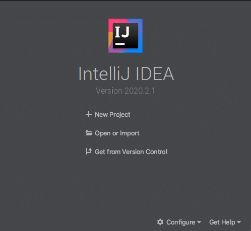 Figure 1. Three ways to create a Java project.

**\*Note:** If you've already completed the tutorial **"[A JavaFX App on ZuluFX in 60 Seconds](https://foojay.io/blog/a-javafx-app-on-zulufx-in-60-seconds/)"** then you could select the option '**Open or Import**' and select the project directory and jump all the way down to step 15 executing the Hello World FX application.

**Step 2:** Select Java as a project type

Select **Java** as the type of project to be created in the **New Project** as shown in figure 2.

**\*Warning:** You should notice in figure 2 on the left is the option for **JavaFX, where it is NOT selected** . I am purposefully avoiding the **non-modular** JavaFX application project convention (in favor of the **modular JPMS convention** ). Non-modular projects are Java Apps prior to Java 9 where JavaFX applications only use the Java **class path** as opposed to the new **module path**.
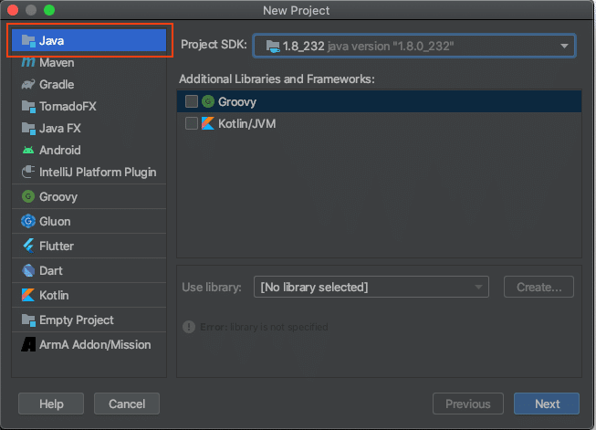 Figure 2. Select Java as the project type.

**Step 3:**Choose your JDK (ZuluFX)

Click on the **Add JDK** option to locate the JDK's **Home** directory. In Figure 3 it shows three options to select a JDK for this project (Download, Add and Detected SDKs.
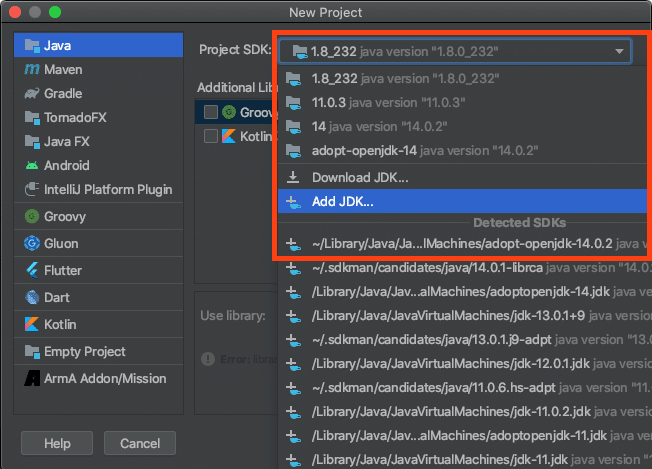

After selecting the '**Add JDK** ' option locate the previously installed (ZuluFX) JDK's **Home** directory as shown in figure 4 below. Assuming you've already installed **ZuluFX** locally, you will select the **Home** directory and click the **Open** button. In MacOS the parent directory will contain symlinks (Alias) to subdirectories under zulu-14.jdk. This makes it convenient for setting environment variables.
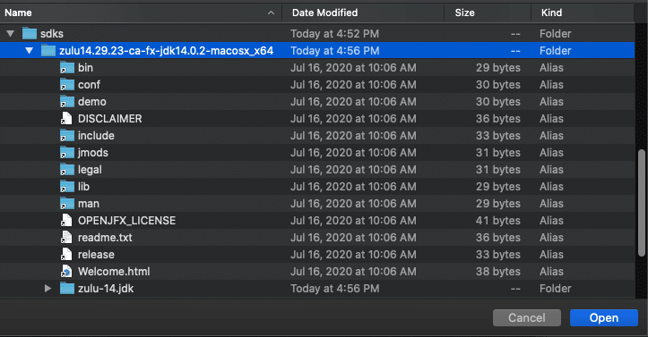 Figure 4. ZuluFX Java JDK that includes JavaFX modules.

**Step 4:** Uncheck Create Project from template option, then Click Next

**Step 5:** Name your project **HelloWorldFX** and click **Finish** . As a convention of mine I will create a projects directory under my home directory. On Windows you would have the following: `%HOMEDRIVE%%HOMEPATH%`\\projects
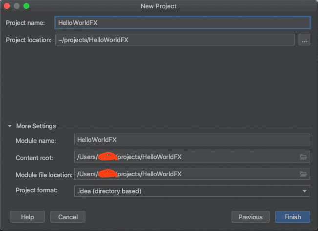 Figure 5. Naming Project to be created in a projects directory.

**Step 6:** Change **Project Language Level** . In IntelliJ's menu options select **File -\> Project Structure** as shown below. Select **14 (Preview)** and click **OK**.
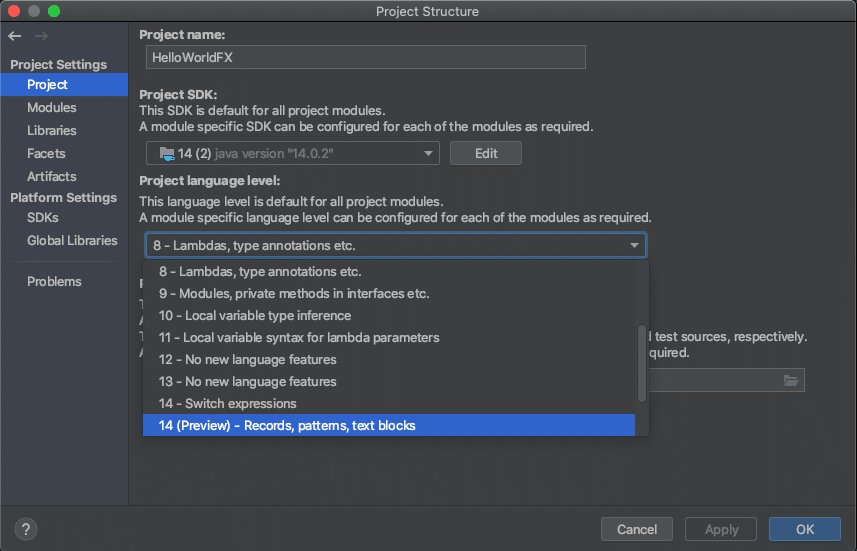 Figure 6. Project language level selection. 14 (Preview) should be selected.

**Step 7:** Unmark the '**src**' directory as the source root as shown below in figure 7.
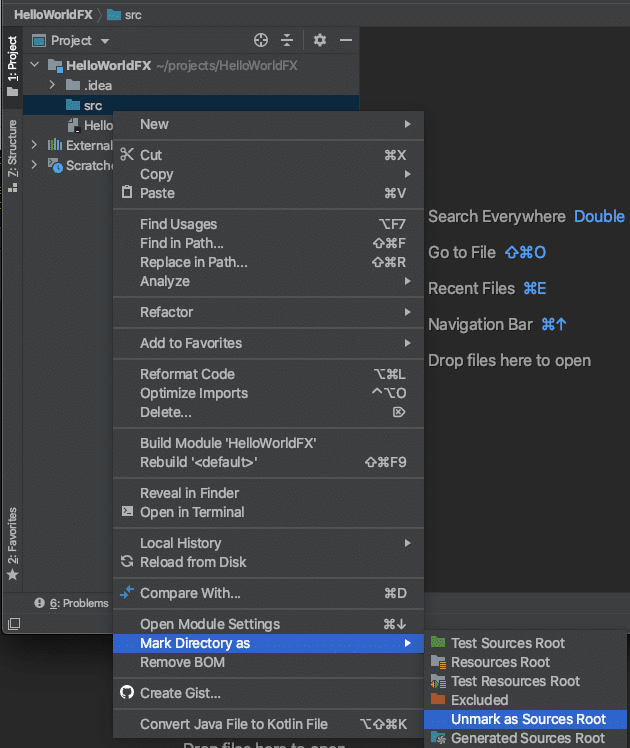 Figure 7. Unmark as Source Root.

**Step 8:** Create a module directory as '**com.mycompany.helloworld** '. Right mouse button click the '**src** ' directory in the project (tree) as shown in Figure 8. **New -\> Directory**
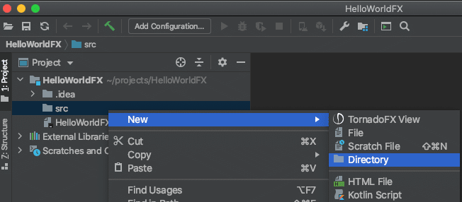 Figure 8. Create a module directory using the reverse domain name convention.  Figure 9. The name of the new directory for the project module.

**Step 9:** Mark module directory as Root Source. Right mouse click '**com.mycompany.helloworld** ', Select **Mark Directory as -\> Sources Root**
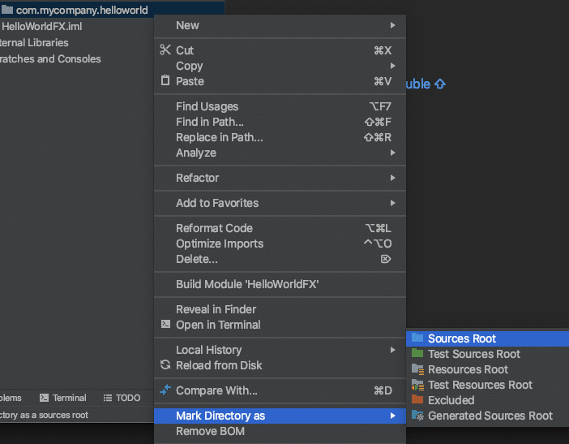 Figure 10. Marking the module directory as the **Sources Root**.

**Step 10:** Creating a module-info.java file definition. JPMS defines a module's dependencies and shared modules. Right mouse click the folder **com.mycompany.helloworld** , select **New -\> module-info.java**
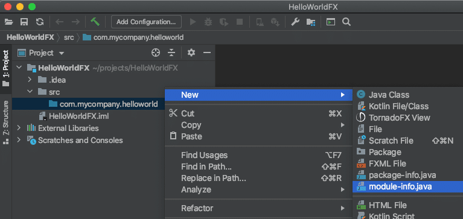 Figure 11. Creating a JPMS module-info.java file for the JavaFX application.

**Step 11:** Enter (copy \& paste) the following module definition into the file.

```java
module com.mycompany.helloworld {
   requires javafx.controls;
   exports com.mycompany.helloworld;
}
```

After hitting Ctrl + S to save the file you will encounter errors in the editor window where the module is referencing (exports) the **com.mycompany.helloworld** package which doesn't exist yet. So in the next step let's create the package namespace.

**Step 12:** Create the package name space of the Java application with the directory path of **com/mycompany/helloworld** . Right mouse click the folder **com.mycompany.helloworld**,
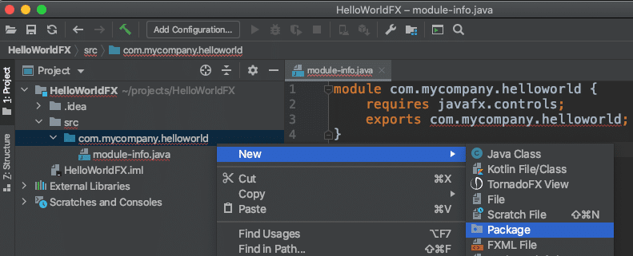 Figure 12. Creating directories of the package namespace.

After selecting the menu options you will enter the package name **com.mycompany.helloworld** and hit **Enter** as shown below:
 Figure 13. package name **com.mycompany.helloworld**

Once created you should see the following folder created under the module name as shown in figure 14 below:
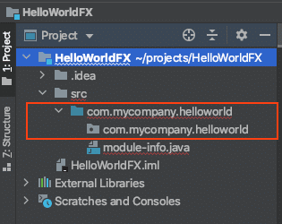 Figure 14. Package name space under module directory.

**Step 13:** Creating the main JavaFX Application file **HelloWorld.java** in the package (folder) **com.mycompany.helloworld** (beneath the module directory).
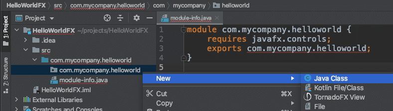 Figure 15. Creating the JavaFX main application Java file.

Next, the prompt will allow you to select the type of Java Class. Enter the name HelloWorld and select JavaFXApplication beneath denoting the Java Class type as shown below:
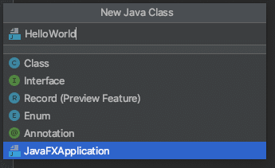 Figure 16. Name of Java class and the class type.

After hitting enter the file is created and displayed in the editor as shown in figure 17 below.



Here you'll notice two things, a generated JavaFX class and no errors from missing a package and class (dependent in the module-info.java file). Also, the generated JavaFX code's **start()** method body is empty. In the next step you'll just cut \& paste the JavaFX application code into body of the method.

**Step 14:** Enter or cut \& paste the following JavaFX code into the body of the **start()** method.

```java
        primaryStage.setTitle("Hello World");
        Group root = new Group();
        Scene scene = new Scene(root, 300, 250);
        Button btn = new Button();
        btn.setLayoutX(100);
        btn.setLayoutY(80);
        btn.setText("Hello World");
        btn.setOnAction( actionEvent ->
                System.out.println("Hello World"));
        root.getChildren().add(btn);
        primaryStage.setScene(scene);
        primaryStage.show();
```

The final project in IntelliJ should look like the following:



**Step 15:** Executing the HelloWorldFX application project.

Right mouse click the **HelloWorld** file in the Project tree view select **Run** as shown in figure 19
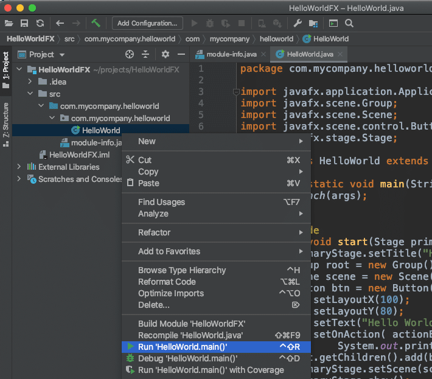   

Figure 19. Run the HelloWorld application.

The following is the output of running the HelloWorld application.
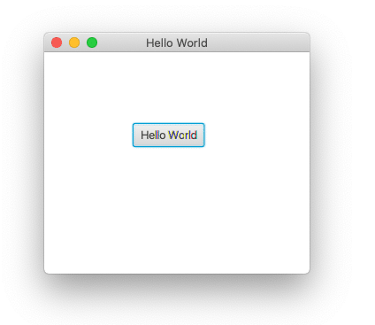 Figure 20. The output of the execution of HelloWorld JavaFX application.

## Maven JavaFX Project

The following are steps to create a modular JavaFX application through IntelliJ as a Maven project.

**Step 1:**Create a New Project
 Figure 21. New Project

**Step 2:** Select Maven as the project type and Choose Project SDK

\*Note: It's preferred to use **ZuluFX** due to JavaFX modules are already bundled together with Java JDK. If you choose a JDK that doesn't include JavaFX you will need to add libraries through File -\> Project Structure -\> Libraries add to locate JavaFX lib directory.
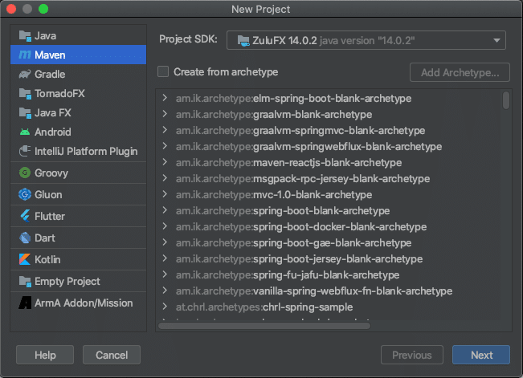 Figure 22. Selecting Maven as a Project type and Selecting a JDK

After hitting Next, you'll set up your project and Maven settings.

Step 3: Name the project and create Maven coordinates

Name the project **MavenHelloWorldFX** and a project directory destination.

Next, you'll be specifying Maven coordinates GroupId, ArtifactId and Version as follows.

**GroupId:** com.mycompany.helloworld  
**ArtifactId:** helloworldfx  
**Version:** 1.0-SNAPSHOT
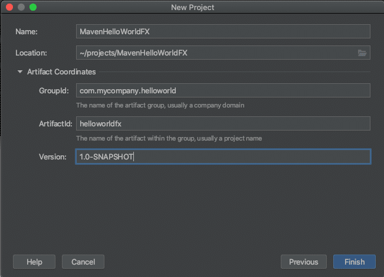 Figure 23. Naming the project and Maven coordinates

Click on **Finish**.

The project will output as shown below in Figure 24.
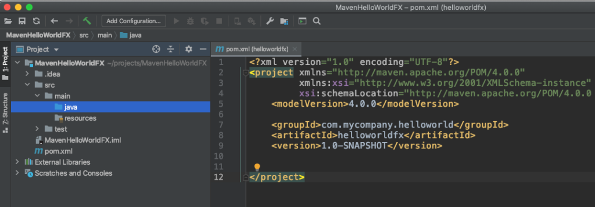 Figure 24. An empty Maven Java project.

Step 4: Add Plugins and dependencies into **pom.xml**file

Copy \& Paste to replace the following **pom.xml** into the editor and Save.

```xml
<project xmlns="http://maven.apache.org/POM/4.0.0" xmlns:xsi="http://www.w3.org/2001/XMLSchema-instance"
  xsi:schemaLocation="http://maven.apache.org/POM/4.0.0 http://maven.apache.org/maven-v4_0_0.xsd">
    <modelVersion>4.0.0</modelVersion>
    <groupId>com.mycompany.helloworld</groupId>
    <artifactId>helloworldfx</artifactId>
    <version>1.0-SNAPSHOT</version>

    <properties>
        <project.build.sourceEncoding>UTF-8</project.build.sourceEncoding>
        <maven.compiler.release>14</maven.compiler.release>
        <javafx.version>14</javafx.version>
    </properties>
    <dependencies>
        <dependency>
            <groupId>org.openjfx</groupId>
            <artifactId>javafx-controls</artifactId>
            <version>${javafx.version}</version>
        </dependency>
    </dependencies>
    <build>
        <plugins>
            <plugin>
                <groupId>org.apache.maven.plugins</groupId>
                <artifactId>maven-compiler-plugin</artifactId>
                <version>3.8.1</version>
                <executions>
                    <execution>
                        <id>default-compile</id>
                        <configuration>
                            <release>${maven.compiler.release}</release>
                        </configuration>
                    </execution>
                </executions>
            </plugin>
            <plugin>
                <groupId>org.openjfx</groupId>
                <artifactId>javafx-maven-plugin</artifactId>
                <version>0.0.5</version>
                <configuration>
                   <release>${maven.compiler.release}</release>
                   <mainClass>com.mycompany.helloworld.HelloWorld</mainClass>
                </configuration>
            </plugin>
        </plugins>
    </build>
</project>
```

**Step 5:**Project Settings -\> Project - Set Language Level

Below you will want to ensure the Project SDK and Project language level is at least 11 or better. In figure 25 the language level was set to Java 14 (Preview).
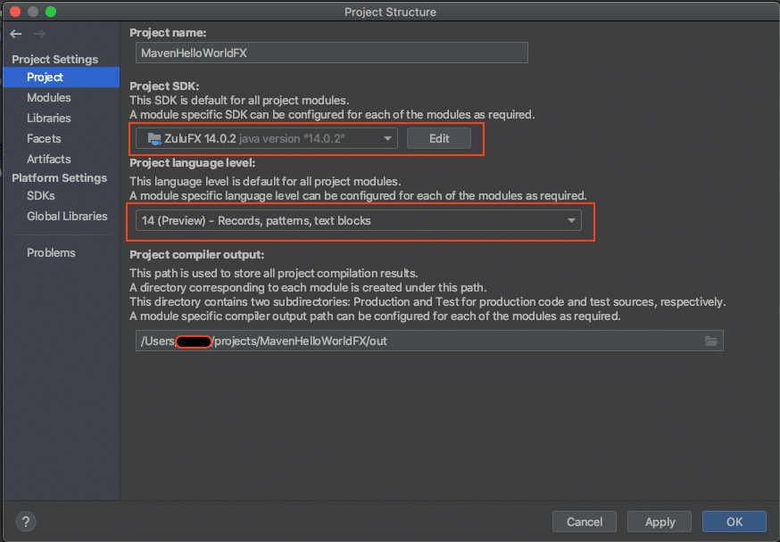 Figure 25. Setting Language Level for Project

Step 6: Project Settings -\> Modules - Set Language Level to 14 (Preview)

Select Modules under Project Settings. Make sure the helloworld project language level is in sync as shown below (fig 26). Then click OK.
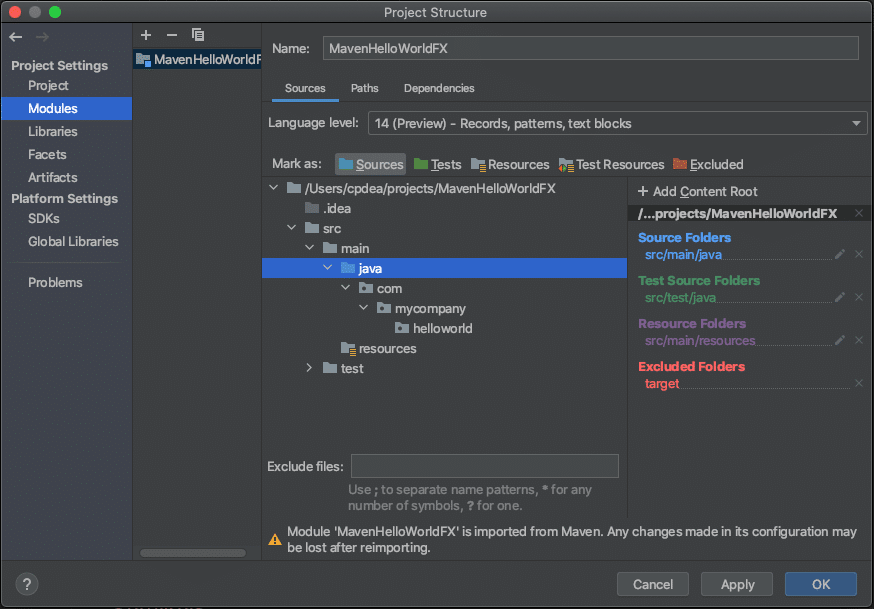 Figure 26. Setting Language Level for Modules

**Step 7:** Create a **module-info.java** file

Right mouse click the **java** folder (Project pane), then   

select menu **New -\> module-info.java**

After the file is created you will want to use the definition in step 6.

**Step 6:** Copy and paste the following module definition to replace the generated one. Then hit **Save**.

```java
module com.mycompany.helloworld {
    requires javafx.controls;
    exports com.mycompany.helloworld;
}
```

**Step 6:** Create a Java package name space **com.mycompany.helloworld**.
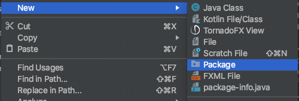 Figure 27. New Package name space folder  Figure 28. Entering the package name

After entering the package name the following is a created folder under the java directory as shown in figure 29 below.
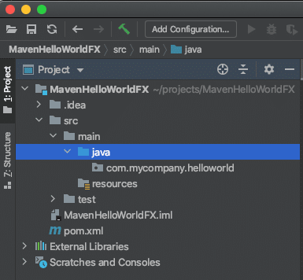 Figure 29. Creating a new module-info.java file.

**Step 7:** Create the Main JavaFX app file

Right Mouse click the folder **com.mycompany.helloworld** (Project pane) to select the popup menu **New -\> Class** , then type in **HelloWorld** as the name of the class as shown in figure 30 below. This will create an empty class.
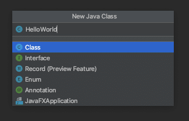 Figure 30. Create a Class called HelloWorld

Next, **copy \& paste** or type the following code to replace the code in the recently created **HelloWorld.java** file and **Save**.

```java
package com.mycompany.helloworld;

import javafx.application.Application;
import javafx.scene.Group;
import javafx.scene.Scene;
import javafx.scene.control.Button;
import javafx.stage.Stage;

public class HelloWorld extends Application {

    public static void main(String[] args) {
        launch(args);
    }

    @Override
    public void start(Stage primaryStage) {
        primaryStage.setTitle("Hello World");
        Group root = new Group();
        Scene scene = new Scene(root, 300, 250);
        Button btn = new Button();
        btn.setLayoutX(100);
        btn.setLayoutY(80);
        btn.setText("Hello World");
        btn.setOnAction( actionEvent ->
                System.out.println("Hello World"));
        root.getChildren().add(btn);
        primaryStage.setScene(scene);
        primaryStage.show();
    }
}
```

**Step 8:** Reload Maven Project

On the right pane there should be tabs to select **Maven** . Next, click on the reload tool bar button. This will pull down any plugins or dependencies specified in the **pom.xml**.
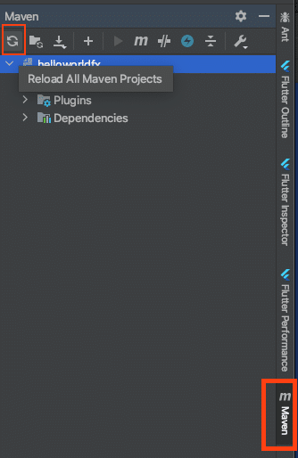 Figure 31. Maven tab to reload the project plugins and dependencies.

Step 9: Executing the **HelloWorldFX** application project.

Still on the Maven pane expand the **Plugins** folder, **javafx** , and double click on **javafx:run**
 Figure 32. Maven executed Hello World application

If you want to run the application using the IDE's Run configuration you'll need to specify VM Options such as the following:

When using ZuluFX:

```bash
--add-modules javafx.controls
```

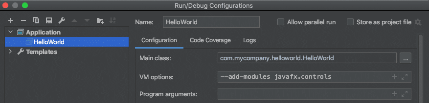 Figure 33. VM Options

When using JavaFX as separate libraries such as from GluonHQ (`$PATH_TO_FX`) and a **mods** directory (modules output directory):

```bash
--module-path $PATH_TO_FX:mods --add-modules javafx.controls
```

## Gradle JavaFX Project

Because this article is getting way too long, I am only going to post the **build.gradle** file below. Because the file and directory structure of a gradle project is the same as a Maven project I trust you can simply go through creating the project in a similar manner and near the end click on the **Gradle** tab and the **reload** button to see the **run** task.

```groovy
plugins {
  id 'application'
  id 'org.openjfx.javafxplugin' version '0.0.8'
}

repositories {
    mavenCentral()
}

javafx {
    version = "14"
    modules = [ 'javafx.controls' ]
}

mainClassName = "com.mycompany.helloworldfx/com.mycompany.helloworldfx.HelloWorld"
```

## Conclusion

Well there you have it, a Hello World JavaFX Application that was **JPMS** based and created using the popular IntelliJ IDE in three project types **Plain** , **Maven** and **Gradle**.

As you get familiar with how to code and execute your application your next step would be how placing check points and incrementally debug your application.

As always feel free to comment if you have questions or need any help. Happy coding!

## References:

Understanding Java 9 Modules by Paul Deitel - <https://www.oracle.com/corporate/features/understanding-java-9-modules.html>

Create a new JavaFX project -<https://www.jetbrains.com/help/idea/javafx.html>

OpenJFX.io - <https://openjfx.io>
